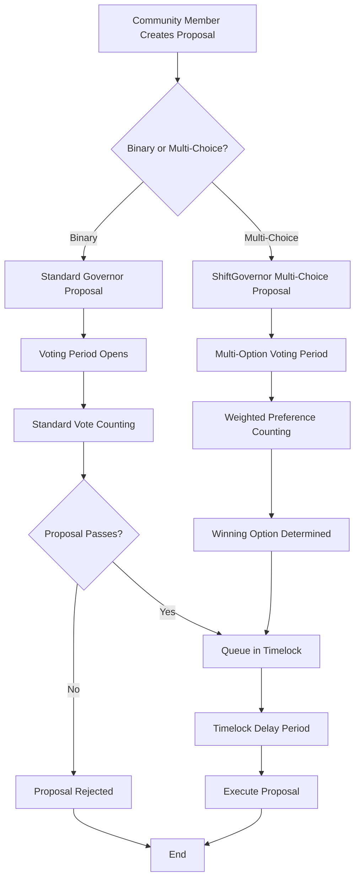
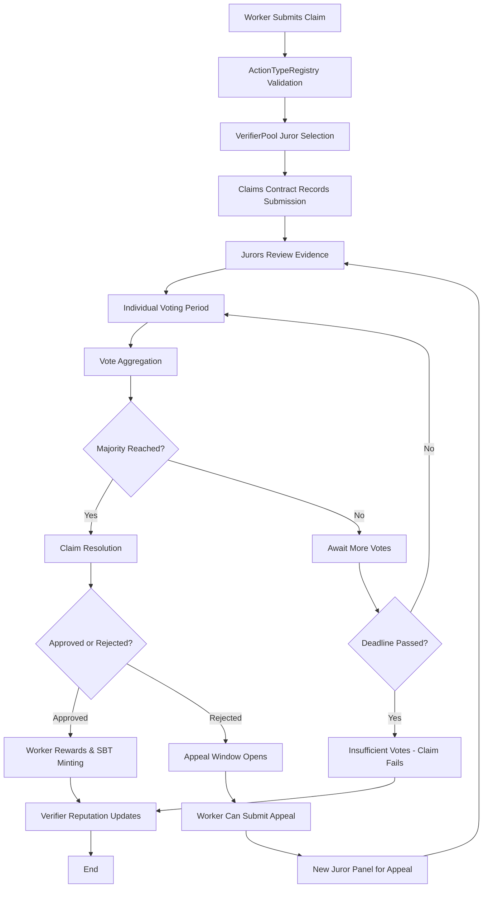
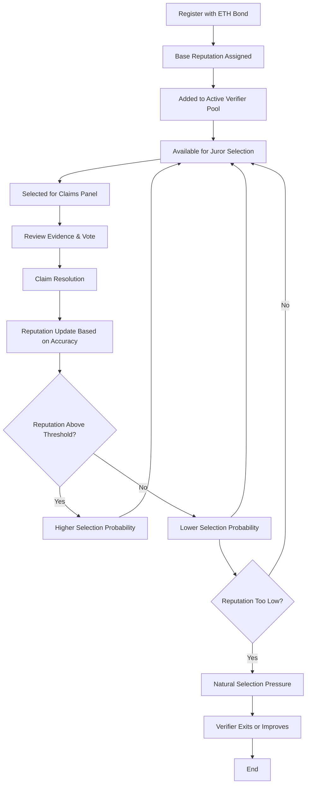

# Shift DeSoc System Architecture

This document provides a high-level overview of Shift DeSoc's system architecture, component interactions, and data flow patterns for both technical and business stakeholders.

## 🏗️ System Overview

Shift DeSoc implements a **modular, blockchain-native architecture** designed for scalability, security, and upgradability. The platform consists of interconnected smart contracts that manage governance, work verification, and economic incentives.

### Core Design Principles

1. **Modularity**: Independent contracts that can be upgraded separately
2. **Composability**: Standard interfaces enable ecosystem integration
3. **Security**: Multi-layer security with economic incentives and timelock protection
4. **Scalability**: Layer 2 deployment with efficient gas usage patterns
5. **Transparency**: All operations verifiable on-chain with rich event logs

## 🔗 Component Architecture

### Smart Contract Layer

```
┌─────────────────────────────────────────────────────────────────────────────┐
│                              GOVERNANCE LAYER                               │
├─────────────────────────────────────────────────────────────────────────────┤
│  ┌─────────────────┐    ┌──────────────────┐    ┌─────────────────────────┐ │
│  │  ShiftGovernor  │◄───┤CountingMultiChoice├────┤  MembershipToken       │ │
│  │  - Proposals    │    │ - Multi-choice   │    │  - Voting Power        │ │
│  │  - Execution    │    │ - Weight Dist.   │    │  - Delegation          │ │
│  │  - Timelock     │    │ - Results        │    │  - Snapshots           │ │
│  └─────────────────┘    └──────────────────┘    └─────────────────────────┘ │
└─────────────────────────────────────────────────────────────────────────────┘

┌─────────────────────────────────────────────────────────────────────────────┐
│                            VERIFICATION LAYER                               │
├─────────────────────────────────────────────────────────────────────────────┤
│  ┌─────────────────┐    ┌──────────────────┐    ┌─────────────────────────┐ │
│  │ActionTypeRegistry│◄───┤     Claims       ├────┤    VerifierPool        │ │
│  │ - Work Types    │    │ - Submissions    │    │ - Registration         │ │
│  │ - Parameters    │    │ - M-of-N Voting  │    │ - Bonding              │ │
│  │ - Evidence Spec │    │ - Appeals        │    │ - Reputation           │ │
│  └─────────────────┘    └──────────────────┘    └─────────────────────────┘ │
└─────────────────────────────────────────────────────────────────────────────┘

┌─────────────────────────────────────────────────────────────────────────────┐
│                              TOKEN LAYER                                    │
├─────────────────────────────────────────────────────────────────────────────┤
│  ┌─────────────────┐    ┌──────────────────┐    ┌─────────────────────────┐ │
│  │   WorkerSBT     │    │ CommunityToken   │    │   RevenueRouter         │ │
│  │ - Soulbound     │    │ - 1:1 USDC       │    │ - Fee Distribution      │ │
│  │ - WorkerPoints  │    │ - Payments       │    │ - Treasury Mgmt         │ │
│  │ - Achievements  │    │ - Rewards        │    │ - Revenue Splits        │ │
│  └─────────────────┘    └──────────────────┘    └─────────────────────────┘ │
└─────────────────────────────────────────────────────────────────────────────┘
```

### Data Flow Architecture

```
┌───────────┐     ┌─────────────┐     ┌──────────────┐     ┌─────────────┐
│  Worker   │────▶│ Submit      │────▶│ Juror        │────▶│ Reputation  │
│           │     │ Claim       │     │ Selection    │     │ Update      │
└───────────┘     └─────────────┘     └──────────────┘     └─────────────┘
                         │                     │                    │
                         ▼                     ▼                    ▼
                  ┌─────────────┐     ┌──────────────┐     ┌─────────────┐
                  │ActionType   │     │VerifierPool  │     │ Claims      │
                  │Registry     │     │              │     │ Resolution  │
                  └─────────────┘     └──────────────┘     └─────────────┘
                         │                     │                    │
                         ▼                     ▼                    ▼
                  ┌─────────────┐     ┌──────────────┐     ┌─────────────┐
                  │Parameters   │     │M-of-N Panel  │     │SBT Minting  │
                  │& Evidence   │     │Assignment    │     │& Rewards    │
                  └─────────────┘     └──────────────┘     └─────────────┘
```

## 🔄 Core Workflows

### 1. Governance Proposal Flow



### 2. Work Verification Flow



### 3. Verifier Lifecycle



## 📊 Data Architecture

### On-Chain State Management

#### Governance State
```solidity
// Proposal tracking
mapping(uint256 => ProposalCore) proposals;
mapping(uint256 => uint8) numOptions;           // Multi-choice configuration
mapping(uint256 => ProposalVote) proposalVotes; // Vote tallying

// Voting power snapshots
mapping(address => Checkpoint[]) checkpoints;   // Historical voting power
mapping(uint256 => uint256) totalSupplyHistory; // Token supply snapshots
```

#### Verification State
```solidity
// Claim lifecycle
mapping(uint256 => Claim) claims;               // All submitted claims
mapping(uint256 => Appeal) appeals;             // Appeal tracking
mapping(address => mapping(uint256 => uint64)) workerCooldowns; // Rate limiting

// Verifier management
mapping(address => Verifier) verifiers;         // Verifier profiles
address[] activeVerifiers;                      // Selection pool
mapping(uint256 => JurorSelection) selections;  // Panel assignments
```

#### Economic State
```solidity
// Token economics
mapping(address => uint256) balances;           // Token holdings
mapping(address => uint256) workerPoints;       // Contribution tracking
mapping(uint256 => uint256) bondAmounts;        // Verifier stakes

// Revenue tracking
mapping(address => uint256) earnedFees;         // Fee distribution
mapping(uint256 => RevenueAllocation) splits;   // Revenue routing
```

### Event-Driven Architecture

#### Governance Events
```solidity
event ProposalCreated(uint256 indexed proposalId, address proposer, string description);
event MultiChoiceProposalCreated(uint256 indexed proposalId, uint8 numOptions);
event VoteCast(address indexed voter, uint256 indexed proposalId, uint8 support, uint256 weight);
event VoteMultiCast(address indexed voter, uint256 indexed proposalId, uint256[] weights);
event ProposalExecuted(uint256 indexed proposalId);
```

#### Verification Events
```solidity
event ClaimSubmitted(uint256 indexed claimId, address indexed worker, uint256 typeId);
event JurorsAssigned(uint256 indexed claimId, address[] jurors);
event ClaimVerified(uint256 indexed claimId, address indexed verifier, bool approve);
event ClaimResolved(uint256 indexed claimId, uint8 status, uint32 approvals, uint32 rejections);
event ReputationUpdated(address indexed verifier, uint256 oldRep, uint256 newRep);
```

#### Economic Events
```solidity
event VerifierRegistered(address indexed verifier, uint256 bondAmount);
event BondIncreased(address indexed verifier, uint256 oldAmount, uint256 newAmount);
event WorkerSBTMinted(address indexed worker, uint256 indexed tokenId, uint256 points);
event FeesDistributed(uint256 totalFees, uint256 treasuryShare, uint256 verifierShare);
```

## 🔐 Security Architecture

### Multi-Layer Security Model

#### Layer 1: Smart Contract Security
- **Access Control**: Role-based permissions with governance oversight
- **Input Validation**: Comprehensive parameter checking and bounds validation
- **Reentrancy Protection**: Consistent use of checks-effects-interactions pattern
- **Integer Safety**: Solidity 0.8+ overflow protection and SafeMath patterns

#### Layer 2: Economic Security
- **Bonding Requirements**: Economic stakes for all critical actors
- **Reputation Tracking**: Long-term incentive alignment through performance history
- **Slashing Mechanisms**: Economic penalties for malicious or poor behavior
- **Cooldown Periods**: Rate limiting to prevent spam and manipulation

#### Layer 3: Governance Security
- **Timelock Protection**: Mandatory delays for critical system changes
- **Multi-Signature Requirements**: Multiple approvals for sensitive operations
- **Emergency Pause**: Governance-controlled circuit breakers for crisis response
- **Upgrade Controls**: Controlled contract upgrade paths through governance

#### Layer 4: Operational Security
- **Monitoring & Alerting**: Real-time tracking of system health and anomalies
- **Audit Trail**: Complete on-chain history of all operations and decisions
- **Recovery Procedures**: Defined processes for handling various failure scenarios
- **Bug Bounty Programs**: Community-driven security testing and improvement

### Attack Vector Analysis & Mitigation

#### Governance Attacks
- **Flash Loan Governance**: Mitigated by voting power snapshots and timelock delays
- **Proposal Spam**: Prevented by proposal thresholds and economic costs
- **Vote Buying**: Reduced through delegation mechanisms and reputation tracking

#### Verification Attacks
- **Sybil Attacks**: Prevented by ETH bonding requirements and reputation tracking
- **Collusion**: Detected through voting pattern analysis and reputation decay
- **Evidence Manipulation**: Mitigated by IPFS content addressing and cryptographic proofs

#### Economic Attacks
- **Drainage Attacks**: Prevented by controlled fund flows and governance oversight
- **Oracle Manipulation**: Reduced dependency on external price feeds
- **MEV Extraction**: Minimized through batch operations and fair ordering

## 🚀 Scalability & Performance

### Layer 2 Optimization

#### Gas Efficiency Strategies
- **Batch Operations**: Group related transactions to reduce per-operation costs
- **State Optimization**: Efficient storage patterns and data packing techniques
- **Event-Driven Updates**: Use events for off-chain indexing instead of expensive storage reads
- **Lazy Computation**: Defer expensive calculations until actually needed

#### Base Network Advantages
- **Low Transaction Costs**: $0.01 vs $20-100 on Ethereum mainnet
- **Fast Confirmations**: 2-second block times vs 15-second Ethereum blocks
- **EVM Compatibility**: Full Ethereum tooling and developer experience
- **Coinbase Integration**: Native fiat on-ramps and enterprise partnerships

### Performance Characteristics

#### Throughput Metrics
- **Governance**: 1000+ votes per proposal without performance degradation
- **Verification**: 100+ concurrent claims with automated juror selection
- **Token Operations**: Standard ERC-20/ERC-721 performance characteristics

#### Latency Targets
- **Vote Casting**: <5 second confirmation times
- **Claim Submission**: <10 second processing including juror selection
- **Reputation Updates**: Real-time updates on claim resolution

## 🔮 Future Architecture Evolution

### Planned Enhancements

#### Cross-Chain Expansion
- **Multi-Network Deployment**: Ethereum, Polygon, Arbitrum support
- **State Synchronization**: Cross-chain reputation and governance coordination
- **Bridge Integration**: Seamless asset movement between networks

#### Advanced Features
- **Zero-Knowledge Privacy**: Private voting with public verifiability
- **AI-Assisted Verification**: Machine learning augmented evidence review
- **Dynamic Parameters**: Automated system tuning based on performance metrics

#### Scalability Improvements
- **State Channels**: Off-chain computation with on-chain settlement
- **Rollup Integration**: Native Layer 3 deployment for specialized use cases
- **Sharding Support**: Horizontal scaling for massive community deployment

### Multi-Community Architecture Evolution

The current architecture supports single-community deployments, but the platform is designed to serve thousands of communities. This section outlines the evolution path from individual deployments to a scalable multi-community network.

#### **Current State: Single Community Per Deployment**

Each community requires separate deployment of core contracts:
- `ShiftGovernor` + `MembershipTokenERC20Votes` + `TimelockController`
- `ActionTypeRegistry` + `VerifierPool` + `Claims`  
- `CountingMultiChoice` (connected via governance)

**Architecture Pattern:**
```
Community A: [Governor_A + Token_A + Registry_A + Pool_A + Claims_A]
Community B: [Governor_B + Token_B + Registry_B + Pool_B + Claims_B]  
Community C: [Governor_C + Token_C + Registry_C + Pool_C + Claims_C]
```

**Benefits:**
- ✅ Complete community autonomy and isolation
- ✅ Flexible governance parameters per community  
- ✅ No cross-community governance conflicts
- ✅ Perfect for MVP and initial community validation

**Challenges:**
- ⚠️ High deployment costs (6+ contracts per community)
- ⚠️ No shared reputation or network effects
- ⚠️ Complex user experience across multiple communities

#### **Phase 1: Single Community Deployments (Months 1-6)**

**Focus:** Prove core system with individual communities

**Implementation:**
- Continue current deployment pattern for early adopter communities
- Enhanced deployment scripts with community-specific parameters
- Per-community governance setup and initialization workflows

**Target Communities:**
- 5-10 pilot communities (DAOs, crypto projects, co-ops)
- Complete governance and verification system validation
- User feedback collection and system refinement

#### **Phase 2: Community Factory Pattern (Months 6-12)**

**Focus:** Cost-effective community creation at scale

**Implementation:**
```solidity
contract CommunityFactory {
    struct CommunityDeployment {
        address governor;
        address membershipToken; 
        address timelock;
        address actionRegistry;
        address verifierPool;
        address claims;
        uint256 communityId;
    }
    
    function createCommunity(
        string calldata name,
        GovernanceParams calldata govParams,
        VerificationParams calldata verifyParams
    ) external returns (CommunityDeployment memory);
    
    function getCommunityContracts(uint256 communityId) 
        external view returns (CommunityDeployment memory);
}
```

**Architecture Pattern:**
```
CommunityFactory
├── Community A Contracts
├── Community B Contracts  
├── Community C Contracts
└── Community Registry & Discovery
```

**Benefits:**
- 💰 Reduced deployment costs through factory patterns
- 🎯 Standardized community creation workflows
- 📊 Centralized community discovery and analytics
- 🔧 Easier upgrades and maintenance

#### **Phase 3: Shared Infrastructure Layer (Months 12-18)**

**Focus:** Cross-community network effects and shared economy

**Implementation:**
```solidity
// Shared across ALL communities:
WorkerSBT_Network        // Portable reputation system
CommunityToken_Network   // Network-wide stable token  
Marketplace_Network      // Cross-community marketplace
HousingManager_Network   // Shared accommodation network

// Community-specific (via Factory):
ShiftGovernor_Community[N]     // Per-community governance
ActionTypeRegistry_Community[N] // Community work types
VerifierPool_Community[N]       // Community verifier sets
```

**Architecture Pattern:**
```
Shared Network Layer:
├── WorkerSBT (cross-community reputation)
├── CommunityToken (network stablecoin)  
├── Marketplace (shared economy)
└── Housing (co-living network)

Community Layer (Factory-deployed):
├── Community A: [Governor + Registry + Pool]
├── Community B: [Governor + Registry + Pool]
└── Community C: [Governor + Registry + Pool]
```

**Benefits:**
- 🌐 Portable reputation across communities via shared WorkerSBT
- 💱 Unified economic layer with network-wide CommunityToken
- 🛒 Cross-community marketplace and service sharing
- 🏠 Shared housing and resource networks
- 📈 Network effects: high-reputation members attract better communities

#### **Phase 4: Advanced Multi-Tenant Architecture (Months 18-24)**

**Focus:** Enterprise-scale platform with advanced inter-community features

**Implementation:**
```solidity
contract ShiftGovernorMultiTenant {
    mapping(uint256 => CommunityConfig) communities;
    mapping(uint256 => mapping(uint256 => Proposal)) proposals;
    
    function propose(uint256 communityId, ...) external;
    function vote(uint256 communityId, uint256 proposalId, ...) external;
    
    // Cross-community features
    function createInterCommunityProposal(uint256[] calldata communities, ...) external;
    function federatedVoting(uint256 proposalId, ...) external;
}
```

**Advanced Features:**
- **Federated Governance:** Cross-community proposals and voting
- **Reputation Bridging:** Weighted reputation transfer between communities
- **Resource Sharing:** Community-to-community resource allocation protocols
- **Governance Analytics:** Network-wide governance insights and optimization
- **Automated Community Management:** AI-assisted governance parameter optimization

### Integration Roadmap

#### Phase 1: Core Platform (Months 1-6)
- Complete WorkerSBT implementation
- Deploy to Base Sepolia testnet
- Community beta testing and feedback integration
- **Single community deployment optimization**

#### Phase 2: Feature Expansion (Months 6-12)
- Advanced analytics and reporting
- Mobile-responsive interfaces
- API development for ecosystem integration
- **CommunityFactory implementation and deployment**

#### Phase 3: Enterprise & Scaling (Months 12-18)
- Enterprise governance features
- Multi-network deployment
- Strategic partnership integrations
- **Shared infrastructure layer (WorkerSBT, CommunityToken networks)**

#### Phase 4: Advanced Capabilities (Months 18-24)
- AI-assisted features
- Privacy enhancements
- Cross-chain coordination
- **Multi-tenant architecture and federated governance**

---

## 🔧 Technical Implementation Details

### Smart Contract Specifications

#### **Core Contracts**

**CommunityRegistry**
```solidity
contract CommunityRegistry {
    struct Community {
        string name;
        string description;
        string metadataURI;
        
        // Governance Parameters  
        uint256 debateWindow;
        uint256 voteWindow;
        uint256 executionDelay;
        
        // Eligibility Rules
        uint256 minSeniority;
        uint256 minSBTs;
        uint256 proposalThreshold;
        
        // Economic Parameters
        uint256[3] revenueSplit;     // [workers%, treasury%, investors%] - governance configurable
        uint256 feeOnWithdraw;
        address[] backingAssets;     // Approved collateral tokens
        
        // Module Addresses
        address governor;
        address timelock;
        address requestHub;
        address draftsManager;
        address claimsManager;
        address actionTypeRegistry;
        address verifierPool;
        address workerSBT;
        address treasuryAdapter;
        
        // Roles & Permissions
        mapping(address => bool) moderators;
        mapping(address => bool) curators;
        
        // Cross-Community Links
        uint256 parentCommunityId;   // Federation/hierarchy support
        uint256[] allyCommunityIds;  // Partnership relationships
    }
    
    function registerCommunity(CommunityParams params) returns (uint256 communityId);
    function updateParameters(uint256 communityId, ParameterUpdate[] updates); // Governance-gated
    function setModuleAddress(uint256 communityId, bytes32 moduleKey, address moduleAddress);
}
```

**ActionTypeRegistry**
```solidity
contract ActionTypeRegistry {
    struct ActionType {
        uint32 weight;              // WorkerPoints reward
        uint32 jurorsMin;           // M (minimum approvals)
        uint32 panelSize;           // N (total jurors)
        uint32 verifyWindow;        // Time limit for verification
        uint32 cooldown;            // Cooldown between claims
        uint32 rewardVerify;        // Verifier reward points
        uint32 slashVerifierBps;    // Slashing rate for bad verifiers
        bool revocable;             // Can be revoked by governance
        string evidenceSpecCID;     // IPFS evidence requirements
        bool active;                // Current status
    }
    
    function createActionType(ActionTypeParams params) external returns (uint256 actionTypeId);
    function updateActionType(uint256 actionTypeId, ActionTypeParams params) external;
    function setActive(uint256 actionTypeId, bool active) external;
}
```

**Claims Contract**
```solidity
contract Claims {
    struct Claim {
        uint256 actionTypeId;
        address claimant;
        string evidenceCID;
        uint64 submittedAt;
        ClaimStatus status;
        uint256[] selectedJurors;
        mapping(address => Vote) votes;
        uint64 resolvedAt;
        bool appealed;
    }
    
    function submitClaim(uint256 actionTypeId, string calldata evidenceCID) external returns (uint256 claimId);
    function vote(uint256 claimId, bool approve, string calldata reason) external;
    function resolve(uint256 claimId) external;
    function appeal(uint256 claimId) external payable;
}
```

#### **Economic Bonding System**

**VerifierPool Implementation**
```solidity
contract VerifierPool {
    struct Verifier {
        uint256 bondAmount;         // ETH bonded as security deposit
        uint256 reputation;         // Accuracy-based reputation score
        uint64 joinedAt;           // Membership timestamp
        bool active;               // Current status
        uint256 totalVotes;       // Total verification votes cast
        uint256 accurateVotes;    // Votes matching final consensus
    }
    
    function registerVerifier() external payable;
    function deactivate() external; // Withdraw bond and exit
    function updateReputations(uint256[] calldata claimIds, bool[] calldata outcomes) external;
    function selectJurors(uint256 claimId, uint256 count) external returns (address[] memory);
}
```

### Layer 2 Deployment Architecture

**Base L2 Optimization**
- Transaction costs: <$0.01 per operation
- Block confirmation: ~2 seconds
- EVM compatibility: Full Ethereum tooling support
- Sequencer reliability: Coinbase infrastructure

**Gas Optimization Patterns**
```solidity
// Batch operations to minimize transaction costs
function batchVote(uint256[] calldata claimIds, bool[] calldata votes) external;

// Efficient storage patterns
struct PackedVote {
    uint64 timestamp;
    uint32 weight;
    bool approved;
    // Total: 12 bytes vs 3 storage slots
}

// Event-driven architecture for off-chain indexing
event ClaimSubmitted(uint256 indexed claimId, address indexed claimant, uint256 indexed actionTypeId);
event VoteCast(uint256 indexed claimId, address indexed voter, bool approved);
```

### Security Implementation

**Multi-Layer Security Model**

1. **Smart Contract Security**
   - OpenZeppelin base contracts (Governor, Timelock, ERC implementations)
   - Comprehensive test coverage (95%+ achieved)
   - Professional security audits (planned pre-mainnet)
   - Gradual deployment strategy (testnet → limited → full)

2. **Economic Security**
   ```solidity
   // Verifier bonding requirements
   uint256 public constant MIN_BOND = 0.1 ether;
   uint256 public constant SLASH_RATE = 1000; // 10%
   
   // Reputation-based selection weighting
   function calculateJurorWeight(address verifier) public view returns (uint256) {
       Verifier memory v = verifiers[verifier];
       return v.reputation * v.bondAmount / 1 ether;
   }
   ```

3. **Governance Security**
   ```solidity
   // Timelock delays for critical operations
   uint256 public constant PROPOSAL_DELAY = 1 days;
   uint256 public constant EXECUTION_DELAY = 2 days;
   
   // Multi-signature requirements for emergency actions
   modifier onlyMultisig() {
       require(msg.sender == emergencyMultisig, "Unauthorized");
       _;
   }
   ```

### Development Status & Testing

#### **Completed Components (86%+ Test Coverage)**
- ✅ **ShiftGovernor**: Multi-choice voting with OpenZeppelin integration
- ✅ **CountingMultiChoice**: Weighted voting distribution logic  
- ✅ **ActionTypeRegistry**: Configurable work verification parameters
- ✅ **Claims**: M-of-N verification with appeals process
- ✅ **VerifierPool**: Reputation-weighted juror selection with bonding

#### **In Development**
- 🔄 **WorkerSBT**: Soulbound token minting and reputation tracking
- 🔄 **CommunityToken**: 1:1 stablecoin backing with governance controls
- 🔄 **RevenueRouter**: Automated revenue distribution system

#### **Testing Strategy**
```javascript
// Example test structure
describe("Claims Verification Flow", () => {
  it("should complete M-of-N verification", async () => {
    // Submit claim
    const claimId = await claims.submitClaim(actionTypeId, evidenceCID);
    
    // Select jurors
    const jurors = await verifierPool.selectJurors(claimId, PANEL_SIZE);
    
    // Cast votes
    for (const juror of jurors.slice(0, MIN_APPROVALS)) {
      await claims.connect(juror).vote(claimId, true, "Good work");
    }
    
    // Verify resolution
    await claims.resolve(claimId);
    expect(await claims.getStatus(claimId)).to.equal(ClaimStatus.Approved);
  });
});
```

This architecture provides a robust foundation for democratic community governance while maintaining the flexibility to evolve with user needs and technological advances. The modular design ensures that individual components can be upgraded or replaced without disrupting the broader system, while the comprehensive security model protects against both technical and economic attacks.

The combination of proven blockchain infrastructure, innovative governance mechanisms, and sustainable economic models creates a platform capable of supporting communities ranging from small DAOs to large enterprise organizations, all while maintaining transparency, accountability, and democratic participation.