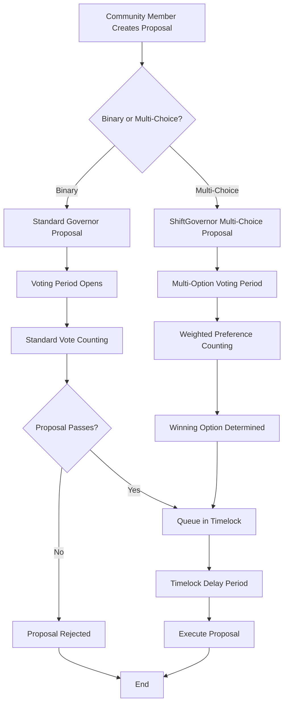
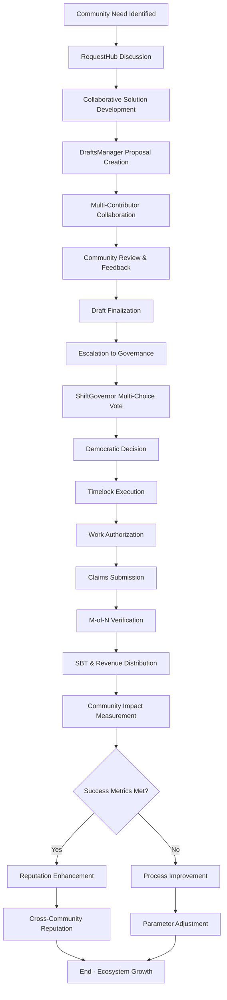
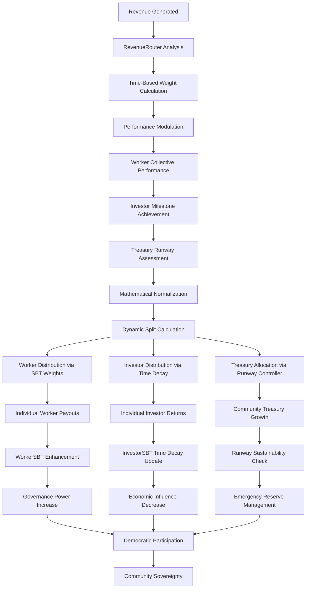
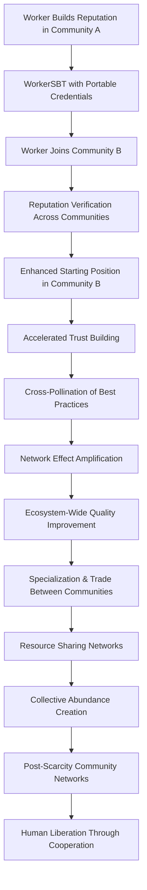
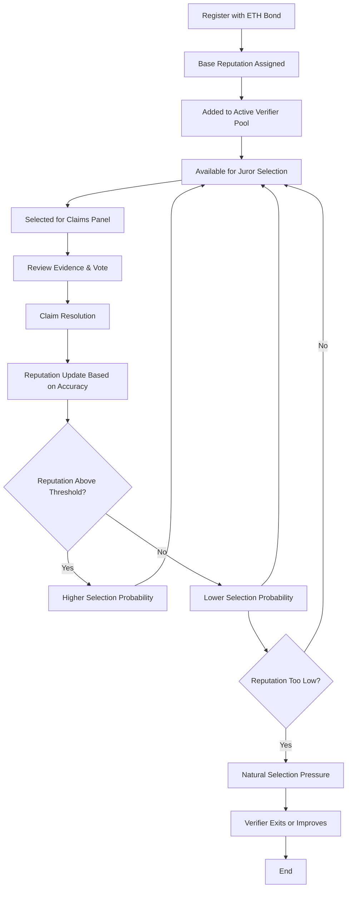

# Shift DeSoc System Architecture

This document provides a high-level overview of Shift DeSoc's system architecture, component interactions, and data flow patterns for both technical and business stakeholders.

## 🏗️ System Overview

Shift DeSoc implements a **modular, blockchain-native architecture** designed for scalability, security, and upgradability. The platform consists of interconnected smart contracts that manage governance, work verification, and economic incentives.

### Core Design Principles

1. **Modularity**: Independent contracts that can be upgraded separately
2. **Composability**: Standard interfaces enable ecosystem integration
3. **Security**: Multi-layer security with economic incentives and timelock protection
4. **Scalability**: Layer 2 deployment with efficient gas usage patterns
5. **Transparency**: All operations verifiable on-chain with rich event logs

## 🔗 Complete System Architecture

### **Layer 1: Community Coordination Infrastructure**

```
┌─────────────────────────────────────────────────────────────────────────────────────────────┐
│                                  COMMUNITY LAYER                                           │
├─────────────────────────────────────────────────────────────────────────────────────────────┤
│ ┌──────────────────┐  ┌─────────────────┐  ┌─────────────────┐  ┌─────────────────────────┐ │
│ │CommunityRegistry │◄─┤   RequestHub    ├──┤ DraftsManager   ├──┤   ParamController      │ │
│ │- Metadata        │  │- Discussions    │  │- Proposals      │  │- Dynamic Parameters    │ │  
│ │- Parameters      │  │- Moderation     │  │- Collaboration  │  │- Governance Control    │ │
│ │- Module Registry │  │- Tagging        │  │- Version Ctrl   │  │- Emergency Override    │ │
│ │- Cross-Community │  │- Event Stream   │  │- Escalation     │  │- Migration Support     │ │
│ └──────────────────┘  └─────────────────┘  └─────────────────┘  └─────────────────────────┘ │
└─────────────────────────────────────────────────────────────────────────────────────────────┘
```

### **Layer 2: Democratic Governance Engine**

```
┌─────────────────────────────────────────────────────────────────────────────────────────────┐
│                                 GOVERNANCE LAYER                                           │
├─────────────────────────────────────────────────────────────────────────────────────────────┤
│ ┌──────────────────┐  ┌─────────────────┐  ┌─────────────────┐  ┌─────────────────────────┐ │
│ │  ShiftGovernor   │◄─┤CountingMultiChoice├─┤MembershipToken │◄─┤    TimelockController  │ │
│ │- Binary Voting   │  │- Multi-choice   │  │- Base Eligibility│  │- Execution Delays     │ │
│ │- Multi-choice    │  │- Weight Distrib │  │- Delegation      │  │- Emergency Actions    │ │
│ │- Proposal Queue  │  │- Result Calc    │  │- SBT Enhancement │  │- Upgrade Protection   │ │
│ │- Integration Hub │  │- Events/Logs    │  │- Voting History  │  │- Role Management      │ │
│ └──────────────────┘  └─────────────────┘  └─────────────────┘  └─────────────────────────┘ │
└─────────────────────────────────────────────────────────────────────────────────────────────┘
```

### **Layer 3: Work Verification & Merit System**

```
┌─────────────────────────────────────────────────────────────────────────────────────────────┐
│                              VERIFICATION LAYER                                            │
├─────────────────────────────────────────────────────────────────────────────────────────────┤
│ ┌──────────────────┐  ┌─────────────────┐  ┌─────────────────┐  ┌─────────────────────────┐ │
│ │ActionTypeRegistry│◄─┤     Claims      ├──┤ VerifierPool    ├──┤      WorkerSBT         │ │
│ │- Work Categories │  │- Submissions    │  │- Registration   │  │- Contribution Record   │ │
│ │- Evidence Specs  │  │- M-of-N Panels  │  │- Bonding System │  │- Reputation Score     │ │
│ │- Reward Params   │  │- Verification   │  │- Random Select  │  │- Governance Multiplier│ │
│ │- Economic Model  │  │- Appeals        │  │- Slashing       │  │- Revenue Weight       │ │
│ └──────────────────┘  └─────────────────┘  └─────────────────┘  └─────────────────────────┘ │
└─────────────────────────────────────────────────────────────────────────────────────────────┘
```

### **Layer 4: Advanced Economic Engine**

```
┌─────────────────────────────────────────────────────────────────────────────────────────────┐
│                                ECONOMIC LAYER                                              │
├─────────────────────────────────────────────────────────────────────────────────────────────┤
│ ┌──────────────────┐  ┌─────────────────┐  ┌─────────────────┐  ┌─────────────────────────┐ │
│ │   InvestorSBT    │◄─┤RevenueRouter    ├──┤TreasuryController├─┤   CommunityToken       │ │
│ │- Capital Records │  │- Dynamic Splits │  │- Runway Manager │  │- 1:1 USDC Backing     │ │
│ │- Time Decay      │  │- Performance    │  │- Burn Tracking  │  │- Payment Rails        │ │
│ │- Milestone Score │  │- Mathematical   │  │- Emergency Mode │  │- Utility Staking      │ │
│ │- Vesting/Cliffs  │  │- Distribution   │  │- Sustainability │  │- Cross-Community      │ │
│ └──────────────────┘  └─────────────────┘  └─────────────────┘  └─────────────────────────┘ │
└─────────────────────────────────────────────────────────────────────────────────────────────┘
```

### **Layer 5: Utility & Project Infrastructure**

```
┌─────────────────────────────────────────────────────────────────────────────────────────────┐
│                                UTILITY LAYER                                               │
├─────────────────────────────────────────────────────────────────────────────────────────────┤
│ ┌──────────────────┐  ┌─────────────────┐  ┌─────────────────┐  ┌─────────────────────────┐ │
│ │  ProjectFactory  │◄─┤  Marketplace    ├──┤ HousingManager  ├──┤   TreasuryAdapter      │ │
│ │- ERC-1155 Tokens │  │- Service Trade  │  │- Co-housing     │  │- Treasury Interface    │ │
│ │- Crowdfunding    │  │- Quality Verify │  │- Reservations   │  │- Spending Limits      │ │
│ │- Milestone Gates │  │- Reputation     │  │- Revenue Gen    │  │- Multi-sig Support    │ │
│ │- Investor Protct │  │- Cross-Community│  │- Worker Discts  │  │- Audit Trails        │ │
│ └──────────────────┘  └─────────────────┘  └─────────────────┘  └─────────────────────────┘ │
└─────────────────────────────────────────────────────────────────────────────────────────────┘
```

### **Data Flow: Complete Economic Lifecycle**

```
┌───────────────┐     ┌─────────────────┐     ┌──────────────────┐     ┌─────────────────┐
│  Community    │────▶│  Identify       │────▶│  Collaborative   │────▶│  Democratic     │
│  Discussion   │     │  Need/Project   │     │  Proposal Dev    │     │  Decision      │
└───────────────┘     └─────────────────┘     └──────────────────┘     └─────────────────┘
        │                        │                        │                        │
        ▼                        ▼                        ▼                        ▼
┌───────────────┐     ┌─────────────────┐     ┌──────────────────┐     ┌─────────────────┐
│RequestHub     │     │Problem/Solution │     │DraftsManager     │     │ShiftGovernor    │
│Events & Tags  │     │Definition       │     │Version Control   │     │Multi-Choice Vote│
└───────────────┘     └─────────────────┘     └──────────────────┘     └─────────────────┘
                                                        │                        │
                                                        ▼                        ▼
                ┌─────────────────┐     ┌──────────────────┐     ┌─────────────────┐
                │   Approved      │◄────┤   Governance     │────▶│  Timelock       │
                │   Work Plan     │     │   Approval       │     │  Execution      │
                └─────────────────┘     └──────────────────┘     └─────────────────┘
                        │                                                  │
                        ▼                                                  ▼
                ┌─────────────────┐     ┌──────────────────┐     ┌─────────────────┐
                │Workers Submit   │────▶│  M-of-N Peer     │────▶│SBT Minting &    │
                │Claims w/Evidence│     │  Verification    │     │Revenue Sharing  │
                └─────────────────┘     └──────────────────┘     └─────────────────┘
```

### Data Flow Architecture

```
┌───────────┐     ┌─────────────┐     ┌──────────────┐     ┌─────────────┐
│  Worker   │────▶│ Submit      │────▶│ Juror        │────▶│ Reputation  │
│           │     │ Claim       │     │ Selection    │     │ Update      │
└───────────┘     └─────────────┘     └──────────────┘     └─────────────┘
                         │                     │                    │
                         ▼                     ▼                    ▼
                  ┌─────────────┐     ┌──────────────┐     ┌─────────────┐
                  │ActionType   │     │VerifierPool  │     │ Claims      │
                  │Registry     │     │              │     │ Resolution  │
                  └─────────────┘     └──────────────┘     └─────────────┘
                         │                     │                    │
                         ▼                     ▼                    ▼
                  ┌─────────────┐     ┌──────────────┐     ┌─────────────┐
                  │Parameters   │     │M-of-N Panel  │     │SBT Minting  │
                  │& Evidence   │     │Assignment    │     │& Rewards    │
                  └─────────────┘     └──────────────┘     └─────────────┘
```

## 🔄 Core Workflows

### 1. Governance Proposal Flow



### 2. Complete Community Coordination Flow



### 3. Dynamic Economic Distribution Flow



### 4. Cross-Community Reputation Flow



### 3. Verifier Lifecycle



## 📊 Data Architecture

### On-Chain State Management

#### Governance State
```solidity
// Proposal tracking
mapping(uint256 => ProposalCore) proposals;
mapping(uint256 => uint8) numOptions;           // Multi-choice configuration
mapping(uint256 => ProposalVote) proposalVotes; // Vote tallying

// Voting power snapshots
mapping(address => Checkpoint[]) checkpoints;   // Historical voting power
mapping(uint256 => uint256) totalSupplyHistory; // Token supply snapshots
```

#### Verification State
```solidity
// Claim lifecycle
mapping(uint256 => Claim) claims;               // All submitted claims
mapping(uint256 => Appeal) appeals;             // Appeal tracking
mapping(address => mapping(uint256 => uint64)) workerCooldowns; // Rate limiting

// Verifier management
mapping(address => Verifier) verifiers;         // Verifier profiles
address[] activeVerifiers;                      // Selection pool
mapping(uint256 => JurorSelection) selections;  // Panel assignments
```

#### Economic State
```solidity
// Triple-Token Architecture State
mapping(address => uint256) membershipBalances;      // Base voting eligibility
mapping(address => WorkerProfile) workerProfiles;    // Merit & contribution data
mapping(address => InvestorProfile) investorProfiles; // Capital & time-decay data

// Dynamic Revenue Distribution State  
struct DistributionSnapshot {
    uint256 timestamp;                          // Calculation time
    uint256 rawWorkerWeight;                    // Mathematical base weight
    uint256 rawInvestorWeight;                  // Mathematical base weight
    uint256 treasuryWeight;                     // Runway-based weight
    uint256 performanceModW;                    // Worker performance multiplier
    uint256 performanceModI;                    // Investor performance multiplier
    uint256 totalNormalization;                 // Sum for percentage calculation
}
mapping(uint256 => DistributionSnapshot) distributionHistory; // Historical calculations

// Cross-Community Reputation State
mapping(address => mapping(uint256 => uint256)) crossCommunityReputation; // [user][communityId] = reputation
mapping(uint256 => CommunityEconomicParams) communityParameters;          // Per-community economic config
mapping(address => uint256[]) userCommunities;                            // Communities user participates in
```

## 🏗️ Advanced Economic Architecture

### **Mathematical Revenue Distribution Engine**

The RevenueRouter eliminates arbitrary splits through time-based mathematical curves:

```solidity
contract RevenueRouterDynamic {
    struct EconomicParams {
        uint64 startTimestamp;           // T=0 for all calculations
        uint64 lambdaInvestor;           // Investor decay rate (e.g., 0.1/month)
        uint64 lambdaWorker;             // Worker growth rate (e.g., 0.05/month)
        uint256 alphaI;                  // Investor curve amplitude
        uint256 betaI;                   // Investor floor (minimum share)
        uint256 alphaW;                  // Worker curve amplitude  
        uint256 betaW;                   // Worker starting share
        uint16 investorFloor;            // Minimum investor % (bps)
        uint16 workerCap;                // Maximum worker % (bps)
        uint16 treasuryFloor;            // Base treasury % (bps)
    }
    
    function calculateTimeBasedWeights(uint64 elapsedTime) 
        external view returns (uint256 investorWeight, uint256 workerWeight) {
        
        // Investor weight: w_I(t) = α_I × e^(-λ_I × t) + β_I  
        uint256 investorDecay = Math.exp(-params.lambdaInvestor * elapsedTime / 1e9);
        investorWeight = (params.alphaI * investorDecay + params.betaI) / 1e18;
        investorWeight = Math.max(investorWeight, params.investorFloor);
        
        // Worker weight: w_W(t) = α_W × (1 - e^(-λ_W × t)) + β_W
        uint256 workerGrowth = 1e18 - Math.exp(-params.lambdaWorker * elapsedTime / 1e9);
        workerWeight = (params.alphaW * workerGrowth + params.betaW) / 1e18;
        workerWeight = Math.min(workerWeight, params.workerCap);
    }
    
    function calculatePerformanceMultipliers() 
        external view returns (uint256 workerMult, uint256 investorMult) {
        
        // Worker performance: output quality × consistency × collaboration
        uint256 qualityScore = getCollectiveOutputQuality();      // Average claim approval rate
        uint256 consistencyScore = getContributionConsistency();  // Regular participation
        uint256 collaborationScore = getPeerReviewScores();      // Team compatibility
        workerMult = Math.cbrt(qualityScore * consistencyScore * collaborationScore);
        
        // Investor performance: milestone achievement × network effects × capital efficiency  
        uint256 milestonesHit = getCollectiveMilestoneScore();    // Community goal achievement
        uint256 networkEffects = getEcosystemContributions();     // Cross-community value
        uint256 capitalEfficiency = getRunwayExtensionRatio();    // $ per month runway added
        investorMult = (milestonesHit + networkEffects + capitalEfficiency) / 3;
    }
}
```

### **Treasury Runway Controller Architecture**

Automated sustainability management without fixed percentages:

```solidity
contract TreasuryController {
    struct RunwayParams {
        uint64 targetRunwayMonths;       // Governance-set sustainability target
        uint64 currentRunwayMonths;      // Calculated from balance/burn
        uint256 monthlyBurnRate;         // EMA of actual expenses
        uint16 urgencyMultiplier;        // How aggressively to protect (bps)
        uint16 maxTreasuryShare;         // Upper bound to prevent starvation
        uint16 baseTreasuryShare;        // Minimum when runway is healthy
    }
    
    function calculateDynamicTreasuryShare() external view returns (uint256) {
        RunwayParams memory runway = getCurrentRunwayStatus();
        
        if (runway.currentRunwayMonths >= runway.targetRunwayMonths) {
            return runway.baseTreasuryShare; // Healthy runway = base minimum
        }
        
        // Exponential urgency function as runway decreases
        uint256 runwayRatio = runway.currentRunwayMonths * 1e18 / runway.targetRunwayMonths;
        uint256 urgencyFactor = 1e18 - runwayRatio; // 0 when healthy, 1e18 when critical
        
        // Additional treasury share scales exponentially with urgency
        uint256 additionalShare = urgencyFactor * runway.urgencyMultiplier / 1e4;
        uint256 totalShare = runway.baseTreasuryShare + additionalShare;
        
        return Math.min(totalShare, runway.maxTreasuryShare);
    }
    
    function updateBurnRate(uint256 newExpense) external {
        // EMA smoothing: new_rate = α × new_expense + (1-α) × old_rate
        uint256 alpha = 200; // 20% weighting for new data (out of 1000)
        params.monthlyBurnRate = (alpha * newExpense + (1000 - alpha) * params.monthlyBurnRate) / 1000;
    }
}
```

### **SBT-Enhanced Governance Integration**

Voting power calculation that rewards merit over wealth:

```solidity
contract MembershipTokenERC20Votes {
    function getEnhancedVotes(address account, uint256 blockNumber) 
        external view returns (uint256 enhancedVotes) {
        
        uint256 baseVotes = getPastVotes(account, blockNumber);
        if (baseVotes == 0) return 0;
        
        // Get SBT multipliers (capped to prevent excessive concentration)
        uint256 workerMultiplier = Math.min(
            workerSBT.getGovernanceMultiplier(account, blockNumber),
            maxWorkerMultiplier  // e.g., 500% max
        );
        
        uint256 investorMultiplier = Math.min(
            investorSBT.getGovernanceMultiplier(account, blockNumber), 
            maxInvestorMultiplier // e.g., 200% max
        );
        
        // Combined multiplier with anti-plutocracy bounds
        uint256 totalMultiplier = 1e18 + workerMultiplier + investorMultiplier;
        enhancedVotes = baseVotes * totalMultiplier / 1e18;
        
        // Global concentration limit (e.g., 15% max per address)
        uint256 totalSupply = getPastTotalSupply(blockNumber);
        uint256 maxConcentration = totalSupply * maxConcentrationBps / 10000;
        
        return Math.min(enhancedVotes, maxConcentration);
    }
}
```

### **Cross-Community Reputation Architecture**

Portable credentials that create network effects:

```solidity
contract WorkerSBT {
    struct CrossCommunityProfile {
        uint256[] participatingCommunities;   // Community IDs where user is active
        mapping(uint256 => uint256) communityPoints; // Points per community
        mapping(uint256 => uint256) communityReputation; // Reputation per community
        uint256 networkReputation;            // Cross-community average
        uint64 lastCrossCommunityActivity;    // Anti-gaming timestamp
    }
    
    function getNetworkReputationScore(address user) external view returns (uint256) {
        CrossCommunityProfile storage profile = crossProfiles[user];
        uint256 totalReputation = 0;
        uint256 activeCommunities = 0;
        
        for (uint i = 0; i < profile.participatingCommunities.length; i++) {
            uint256 communityId = profile.participatingCommunities[i];
            uint256 reputation = profile.communityReputation[communityId];
            
            if (reputation > 0) {
                totalReputation += reputation;
                activeCommunities++;
            }
        }
        
        if (activeCommunities == 0) return 0;
        
        // Network effect bonus: more communities = higher trust
        uint256 networkBonus = Math.sqrt(activeCommunities * 1e18);
        uint256 avgReputation = totalReputation / activeCommunities;
        
        return avgReputation * networkBonus / 1e9;
    }
    
    function portReputationToNewCommunity(address user, uint256 newCommunityId) 
        external returns (uint256 startingReputation) {
        
        uint256 networkScore = getNetworkReputationScore(user);
        
        // Starting reputation = 50% of network average (must still prove local value)
        startingReputation = networkScore / 2;
        
        // Add to user's community list
        crossProfiles[user].participatingCommunities.push(newCommunityId);
        crossProfiles[user].communityReputation[newCommunityId] = startingReputation;
        
        emit ReputationPorted(user, newCommunityId, startingReputation);
    }
}
```

### Event-Driven Architecture

#### Governance Events
```solidity
event ProposalCreated(uint256 indexed proposalId, address proposer, string description);
event MultiChoiceProposalCreated(uint256 indexed proposalId, uint8 numOptions);
event VoteCast(address indexed voter, uint256 indexed proposalId, uint8 support, uint256 weight);
event VoteMultiCast(address indexed voter, uint256 indexed proposalId, uint256[] weights);
event ProposalExecuted(uint256 indexed proposalId);
```

#### Verification Events
```solidity
event ClaimSubmitted(uint256 indexed claimId, address indexed worker, uint256 typeId);
event JurorsAssigned(uint256 indexed claimId, address[] jurors);
event ClaimVerified(uint256 indexed claimId, address indexed verifier, bool approve);
event ClaimResolved(uint256 indexed claimId, uint8 status, uint32 approvals, uint32 rejections);
event ReputationUpdated(address indexed verifier, uint256 oldRep, uint256 newRep);
```

#### Economic Events
```solidity
event VerifierRegistered(address indexed verifier, uint256 bondAmount);
event BondIncreased(address indexed verifier, uint256 oldAmount, uint256 newAmount);
event WorkerSBTMinted(address indexed worker, uint256 indexed tokenId, uint256 points);
event FeesDistributed(uint256 totalFees, uint256 treasuryShare, uint256 verifierShare);
```

## 🔐 Security Architecture

### Multi-Layer Security Model

#### Layer 1: Smart Contract Security
- **Access Control**: Role-based permissions with governance oversight
- **Input Validation**: Comprehensive parameter checking and bounds validation
- **Reentrancy Protection**: Consistent use of checks-effects-interactions pattern
- **Integer Safety**: Solidity 0.8+ overflow protection and SafeMath patterns

#### Layer 2: Economic Security
- **Bonding Requirements**: Economic stakes for all critical actors
- **Reputation Tracking**: Long-term incentive alignment through performance history
- **Slashing Mechanisms**: Economic penalties for malicious or poor behavior
- **Cooldown Periods**: Rate limiting to prevent spam and manipulation

#### Layer 3: Governance Security
- **Timelock Protection**: Mandatory delays for critical system changes
- **Multi-Signature Requirements**: Multiple approvals for sensitive operations
- **Emergency Pause**: Governance-controlled circuit breakers for crisis response
- **Upgrade Controls**: Controlled contract upgrade paths through governance

#### Layer 4: Operational Security
- **Monitoring & Alerting**: Real-time tracking of system health and anomalies
- **Audit Trail**: Complete on-chain history of all operations and decisions
- **Recovery Procedures**: Defined processes for handling various failure scenarios
- **Bug Bounty Programs**: Community-driven security testing and improvement

### Attack Vector Analysis & Mitigation

#### Governance Attacks
- **Flash Loan Governance**: Mitigated by voting power snapshots and timelock delays
- **Proposal Spam**: Prevented by proposal thresholds and economic costs
- **Vote Buying**: Reduced through delegation mechanisms and reputation tracking

#### Verification Attacks
- **Sybil Attacks**: Prevented by ETH bonding requirements and reputation tracking
- **Collusion**: Detected through voting pattern analysis and reputation decay
- **Evidence Manipulation**: Mitigated by IPFS content addressing and cryptographic proofs

#### Economic Attacks
- **Drainage Attacks**: Prevented by controlled fund flows and governance oversight
- **Oracle Manipulation**: Reduced dependency on external price feeds
- **MEV Extraction**: Minimized through batch operations and fair ordering

## 🚀 Scalability & Performance

### Layer 2 Optimization

#### Gas Efficiency Strategies
- **Batch Operations**: Group related transactions to reduce per-operation costs
- **State Optimization**: Efficient storage patterns and data packing techniques
- **Event-Driven Updates**: Use events for off-chain indexing instead of expensive storage reads
- **Lazy Computation**: Defer expensive calculations until actually needed

#### Base Network Advantages
- **Low Transaction Costs**: $0.01 vs $20-100 on Ethereum mainnet
- **Fast Confirmations**: 2-second block times vs 15-second Ethereum blocks
- **EVM Compatibility**: Full Ethereum tooling and developer experience
- **Coinbase Integration**: Native fiat on-ramps and enterprise partnerships

### Performance Characteristics

#### Throughput Metrics
- **Governance**: 1000+ votes per proposal without performance degradation
- **Verification**: 100+ concurrent claims with automated juror selection
- **Token Operations**: Standard ERC-20/ERC-721 performance characteristics

#### Latency Targets
- **Vote Casting**: <5 second confirmation times
- **Claim Submission**: <10 second processing including juror selection
- **Reputation Updates**: Real-time updates on claim resolution

## 🔮 Future Architecture Evolution

### Planned Enhancements

#### Cross-Chain Expansion
- **Multi-Network Deployment**: Ethereum, Polygon, Arbitrum support
- **State Synchronization**: Cross-chain reputation and governance coordination
- **Bridge Integration**: Seamless asset movement between networks

#### Advanced Features
- **Zero-Knowledge Privacy**: Private voting with public verifiability
- **AI-Assisted Verification**: Machine learning augmented evidence review
- **Dynamic Parameters**: Automated system tuning based on performance metrics

#### Scalability Improvements
- **State Channels**: Off-chain computation with on-chain settlement
- **Rollup Integration**: Native Layer 3 deployment for specialized use cases
- **Sharding Support**: Horizontal scaling for massive community deployment

## 🔗 Partnership Patterns & Ecosystem Architecture

### **Community-to-Community Coordination**

#### **Federated Governance Model**
Communities can establish formal relationships for resource sharing and collective decision-making:

```solidity
contract CommunityFederation {
    struct FederationParams {
        uint256[] memberCommunities;        // Community IDs in federation
        uint16 consensusThreshold;          // % needed for federation decisions
        address federationTreasury;         // Shared resource pool
        mapping(uint256 => uint16) votingWeights; // Per-community federation power
    }
    
    function proposeFederationAction(
        uint256 federationId,
        address[] calldata targets,
        uint256[] calldata values,
        bytes[] calldata calldatas,
        string calldata description
    ) external returns (uint256 proposalId) {
        // Cross-community governance proposal
        // Requires consensus from member communities
    }
    
    function executeCrossCommunitySplit(
        uint256 federationId,
        uint256 amount,
        uint256[] calldata communityShares
    ) external {
        // Resource distribution across federated communities
        // Based on contribution metrics and federation agreements
    }
}
```

#### **Resource Sharing Networks**
Communities specialize and trade expertise, goods, and services:

```solidity
contract InterCommunityMarketplace {
    struct ResourceListing {
        uint256 sourceCommunityId;         // Community offering resource
        string resourceType;               // "expertise", "goods", "services"
        uint256 priceInCommunityToken;     // Cost in local community token
        bytes32 qualityHash;               // IPFS hash of quality credentials
        uint256 availableQuantity;         // Amount available for trade
        uint64 expirationTime;             // Listing deadline
    }
    
    function createResourceListing(ResourceListing calldata listing) external;
    function requestResource(uint256 listingId, uint256 quantity) external;
    function fulfillResourceRequest(uint256 requestId, bytes32 fulfillmentProof) external;
    
    // Cross-community reputation affects trade eligibility and pricing
    function getTradeMultiplier(address user, uint256 targetCommunityId) 
        external view returns (uint256 trustMultiplier);
}
```

### **External Platform Partnerships**

#### **Traditional Platform Enhancement Opportunities**
Partnerships where existing platforms gain governance infrastructure while maintaining community sovereignty:

```solidity
contract DiscordGovernanceBridge {
    mapping(uint256 => string) communityDiscordGuilds;     // Community → Discord server
    mapping(bytes32 => uint256) discordProposalMapping;    // Discord thread → Proposal ID
    
    function linkDiscordProposal(
        uint256 proposalId,
        string calldata discordThreadId,
        bytes calldata signature
    ) external {
        // Links on-chain governance to Discord discussion
        // Enables notification and result broadcasting
    }
    
    function broadcastResults(uint256 proposalId) external {
        // Posts governance results back to Discord
        // Maintains discussion continuity across platforms
    }
}

contract GitHubPartnership {
    mapping(uint256 => string) communityRepositories;      // Community → GitHub org/repo
    mapping(bytes32 => uint256) issueToActionType;         // GitHub issue → ActionType
    
    function createActionTypeFromIssue(
        uint256 communityId,
        string calldata issueUrl,
        ActionTypeParams calldata params
    ) external returns (uint256 actionTypeId) {
        // Convert GitHub issues into verifiable work types
        // Enables seamless developer onboarding
    }
    
    function submitClaimFromPR(
        uint256 actionTypeId,
        string calldata pullRequestUrl,
        bytes32 evidenceHash
    ) external returns (uint256 claimId) {
        // Submit work claims directly from GitHub PR
        // Links code contribution to reputation system
    }
}
```

#### **DeFi Protocol Partnership Opportunities**
Communities using Shift can optionally access broader DeFi ecosystem through partner protocols:

```solidity
contract TreasuryDeFiAdapter {
    function investInYieldProtocol(
        address protocol,
        uint256 amount,
        uint256 minYield
    ) external onlyGovernance {
        // Community governance can deploy treasury funds
        // Into verified yield-generating protocols
    }
    
    function provideLiquidityToAMM(
        address pool,
        uint256 tokenAAmount,
        uint256 tokenBAmount
    ) external onlyGovernance returns (uint256 liquidityTokens) {
        // Enable communities to provide liquidity
        // Generate revenue from trading fees
    }
    
    function borrowAgainstTreasury(
        address lendingProtocol,
        uint256 collateralAmount,
        uint256 borrowAmount
    ) external onlyGovernance {
        // Emergency borrowing capability
        // Maintain operations during cash flow gaps
    }
}
```

#### **Decentralized Infrastructure Partnerships**
Optional integrations where partners gain access to Shift's governance infrastructure:

```solidity
contract DecentralizedInfrastructureAdapter {
    // Identity & Sybil Resistance
    IWorldID public worldID;                    // Privacy-preserving human verification
    IBrightID public brightID;                  // Social graph identity verification  
    IProofOfHumanity public proofOfHumanity;   // Decentralized human registry
    IEAS public attestationService;             // Portable credential system
    
    // Dispute Resolution & Appeals
    IKleros public klerosArbitrator;            // Decentralized arbitration
    IAragonCourt public aragonCourt;            // Governance dispute resolution
    IChainlinkFunctions public chainlinkOracle; // Real-world data verification
    
    // Property & Asset Tokenization
    IRealT public realTProtocol;                // Fractional real estate
    ILoftyAI public loftyPropertyManager;       // Automated property management
    IPropy public propyTitleService;            // Blockchain property records
    IRedSwan public redSwanCommercial;          // Commercial real estate tokenization
    
    function verifyHumanIdentity(address user) external returns (bool isHuman) {
        // Multi-protocol human verification for sybil resistance
        bool worldIDVerified = worldID.verifyProof(user, /* proof params */);
        bool brightIDVerified = brightID.isVerified(user);
        bool pohVerified = proofOfHumanity.isRegistered(user);
        
        return worldIDVerified || brightIDVerified || pohVerified;
    }
    
    function initiateDispute(
        uint256 claimId,
        bytes32 disputeType,
        uint256 disputeAmount
    ) external returns (uint256 disputeId) {
        if (disputeAmount < KLEROS_THRESHOLD) {
            return klerosArbitrator.createDispute(claimId, disputeType);
        } else {
            return aragonCourt.createDispute(claimId, disputeType, disputeAmount);
        }
    }
    
    function tokenizeProperty(
        string calldata propertyAddress,
        uint256 totalValue,
        uint256 tokenSupply
    ) external returns (address tokenContract) {
        // Property tokenization for community land acquisition
        return realTProtocol.tokenizeProperty(
            propertyAddress, 
            totalValue, 
            tokenSupply,
            address(this) // Community treasury as initial owner
        );
    }
    
    function generateYield(uint256 amount, address protocol) external onlyGovernance {
        // Automated treasury management through DeFi protocols
        require(approvedProtocols[protocol], "Protocol not approved");
        IERC20(communityToken).transfer(protocol, amount);
    }
}
```

### **Multi-Community Architecture Evolution**

#### **Phase 1: Isolated Communities (Current - Month 6)**
```
Community A: [Complete Contract Suite A]
Community B: [Complete Contract Suite B]  
Community C: [Complete Contract Suite C]
```

**Benefits:** Complete autonomy, no cross-community conflicts, perfect for MVP validation
**Challenges:** High deployment costs, no network effects, complex multi-community UX

#### **Phase 2: Federated Architecture (Month 6-18)**
```
Shared Infrastructure: [CommunityRegistry + CrossReputationHub + FederationController]
                           ↓
Community A: [Governor_A + Local_Contracts_A] ←→ Community B: [Governor_B + Local_Contracts_B]
                           ↓                                           ↓
Community C: [Governor_C + Local_Contracts_C] ←→ Community D: [Governor_D + Local_Contracts_D]
```

**Benefits:** Shared reputation, resource trading, reduced deployment costs, network effects
**Implementation:** CommunityFactory for new community deployment, shared reputation portability

#### **Phase 3: Ecosystem Network (Month 18+)**
```
Global Infrastructure Layer:
├── CrossCommunityReputationHub (Universal WorkerSBT)
├── GlobalGovernanceCoordinator (Federation decisions)
├── InterCommunityMarketplace (Resource & service trading)
└── EcosystemTreasury (Shared infrastructure funding)

Regional Hubs:
├── North America Hub [Communities 1-100]
├── Europe Hub [Communities 101-200]  
├── Asia-Pacific Hub [Communities 201-300]
└── Emerging Markets Hub [Communities 301-400]

Local Community Layer:
└── Individual communities with specialized governance
```

**Benefits:** Global reputation network, specialized community ecosystems, infrastructure cost sharing
**Implementation:** Layer 2 deployment, regional specialization, cross-chain reputation portability

**Focus:** Cost-effective community creation at scale

**Implementation:**
```solidity
contract CommunityFactory {
    struct CommunityDeployment {
        address governor;
        address membershipToken; 
        address timelock;
        address actionRegistry;
        address verifierPool;
        address claims;
        uint256 communityId;
    }
    
    function createCommunity(
        string calldata name,
        GovernanceParams calldata govParams,
        VerificationParams calldata verifyParams
    ) external returns (CommunityDeployment memory);
    
    function getCommunityContracts(uint256 communityId) 
        external view returns (CommunityDeployment memory);
}
```

**Architecture Pattern:**
```
CommunityFactory
├── Community A Contracts
├── Community B Contracts  
├── Community C Contracts
└── Community Registry & Discovery
```

**Benefits:**
- 💰 Reduced deployment costs through factory patterns
- 🎯 Standardized community creation workflows
- 📊 Centralized community discovery and analytics
- 🔧 Easier upgrades and maintenance

#### **Phase 3: Shared Infrastructure Layer (Months 12-18)**

**Focus:** Cross-community network effects and shared economy

**Implementation:**
```solidity
// Shared across ALL communities:
WorkerSBT_Network        // Portable reputation system
CommunityToken_Network   // Network-wide stable token  
Marketplace_Network      // Cross-community marketplace
HousingManager_Network   // Shared accommodation network

// Community-specific (via Factory):
ShiftGovernor_Community[N]     // Per-community governance
ActionTypeRegistry_Community[N] // Community work types
VerifierPool_Community[N]       // Community verifier sets
```

**Architecture Pattern:**
```
Shared Network Layer:
├── WorkerSBT (cross-community reputation)
├── CommunityToken (network stablecoin)  
├── Marketplace (shared economy)
└── Housing (co-living network)

Community Layer (Factory-deployed):
├── Community A: [Governor + Registry + Pool]
├── Community B: [Governor + Registry + Pool]
└── Community C: [Governor + Registry + Pool]
```

**Benefits:**
- 🌐 Portable reputation across communities via shared WorkerSBT
- 💱 Unified economic layer with network-wide CommunityToken
- 🛒 Cross-community marketplace and service sharing
- 🏠 Shared housing and resource networks
- 📈 Network effects: high-reputation members attract better communities

#### **Phase 4: Advanced Multi-Tenant Architecture (Months 18-24)**

**Focus:** Enterprise-scale platform with advanced inter-community features

**Implementation:**
```solidity
contract ShiftGovernorMultiTenant {
    mapping(uint256 => CommunityConfig) communities;
    mapping(uint256 => mapping(uint256 => Proposal)) proposals;
    
    function propose(uint256 communityId, ...) external;
    function vote(uint256 communityId, uint256 proposalId, ...) external;
    
    // Cross-community features
    function createInterCommunityProposal(uint256[] calldata communities, ...) external;
    function federatedVoting(uint256 proposalId, ...) external;
}
```

**Advanced Features:**
- **Federated Governance:** Cross-community proposals and voting
- **Reputation Bridging:** Weighted reputation transfer between communities
- **Resource Sharing:** Community-to-community resource allocation protocols
- **Governance Analytics:** Network-wide governance insights and optimization
- **Automated Community Management:** AI-assisted governance parameter optimization

### Partnership Development Roadmap

#### Phase 1: Core Platform (Months 1-6)
- Complete WorkerSBT implementation
- Deploy to Base Sepolia testnet
- Community beta testing and platform optimization
- **Single community deployment optimization**

#### Phase 2: Feature Expansion (Months 6-12)
- Advanced analytics and reporting
- Mobile-responsive interfaces
- API development for partner ecosystem access
- **CommunityFactory implementation and deployment**

#### Phase 3: Enterprise & Scaling (Months 12-18)
- Enterprise governance features
- Multi-network deployment
- Strategic partnership program launch
- **Shared infrastructure layer (WorkerSBT, CommunityToken networks)**

#### Phase 4: Advanced Capabilities (Months 18-24)
- AI-assisted features
- Privacy enhancements
- Cross-chain coordination
- **Multi-tenant architecture and federated governance**

---

## 🔧 Technical Implementation Details

### Smart Contract Specifications

#### **Core Contracts**

**CommunityRegistry**
```solidity
contract CommunityRegistry {
    struct Community {
        string name;
        string description;
        string metadataURI;
        
        // Governance Parameters  
        uint256 debateWindow;
        uint256 voteWindow;
        uint256 executionDelay;
        
        // Eligibility Rules
        uint256 minSeniority;
        uint256 minSBTs;
        uint256 proposalThreshold;
        
        // Economic Parameters
        uint256[3] revenueSplit;     // [workers%, treasury%, investors%] - governance configurable
        uint256 feeOnWithdraw;
        address[] backingAssets;     // Approved collateral tokens
        
        // Module Addresses
        address governor;
        address timelock;
        address requestHub;
        address draftsManager;
        address claimsManager;
        address actionTypeRegistry;
        address verifierPool;
        address workerSBT;
        address treasuryAdapter;
        
        // Roles & Permissions
        mapping(address => bool) moderators;
        mapping(address => bool) curators;
        
        // Cross-Community Links
        uint256 parentCommunityId;   // Federation/hierarchy support
        uint256[] allyCommunityIds;  // Partnership relationships
    }
    
    function registerCommunity(CommunityParams params) returns (uint256 communityId);
    function updateParameters(uint256 communityId, ParameterUpdate[] updates); // Governance-gated
    function setModuleAddress(uint256 communityId, bytes32 moduleKey, address moduleAddress);
}
```

## 🚀 Implementation Roadmap & Technical Evolution

### **Phase 1: MVP Foundation (Current - Month 3)**
**Goal:** Prove core governance and verification with 5-10 pilot communities

**Technical Deliverables:**
- ✅ ShiftGovernor with multi-choice voting (completed)
- ✅ Claims + ActionTypeRegistry + VerifierPool (completed) 
- ✅ WorkerSBT basic point accumulation (completed)
- ✅ CommunityToken 1:1 USDC backing (completed)
- 🔄 Enhanced deployment scripts and community onboarding
- 🔄 Basic RevenueRouter with fixed splits

**Architecture Focus:**
- Individual community deployments
- Core workflow validation: request → draft → proposal → execution → claims → verification
- User experience optimization for non-technical community managers

### **Phase 2: Advanced Tokenomics (Month 3-8)**  
**Goal:** Implement dynamic economic model and enhanced governance

**Technical Deliverables:**
- 🆕 InvestorSBT with time-decay mathematics
- 🆕 Dynamic RevenueRouter with performance modulation  
- 🆕 TreasuryController with runway management
- 🆕 Enhanced MembershipToken with SBT-weighted voting
- 🆕 ParamController for governance parameter management
- 🆕 RequestHub + DraftsManager community coordination layer

**Architecture Focus:**
- Mathematical economic distribution (eliminate arbitrary splits)
- Community coordination infrastructure (discussion → collaborative drafts → governance)
- Enhanced governance with merit-based voting power

### **Phase 3: Network Effects (Month 8-15)**
**Goal:** Cross-community reputation and federated governance

**Technical Deliverables:**  
- 🆕 CommunityRegistry with federation support
- 🆕 Cross-community WorkerSBT reputation portability
- 🆕 Inter-community marketplace for resource trading
- 🆕 Federation governance for multi-community decisions
- 🆕 ProjectFactory ERC-1155 crowdfunding system
- 🆕 Advanced security: concentration limits, sybil resistance

**Architecture Focus:**
- Shared infrastructure deployment (reduce per-community costs)
- Network reputation effects (quality contributors attract better communities)
- Economic sovereignty (communities control their own parameters)

### **Phase 4: Ecosystem Maturity (Month 15+)**
**Goal:** Global community network with specialized hubs

**Technical Deliverables:**
- 🔧 Layer 2 optimization and multi-chain deployment
- 🔧 Advanced anti-gaming mechanisms and formal verification
- 🔧 Enterprise integration APIs and compliance tooling
- 🔧 Mobile-first user experience and progressive web app
- 🔧 AI-assisted community management and decision support

**Architecture Focus:**
- Global scalability (support 1000+ communities)
- Regulatory compliance (meet various jurisdictional requirements)  
- Mainstream adoption (non-crypto community onboarding)

---

## 📋 Summary: Complete Vision Implementation

**Shift DeSoc Architecture** provides the infrastructure for **human liberation through collaborative abundance**:

### **Economic Democracy**
- **Dynamic revenue distribution** eliminates arbitrary splits favoring capital over contribution
- **Time-based transition** from capital priority to worker cooperative over 24-36 months  
- **Performance-based modulation** ensures merit drives economic rewards
- **Community sovereignty** through governance-controlled economic parameters

### **Merit-Based Coordination**  
- **Triple-token architecture** (Membership + WorkerSBT + InvestorSBT) balances eligibility, merit, and capital
- **Cross-community reputation** creates network effects rewarding quality contributors
- **Sybil-resistant verification** through economic bonding and peer consensus
- **Anti-plutocracy mechanisms** prevent governance capture by wealth concentration

### **Post-Scarcity Community Networks**
- **Resource-based economics** where communities meet member needs through coordination not competition
- **Specialization and trade** between communities creates abundance through cooperation  
- **Portable credentials** enable fluid movement between communities based on contribution quality
- **Democratic infrastructure** that scales from local cooperatives to global federation networks

**The Result**: Communities that demonstrate how **technology enables abundance through cooperation**, proving that a better world is not only possible but inevitable once we have the tools to build it.

*This is not just a governance platform - it's infrastructure for the transition from scarcity-based employment to abundance-based contribution.*

**Claims Contract**
```solidity
contract Claims {
    struct Claim {
        uint256 actionTypeId;
        address claimant;
        string evidenceCID;
        uint64 submittedAt;
        ClaimStatus status;
        uint256[] selectedJurors;
        mapping(address => Vote) votes;
        uint64 resolvedAt;
        bool appealed;
    }
    
    function submitClaim(uint256 actionTypeId, string calldata evidenceCID) external returns (uint256 claimId);
    function vote(uint256 claimId, bool approve, string calldata reason) external;
    function resolve(uint256 claimId) external;
    function appeal(uint256 claimId) external payable;
}
```

#### **Economic Bonding System**

**VerifierPool Implementation**
```solidity
contract VerifierPool {
    struct Verifier {
        uint256 bondAmount;         // ETH bonded as security deposit
        uint256 reputation;         // Accuracy-based reputation score
        uint64 joinedAt;           // Membership timestamp
        bool active;               // Current status
        uint256 totalVotes;       // Total verification votes cast
        uint256 accurateVotes;    // Votes matching final consensus
    }
    
    function registerVerifier() external payable;
    function deactivate() external; // Withdraw bond and exit
    function updateReputations(uint256[] calldata claimIds, bool[] calldata outcomes) external;
    function selectJurors(uint256 claimId, uint256 count) external returns (address[] memory);
}
```

### Layer 2 Deployment Architecture

**Base L2 Optimization**
- Transaction costs: <$0.01 per operation
- Block confirmation: ~2 seconds
- EVM compatibility: Full Ethereum tooling support
- Sequencer reliability: Coinbase infrastructure

**Gas Optimization Patterns**
```solidity
// Batch operations to minimize transaction costs
function batchVote(uint256[] calldata claimIds, bool[] calldata votes) external;

// Efficient storage patterns
struct PackedVote {
    uint64 timestamp;
    uint32 weight;
    bool approved;
    // Total: 12 bytes vs 3 storage slots
}

// Event-driven architecture for off-chain indexing
event ClaimSubmitted(uint256 indexed claimId, address indexed claimant, uint256 indexed actionTypeId);
event VoteCast(uint256 indexed claimId, address indexed voter, bool approved);
```

### Security Implementation

**Multi-Layer Security Model**

1. **Smart Contract Security**
   - OpenZeppelin base contracts (Governor, Timelock, ERC implementations)
   - Comprehensive test coverage (95%+ achieved)
   - Professional security audits (planned pre-mainnet)
   - Gradual deployment strategy (testnet → limited → full)

2. **Economic Security**
   ```solidity
   // Verifier bonding requirements
   uint256 public constant MIN_BOND = 0.1 ether;
   uint256 public constant SLASH_RATE = 1000; // 10%
   
   // Reputation-based selection weighting
   function calculateJurorWeight(address verifier) public view returns (uint256) {
       Verifier memory v = verifiers[verifier];
       return v.reputation * v.bondAmount / 1 ether;
   }
   ```

3. **Governance Security**
   ```solidity
   // Timelock delays for critical operations
   uint256 public constant PROPOSAL_DELAY = 1 days;
   uint256 public constant EXECUTION_DELAY = 2 days;
   
   // Multi-signature requirements for emergency actions
   modifier onlyMultisig() {
       require(msg.sender == emergencyMultisig, "Unauthorized");
       _;
   }
   ```

### Development Status & Testing

#### **Completed Components (86%+ Test Coverage)**
- ✅ **ShiftGovernor**: Multi-choice voting with OpenZeppelin integration
- ✅ **CountingMultiChoice**: Weighted voting distribution logic  
- ✅ **ActionTypeRegistry**: Configurable work verification parameters
- ✅ **Claims**: M-of-N verification with appeals process
- ✅ **VerifierPool**: Reputation-weighted juror selection with bonding

#### **In Development**
- 🔄 **WorkerSBT**: Soulbound token minting and reputation tracking
- 🔄 **CommunityToken**: 1:1 stablecoin backing with governance controls
- 🔄 **RevenueRouter**: Automated revenue distribution system

#### **Testing Strategy**
```javascript
// Example test structure
describe("Claims Verification Flow", () => {
  it("should complete M-of-N verification", async () => {
    // Submit claim
    const claimId = await claims.submitClaim(actionTypeId, evidenceCID);
    
    // Select jurors
    const jurors = await verifierPool.selectJurors(claimId, PANEL_SIZE);
    
    // Cast votes
    for (const juror of jurors.slice(0, MIN_APPROVALS)) {
      await claims.connect(juror).vote(claimId, true, "Good work");
    }
    
    // Verify resolution
    await claims.resolve(claimId);
    expect(await claims.getStatus(claimId)).to.equal(ClaimStatus.Approved);
  });
});
```

This architecture provides a robust foundation for democratic community governance while maintaining the flexibility to evolve with user needs and technological advances. The modular design ensures that individual components can be upgraded or replaced without disrupting the broader system, while the comprehensive security model protects against both technical and economic attacks.

The combination of proven blockchain infrastructure, innovative governance mechanisms, and sustainable economic models creates a platform capable of supporting communities ranging from small DAOs to large enterprise organizations, all while maintaining transparency, accountability, and democratic participation.