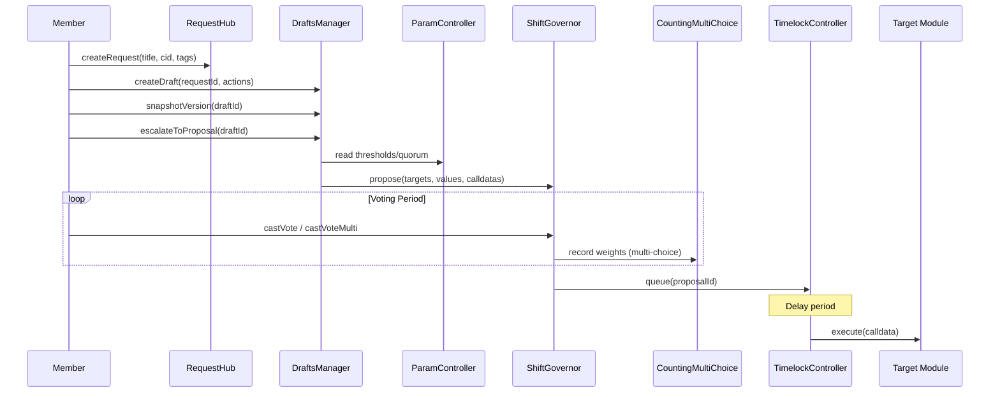
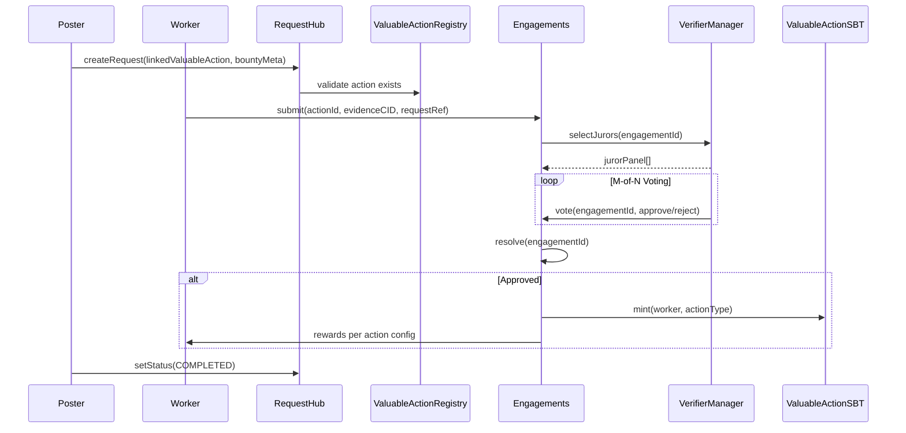
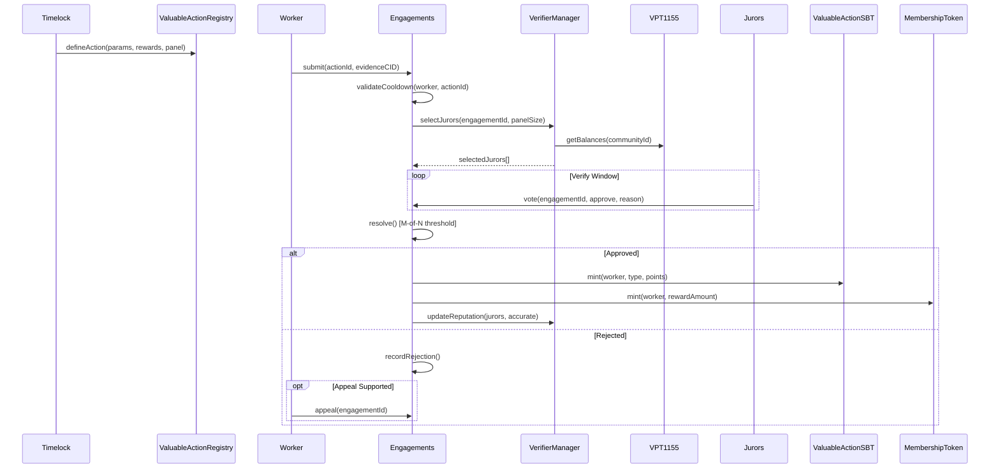
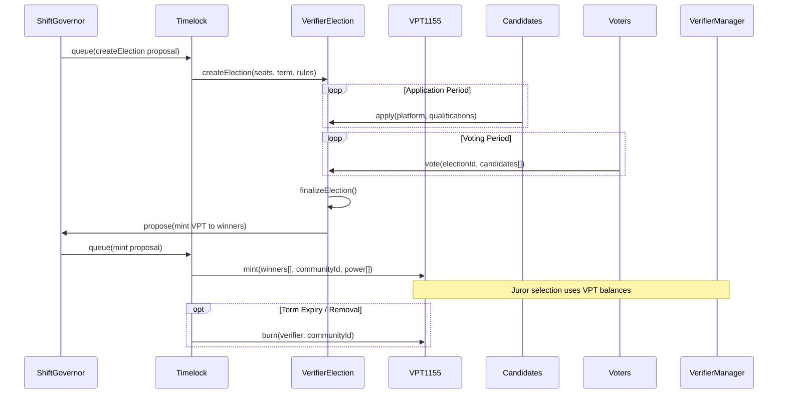
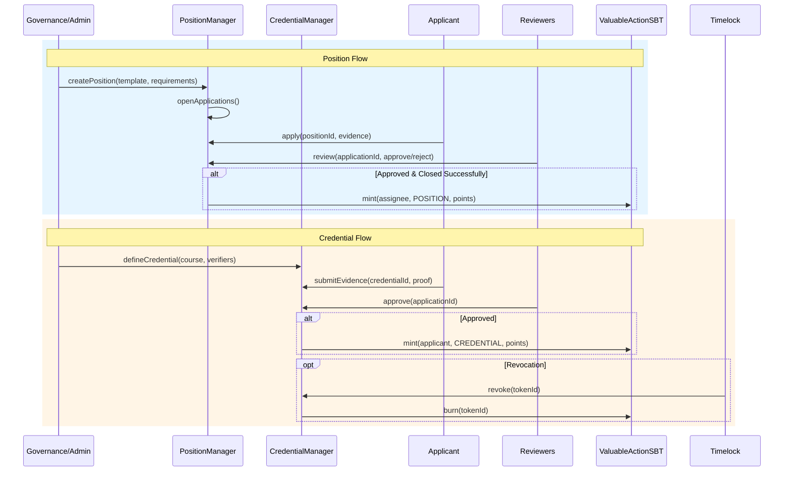
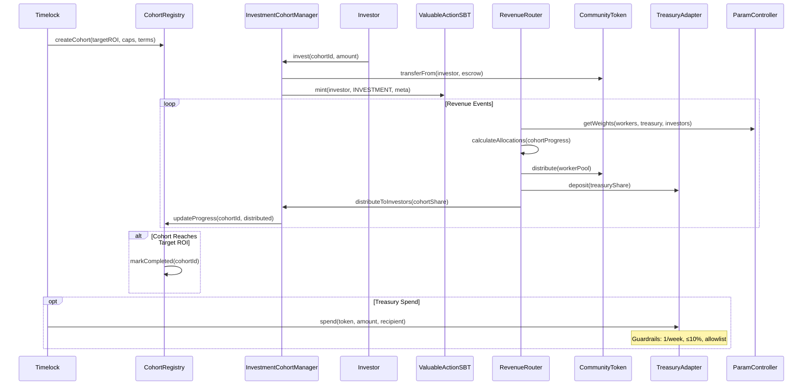
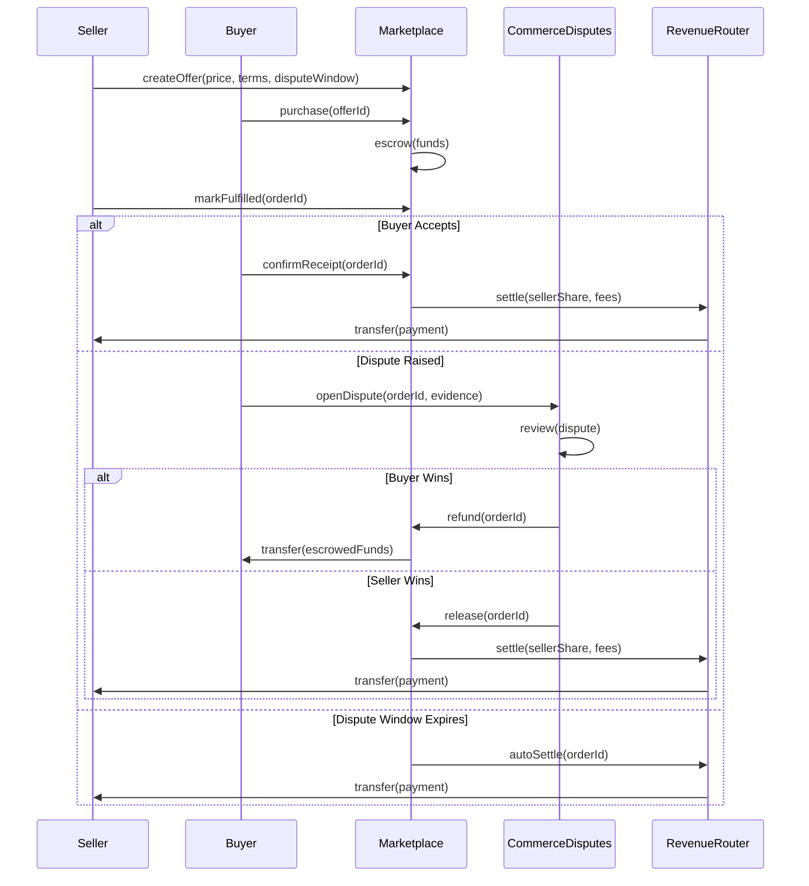
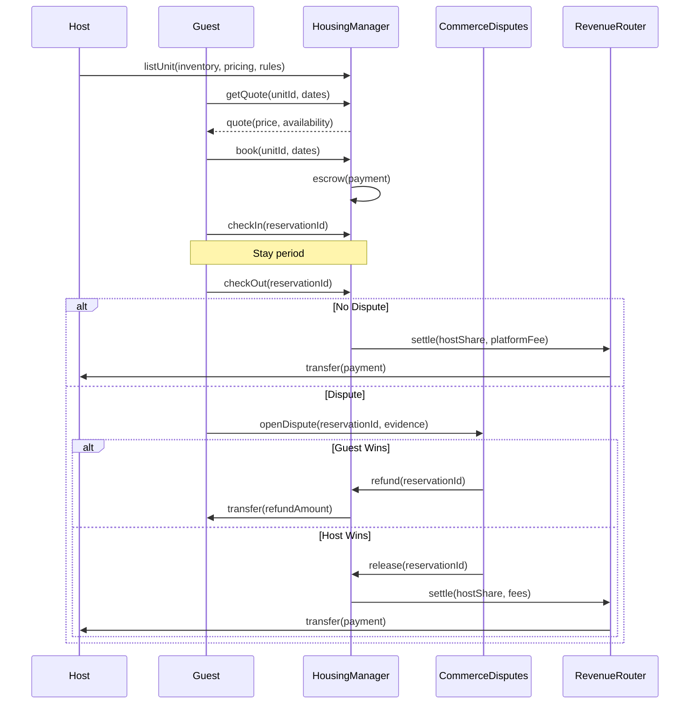
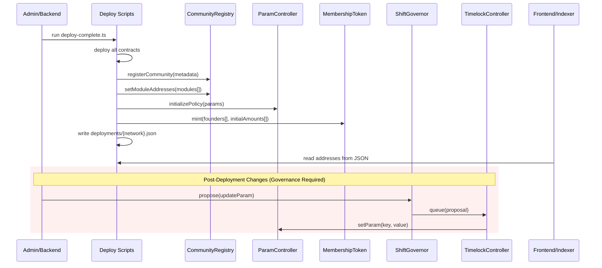

# Shift DeSoc Flows

Purpose: quick, implementation-oriented walkthroughs of the main lifecycles. Guardrails: Timelock is the only privileged authority; ParamController is the single policy source; verifier power is governance-granted (no staking); TreasuryAdapter guardrails stay intact (≤1 spend/week, ≤10% per-token, stablecoin allowlist, pause/emergency paths); commerce disputes are separate from work verification.

## Governance: Request → Draft → Proposal → Vote → Timelock → Execute
- Scope: Community coordination and decision execution. Modules: CommunityRegistry, RequestHub, DraftsManager, ShiftGovernor, CountingMultiChoice, TimelockController, ParamController.
- Flow: (1) Member opens discussion in RequestHub (tags, status). (2) DraftsManager bundles actions (targets/values/calldatas) and snapshots versions. (3) Draft escalates to proposal (binary or multi-choice) in ShiftGovernor; proposal thresholds/quorum read from ParamController. (4) Voting uses MembershipToken snapshots; multi-choice via CountingMultiChoice. (5) Successful proposal queues in TimelockController and executes after delay. (6) Modules mutate only when called by TimelockController.

- References: [docs/EN/Architecture.md](docs/EN/Architecture.md), [docs/EN/contracts/ShiftGovernor.md](docs/EN/contracts/ShiftGovernor.md), [docs/EN/contracts/CountingMultiChoice.md](docs/EN/contracts/CountingMultiChoice.md), [docs/EN/contracts/DraftsManager.md](docs/EN/contracts/DraftsManager.md), [docs/EN/contracts/ParamController.md](docs/EN/contracts/ParamController.md).

## Bounties (RequestHub-linked Valuable Actions)
- Scope: Lightweight bounty creation tied to ValuableAction definitions. Modules: RequestHub, ValuableActionRegistry, Engagements.
- Flow: (1) Poster creates RequestHub entry with `linkedValuableAction` and optional bounty amount metadata. (2) Workers submit engagements referencing the request/action. (3) Verification uses the standard VPS flow below; payouts/rewards follow the action's config. (4) Request statuses update via moderators/governance.

- References: [docs/EN/contracts/RequestHub.md](docs/EN/contracts/RequestHub.md), [docs/EN/contracts/ValuableActionRegistry.md](docs/EN/contracts/ValuableActionRegistry.md), [docs/EN/contracts/Engagements.md](docs/EN/contracts/Engagements.md).

## Work Verification (VPS: Engagements)
- Scope: Work submission and M-of-N juror verification. Modules: ValuableActionRegistry, Engagements, VerifierManager, VerifierPowerToken1155, VerifierElection, ValuableActionSBT, MembershipTokenERC20Votes.
- Flow: (1) Governance-defined ValuableAction sets verification params (panel size, approvals needed, cooldowns, rewards) in ValuableActionRegistry via Timelock. (2) Worker submits engagement with evidence; Engagements validates cooldown/eligibility. (3) VerifierManager selects jurors using VPT weights; only governance-minted VPT1155 balances qualify. (4) Jurors vote within verify window; M-of-N threshold resolves. (5) Approved: ValuableActionSBT mints (type-specific), MembershipToken and optional CommunityToken rewards mint per config. (6) Rejected: record outcome; cooldowns apply; optional appeal if supported. (7) Reputation for verifiers updates; slashing only via governance paths.

- References: [docs/EN/contracts/ValuableActionRegistry.md](docs/EN/contracts/ValuableActionRegistry.md), [docs/EN/contracts/Engagements.md](docs/EN/contracts/Engagements.md), [docs/EN/contracts/VerifierManager.md](docs/EN/contracts/VerifierManager.md), [docs/EN/contracts/VerifierPowerToken1155.md](docs/EN/contracts/VerifierPowerToken1155.md), [docs/EN/contracts/VerifierElection.md](docs/EN/contracts/VerifierElection.md), [docs/EN/contracts/ValuableActionSBT.md](docs/EN/contracts/ValuableActionSBT.md), [docs/EN/contracts/MembershipTokenERC20Votes.md](docs/EN/contracts/MembershipTokenERC20Votes.md).

## Verifier Elections (VPT Grants)
- Scope: Governance-controlled verifier roster and power grants. Modules: VerifierElection, VerifierPowerToken1155, ShiftGovernor/Timelock.
- Flow: (1) Proposal creates/updates election params (seats, term) via Timelock. (2) Candidates apply off-chain/on-chain per election rules. (3) Community votes; winners finalized through Timelock-approved action. (4) Timelock mints/burns VPT1155 power to winners/removals. (5) VerifierManager uses active VPT balances for juror selection; power expires via governance removal or term logic.

- References: [docs/EN/contracts/VerifierElection.md](docs/EN/contracts/VerifierElection.md), [docs/EN/contracts/VerifierPowerToken1155.md](docs/EN/contracts/VerifierPowerToken1155.md), [docs/EN/contracts/VerifierManager.md](docs/EN/contracts/VerifierManager.md).

## Positions & Credentials
- Scope: Role assignments and course/credential issuance. Modules: PositionManager, CredentialManager, ValuableActionSBT.
- Flow (Positions): (1) Governance or authorized role creates position template and opens applications. (2) Applicants submit; reviewers approve/reject. (3) On successful assignment/closure, POSITION-type SBT mints; failures do not mint. (4) Parameters (cooldowns, limits) sourced from ParamController where applicable.
- Flow (Credentials): (1) Course/credential defined with verifier requirements. (2) Applicant submits evidence; designated verifiers approve. (3) Approved claims mint CREDENTIAL-type SBT; governance can revoke where allowed. (4) Appeals/revocations routed through module rules and Timelock when privileged.

- References: [docs/EN/contracts/PositionManager.md](docs/EN/contracts/PositionManager.md), [docs/EN/contracts/CredentialManager.md](docs/EN/contracts/CredentialManager.md), [docs/EN/contracts/ValuableActionSBT.md](docs/EN/contracts/ValuableActionSBT.md).

## Investment & Revenue (Cohorts + Router)
- Scope: Investor onboarding, Target ROI tracking, waterfall distributions. Modules: CohortRegistry, InvestmentCohortManager, RevenueRouter, CommunityToken, TreasuryAdapter, ParamController.
- Flow: (1) Governance defines cohort terms (target ROI, caps) via Timelock into CohortRegistry. (2) Investors join cohorts through InvestmentCohortManager; Investment SBT metadata recorded in ValuableActionSBT where applicable. (3) Revenue flows into RevenueRouter; allocations follow governed weights (workers/treasury/investors) and cohort progress. (4) CommunityToken handles USDC-backed mint/redemptions; salary/claims reference SBT points. (5) TreasuryAdapter enforces spend guardrails on outbound treasury actions (1/week, ≤10% per token, stablecoin allowlist, pause/emergency withdraw). (6) ParamController stays the single source for economic parameters.

- References: [docs/EN/contracts/CohortRegistry.md](docs/EN/contracts/CohortRegistry.md), [docs/EN/contracts/InvestmentCohortManager.md](docs/EN/contracts/InvestmentCohortManager.md), [docs/EN/contracts/RevenueRouter.md](docs/EN/contracts/RevenueRouter.md), [docs/EN/contracts/CommunityToken.md](docs/EN/contracts/CommunityToken.md), [docs/EN/TreasuryAdapter-Spec-v1.md](docs/EN/TreasuryAdapter-Spec-v1.md), [docs/EN/contracts/ParamController.md](docs/EN/contracts/ParamController.md), [docs/EN/Tokenomics.md](docs/EN/Tokenomics.md).

## Marketplace Orders & Disputes
- Scope: Commercial offers, escrow, and disputes (separate from work verification). Modules: Marketplace, CommerceDisputes, RevenueRouter, TreasuryAdapter (payment path).
- Flow: (1) Seller creates offer (price, terms, dispute window). (2) Buyer purchases; funds escrowed. (3) Seller marks fulfillment; buyer accepts or raises dispute within window. (4) CommerceDisputes resolves: either refund buyer or release to seller (binary outcomes). (5) Settlements route through RevenueRouter/treasury path as configured; TreasuryAdapter guardrails apply when treasury funds move. (6) This flow never uses Engagements/ValuableAction verification.

- References: [docs/EN/contracts/Marketplace.md](docs/EN/contracts/Marketplace.md), [docs/EN/Marketplace-Spec-v1.md](docs/EN/Marketplace-Spec-v1.md), [docs/EN/contracts/CommerceDisputes.md](docs/EN/contracts/CommerceDisputes.md), [docs/EN/contracts/RevenueRouter.md](docs/EN/contracts/RevenueRouter.md).

## Housing Bookings
- Scope: Reservation lifecycle for housing products. Modules: HousingManager, CommerceDisputes (for disputes), RevenueRouter.
- Flow: (1) Host lists inventory; HousingManager calculates pricing and availability. (2) Guest books/reserves; funds handled per module rules. (3) Check-in/out triggers settlement flows; disputes route to CommerceDisputes (same binary outcomes). (4) Revenue sharing handled via RevenueRouter; treasury guardrails apply when treasury funds move.

- References: [docs/EN/contracts/HousingManager.md](docs/EN/contracts/HousingManager.md), [docs/EN/HousingManager-Spec-v1.md](docs/EN/HousingManager-Spec-v1.md), [docs/EN/contracts/CommerceDisputes.md](docs/EN/contracts/CommerceDisputes.md).

## Community Creation & Configuration
- Scope: Deployment and wiring of a community instance. Modules: deployment scripts, CommunityRegistry, ParamController, ShiftGovernor, TimelockController, module addresses JSON.
- Flow: (1) Backend deploys full suite (scripts/ API) and writes deployments/{network}.json + deployments/latest.json. (2) CommunityRegistry registers module addresses and metadata; ParamController seeded with policy. (3) Initial governance token distribution configured (e.g., founders) per deployment script. (4) Subsequent config changes (params, verifier power, module updates) must go through ShiftGovernor → TimelockController. (5) Frontend/indexer ingest addresses from deployments JSON; no hardcoded addresses in contracts.

- References: [docs/EN/Architecture.md](docs/EN/Architecture.md), [docs/EN/contracts/CommunityRegistry.md](docs/EN/contracts/CommunityRegistry.md), [docs/EN/contracts/ParamController.md](docs/EN/contracts/ParamController.md), [deployments/README.md](deployments/README.md), [scripts/deploy-complete.ts](scripts/deploy-complete.ts).
