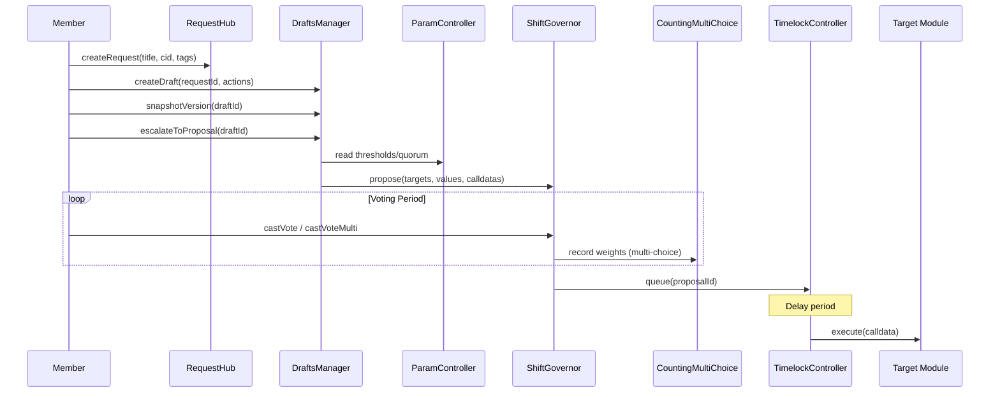
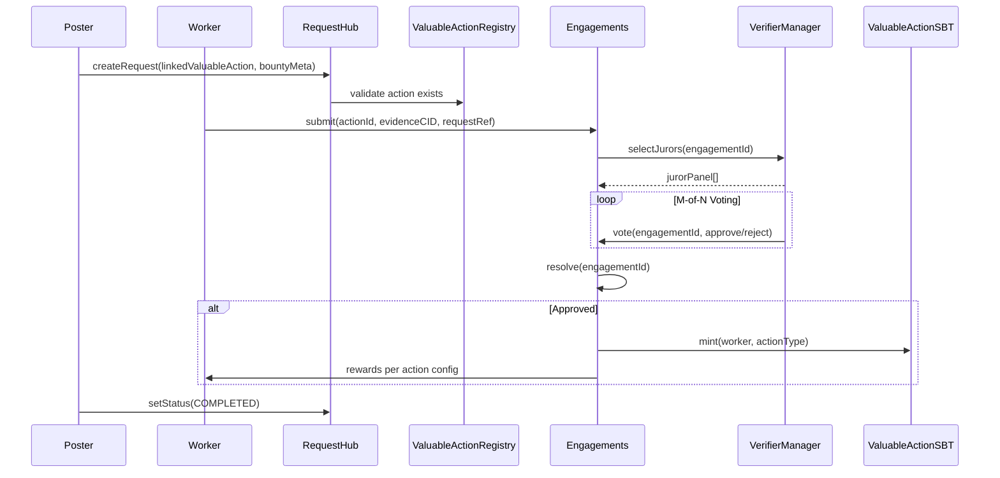
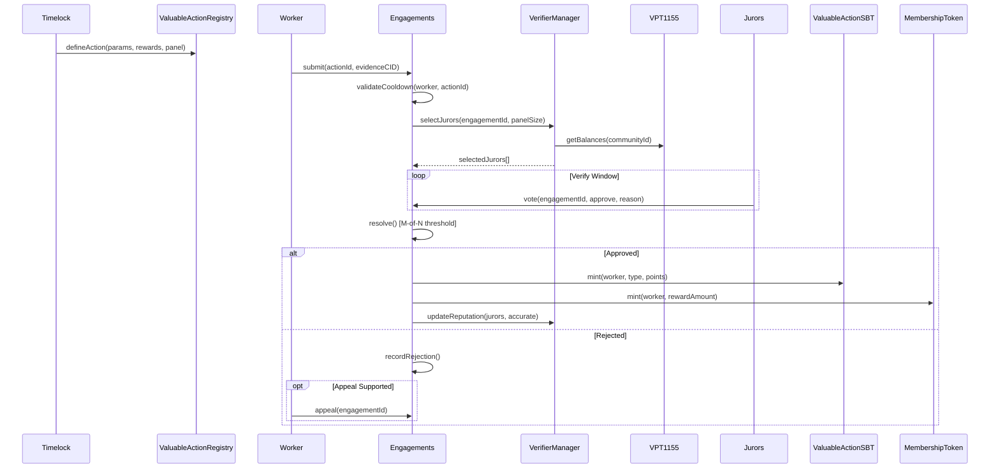
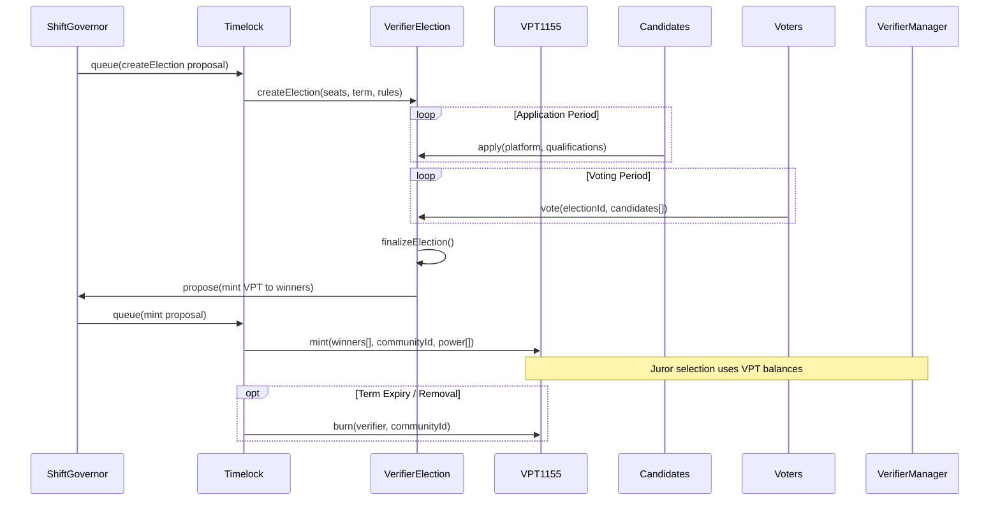
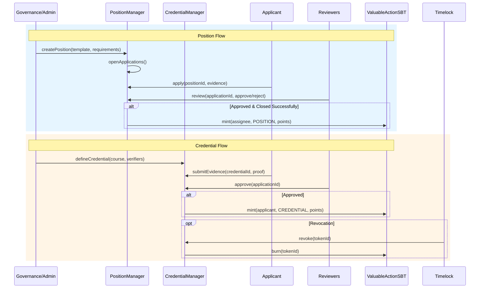
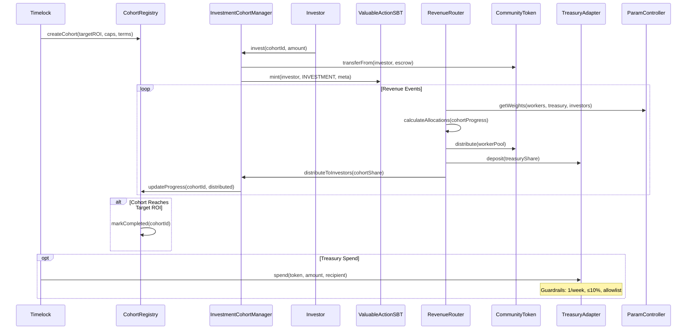
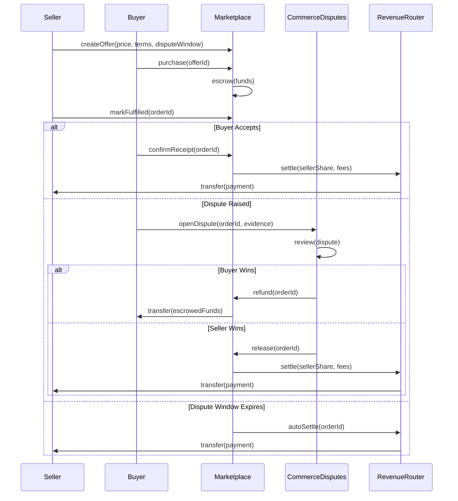
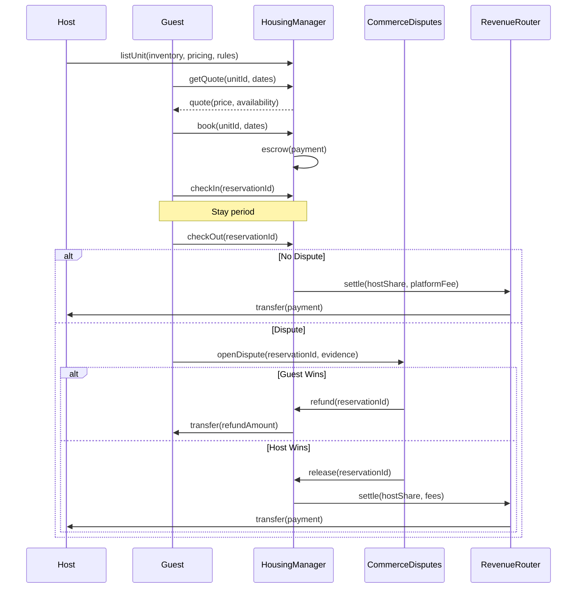
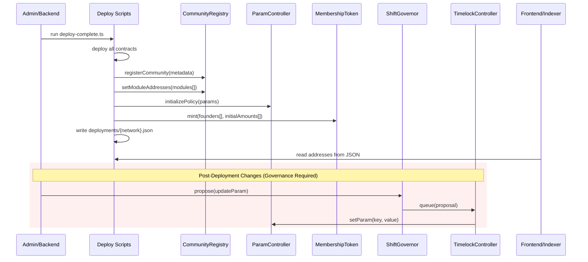

# Shift DeSoc Flows

This guide walks through the main processes in Shift DeSoc, explaining how community members, workers, investors, and administrators interact with the system. Whether you're a community organizer looking to understand governance, a developer planning an integration, or a business evaluating Shift for your organization, these flows describe what happens at each step.

**Key Principles**: All privileged actions require community approval through governance. The Timelock contract acts as the final gatekeeper, ensuring no single person can make critical changes unilaterally. Economic parameters, timing rules, and eligibility criteria are centrally managed through ParamController, making the system predictable and auditable. Commerce disputes are handled separately from work verification to maintain clear accountability.

---

## Governance: From Community Discussion to Executed Decisions

Governance in Shift follows a deliberate path from open discussion to binding action. This ensures that decisions reflect genuine community consensus rather than hasty reactions.

**How it works**: When a community member identifies a need or opportunity, they start by opening a discussion in the RequestHub. This could be anything from "We need better documentation" to "Let's change how revenue is split." Other members can comment, suggest alternatives, and refine the idea collaboratively.

Once the discussion matures, contributors can formalize it into a draft proposal using the DraftsManager. A draft bundles together the specific on-chain actions needed to implement the idea—which contracts to call, with what parameters. Drafts can go through multiple versions as the community refines the approach, with each version saved for transparency.

When a draft is ready for a vote, it escalates to ShiftGovernor as a formal proposal. The system reads voting thresholds and quorum requirements from ParamController, ensuring consistent rules across all proposals. Members vote using their MembershipToken balance (earned through verified work contributions). For complex decisions with multiple options, the CountingMultiChoice module enables weighted voting across alternatives.

If the proposal passes, it doesn't execute immediately. Instead, it enters a queue in TimelockController with a mandatory delay period. This gives the community time to prepare for changes and provides a safety window to catch any issues. Only after the delay does the Timelock execute the approved actions, calling the target contracts with the community-approved parameters.

This entire flow ensures that no individual—not even founders or administrators—can make unilateral changes to critical community systems.

- References: [Architecture](docs/EN/Architecture.md), [ShiftGovernor](docs/EN/contracts/ShiftGovernor.md), [CountingMultiChoice](docs/EN/contracts/CountingMultiChoice.md), [DraftsManager](docs/EN/contracts/DraftsManager.md), [ParamController](docs/EN/contracts/ParamController.md).

---

## Bounties: Connecting Community Needs with Skilled Contributors

Bounties bridge the gap between what communities need and who can deliver it. Rather than hiring through traditional channels, communities can post specific tasks tied to their established work verification standards.

**How it works**: A community member or administrator creates a bounty by posting a request in RequestHub that links to a predefined ValuableAction type. For example, a community might have a "Technical Documentation" action type that specifies what evidence is required, how many verifiers review submissions, and what rewards successful completion earns.

Workers interested in the bounty submit their work through the Engagements system, referencing both the bounty request and the linked action type. This submission includes evidence of completion—perhaps links to pull requests, documentation drafts, or deliverable files.

The submission then follows the standard verification process (detailed in the Work Verification section below). A panel of community-elected verifiers reviews the evidence and votes on whether the work meets the defined standards. If approved, the worker receives the configured rewards: governance tokens that increase their voting power, reputation credentials, and potentially payment from the bounty fund.

Throughout this process, moderators and governance can update the request status—marking it as in-progress when work begins, or completed when the bounty is fulfilled. This keeps the community informed about which needs have been addressed.

- References: [RequestHub](docs/EN/contracts/RequestHub.md), [ValuableActionRegistry](docs/EN/contracts/ValuableActionRegistry.md), [Engagements](docs/EN/contracts/Engagements.md).

---

## Work Verification: How Contributions Become Recognized Value

At the heart of Shift is the principle that governance power should flow from demonstrated contribution, not capital. The Verifier Power System (VPS) makes this real by providing a transparent, community-controlled process for validating work.

**Defining What Counts as Valuable Work**: Before anyone can submit work for verification, the community must first define what types of contributions it values. Through governance, communities create ValuableAction definitions that specify everything about a work category: what evidence is required, how many verifiers must review it, what the approval threshold is, how long the review window lasts, and what rewards successful completion earns. These definitions are stored in the ValuableActionRegistry and can only be modified through governance.

**Submitting Work for Review**: When a worker completes a task, they submit an engagement through the Engagements contract, attaching evidence of their work (typically as IPFS content links). The system first validates that the worker is eligible—checking cooldown periods between submissions and any other eligibility rules defined for that action type.

**The Verification Panel**: Once a submission is accepted, the VerifierManager assembles a review panel. Verifiers aren't self-appointed—they hold VerifierPowerTokens (VPT) that were granted through community governance. The selection process weights verifiers by their VPT balance, meaning verifiers the community has granted more power to are more likely to be selected for panels.

**Review and Resolution**: Selected verifiers have a defined time window to review the evidence and cast their votes. Each verifier independently decides whether the work meets the community's standards. The system uses an M-of-N threshold—for example, 3-of-5 verifiers must approve for the work to pass.

**Outcomes**: If approved, the worker receives their rewards automatically: a ValuableActionSBT (soulbound token) documenting their contribution, MembershipTokens that increase their governance voting power, and potentially CommunityToken payments. If rejected, the outcome is recorded and cooldown periods may apply before the worker can resubmit. Some action types support appeals for contested decisions.

**Verifier Accountability**: Verifiers build reputation over time based on whether their votes align with panel outcomes. This accountability system—combined with the fact that verifier power comes from governance, not staking—ensures verifiers are incentivized to judge fairly rather than to maximize personal returns.

- References: [ValuableActionRegistry](docs/EN/contracts/ValuableActionRegistry.md), [Engagements](docs/EN/contracts/Engagements.md), [VerifierManager](docs/EN/contracts/VerifierManager.md), [VerifierPowerToken1155](docs/EN/contracts/VerifierPowerToken1155.md), [VerifierElection](docs/EN/contracts/VerifierElection.md), [ValuableActionSBT](docs/EN/contracts/ValuableActionSBT.md), [MembershipTokenERC20Votes](docs/EN/contracts/MembershipTokenERC20Votes.md).

---

## Verifier Elections: Building a Trusted Review Panel

Verifiers are the quality gatekeepers of a community. Unlike systems where anyone can stake tokens to become a validator, Shift requires verifiers to be elected by the community. This ensures that verification power reflects community trust, not just financial resources.

**Setting Up an Election**: The process begins with a governance proposal to create or update an election. This proposal specifies how many verifier seats are available, the term length, eligibility requirements, and voting rules. Once approved and executed through the Timelock, the VerifierElection contract opens for applications.

**Candidate Applications**: During the application period, community members who want to serve as verifiers submit their candidacy. They typically include their qualifications, past contributions, and platform—explaining how they would approach the verification role. This information helps voters make informed decisions.

**Community Voting**: Once applications close, the voting period begins. Community members use their governance tokens to vote for candidates they trust to fairly evaluate work submissions. The election can support various voting mechanisms depending on how it was configured.

**Finalizing Results and Granting Power**: When voting concludes, the election is finalized and the winning candidates are identified. A new governance proposal then mints VerifierPowerTokens (VPT) to the winners. These tokens are non-transferable—they represent a community grant of trust, not a tradeable asset.

**Ongoing Accountability**: Verifiers serve for their elected term, during which they're called to serve on verification panels based on their VPT balance. If a verifier consistently makes poor judgments or violates community standards, governance can propose to remove them and burn their VPT. When terms expire, new elections can refresh the verifier roster.

- References: [VerifierElection](docs/EN/contracts/VerifierElection.md), [VerifierPowerToken1155](docs/EN/contracts/VerifierPowerToken1155.md), [VerifierManager](docs/EN/contracts/VerifierManager.md).

---

## Positions and Credentials: Formalizing Roles and Skills

Beyond verifying individual work contributions, communities need ways to recognize ongoing roles (like "Community Moderator" or "Technical Lead") and certified skills (like "Completed Safety Training" or "Certified Instructor"). The Positions and Credentials systems address these needs.

**Positions — Assigning Community Roles**: When a community needs to fill a role, an authorized administrator or governance action creates a position template defining the role's requirements, responsibilities, and associated recognition. Applications open, and interested members submit their qualifications and relevant experience.

Designated reviewers evaluate applications and make approval decisions. When someone is successfully assigned to a position, they receive a POSITION-type soulbound token documenting their role. This token can unlock access to role-specific tools, channels, or responsibilities within the community's systems.

**Credentials — Certifying Skills and Achievements**: For skills or certifications that don't represent ongoing roles, the Credentials system provides a path from learning to recognition. A community defines a credential—perhaps completing a training course, passing a competency assessment, or achieving a milestone.

Applicants submit evidence of completion, which designated verifiers review. Upon approval, the applicant receives a CREDENTIAL-type soulbound token that permanently documents their achievement. These credentials can serve as prerequisites for other opportunities within the community.

**Revocation**: Unlike traditional certificates that exist forever once issued, governance retains the ability to revoke credentials when warranted—for example, if fraud is discovered or if a certification expires. This maintains the integrity and trustworthiness of the credential system.

- References: [PositionManager](docs/EN/contracts/PositionManager.md), [CredentialManager](docs/EN/contracts/CredentialManager.md), [ValuableActionSBT](docs/EN/contracts/ValuableActionSBT.md).

---

## Investment and Revenue: Sustainable Community Economics

Shift provides a complete economic infrastructure for communities that want to accept investment and distribute revenue fairly among workers, the community treasury, and investors.

**Creating Investment Cohorts**: Investment in a Shift community is organized into cohorts—groups of investors who enter under the same terms. Through governance, communities define cohort parameters: the target return on investment (ROI), maximum investment caps, and any special terms. Each cohort is tracked separately, ensuring transparency about which investors are at what stage of their return.

**The Investment Process**: When investors join a cohort, they deposit funds through the InvestmentCohortManager. Their investment is recorded on-chain, and they receive a soulbound Investment token documenting their stake. The invested funds flow into the community's CommunityToken system, which maintains 1:1 backing with USDC for stability and redeemability.

**Revenue Distribution**: As the community generates revenue (from marketplace fees, services, or other sources), it flows through the RevenueRouter. This contract consults ParamController to determine the current allocation weights—what percentage goes to the worker pool, to the community treasury, and to investors.

The investor share isn't fixed. As cohorts approach their target ROI, their share automatically decreases. This creates a sustainable model: early investors receive returns that compensate for their risk, but the community isn't perpetually obligated to investors who have already received fair returns.

**Treasury Spending**: Funds allocated to the treasury are managed through the TreasuryAdapter, which enforces strict guardrails: no more than one spend per week, no more than 10% of any token's balance per transaction, and only approved stablecoins can be disbursed. These rules, along with emergency pause capabilities, protect community funds while still allowing governance to direct resources toward community priorities.

- References: [CohortRegistry](docs/EN/contracts/CohortRegistry.md), [InvestmentCohortManager](docs/EN/contracts/InvestmentCohortManager.md), [RevenueRouter](docs/EN/contracts/RevenueRouter.md), [CommunityToken](docs/EN/contracts/CommunityToken.md), [TreasuryAdapter](docs/EN/TreasuryAdapter-Spec-v1.md), [ParamController](docs/EN/contracts/ParamController.md), [Tokenomics](docs/EN/Tokenomics.md).

---

## Marketplace: Commerce with Built-in Dispute Resolution

The Marketplace enables community members to buy and sell goods and services with transparent terms and fair dispute resolution. Unlike traditional marketplaces, the rules are on-chain and enforced automatically.

**Creating and Purchasing Offers**: Sellers list offers specifying their price, terms of service, and dispute window duration. When a buyer purchases, their payment is held in escrow by the Marketplace contract—not by the seller, not by a third party, but by transparent, auditable code.

**Fulfillment and Confirmation**: The seller delivers the goods or services and marks the order as fulfilled. The buyer then has the duration of the dispute window to either confirm receipt (releasing payment to the seller) or raise a dispute if something is wrong.

**Dispute Resolution**: If the buyer raises a dispute, it routes to CommerceDisputes—a dedicated module for commercial conflicts that operates separately from work verification. This separation ensures that commercial transactions are judged by appropriate standards rather than work quality criteria. Disputes result in binary outcomes: either the buyer receives a refund, or the seller receives payment.

**Automatic Settlement**: If the dispute window expires without the buyer taking action, the system automatically settles in favor of the seller. This prevents buyers from indefinitely withholding payment for satisfactory transactions.

**Revenue Routing**: When transactions settle, proceeds flow through the RevenueRouter, which applies the community's configured fee structure and allocation rules. This can include platform fees that support community operations.

- References: [Marketplace](docs/EN/contracts/Marketplace.md), [Marketplace Spec](docs/EN/Marketplace-Spec-v1.md), [CommerceDisputes](docs/EN/contracts/CommerceDisputes.md), [RevenueRouter](docs/EN/contracts/RevenueRouter.md).

---

## Housing Bookings: Short-term Rentals with Community Governance

For communities operating shared housing or co-living spaces, the HousingManager provides a complete booking system integrated with Shift's economic infrastructure.

**Listing and Availability**: Hosts list their available units with pricing rules, availability calendars, and booking terms. The system calculates pricing based on dates, duration, and any dynamic rules the community has configured.

**The Booking Process**: Guests browse available units and request quotes for their desired dates. When they book, payment is escrowed according to the module's rules. This protects both parties: guests know their funds are secure until their stay, and hosts know payment will be released upon successful completion.

**Check-in and Stay**: Guests check in at the start of their reservation, beginning their stay period. The system tracks the reservation status throughout.

**Settlement and Disputes**: Upon checkout, the standard path is automatic settlement—the host receives their share of the payment (minus any platform fees), routed through the RevenueRouter. If issues arose during the stay, the guest can open a dispute through CommerceDisputes before checkout. As with marketplace transactions, dispute outcomes are binary: either the guest receives a refund, or the host receives payment.

This system brings the transparency and dispute resolution capabilities of Shift to the traditionally opaque short-term rental market, while allowing communities to capture revenue that might otherwise flow to external platform operators.

- References: [HousingManager](docs/EN/contracts/HousingManager.md), [HousingManager Spec](docs/EN/HousingManager-Spec-v1.md), [CommerceDisputes](docs/EN/contracts/CommerceDisputes.md).

---

## Community Creation: From Deployment to Self-Governance

Creating a new Shift community involves deploying a complete suite of contracts and wiring them together correctly. This section explains what happens during community creation and how communities transition to full self-governance.

**Initial Deployment**: An administrator or automated backend system runs the deployment scripts, which deploy all the necessary contracts for a complete community: governance contracts, verification modules, economic infrastructure, and commerce systems. The deployment process writes all contract addresses to a structured JSON file, creating a single source of truth for the community's on-chain presence.

**Configuration and Wiring**: Once contracts are deployed, the system registers the community in CommunityRegistry with its metadata and module addresses. ParamController is initialized with the community's governance parameters—voting periods, quorum thresholds, economic splits, and eligibility rules. These initial settings bootstrap the community but can be changed through governance later.

**Founder Token Distribution**: To enable initial decision-making, the deployment process mints MembershipTokens to the founding members. This gives them the voting power to begin governance operations, elect initial verifiers, and define the community's first ValuableActions. Over time, as more members contribute verified work, governance power naturally distributes more broadly.

**The Transition to Self-Governance**: Once deployment completes, all subsequent changes must go through governance. Even the founders cannot unilaterally modify parameters, add verifiers, or change economic rules. Any configuration change requires proposing through ShiftGovernor, passing a community vote, and executing through the Timelock. This ensures that from day one, the community's rules are transparent and community-controlled.

**Integration Points**: External systems—frontends, indexers, mobile apps—read the community's contract addresses from the deployment JSON files. This keeps integrations synchronized and avoids hardcoded addresses that would break if contracts were ever redeployed.

- References: [Architecture](docs/EN/Architecture.md), [CommunityRegistry](docs/EN/contracts/CommunityRegistry.md), [ParamController](docs/EN/contracts/ParamController.md), [Deployments Guide](deployments/README.md), [Deploy Script](scripts/deploy-complete.ts).
