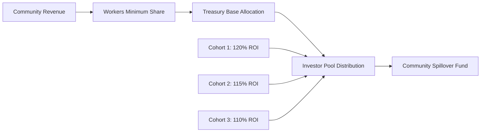

# Cohort-Based Investment System Guide

## 🎯 Overview

The Shift DeSoc cohort-based investment system provides **guaranteed returns** for investors while creating sustainable funding mechanisms for community operations. Unlike traditional DAO treasury models, our system ensures investors receive their Target ROI through **waterfall revenue distribution** while maintaining **community ownership** and **worker prioritization**.

## 🏗️ How Investment Cohorts Work

### **Investment Cohort Structure**

Each **Investment Cohort** represents a group of investors who share:

- **Target ROI**: Guaranteed return percentage (e.g., 120% = 20% return)
- **Investment Terms**: Immutable agreement captured on-chain
- **Revenue Priority**: Automated waterfall distribution
- **Completion Tracking**: Transparent progress toward ROI goals



### **Investment Process Flow**

1. **Cohort Creation**: Community governance creates investment cohorts with specific terms
2. **Investment Participation**: Investors join cohorts and receive Investment SBTs
3. **Revenue Distribution**: Automatic waterfall allocation prioritizes investor ROI
4. **Completion & Graduation**: Cohorts complete when investors reach Target ROI
5. **Community Benefit**: Post-completion revenue flows to community treasury

## 💰 Revenue Distribution Model

### **Waterfall Priority System**

Revenue flows through a **strict priority waterfall** ensuring predictable returns:

```solidity
// Revenue Distribution Priority (enforced automatically)
1. Workers Minimum Share (e.g., 40% of total revenue)
2. Treasury Base Allocation (e.g., 20% of total revenue)
3. Active Investor Cohorts (remaining 40% distributed by weight)
4. Community Spillover (after all cohorts complete ROI)
```

### **Example: $10,000 Monthly Revenue**

**Active Cohorts:**

- Cohort A: $50,000 invested, 120% Target ROI, Weight: 3.0
- Cohort B: $30,000 invested, 115% Target ROI, Weight: 2.0
- Cohort C: $20,000 invested, 110% Target ROI, Weight: 1.5

**Distribution:**

```
Total Revenue: $10,000

1. Workers (40%): $4,000 → Direct to worker wallets
2. Treasury (20%): $2,000 → Community treasury
3. Investors (40%): $4,000 → Distributed by cohort weight

   Cohort Weights: A=3.0, B=2.0, C=1.5 (Total: 6.5)

   Cohort A: $4,000 × (3.0/6.5) = $1,846
   Cohort B: $4,000 × (2.0/6.5) = $1,231
   Cohort C: $4,000 × (1.5/6.5) = $923
```

### **Cohort Completion & Graduation**

Once investors reach their Target ROI:

```solidity
// Example: Cohort A reaches 120% ROI
Cohort A Total Invested: $50,000
Cohort A Total Received: $60,000 (120% of $50,000)
Status: COMPLETED ✅

// Future revenue redistribution
Remaining Active Cohorts: B (2.0), C (1.5) = Total Weight 3.5
Cohort B: $4,000 × (2.0/3.5) = $2,286 (+$1,055 increase!)
Cohort C: $4,000 × (1.5/3.5) = $1,714 (+$791 increase!)
```

## 🎛️ Community Configuration Guide

### **Creating Investment Cohorts**

Communities configure cohort parameters through governance:

```solidity
struct CohortParams {
    uint256 communityId;           // Community creating the cohort
    uint16 targetROIBps;           // Target ROI (12000 = 120%)
    uint16 priorityWeight;         // Revenue distribution weight
    uint32 maxInvestors;           // Maximum number of investors
    uint256 minInvestment;         // Minimum investment amount per person
    uint256 maxTotalRaise;         // Maximum total cohort size
    string termsURI;               // IPFS: detailed investment terms
    bool active;                   // Whether cohort accepts new investments
}

// Example configurations for different community needs:

// Conservative Cohort (Lower risk, lower return)
CohortParams({
    targetROIBps: 11000,           // 110% ROI (10% return)
    priorityWeight: 1000,          // Lower priority
    maxInvestors: 50,
    minInvestment: 1000e6,         // $1,000 USDC minimum
    maxTotalRaise: 100000e6,       // $100,000 maximum raise
    termsURI: "ipfs://Qm...",
    active: true
});

// Growth Cohort (Balanced risk/return)
CohortParams({
    targetROIBps: 12000,           // 120% ROI (20% return)
    priorityWeight: 2000,          // Medium priority
    maxInvestors: 25,
    minInvestment: 5000e6,         // $5,000 USDC minimum
    maxTotalRaise: 200000e6,       // $200,000 maximum raise
    termsURI: "ipfs://Qm...",
    active: true
});

// Premium Cohort (Higher risk, higher return)
CohortParams({
    targetROIBps: 15000,           // 150% ROI (50% return)
    priorityWeight: 3000,          // High priority
    maxInvestors: 10,
    minInvestment: 25000e6,        // $25,000 USDC minimum
    maxTotalRaise: 500000e6,       // $500,000 maximum raise
    termsURI: "ipfs://Qm...",
    active: true
});
```

### **Revenue Policy Configuration**

Communities control revenue distribution through **ParamController**:

```solidity
// Revenue split configuration (must sum to 10000 = 100%)
struct RevenuePolicy {
    uint16 workersMinBps;          // Minimum % for workers (e.g., 4000 = 40%)
    uint16 treasuryBaseBps;        // Base % for treasury (e.g., 2000 = 20%)
    uint16 investorsPoolBps;       // Remaining % for investors (e.g., 4000 = 40%)
}

// Example policies for different community strategies:

// Worker-Prioritized (Co-op Model)
RevenuePolicy({
    workersMinBps: 6000,           // 60% to workers
    treasuryBaseBps: 2000,         // 20% to treasury
    investorsPoolBps: 2000         // 20% to investors
});

// Growth-Focused (VC Model)
RevenuePolicy({
    workersMinBps: 3000,           // 30% to workers
    treasuryBaseBps: 2000,         // 20% to treasury
    investorsPoolBps: 5000         // 50% to investors
});

// Balanced Community Model
RevenuePolicy({
    workersMinBps: 4000,           // 40% to workers
    treasuryBaseBps: 2000,         // 20% to treasury
    investorsPoolBps: 4000         // 40% to investors
});
```

## 🔧 Technical Integration

### **For Developers: Investment SBT Integration**

Investment SBTs provide on-chain credentials for cohort membership:

```solidity
// Investment SBT minting (triggered by investment)
interface IValuableActionSBT {
    function mintInvestmentSBT(
        address investor,
        uint256 communityId,
        uint256 cohortId,
        uint256 amount,
        string calldata evidenceURI
    ) external returns (uint256 sbtId);

    function getInvestmentMeta(uint256 tokenId)
        external view returns (InvestmentMeta memory);
}

// Integration with frontend applications
struct InvestmentMeta {
    uint256 communityId;        // Community identification
    uint256 cohortId;           // Specific cohort membership
    uint256 amountInvested;     // Investment amount for calculations
    bytes32 termsHash;          // Immutable terms snapshot
    uint64 investmentDate;      // Historical tracking
    bool isInvestmentSBT;       // Type identification
}

// Usage example: Investment dashboard
function getUserInvestments(address investor) external view returns (UserInvestment[] memory) {
    uint256[] memory sbtIds = valuableActionSBT.getTokensByOwner(investor);
    UserInvestment[] memory investments = new UserInvestment[](sbtIds.length);

    uint256 investmentCount = 0;
    for (uint256 i = 0; i < sbtIds.length; i++) {
        if (valuableActionSBT.isInvestmentSBT(sbtIds[i])) {
            InvestmentMeta memory meta = valuableActionSBT.getInvestmentMeta(sbtIds[i]);
            CohortInfo memory cohort = cohortRegistry.getCohortInfo(meta.cohortId);

            investments[investmentCount] = UserInvestment({
                sbtId: sbtIds[i],
                communityName: communityRegistry.getCommunity(meta.communityId).name,
                amountInvested: meta.amountInvested,
                targetROI: cohort.targetROIBps,
                currentROI: cohort.currentROI,
                monthlyEarnings: revenueRouter.previewInvestorShare(meta.cohortId, investor),
                isCompleted: cohort.isCompleted
            });
            investmentCount++;
        }
    }
}
```

### **Revenue Distribution Integration**

```solidity
// Revenue routing (called automatically by community treasury)
interface IRevenueRouter {
    function routeRevenue(
        uint256 communityId,
        uint256 totalAmount
    ) external returns (
        uint256 workersAmount,
        uint256 treasuryAmount,
        uint256 investorsAmount
    );

    function previewDistribution(uint256 communityId, uint256 amount)
        external view returns (DistributionPreview memory);
}

// Frontend integration: Revenue dashboard
async function getRevenueProjection(communityId, monthlyRevenue) {
    const preview = await revenueRouter.previewDistribution(communityId, monthlyRevenue);

    return {
        workers: {
            amount: preview.workersAmount,
            percentage: (preview.workersAmount * 100) / monthlyRevenue
        },
        treasury: {
            amount: preview.treasuryAmount,
            percentage: (preview.treasuryAmount * 100) / monthlyRevenue
        },
        investors: {
            totalPool: preview.investorsAmount,
            cohortDistribution: preview.cohortShares,
            monthsToCompletion: preview.estimatedCompletionMonths
        }
    };
}
```

## 📊 Business Benefits

### **For Communities**

1. **Predictable Funding**: Guaranteed investor commitments with clear completion timelines
2. **Worker Priority**: Always-protected minimum share for contributor compensation
3. **Growth Capital**: Access to investment without giving up community ownership
4. **Transparency**: Full on-chain tracking of investments, returns, and distributions

### **For Investors**

1. **Guaranteed ROI**: Target returns protected by smart contract waterfall distribution
2. **Transparent Progress**: Real-time tracking of ROI progress toward completion
3. **Revenue Priority**: Automatic allocation from community revenue streams
4. **Credential System**: Investment SBTs provide verified on-chain investment history

### **For Workers**

1. **Protected Income**: Minimum revenue share guaranteed regardless of investor performance
2. **Community Ownership**: Workers maintain governance control through MembershipTokens
3. **Growth Participation**: Share in community success through spillover distributions
4. **Sustainable Model**: Investor completion creates long-term community value

## 🚀 Implementation Roadmap

### **Phase 1: Cohort Creation** ✅ COMPLETE

- CohortRegistry with immutable terms and weight calculations
- ParamController integration for governance-controlled policies
- Investment SBT minting with cohort metadata

### **Phase 2: Revenue Distribution** ✅ COMPLETE

- RevenueRouter with waterfall distribution logic
- Multi-cohort weight-based allocation
- Automatic completion detection and graduation

### **Phase 3: Testing & Deployment** ✅ COMPLETE

- Comprehensive test suite with edge case coverage
- Base Sepolia deployment with real-world validation
- Production-ready smart contracts

### **Phase 4: User Interface Integration** 🔄 IN PROGRESS

- Investment dashboard for cohort browsing and participation
- Revenue projection tools for communities and investors
- Real-time ROI tracking and completion notifications

## 📝 Example Use Cases

### **Case 1: Developer Community Funding**

**Scenario**: Open source developer community needs funding for full-time contributors

**Cohort Configuration**:

```
Target ROI: 130% (30% return over 18 months)
Priority Weight: 2500 (medium-high priority)
Max Investors: 20
Min Investment: $10,000 USDC
Max Total Raise: $300,000 USDC
Revenue Policy: 50% workers, 20% treasury, 30% investors
```

**Expected Outcome**:

- Workers receive guaranteed $15,000/month minimum ($300k annual)
- Investors receive $90,000 returns ($30k annual to investor pool)
- Community retains $60,000 annually for growth and treasury

### **Case 2: Creative Community Co-op**

**Scenario**: Artist collective needs studio space and equipment funding

**Cohort Configuration**:

```
Target ROI: 115% (15% return over 24 months)
Priority Weight: 1500 (conservative priority)
Max Investors: 15
Min Investment: $5,000 USDC
Max Total Raise: $150,000 USDC
Revenue Policy: 60% workers, 20% treasury, 20% investors
```

**Expected Outcome**:

- Workers receive $18,000/month guaranteed ($216k annual)
- Investors receive $22,500 returns ($11.25k annual to investor pool)
- Community retains $6,000 annually for reinvestment

### **Case 3: Tech Startup Accelerator**

**Scenario**: High-growth community needs rapid scaling capital

**Cohort Configuration**:

```
Target ROI: 200% (100% return over 12 months)
Priority Weight: 5000 (maximum priority)
Max Investors: 5
Min Investment: $100,000 USDC
Max Total Raise: $1,000,000 USDC
Revenue Policy: 30% workers, 20% treasury, 50% investors
```

**Expected Outcome**:

- Workers receive $45,000/month minimum ($540k annual)
- Investors receive $1,000,000 returns ($1M annual to investor pool)
- Community retains $30,000 annually for operations

---

## 🎯 Getting Started

### **For Community Leaders**

1. **Review Revenue Model**: Analyze current revenue streams and project monthly income
2. **Configure Cohorts**: Determine appropriate Target ROI and investment terms
3. **Set Revenue Policy**: Choose worker/treasury/investor split ratios
4. **Launch Cohorts**: Create investment opportunities through governance process

### **For Investors**

1. **Explore Communities**: Browse active cohorts across different communities
2. **Analyze Terms**: Review Target ROI, timeline, and revenue projections
3. **Make Investment**: Join cohorts that match investment goals and timeline
4. **Track Progress**: Monitor ROI progress through Investment SBT dashboard

### **For Developers**

1. **Integration Guide**: Review smart contract interfaces and integration patterns
2. **Frontend SDKs**: Implement user interfaces for investment and revenue tracking
3. **Testing Framework**: Use Base Sepolia deployment for development and testing
4. **Production Deployment**: Leverage proven smart contracts for mainnet launches

The cohort-based investment system provides sustainable funding for communities while protecting both worker livelihoods and investor returns through transparent, automated smart contract execution.
