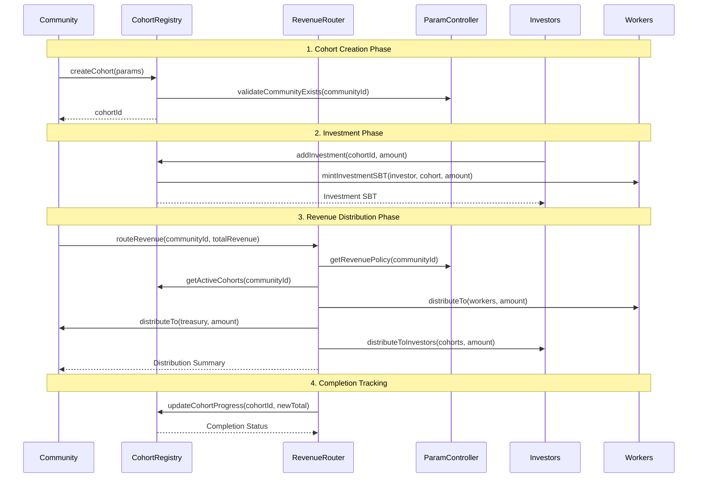

# Developer Integration Guide: Cohort-Based Revenue System

## 🎯 Overview

This guide provides developers with comprehensive technical documentation for integrating with Shift DeSoc's cohort-based revenue distribution system. The system consists of three core components that work together to provide **guaranteed investor returns** and **sustainable community funding**.

## 🏗️ Core Architecture

### **Smart Contract Stack**

```
┌─────────────────────────────────────────────────────────────────────┐
│                    COHORT REVENUE SYSTEM                            │
├─────────────────────────────────────────────────────────────────────┤
│ ┌─────────────────┐  ┌─────────────────┐  ┌─────────────────────────┐ │
│ │ ParamController │  │ CohortRegistry  │  │     RevenueRouter      │ │
│ │- Revenue Policy │◄─┤- Cohort Mgmt   ├──┤- Waterfall Distribution│ │
│ │- Governance     │  │- Weight Calc    │  │- Multi-Cohort Support  │ │
│ │- Parameter Mgmt │  │- Investment SBT │  │- Precision Math        │ │
│ └─────────────────┘  └─────────────────┘  └─────────────────────────┘ │
│           │                    │                         │             │
│           └                    └                         └             │
│ ┌─────────────────┐  ┌─────────────────┐  ┌─────────────────────────┐ │
│ │ValuableActionSBT│  │CommunityRegistry│  │    CommunityToken       │ │
│ │- Investment SBT │  │- Community Data │  │- 1:1 USDC Backing      │ │
│ │- Metadata Store │  │- Module Address │  │- Treasury Management   │ │
│ └─────────────────┘  └─────────────────┘  └─────────────────────────┘ │
└─────────────────────────────────────────────────────────────────────┘
```

### **Data Flow Architecture**



## 🔧 Smart Contract Interfaces

### **CohortRegistry Interface**

```solidity
interface ICohortRegistry {
    struct Cohort {
        uint256 communityId;           // Community that created this cohort
        uint16 targetROIBps;           // Target ROI in basis points (12000 = 120%)
        uint16 priorityWeight;         // Revenue distribution weight
        uint32 maxInvestors;           // Maximum number of investors allowed
        uint256 minInvestment;         // Minimum investment per person (USDC)
        uint256 maxTotalRaise;         // Maximum total investment (USDC)
        uint256 totalInvested;         // Current total invested amount
        uint256 totalReturned;         // Current total returned to investors
        uint256 investorCount;         // Number of current investors
        bool active;                   // Whether cohort accepts new investments
        bool isCompleted;              // Whether cohort has reached target ROI
        bytes32 termsHash;             // Immutable IPFS hash of investment terms
        uint64 createdAt;              // Creation timestamp
        uint64 completedAt;            // Completion timestamp (0 if not completed)
        string termsURI;               // Human-readable terms location
        address valuableActionSBT;     // SBT contract for minting Investment SBTs
    }

    struct InvestorRecord {
        address investor;              // Investor address
        uint256 amountInvested;        // Total investment by this investor
        uint256 amountReturned;        // Total returned to this investor
        uint256 sbtId;                 // Associated Investment SBT token ID
        uint64 joinedAt;               // Investment timestamp
    }

    // Core Functions
    function createCohort(CohortParams calldata params) external returns (uint256 cohortId);
    function addInvestment(uint256 cohortId, address investor, uint256 amount) external returns (uint256 sbtId);
    function markRecovered(uint256 cohortId, address investor, uint256 amount) external;
    function getCohort(uint256 cohortId) external view returns (Cohort memory);
    function getCohortWeight(uint256 cohortId) external view returns (uint256);
    function getActiveCohorts(uint256 communityId) external view returns (uint256[] memory);
    function getInvestorRecord(uint256 cohortId, address investor) external view returns (InvestorRecord memory);

    // Events
    event CohortCreated(uint256 indexed cohortId, uint256 indexed communityId, uint16 targetROIBps, uint16 priorityWeight);
    event InvestmentAdded(uint256 indexed cohortId, address indexed investor, uint256 amount, uint256 sbtId);
    event InvestmentReturned(uint256 indexed cohortId, address indexed investor, uint256 amount);
    event CohortCompleted(uint256 indexed cohortId, uint256 totalInvested, uint256 totalReturned);
}
```

### **RevenueRouter Interface**

```solidity
interface IRevenueRouter {
    struct DistributionResult {
        uint256 workersAmount;         // Amount allocated to workers
        uint256 treasuryAmount;        // Amount allocated to treasury
        uint256 investorsAmount;       // Amount allocated to investor pool
        uint256[] cohortShares;        // Per-cohort distribution amounts
        uint256[] cohortIds;           // Cohort IDs corresponding to shares
    }

    struct DistributionPreview {
        uint256 workersAmount;
        uint256 treasuryAmount;
        uint256 investorsAmount;
        CohortShare[] cohortShares;
        uint256 totalActiveWeight;
        uint256[] estimatedCompletionMonths;
    }

    struct CohortShare {
        uint256 cohortId;
        uint256 amount;
        uint256 weight;
        uint16 targetROIBps;
        uint256 progressBps;           // Current progress toward target (10000 = 100%)
    }

    // Core Functions
    function routeRevenue(uint256 communityId, uint256 totalAmount) external returns (DistributionResult memory);
    function previewDistribution(uint256 communityId, uint256 amount) external view returns (DistributionPreview memory);
    function previewInvestorShare(uint256 cohortId, address investor) external view returns (uint256);
    function getDistributionHistory(uint256 communityId, uint256 fromBlock) external view returns (DistributionEvent[] memory);

    // Events
    event RevenueDistributed(
        uint256 indexed communityId,
        uint256 totalAmount,
        uint256 workersAmount,
        uint256 treasuryAmount,
        uint256 investorsAmount,
        uint256 timestamp
    );
    event CohortDistribution(
        uint256 indexed cohortId,
        uint256 amount,
        uint256 weight,
        uint256 totalActiveWeight,
        uint256 timestamp
    );
}
```

### **ValuableActionSBT Investment Extensions**

```solidity
interface IValuableActionSBT {
    struct InvestmentMeta {
        uint256 communityId;        // Community where investment was made
        uint256 cohortId;           // Specific cohort membership
        uint256 amountInvested;     // Investment amount for pro-rata calculations
        bytes32 termsHash;          // Snapshot of cohort terms at investment time
        uint64 investmentDate;      // Timestamp for historical tracking
        bool isInvestmentSBT;       // Flag for SBT subtype identification
    }

    // Investment SBT Functions
    function mintInvestmentSBT(
        address investor,
        uint256 communityId,
        uint256 cohortId,
        uint256 amount,
        string calldata evidenceURI
    ) external returns (uint256 sbtId);

    function isInvestmentSBT(uint256 tokenId) external view returns (bool);
    function getInvestmentMeta(uint256 tokenId) external view returns (InvestmentMeta memory);
    function getInvestmentsByCohort(uint256 cohortId) external view returns (uint256[] memory sbtIds);
    function getInvestmentsByOwner(address owner) external view returns (uint256[] memory sbtIds);

    // Events
    event InvestmentSBTMinted(
        address indexed investor,
        uint256 indexed sbtId,
        uint256 indexed communityId,
        uint256 cohortId,
        uint256 amount
    );
}
```

## 📊 Implementation Examples

### **Frontend Integration: Investment Dashboard**

```typescript
// Investment Dashboard Component
interface UserInvestment {
  sbtId: number;
  communityName: string;
  cohortId: number;
  amountInvested: string;
  targetROI: number;
  currentROI: number;
  monthlyEarnings: string;
  isCompleted: boolean;
  completionDate?: Date;
  termsURI: string;
}

class InvestmentDashboard {
  private cohortRegistry: ICohortRegistry;
  private revenueRouter: IRevenueRouter;
  private valuableActionSBT: IValuableActionSBT;

  async getUserInvestments(userAddress: string): Promise<UserInvestment[]> {
    // Get all Investment SBTs owned by user
    const sbtIds = await this.valuableActionSBT.getInvestmentsByOwner(userAddress);

    const investments: UserInvestment[] = [];

    for (const sbtId of sbtIds) {
      const meta = await this.valuableActionSBT.getInvestmentMeta(sbtId);
      const cohort = await this.cohortRegistry.getCohort(meta.cohortId);
      const investorRecord = await this.cohortRegistry.getInvestorRecord(
        meta.cohortId,
        userAddress,
      );

      // Calculate current ROI progress
      const currentROI =
        (investorRecord.amountReturned / investorRecord.amountInvested) * 100;
      const targetROI = cohort.targetROIBps / 100;

      // Get projected monthly earnings
      const monthlyEarnings = await this.revenueRouter.previewInvestorShare(
        meta.cohortId,
        userAddress,
      );

      investments.push({
        sbtId: sbtId.toNumber(),
        communityName: await this.getCommunityName(meta.communityId),
        cohortId: meta.cohortId.toNumber(),
        amountInvested: ethers.utils.formatUnits(meta.amountInvested, 6),
        targetROI: targetROI,
        currentROI: currentROI,
        monthlyEarnings: ethers.utils.formatUnits(monthlyEarnings, 6),
        isCompleted: cohort.isCompleted,
        completionDate:
          cohort.completedAt > 0
            ? new Date(cohort.completedAt * 1000)
            : undefined,
        termsURI: cohort.termsURI,
      });
    }

    return investments;
  }

  async getCommunityRevenueForecast(
    communityId: number,
    projectedMonthlyRevenue: string,
  ): Promise<RevenueForecast> {
    const amount = ethers.utils.parseUnits(projectedMonthlyRevenue, 6);
    const preview = await this.revenueRouter.previewDistribution(
      communityId,
      amount,
    );

    return {
      totalRevenue: projectedMonthlyRevenue,
      workersShare: {
        amount: ethers.utils.formatUnits(preview.workersAmount, 6),
        percentage: preview.workersAmount.mul(100).div(amount).toNumber(),
      },
      treasuryShare: {
        amount: ethers.utils.formatUnits(preview.treasuryAmount, 6),
        percentage: preview.treasuryAmount.mul(100).div(amount).toNumber(),
      },
      investorsShare: {
        totalAmount: ethers.utils.formatUnits(preview.investorsAmount, 6),
        percentage: preview.investorsAmount.mul(100).div(amount).toNumber(),
        cohortBreakdown: preview.cohortShares.map((share) => ({
          cohortId: share.cohortId.toNumber(),
          amount: ethers.utils.formatUnits(share.amount, 6),
          weight: share.weight.toNumber(),
          targetROI: share.targetROIBps,
          progress: share.progressBps / 100,
        })),
      },
      estimatedCompletionMonths: preview.estimatedCompletionMonths.map((m) =>
        m.toNumber(),
      ),
    };
  }
}
```

### **Backend Integration: Revenue Processing**

```typescript
// Automated Revenue Distribution Service
class RevenueDistributionService {
  private revenueRouter: IRevenueRouter;
  private communityToken: ICommunityToken;
  private eventEmitter: EventEmitter;

  async processMonthlyRevenue(
    communityId: number,
    revenueAmount: string,
    revenueSource: string,
  ): Promise<DistributionReceipt> {
    const amount = ethers.utils.parseUnits(revenueAmount, 6);

    try {
      // Preview distribution before execution
      const preview = await this.revenueRouter.previewDistribution(
        communityId,
        amount,
      );

      // Log distribution plan
      console.log(`Revenue Distribution Plan for Community ${communityId}:`);
      console.log(`  Total Revenue: $${revenueAmount}`);
      console.log(
        `  Workers: $${ethers.utils.formatUnits(preview.workersAmount, 6)}`,
      );
      console.log(
        `  Treasury: $${ethers.utils.formatUnits(preview.treasuryAmount, 6)}`,
      );
      console.log(
        `  Investors: $${ethers.utils.formatUnits(preview.investorsAmount, 6)}`,
      );

      // Execute distribution
      const tx = await this.revenueRouter.routeRevenue(communityId, amount, {
        gasLimit: 500000, // Adequate gas for multi-cohort distribution
      });

      const receipt = await tx.wait();

      // Parse distribution events
      const distributionEvents = this.parseDistributionEvents(receipt.logs);

      // Emit notifications
      this.eventEmitter.emit("revenueDistributed", {
        communityId,
        totalAmount: revenueAmount,
        distributionEvents,
        transactionHash: receipt.transactionHash,
        blockNumber: receipt.blockNumber,
        source: revenueSource,
      });

      return {
        success: true,
        transactionHash: receipt.transactionHash,
        distributionSummary: preview,
        gasUsed: receipt.gasUsed.toString(),
        events: distributionEvents,
      };
    } catch (error) {
      console.error(
        `Revenue distribution failed for community ${communityId}:`,
        error,
      );

      return {
        success: false,
        error: error.message,
        communityId,
        attemptedAmount: revenueAmount,
      };
    }
  }

  async getDistributionHistory(
    communityId: number,
    fromDate: Date,
    toDate?: Date,
  ): Promise<HistoricalDistribution[]> {
    const fromBlock = await this.getBlockFromDate(fromDate);
    const toBlock = toDate ? await this.getBlockFromDate(toDate) : "latest";

    const events = await this.revenueRouter.queryFilter(
      this.revenueRouter.filters.RevenueDistributed(communityId),
      fromBlock,
      toBlock,
    );

    return events.map((event) => ({
      transactionHash: event.transactionHash,
      blockNumber: event.blockNumber,
      timestamp: new Date(event.args.timestamp * 1000),
      totalAmount: ethers.utils.formatUnits(event.args.totalAmount, 6),
      workersAmount: ethers.utils.formatUnits(event.args.workersAmount, 6),
      treasuryAmount: ethers.utils.formatUnits(event.args.treasuryAmount, 6),
      investorsAmount: ethers.utils.formatUnits(event.args.investorsAmount, 6),
    }));
  }

  private parseDistributionEvents(logs: any[]): DistributionEvent[] {
    return logs
      .filter(
        (log) =>
          log.topics[0] ===
          this.revenueRouter.interface.getEventTopic("CohortDistribution"),
      )
      .map((log) => {
        const parsed = this.revenueRouter.interface.parseLog(log);
        return {
          cohortId: parsed.args.cohortId.toNumber(),
          amount: ethers.utils.formatUnits(parsed.args.amount, 6),
          weight: parsed.args.weight.toNumber(),
          totalActiveWeight: parsed.args.totalActiveWeight.toNumber(),
          timestamp: new Date(parsed.args.timestamp * 1000),
        };
      });
  }
}
```

### **Community Management: Cohort Creation**

```typescript
// Community Administration Interface
class CommunityManagement {
  private cohortRegistry: ICohortRegistry;
  private paramController: IParamController;

  async createInvestmentCohort(
    communityId: number,
    cohortConfig: CohortConfiguration,
  ): Promise<CohortCreationResult> {
    // Validate community exists and caller has admin rights
    const community = await this.paramController.getCommunity(communityId);
    if (!community.exists) {
      throw new Error(`Community ${communityId} does not exist`);
    }

    // Prepare cohort parameters
    const params = {
      communityId: communityId,
      targetROIBps: Math.floor(cohortConfig.targetROI * 100), // Convert % to basis points
      priorityWeight: cohortConfig.priorityWeight,
      maxInvestors: cohortConfig.maxInvestors,
      minInvestment: ethers.utils.parseUnits(
        cohortConfig.minInvestment.toString(),
        6,
      ),
      maxTotalRaise: ethers.utils.parseUnits(
        cohortConfig.maxTotalRaise.toString(),
        6,
      ),
      termsURI: cohortConfig.termsURI,
      active: true,
    };

    // Create cohort through governance (if required) or direct creation
    const tx = await this.cohortRegistry.createCohort(params, {
      gasLimit: 200000,
    });

    const receipt = await tx.wait();
    const cohortCreatedEvent = receipt.logs.find(
      (log) =>
        log.topics[0] ===
        this.cohortRegistry.interface.getEventTopic("CohortCreated"),
    );

    if (!cohortCreatedEvent) {
      throw new Error("Cohort creation event not found in transaction receipt");
    }

    const parsed = this.cohortRegistry.interface.parseLog(cohortCreatedEvent);
    const cohortId = parsed.args.cohortId.toNumber();

    return {
      success: true,
      cohortId: cohortId,
      transactionHash: receipt.transactionHash,
      configuration: cohortConfig,
      estimatedFunding: {
        minRaise: cohortConfig.minInvestment,
        maxRaise: cohortConfig.maxTotalRaise,
        targetCompletion: this.estimateCompletionTime(cohortConfig),
      },
    };
  }

  async updateRevenuePolicy(
    communityId: number,
    newPolicy: RevenuePolicy,
  ): Promise<PolicyUpdateResult> {
    // Validate policy sums to 100%
    const totalBps =
      newPolicy.workersMinBps +
      newPolicy.treasuryBaseBps +
      newPolicy.investorsPoolBps;
    if (totalBps !== 10000) {
      throw new Error(
        `Revenue policy must sum to 100% (10000 bps), got ${totalBps}`,
      );
    }

    // Update through governance process
    const tx = await this.paramController.updateRevenuePolicy(
      communityId,
      [
        newPolicy.workersMinBps,
        newPolicy.treasuryBaseBps,
        newPolicy.investorsPoolBps,
      ],
      { gasLimit: 150000 },
    );

    const receipt = await tx.wait();

    return {
      success: true,
      transactionHash: receipt.transactionHash,
      newPolicy: newPolicy,
      effectiveDate: new Date(), // Immediate effect
    };
  }

  private estimateCompletionTime(
    config: CohortConfiguration,
  ): EstimatedCompletion {
    // Simple estimation based on target ROI and typical revenue patterns
    const returnRequired = (config.targetROI - 100) / 100; // ROI above 100%
    const avgMonthlyReturn = 0.02; // Assume 2% monthly return on investment
    const estimatedMonths = Math.ceil(returnRequired / avgMonthlyReturn);

    return {
      estimatedMonths: estimatedMonths,
      estimatedDate: new Date(
        Date.now() + estimatedMonths * 30 * 24 * 60 * 60 * 1000,
      ),
      confidence: "medium", // Based on historical data
      assumptions: [
        "2% average monthly return rate",
        "Consistent revenue generation",
        "No major market disruptions",
      ],
    };
  }
}
```

## 🧪 Testing Framework

### **Unit Test Examples**

```typescript
// Comprehensive Test Suite for Cohort Revenue System
describe("Cohort Revenue Distribution", function () {
  let cohortRegistry: CohortRegistry;
  let revenueRouter: RevenueRouter;
  let paramController: ParamController;
  let communityToken: CommunityToken;

  beforeEach(async function () {
    // Deploy test contracts
    const deployment = await deployTestSystem();
    cohortRegistry = deployment.cohortRegistry;
    revenueRouter = deployment.revenueRouter;
    paramController = deployment.paramController;
    communityToken = deployment.communityToken;
  });

  describe("Multi-Cohort Revenue Distribution", function () {
    it("should distribute revenue proportionally across active cohorts", async function () {
      // Create test cohorts with different weights
      const cohort1 = await createTestCohort({
        targetROIBps: 12000, // 120% ROI
        priorityWeight: 3000,
        totalInvested: ethers.utils.parseUnits("50000", 6), // $50k
      });

      const cohort2 = await createTestCohort({
        targetROIBps: 11500, // 115% ROI
        priorityWeight: 2000,
        totalInvested: ethers.utils.parseUnits("30000", 6), // $30k
      });

      const cohort3 = await createTestCohort({
        targetROIBps: 11000, // 110% ROI
        priorityWeight: 1500,
        totalInvested: ethers.utils.parseUnits("20000", 6), // $20k
      });

      // Simulate monthly revenue distribution
      const monthlyRevenue = ethers.utils.parseUnits("10000", 6); // $10k

      const result = await revenueRouter.routeRevenue(1, monthlyRevenue);

      // Verify waterfall distribution
      const expectedWorkersShare = monthlyRevenue.mul(4000).div(10000); // 40%
      const expectedTreasuryShare = monthlyRevenue.mul(2000).div(10000); // 20%
      const expectedInvestorsShare = monthlyRevenue.mul(4000).div(10000); // 40%

      expect(result.workersAmount).to.equal(expectedWorkersShare);
      expect(result.treasuryAmount).to.equal(expectedTreasuryShare);
      expect(result.investorsAmount).to.equal(expectedInvestorsShare);

      // Verify proportional cohort distribution
      const totalWeight = 3000 + 2000 + 1500; // 6500
      const cohort1Share = expectedInvestorsShare.mul(3000).div(totalWeight);
      const cohort2Share = expectedInvestorsShare.mul(2000).div(totalWeight);
      const cohort3Share = expectedInvestorsShare.mul(1500).div(totalWeight);

      expect(result.cohortShares[0]).to.equal(cohort1Share);
      expect(result.cohortShares[1]).to.equal(cohort2Share);
      expect(result.cohortShares[2]).to.equal(cohort3Share);
    });

    it("should handle cohort completion and weight redistribution", async function () {
      // Create cohorts with one near completion
      const nearCompleteCohort = await createTestCohort({
        targetROIBps: 12000, // 120% ROI
        totalInvested: ethers.utils.parseUnits("100000", 6),
        totalReturned: ethers.utils.parseUnits("115000", 6), // 115% progress
        priorityWeight: 2000,
      });

      const activeCohort = await createTestCohort({
        targetROIBps: 11500, // 115% ROI
        totalInvested: ethers.utils.parseUnits("50000", 6),
        totalReturned: ethers.utils.parseUnits("25000", 6), // 50% progress
        priorityWeight: 1500,
      });

      // Distribute revenue that completes first cohort
      const revenue = ethers.utils.parseUnits("8000", 6);

      const result = await revenueRouter.routeRevenue(1, revenue);

      // Verify first cohort completion
      const cohort1 = await cohortRegistry.getCohort(
        nearCompleteCohort.cohortId,
      );
      expect(cohort1.isCompleted).to.be.true;

      // Verify remaining revenue goes to active cohort
      const investorsShare = revenue.mul(4000).div(10000); // 40% of $8k = $3.2k
      const cohort1Needed = ethers.utils.parseUnits("5000", 6); // $5k to complete
      const remainingForCohort2 = investorsShare.sub(cohort1Needed);

      expect(result.cohortShares[1]).to.equal(remainingForCohort2);
    });
  });

  describe("Investment SBT Integration", function () {
    it("should mint Investment SBT with correct metadata", async function () {
      const cohortId = await createTestCohort({
        communityId: 1,
        targetROIBps: 12000,
        priorityWeight: 2000,
      });

      const investor = accounts[1];
      const investmentAmount = ethers.utils.parseUnits("10000", 6);

      // Add investment and mint SBT
      const sbtId = await cohortRegistry
        .connect(investor)
        .addInvestment(cohortId, investor.address, investmentAmount);

      // Verify SBT metadata
      const investmentMeta = await valuableActionSBT.getInvestmentMeta(sbtId);

      expect(investmentMeta.communityId).to.equal(1);
      expect(investmentMeta.cohortId).to.equal(cohortId);
      expect(investmentMeta.amountInvested).to.equal(investmentAmount);
      expect(investmentMeta.isInvestmentSBT).to.be.true;

      // Verify cohort record
      const investorRecord = await cohortRegistry.getInvestorRecord(
        cohortId,
        investor.address,
      );
      expect(investorRecord.amountInvested).to.equal(investmentAmount);
      expect(investorRecord.sbtId).to.equal(sbtId);
    });
  });
});
```

## 🚀 Deployment Guide

### **Contract Deployment Sequence**

```typescript
// Production Deployment Script
async function deployProductionSystem(): Promise<DeploymentResult> {
  console.log("🚀 Starting Shift DeSoc Cohort System Deployment...");

  // 1. Deploy base infrastructure
  console.log("📋 Deploying base contracts...");
  const paramController = await deployContract("ParamController");
  const communityRegistry = await deployContract("CommunityRegistry", [
    paramController.address,
  ]);

  // 2. Deploy token contracts
  console.log("🪙 Deploying token contracts...");
  const membershipToken = await deployContract("MembershipTokenERC20Votes");
  const communityToken = await deployContract("CommunityToken", [USDC_ADDRESS]);
  const valuableActionSBT = await deployContract("ValuableActionSBT");

  // 3. Deploy cohort system
  console.log("💼 Deploying cohort system...");
  const cohortRegistry = await deployContract("CohortRegistry", [
    paramController.address,
    valuableActionSBT.address,
  ]);

  const revenueRouter = await deployContract("RevenueRouter", [
    paramController.address,
    cohortRegistry.address,
    communityToken.address,
  ]);

  // 4. Configure integrations
  console.log("🔧 Configuring system integrations...");
  await paramController.setModuleAddress(
    "CohortRegistry",
    cohortRegistry.address,
  );
  await paramController.setModuleAddress(
    "RevenueRouter",
    revenueRouter.address,
  );
  await valuableActionSBT.setCohortRegistry(cohortRegistry.address);
  await cohortRegistry.setRevenueRouter(revenueRouter.address);

  // 5. Verify deployment
  console.log("✅ Verifying deployment...");
  await verifyDeployment({
    paramController,
    communityRegistry,
    membershipToken,
    communityToken,
    valuableActionSBT,
    cohortRegistry,
    revenueRouter,
  });

  console.log("🎉 Deployment completed successfully!");

  return {
    contracts: {
      paramController: paramController.address,
      communityRegistry: communityRegistry.address,
      membershipToken: membershipToken.address,
      communityToken: communityToken.address,
      valuableActionSBT: valuableActionSBT.address,
      cohortRegistry: cohortRegistry.address,
      revenueRouter: revenueRouter.address,
    },
    network: await ethers.provider.getNetwork(),
    deployedAt: new Date(),
    gasUsed: await getTotalGasUsed(),
  };
}
```

### **Configuration Examples**

```typescript
// Production Configuration Templates
export const ProductionConfigurations = {
  // Conservative Community (Co-op Model)
  cooperative: {
    revenuePolicy: {
      workersMinBps: 6000, // 60% to workers
      treasuryBaseBps: 2000, // 20% to treasury
      investorsPoolBps: 2000, // 20% to investors
    },
    cohortDefaults: {
      targetROIBps: 11000, // 110% ROI (10% return)
      priorityWeight: 1000, // Low priority weight
      maxInvestors: 50,
      minInvestment: ethers.utils.parseUnits("1000", 6), // $1k minimum
    },
  },

  // Balanced Community (Standard Model)
  balanced: {
    revenuePolicy: {
      workersMinBps: 4000, // 40% to workers
      treasuryBaseBps: 2000, // 20% to treasury
      investorsPoolBps: 4000, // 40% to investors
    },
    cohortDefaults: {
      targetROIBps: 12000, // 120% ROI (20% return)
      priorityWeight: 2000, // Medium priority weight
      maxInvestors: 25,
      minInvestment: ethers.utils.parseUnits("5000", 6), // $5k minimum
    },
  },

  // Growth Community (VC Model)
  venture: {
    revenuePolicy: {
      workersMinBps: 3000, // 30% to workers
      treasuryBaseBps: 2000, // 20% to treasury
      investorsPoolBps: 5000, // 50% to investors
    },
    cohortDefaults: {
      targetROIBps: 15000, // 150% ROI (50% return)
      priorityWeight: 3000, // High priority weight
      maxInvestors: 10,
      minInvestment: ethers.utils.parseUnits("25000", 6), // $25k minimum
    },
  },
};
```

## 🔐 Security Considerations

### **Access Control Patterns**

```solidity
// Role-Based Access Control for Cohort System
contract CohortRegistry is AccessControl {
    bytes32 public constant COHORT_CREATOR_ROLE = keccak256("COHORT_CREATOR_ROLE");
    bytes32 public constant INVESTMENT_MANAGER_ROLE = keccak256("INVESTMENT_MANAGER_ROLE");
    bytes32 public constant REVENUE_DISTRIBUTOR_ROLE = keccak256("REVENUE_DISTRIBUTOR_ROLE");

    modifier onlyCohortCreator(uint256 communityId) {
        require(
            hasRole(COHORT_CREATOR_ROLE, msg.sender) ||
            paramController.isAuthorizedForCommunity(communityId, msg.sender),
            "Unauthorized cohort creation"
        );
        _;
    }

    modifier onlyRevenueDistributor() {
        require(
            hasRole(REVENUE_DISTRIBUTOR_ROLE, msg.sender) ||
            msg.sender == address(revenueRouter),
            "Unauthorized revenue distribution"
        );
        _;
    }
}
```

### **Input Validation & Precision**

```solidity
// Comprehensive Input Validation
contract RevenueRouter {
    using SafeMath for uint256;

    uint256 private constant MAX_BPS = 10000;
    uint256 private constant PRECISION_MULTIPLIER = 1e18;

    function routeRevenue(uint256 communityId, uint256 totalAmount)
        external
        onlyAuthorized
        returns (DistributionResult memory)
    {
        // Input validation
        require(totalAmount > 0, "Amount must be positive");
        require(communityId > 0, "Invalid community ID");
        require(totalAmount <= type(uint128).max, "Amount too large");

        // Get validated revenue policy
        IParamController.RevenuePolicy memory policy = paramController.getRevenuePolicy(communityId);
        require(
            policy.workersMinBps + policy.treasuryBaseBps + policy.investorsPoolBps == MAX_BPS,
            "Invalid revenue policy configuration"
        );

        // Precision-safe calculations
        uint256 workersAmount = totalAmount.mul(policy.workersMinBps).div(MAX_BPS);
        uint256 treasuryAmount = totalAmount.mul(policy.treasuryBaseBps).div(MAX_BPS);
        uint256 investorsAmount = totalAmount.sub(workersAmount).sub(treasuryAmount);

        // Distribute with reentrancy protection
        return _distributeWithProtection(communityId, workersAmount, treasuryAmount, investorsAmount);
    }
}
```

---

## 📚 Additional Resources

### **API Documentation**

- [CohortRegistry API Reference](../contracts/CohortRegistry.md)
- [RevenueRouter API Reference](../contracts/RevenueRouter.md)
- [ParamController Integration Guide](../contracts/ParamController.md)

### **Example Applications**

- [Investment Dashboard Frontend](https://github.com/shift-desoc/investment-dashboard)
- [Revenue Analytics Backend](https://github.com/shift-desoc/revenue-analytics)
- [Community Management Interface](https://github.com/shift-desoc/community-admin)

### **Testing Resources**

- [Test Suite Examples](../../packages/foundry/test/RevenueRouterCohort.t.sol)
- [Integration Test Framework](../../packages/foundry/test/integration/)
- [Performance Benchmarks](../../scripts/performance-tests/)

### **Deployment Scripts**

- [Base Sepolia Deployment](../../packages/hardhat/scripts/deploy-cohort-system.ts)
- [Mainnet Migration Guide](../../packages/hardhat/scripts/mainnet-deployment.md)
- [Verification Scripts](../../packages/hardhat/scripts/verify-contracts.ts)

This comprehensive developer guide provides all the technical details needed to integrate with Shift DeSoc's innovative cohort-based revenue system, enabling sustainable community funding while guaranteeing investor returns through transparent smart contract automation.
