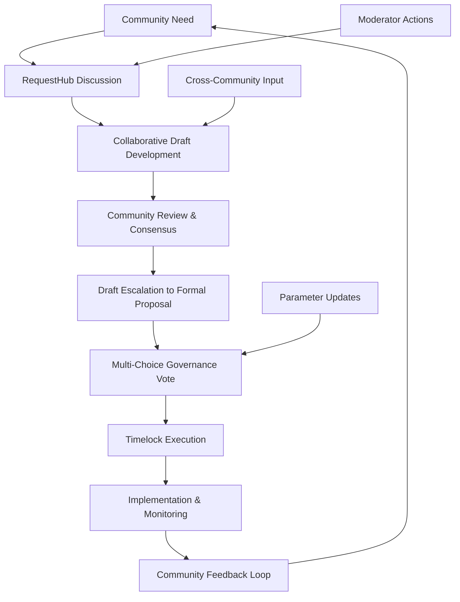
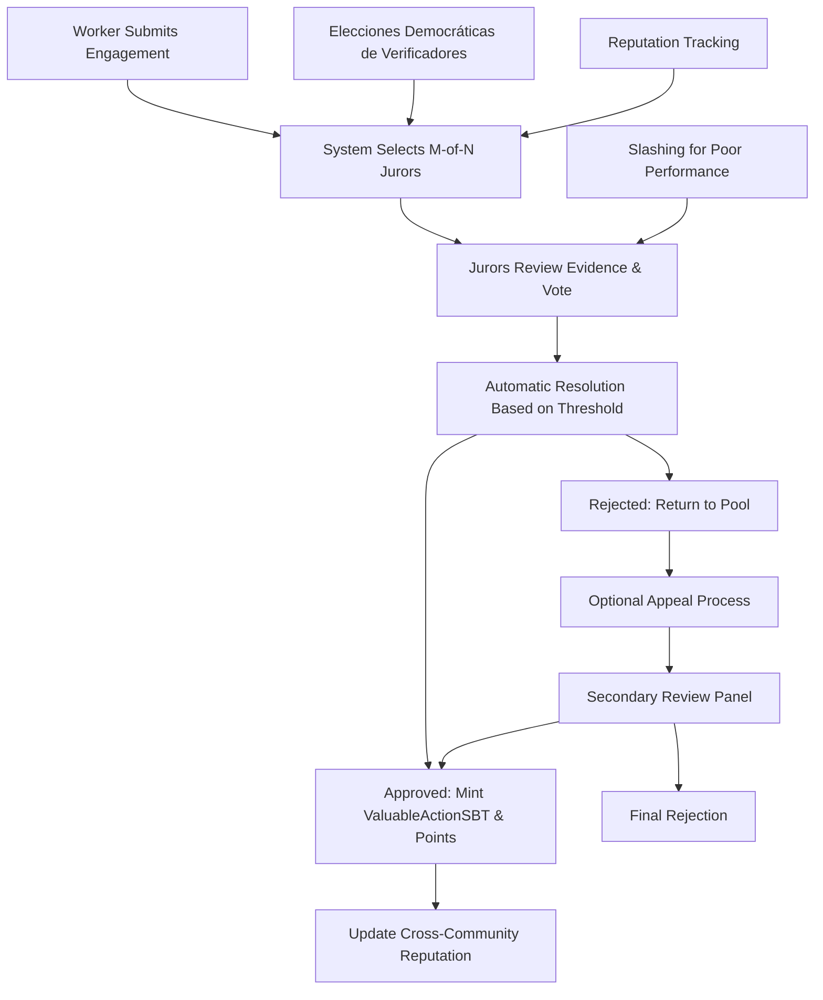

Para recorridos paso a paso de los ciclos, ver [docs/ES/Flows.md](docs/ES/Flows.md).

│ │- Cooldowns      │  │- Apelaciones   │  │- Slashing      │  │- Poder Gobernanza │ │
│ │- Spec Evidencia │  │- Gestores SBT  │  │- Pool Activo   │  │- Anti-Gaming      │ │
│ └─────────────────┘  └────────────────┘  └────────────────┘  └─────────────────────┘ │
└─────────────────────────────────────────────────────────────────────────────────────────┘
```

### **VerifierPowerToken1155 (VPT): Selección Democrática de Verificadores**

El sistema VPT reemplaza los bonos económicos tradicionales con elecciones comunitarias controladas por procesos de gobernanza transparentes. Cada comunidad puede elegir sus propios verificadores a través de procesos democráticos.

#### **Arquitectura Central VPT**

```solidity
contract VerifierPowerToken1155 {
    // Cada comunidad tiene su propio tipo de token para verificadores
    mapping(uint256 => CommunityVPTConfig) public configuracionesComunidad;
    mapping(uint256 => mapping(address => uint256)) public saldosPoderVerificadores;

    struct CommunityVPTConfig {
        uint256 maxVerificadores;           // Máximo número de verificadores activos
        uint256 duracionMandato;            // Cuánto tiempo sirven los verificadores (en segundos)
        uint256 minVotosParaGanar;          // Votos mínimos necesarios para ser verificador
        bool eleccionesActivas;             // Si la comunidad acepta elecciones
        uint256 eleccionActualId;           // ID de elección activa
    }

    function crearEleccionVerificador(
        uint256 communityId,
        uint256 asientos,
        uint64 duracionMandato,
        string[] calldata requisitosCandidatos
    ) external returns (uint256 electionId);

    function aplicarVerificador(
        uint256 electionId,
        string calldata plataforma,
        string calldata calificaciones
    ) external;

    function votarEnEleccion(
        uint256 electionId,
        address[] calldata candidatosPreferidos
    ) external;

    function finalizarEleccion(uint256 electionId) external;

    function mintearTokensVerificador(
        address[] calldata ganadores,
        uint256 communityId,
        uint256[] calldata cantidadesPoder
    ) external;
}
```

#### **Proceso de Elección Democrática**

1. **Creación de Elecciones**: La gobernanza comunitaria crea elecciones de verificadores con parámetros específicos
2. **Aplicaciones de Candidatos**: Los miembros comunitarios aplican con calificaciones y plataformas
3. **Votación Comunitaria**: Todos los miembros elegibles de la comunidad votan por sus candidatos preferidos
4. **Finalización de Resultados**: Los ganadores reciben tokens VPT1155 otorgando privilegios de verificador
5. **Servicio de Mandato**: Los verificadores elegidos sirven por la duración especificada
6. **Monitoreo de Rendimiento**: La comunidad puede monitorear y potencialmente remover verificadores con bajo rendimiento
7. **Re-elección**: Las elecciones regulares aseguran confianza comunitaria continua

#### **Detección de Fraude y Rendición de Cuentas**

```solidity
contract VerifierElection {
    struct ReporteFraude {
        address reportero;
        address acusado;
        uint256 claimId;            // Claim donde supuestamente ocurrió fraude
        string evidenciaURI;        // Evidencia IPFS
        uint256 tiempoReporte;
        bool resuelto;
        bool fraudeConfirmado;
    }

    function reportarFraudeVerificador(
        address verifier,
        uint256 claimId,
        string calldata evidenciaURI
    ) external returns (uint256 reportId);

    function investigarFraude(
        uint256 reportId,
        bool fraudeConfirmado,
        string calldata resolucion
    ) external onlyGovernance;

    function removerVerificador(
        uint256 communityId,
        address verifier,
        string calldata razon
    ) external onlyGovernance;
}
```

#### **Beneficios de Integración VPT**

##### **Soberanía Comunitaria**

- **Control Democrático**: Las comunidades eligen sus propios verificadores basándose en confianza local y experiencia
- **Alineación Cultural**: Los verificadores entienden los valores y contexto comunitarios
- **Rendición de Cuentas**: Los verificadores con bajo rendimiento pueden ser reemplazados a través de gobernanza
- **Accesibilidad**: Sin barreras financieras para convertirse en verificador (no se requieren bonos)

##### **Aseguramiento de Calidad**

- **Selección Basada en Mérito**: Las comunidades eligen verificadores basándose en calificaciones, no en riqueza
- **Límites de Mandato**: Las elecciones regulares previenen el atrincheramiento y aseguran perspectivas frescas
- **Monitoreo de Rendimiento**: Seguimiento transparente de precisión y comportamiento de verificadores
- **Prevención de Fraude**: Supervisión comunitaria y mecanismos de reporte

##### **Sostenibilidad Económica**

- **Sin Requisitos de Capital**: Remueve barreras económicas que excluyen participantes calificados pero menos adinerados
- **Inversión Comunitaria**: Los verificadores son miembros comunitarios con participación en el éxito
- **Costos Reducidos**: No hay necesidad de manejar bonos, slashing, o penalidades económicas
- **Legitimidad Democrática**: Decisiones respaldadas por consenso comunitario, no por poder económico

### **Capa 4: Motor Económico Avanzado - Sistema de Cohortes de Inversión**

Sistema de tokens triple con distribución por cascada basada en cohortes y ROI garantizado:

```
┌─────────────────────────────────────────────────────────────────────────────────────────┐
│                          MOTOR ECONÓMICO BASADO EN COHORTES                             │
├─────────────────────────────────────────────────────────────────────────────────────────┤
│ ┌─────────────────┐  ┌────────────────┐  ┌────────────────┐  ┌─────────────────────┐ │
│ │ ParamController │  │ CohortRegistry │  │  RevenueRouter │  │   TreasuryAdapter   │ │
│ │- Políticas Rev  │  │- Gestión Cohort│  │- Cascada Distrib│ │- Gestión Tesorería │ │
│ │- Control Gobern │  │- Pesos Inversión│  │- Multi-Cohort  │  │- Límites Gasto    │ │
│ │- Migración Param│  │- ROI Garantizado│  │- Completación   │  │- Governance Gates  │ │
│ │- Validación     │  │- Investment SBTs│  │- Precision Math │  │- Emergency Funds  │ │
│ │- Timelock Integ │  │- Access Control │  │- Spillover Funds│  │- Policy Integration│ │
│ └─────────────────┘  └────────────────┘  └────────────────┘  └─────────────────────┘ │
│           │                    │                         │             │             │
│           ▼                    ▼                         ▼             ▼             │
│ ┌─────────────────┐  ┌────────────────┐  ┌────────────────┐  ┌─────────────────────┐ │
│ │ValuableActionSBT│  │ CommunityToken │  │MembershipToken │  │    Investment SBTs  │ │
│ │- Investment SBT │  │- 1:1 USDC Back │  │- Poder Gobern │  │- Cohort Metadata   │ │
│ │- Metadata Store │  │- Merit Payouts │  │- Merit-Based  │  │- Terms Snapshot    │ │
│ │- Cohort Links   │  │- Treasury Mgmt │  │- Anti-Plutocracia│ │- ROI Tracking     │ │
│ └─────────────────┘  └────────────────┘  └────────────────┘  └─────────────────────┘ │
└─────────────────────────────────────────────────────────────────────────────────────────┘
```

### **Capa 5: Infraestructura de Utilidades & Proyectos**

Aplicaciones del mundo real que demuestran el valor de la coordinación descentralizada:

```
┌─────────────────────────────────────────────────────────────────────────────────────────┐
│                         INFRAESTRUCTURA UTILIDADES & PROYECTOS                          │
├─────────────────────────────────────────────────────────────────────────────────────────┤
│ ┌─────────────────┐  ┌────────────────┐  ┌────────────────┐  ┌─────────────────────┐ │
│ │ ProjectFactory  │  │  Marketplace   │  │ HousingManager │  │  Cross-Chain Bridge │ │
│ │- Crowdfunding   │  │- P2P Services  │  │- Co-housing    │  │- Multi-Network     │ │
│ │- Tokens ERC-1155│  │- Trade Servicios│  │- Co-housing    │  │- Interfaz Tesorería   │ │
│ │- Milestone Valid│  │- Quality Verif │  │- Investor Stake│  │- Sync Estado       │ │
│ │- Protec Investor│  │- Reputation    │  │- Worker Discounts│ │- Asset Movement   │ │
│ │- Community Funds│  │- Escrow System │  │- Booking System│  │- Unified Economy   │ │
│ └─────────────────┘  └────────────────┘  └────────────────┘  └─────────────────────┘ │
└─────────────────────────────────────────────────────────────────────────────────────────┘
```

## 🔗 Flujos de Datos del Sistema

### **Flujo de Coordinación Comunitaria**



### **Flujo de Verificación de Trabajo**



### **Flujo Económico Dinámico**

```mermaid
graph TD
    A[Revenue Generated] --> B[Mathematical Distribution Engine]
    B --> C[Time-Based Weight Calculation]
    B --> D[Performance Modulation]
    B --> E[Treasury Runway Analysis]

    C --> F[Worker Share: w_W(t) = α_W × (1 - e^(-λ_W × t)) + β_W]
    C --> G[Investor Share: w_I(t) = α_I × e^(-λ_I × t) + β_I]
    E --> H[Treasury Share: Dynamic based on runway urgency]

    F --> I[CommunityToken Distribution to Workers]
    G --> J[Returns to InvestorSBT Holders]
    H --> K[Treasury Fund Growth]

    I --> L[ValuableActionSBT Point Tracking]
    J --> M[InvestorSBT Decay Tracking]
    K --> N[Runway Extension & Sustainability]
```

## � Estado de Datos & Estructura de Contratos Inteligentes

### **Mapas de Estado del Sistema**

## 🌐 Comunidad y Federación (Visión Futura)

Estas fases describen cómo podría evolucionar la coordinación entre comunidades. Son conceptuales y no están desplegadas; cualquier servicio compartido debe respetar timelock y ParamController.

- **Fase 1: Comunidades aisladas (estado actual en staging)** — Cada comunidad opera su suite completa sin dependencias cross-community; menor riesgo y operación clara.
- **Fase 2: Coordinación federada (concepto futuro)** — Descubrimiento compartido, vistas ligeras de reputación y marketplaces inter-comunidad. La ejecución y control de tesorería/verificadores sigue siendo local a cada comunidad.
- **Fase 3: Red de ecosistema (concepto futuro)** — Hubs opcionales con servicios compartidos (p. ej., vistas de reputación o intercambio de recursos) siempre bajo decisiones de gobernanza con timelock. Sin control compartido de tesorería ni verificación sin mandato explícito.

**Lineamientos para cualquier federación futura:**
- Mantener verificación de trabajo, tesorería y parámetros bajo gobernanza local salvo delegación explícita y timelock.
- Priorizar planos de datos compartidos (indexers, vistas de reputación) sobre ejecución compartida.
- ParamController sigue siendo la fuente de política por comunidad; evitar configuraciones paralelas en capas compartidas.
        uint32 maxInvestors;           // Máximo número de inversores permitidos
        uint256 minInvestment;         // Inversión mínima por persona (USDC)
        uint256 maxTotalRaise;         // Inversión máxima total (USDC)
        uint256 totalInvested;         // Cantidad total invertida actual
        uint256 totalReturned;         // Total devuelto a inversores
        uint256 investorCount;         // Número de inversores actuales
        bool active;                   // Si la cohorte acepta nuevas inversiones
        bool isCompleted;              // Si la cohorte alcanzó el ROI objetivo
        bytes32 termsHash;             // Hash IPFS inmutable de términos de inversión
        uint64 createdAt;              // Timestamp de creación
        uint64 completedAt;            // Timestamp de completación (0 si no completada)
        string termsURI;               // Ubicación de términos legibles
        address valuableActionSBT;     // Contrato SBT para acuñar Investment SBTs
    }

    mapping(uint256 => Cohort) public cohorts;
    mapping(uint256 => mapping(address => InvestorRecord)) public investorRecords;

    // Crear nueva cohorte de inversión
    function createCohort(CohortParams calldata params) external returns (uint256 cohortId) {
        // Validar parámetros y permisos
        require(paramController.isAuthorizedForCommunity(params.communityId, msg.sender), "No autorizado");
        require(params.targetROIBps >= 10000 && params.targetROIBps <= 50000, "ROI objetivo inválido");

        cohortId = ++nextCohortId;
        cohorts[cohortId] = Cohort({
            communityId: params.communityId,
            targetROIBps: params.targetROIBps,
            priorityWeight: params.priorityWeight,
            // ... otros parámetros
            active: true,
            isCompleted: false
        });

        emit CohortCreated(cohortId, params.communityId, params.targetROIBps, params.priorityWeight);
    }
}

            // Actualizar seguimiento de ingresos acumulativos
            investorRevenue[investor].cumulativeRevenue += amount;

            // Transferir ingresos
            payable(investor).transfer(amount);
        }

        // El resto va a salarios de trabajadores y tesorería
        uint256 remainingRevenue = totalRevenue - investorRevenue;
        distributeToWorkersAndTreasury(remainingRevenue);
    }
}
```

### **Arquitectura de Controlador de Runway de Tesorería**

Gestión automatizada de sostenibilidad sin porcentajes fijos:

```solidity
contract TreasuryController {
    struct RunwayParams {
        uint64 targetRunwayMonths;       // Meta sostenibilidad fijada por gobernanza
        uint64 currentRunwayMonths;      // Calculado desde balance/burn
        uint256 monthlyBurnRate;         // EMA de gastos reales
        uint16 urgencyMultiplier;        // Qué tan agresivamente proteger (bps)
        uint16 maxTreasuryShare;         // Límite superior para prevenir hambruna
        uint16 baseTreasuryShare;        // Mínimo cuando runway es saludable
    }

    function calculateDynamicTreasuryShare() external view returns (uint256) {
        RunwayParams memory runway = getCurrentRunwayStatus();

        if (runway.currentRunwayMonths >= runway.targetRunwayMonths) {
            return runway.baseTreasuryShare; // Runway saludable = mínimo base
        }

        // Función de urgencia exponencial cuando el runway decrece
        uint256 runwayRatio = runway.currentRunwayMonths * 1e18 / runway.targetRunwayMonths;
        uint256 urgencyFactor = 1e18 - runwayRatio; // 0 cuando saludable, 1e18 cuando crítico

        // Share adicional de tesorería escala exponencialmente con urgencia
        uint256 additionalShare = urgencyFactor * runway.urgencyMultiplier / 1e4;
        uint256 totalShare = runway.baseTreasuryShare + additionalShare;

        return Math.min(totalShare, runway.maxTreasuryShare);
    }

    function updateBurnRate(uint256 newExpense) external {
        // Suavizado EMA: new_rate = α × new_expense + (1-α) × old_rate
        uint256 alpha = 200; // 20% ponderación para datos nuevos (de 1000)
        params.monthlyBurnRate = (alpha * newExpense + (1000 - alpha) * params.monthlyBurnRate) / 1000;
    }
}
```

### **Arquitectura de Token de Gobernanza Basado en Mérito**

Token de gobernanza puro que se acuña automáticamente basado en contribuciones verificadas:

```solidity
contract MembershipTokenERC20Votes {
    // Eliminado: funciones mint/redeem - los tokens solo se ganan a través de logros SBT
    // Eliminado: respaldo USDC - utilidad de gobernanza pura

    struct GovernanceWeighting {
        uint64 vestingPeriodMonths;     // Línea de tiempo de equilibrio establecida por la comunidad (ej. 36 meses)
        uint64 startTimestamp;          // T=0 para cálculos basados en tiempo
        uint256 workerBaseWeight;       // Peso inicial de gobernanza ValuableActionSBT
        uint256 investorBaseWeight;     // Peso inicial de gobernanza InvestorSBT
        uint256 maxConcentrationBps;    // Límite anti-plutocracia (ej. 15%)
    }

    function calculateTimeBasedWeight(address account)
        external view returns (uint256 totalVotingPower) {

        uint256 workerTokens = getValuableActionSBTTokens(account);
        uint256 investorTokens = getInvestorSBTTokens(account);

        // Cálculo de ponderación basado en tiempo
        uint256 elapsedMonths = (block.timestamp - weighting.startTimestamp) / 30 days;
        uint256 progressRatio = Math.min(elapsedMonths * 1e18 / weighting.vestingPeriodMonths, 1e18);

        // Progresión lineal: inversores empiezan alto, trabajadores crecen con el tiempo
        uint256 currentWorkerWeight = weighting.workerBaseWeight +
            (progressRatio * (1e18 - weighting.workerBaseWeight) / 1e18);
        uint256 currentInvestorWeight = weighting.investorBaseWeight -
            (progressRatio * (weighting.investorBaseWeight - 1e18) / 1e18);

        totalVotingPower = (workerTokens * currentWorkerWeight + investorTokens * currentInvestorWeight) / 1e18;

        // Límite anti-plutocracia de concentración
        uint256 totalSupply = totalSupply();
        uint256 maxConcentration = totalSupply * weighting.maxConcentrationBps / 10000;
        return Math.min(totalVotingPower, maxConcentration);
    }

    function mintFromSBT(address recipient, uint256 amount, bytes32 sbtType) external {
        require(msg.sender == valuableActionRegistry || msg.sender == valuableActionSBT || msg.sender == investorSBT, "No autorizado");
        _mint(recipient, amount);
        emit MembershipMinted(recipient, amount, sbtType);
    }
}
```

### **Arquitectura de Reputación Cross-Community**

Credenciales portables que crean efectos de red:

```solidity
contract ValuableActionSBT {
    struct CrossCommunityProfile {
        uint256[] participatingCommunities;   // IDs de comunidades donde el usuario está activo
        mapping(uint256 => uint256) communityPoints; // Puntos por comunidad
        mapping(uint256 => uint256) communityReputation; // Reputación por comunidad
        uint256 networkReputation;            // Promedio cross-community
        uint64 lastCrossCommunityActivity;    // Timestamp anti-gaming
    }

    function getNetworkReputationScore(address user) external view returns (uint256) {
        CrossCommunityProfile storage profile = crossProfiles[user];
        uint256 totalReputation = 0;
        uint256 activeCommunities = 0;

        for (uint i = 0; i < profile.participatingCommunities.length; i++) {
            uint256 communityId = profile.participatingCommunities[i];
            uint256 reputation = profile.communityReputation[communityId];

            if (reputation > 0) {
                totalReputation += reputation;
                activeCommunities++;
            }
        }

        if (activeCommunities == 0) return 0;

        // Bonus de efecto de red: más comunidades = mayor confianza
        uint256 networkBonus = Math.sqrt(activeCommunities * 1e18);
        uint256 avgReputation = totalReputation / activeCommunities;

        return avgReputation * networkBonus / 1e9;
    }

    function portReputationToNewCommunity(address user, uint256 newCommunityId)
        external returns (uint256 startingReputation) {

        uint256 networkScore = getNetworkReputationScore(user);

        // Reputación inicial = 50% del promedio de red (debe aún probar valor local)
        startingReputation = networkScore / 2;

        // Añadir a la lista de comunidades del usuario
        crossProfiles[user].participatingCommunities.push(newCommunityId);
        crossProfiles[user].communityReputation[newCommunityId] = startingReputation;

        emit ReputationPorted(user, newCommunityId, startingReputation);
    }
}
```

### Arquitectura Dirigida por Eventos

#### Eventos de Gobernanza

```solidity
event ProposalCreated(uint256 indexed proposalId, address proposer, string description);
event MultiChoiceProposalCreated(uint256 indexed proposalId, uint8 numOptions);
event VoteCast(address indexed voter, uint256 indexed proposalId, uint8 support, uint256 weight);
event VoteMultiCast(address indexed voter, uint256 indexed proposalId, uint256[] weights);
event ProposalExecuted(uint256 indexed proposalId);
```

#### Eventos de Verificación

```solidity
event EngagementSubmitted(uint256 indexed engagementId, address indexed worker, uint256 typeId);
event JurorsAssigned(uint256 indexed engagementId, address[] jurors);
event EngagementVerified(uint256 indexed engagementId, address indexed verifier, bool approve);
event EngagementResolved(uint256 indexed engagementId, uint8 status, uint32 approvals, uint32 rejections);
event ReputationUpdated(address indexed verifier, uint256 oldRep, uint256 newRep);
```

#### Eventos Económicos

```solidity
event EleccionCreada(uint256 indexed electionId, uint256 indexed communityId, uint256 asientos);
event VerificadorElegido(uint256 indexed electionId, address indexed verifier, uint256 votos);
event ValuableActionSBTMinted(address indexed worker, uint256 indexed tokenId, uint256 points);
event FeesDistributed(uint256 totalFees, uint256 treasuryShare, uint256 verifierShare);
```

## 🔐 Arquitectura de Seguridad

### Modelo de Seguridad Multi-Capa

#### Capa 1: Seguridad de Contratos Inteligentes

- **Control de Acceso**: Permisos basados en roles con supervisión de gobernanza
- **Validación de Input**: Verificación comprensiva de parámetros y validación de límites
- **Protección Reentrancy**: Uso consistente del patrón checks-effects-interactions
- **Seguridad de Integers**: Protección overflow Solidity 0.8+ y patrones SafeMath

#### Capa 2: Seguridad Económica

- **Rendición de Cuentas Democrática**: Verificadores elegidos por la comunidad con límites de mandato
- **Seguimiento de Reputación**: Alineación de incentivos a largo plazo a través de historial de performance
- **Mecanismos de Slashing**: Penalidades económicas por comportamiento malicioso o pobre
- **Períodos de Cooldown**: Rate limiting para prevenir spam y manipulación

#### Capa 3: Seguridad de Gobernanza

- **Protección Timelock**: Retrasos obligatorios para cambios críticos del sistema
- **Requisitos Multi-Signature**: Múltiples aprobaciones para operaciones sensibles
- **Pausa de Emergencia**: Circuit breakers controlados por gobernanza para respuesta a crisis
- **Controles de Upgrade**: Rutas de upgrade de contratos controladas a través de gobernanza

#### Capa 4: Seguridad Operacional

- **Monitoreo & Alertas**: Seguimiento en tiempo real de salud del sistema y anomalías
- **Audit Trail**: Historial completo on-chain de todas las operaciones y decisiones
- **Procedimientos de Recuperación**: Procesos definidos para manejar varios escenarios de fallo
- **Programas Bug Bounty**: Testing de seguridad dirigido por la comunidad y mejoras

### Análisis de Vectores de Ataque & Mitigación

#### Ataques de Gobernanza

- **Gobernanza Flash Loan**: Mitigado por snapshots de poder de voto y retrasos timelock
- **Spam de Propuestas**: Prevenido por umbrales de propuestas y costos económicos
- **Compra de Votos**: Reducido a través de mecanismos de delegación y seguimiento de reputación

#### Ataques de Verificación

- **Ataques Sybil**: Prevenidos por elecciones democráticas y verificación comunitaria de candidatos
- **Colusión**: Detectada a través de análisis de patrones de votación y decay de reputación
- **Manipulación de Evidencia**: Mitigada por direccionamiento de contenido IPFS y pruebas criptográficas

#### Ataques Económicos

- **Ataques de Drenaje**: Prevenidos por flujos de fondos controlados y supervisión de gobernanza
- **Manipulación de Oracle**: Dependencia reducida en price feeds externos
- **Extracción MEV**: Minimizada a través de operaciones batch y ordenamiento justo

## 🚀 Escalabilidad & Performance

### Optimización Layer 2

#### Estrategias de Eficiencia de Gas

- **Operaciones Batch**: Agrupar transacciones relacionadas para reducir costos por operación
- **Optimización de Estado**: Patrones eficientes de storage y técnicas de empaquetado de datos
- **Updates Dirigidas por Eventos**: Usar eventos para indexado off-chain en lugar de lecturas caras de storage
- **Computación Lazy**: Diferir cálculos caros hasta que realmente se necesiten

#### Ventajas de Red Base

- **Costos Bajos de Transacción**: $0.01 vs $20-100 en Ethereum mainnet
- **Confirmaciones Rápidas**: Tiempos de bloque 2-segundo vs 15-segundo Ethereum
- **Compatibilidad EVM**: Herramientas completas de Ethereum y experiencia de desarrollador
- **Integración Coinbase**: On-ramps nativos fiat y partnerships empresariales

### Características de Performance

#### Métricas de Throughput

- **Gobernanza**: 1000+ votos por propuesta sin degradación de performance
- **Verificación**: 100+ compromisos concurrentes con selección automatizada de jurados
- **Operaciones de Token**: Características de performance ERC-20/ERC-721 estándar

#### Objetivos de Latencia

- **Casting de Votos**: <5 segundo tiempos de confirmación
- **Envío de Compromisos**: <10 segundo procesamiento incluyendo selección de jurados
- **Updates de Reputación**: Updates en tiempo real en resolución de compromisos

## 🔮 Evolución Futura de Arquitectura

### Mejoras Planificadas

#### Expansión Cross-Chain

- **Despliegue Multi-Red**: Soporte Ethereum, Polygon, Arbitrum
- **Sincronización de Estado**: Coordinación cross-chain de reputación y gobernanza
- **Integración de Bridge**: Movimiento seamless de assets entre redes

#### Características Avanzadas

- **Privacidad Zero-Knowledge**: Votación privada con verificabilidad pública
- **Verificación Asistida por IA**: Revisión de evidencia augmentada por machine learning
- **Parámetros Dinámicos**: Tuning automatizado del sistema basado en métricas de performance

#### Mejoras de Escalabilidad

- **State Channels**: Computación off-chain con settlement on-chain
- **Integración Rollup**: Despliegue Layer 3 nativo para casos de uso especializados
- **Soporte Sharding**: Escalado horizontal para despliegue masivo de comunidades

## 🔗 Patrones de Integración & Arquitectura de Ecosistema

### **Integración Community-to-Community**

#### **Modelo de Gobernanza Federada**

Las comunidades pueden establecer relaciones formales para compartir recursos y tomar decisiones colectivas:

```solidity
contract CommunityFederation {
    struct FederationParams {
        uint256[] memberCommunities;        // IDs de comunidades en federación
        uint16 consensusThreshold;          // % necesario para decisiones de federación
        address federationTreasury;         // Pool de recursos compartidos
        mapping(uint256 => uint16) votingWeights; // Poder de federación por comunidad
    }

    function proposeFederationAction(
        uint256 federationId,
        address[] calldata targets,
        uint256[] calldata values,
        bytes[] calldata calldatas,
        string calldata description
    ) external returns (uint256 proposalId) {
        // Propuesta de gobernanza cross-community
        // Requiere consenso de comunidades miembro
    }

    function executeCrossCommunitySplit(
        uint256 federationId,
        uint256 amount,
        uint256[] calldata communityShares
    ) external {
        // Distribución de recursos a través de comunidades federadas
        // Basado en métricas de contribución y acuerdos de federación
    }
}
```

#### **Redes de Intercambio de Recursos**

Las comunidades se especializan y comercian expertise, bienes y servicios:

```solidity
contract InterCommunityMarketplace {
    struct ResourceListing {
        uint256 sourceCommunityId;         // Comunidad ofreciendo recurso
        string resourceType;               // "expertise", "goods", "services"
        uint256 priceInCommunityToken;     // Costo en token de comunidad local
        bytes32 qualityHash;               // Hash IPFS de credenciales de calidad
        uint256 availableQuantity;         // Cantidad disponible para comercio
        uint64 expirationTime;             // Deadline del listado
    }

    function createResourceListing(ResourceListing calldata listing) external;
    function requestResource(uint256 listingId, uint256 quantity) external;
    function fulfillResourceRequest(uint256 requestId, bytes32 fulfillmentProof) external;

    // Reputación cross-community afecta elegibilidad de comercio y precios
    function getTradeMultiplier(address user, uint256 targetCommunityId)
        external view returns (uint256 trustMultiplier);
}
```

### **Integración con Plataformas Externas**

#### **Bridges de Plataformas Tradicionales**

Integración con herramientas comunitarias existentes mientras mantienen soberanía:

```solidity
contract DiscordGovernanceBridge {
    mapping(uint256 => string) communityDiscordGuilds;     // Comunidad → servidor Discord
    mapping(bytes32 => uint256) discordProposalMapping;    // Hilo Discord → ID Propuesta

    function linkDiscordProposal(
        uint256 proposalId,
        string calldata discordThreadId,
        bytes calldata signature
    ) external {
        // Vincula gobernanza on-chain con discusión Discord
        // Permite notificación y broadcasting de resultados
    }

    function broadcastResults(uint256 proposalId) external {
        // Publica resultados de gobernanza de vuelta a Discord
        // Mantiene continuidad de discusión a través de plataformas
    }
}

contract GitHubIntegration {
    mapping(uint256 => string) communityRepositories;      // Comunidad → org/repo GitHub
    mapping(bytes32 => uint256) issueToValuableAction;     // Issue GitHub → ValuableAction

    function createValuableActionFromIssue(
        uint256 communityId,
        string calldata issueUrl,
        ValuableActionParams calldata params
    ) external returns (uint256 valuableActionId) {
        // Convierte issues GitHub en tipos de trabajo verificables
        // Permite onboarding seamless de desarrolladores
    }

    function submitEngagementFromPR(
        uint256 valuableActionId,
        string calldata pullRequestUrl,
        bytes32 evidenceHash
    ) external returns (uint256 engagementId) {
        // Envía compromisos de trabajo directamente desde GitHub PR
        // Vincula contribución de código con sistema de reputación
    }
}
```

#### **Integración con Protocolos DeFi**

Las tesorerías comunitarias pueden participar en el ecosistema DeFi más amplio:

```solidity
contract TreasuryDeFiAdapter {
    function investInYieldProtocol(
        address protocol,
        uint256 amount,
        uint256 minYield
    ) external onlyGovernance {
        // Gobernanza comunitaria puede desplegar fondos de tesorería
        // En protocolos verificados generadores de yield
    }

    function provideLiquidityToAMM(
        address pool,
        uint256 tokenAAmount,
        uint256 tokenBAmount
    ) external onlyGovernance returns (uint256 liquidityTokens) {
        // Permite a comunidades proveer liquidez
        // Generar ingresos de fees de trading
    }

    function borrowAgainstTreasury(
        address lendingProtocol,
        uint256 collateralAmount,
        uint256 borrowAmount
    ) external onlyGovernance {
        // Capacidad de préstamo de emergencia
        // Mantener operaciones durante gaps de cash flow
    }
}
```

#### **Integración con Infraestructura Descentralizada**

Partnerships esenciales para funcionalidad descentralizada de grado empresarial:

```solidity
contract DecentralizedInfrastructureAdapter {
    // Identidad & Resistencia Sybil
    IWorldID public worldID;                    // Verificación de humanos preservando privacidad
    IBrightID public brightID;                  // Verificación de identidad de grafo social
    IProofOfHumanity public proofOfHumanity;   // Registro humano descentralizado
    IEAS public attestationService;             // Sistema de credenciales portables

    // Resolución de Disputas & Apelaciones
    IKleros public klerosArbitrator;            // Arbitraje descentralizado
    IAragonCourt public aragonCourt;            // Resolución de disputas de gobernanza
    IChainlinkFunctions public chainlinkOracle; // Verificación de datos del mundo real

    // Tokenización de Propiedades & Assets
    IRealT public realTProtocol;                // Real estate fraccionado
    ILoftyAI public loftyPropertyManager;       // Gestión automatizada de propiedades
    IPropy public propyTitleService;            // Registros de propiedades blockchain
    IRedSwan public redSwanCommercial;          // Tokenización real estate comercial

    function verifyHumanIdentity(address user) external returns (bool isHuman) {
        // Verificación humana multi-protocolo para resistencia sybil
        bool worldIDVerified = worldID.verifyProof(user, /* parámetros proof */);
        bool brightIDVerified = brightID.isVerified(user);
        bool pohVerified = proofOfHumanity.isRegistered(user);

        return worldIDVerified || brightIDVerified || pohVerified;
    }

    function initiateDispute(
        uint256 claimId,
        bytes32 disputeType,
        uint256 disputeAmount
    ) external returns (uint256 disputeId) {
        if (disputeAmount < KLEROS_THRESHOLD) {
            return klerosArbitrator.createDispute(claimId, disputeType);
        } else {
            return aragonCourt.createDispute(claimId, disputeType, disputeAmount);
        }
    }

    function tokenizeProperty(
        string calldata propertyAddress,
        uint256 totalValue,
        uint256 tokenSupply
    ) external returns (address tokenContract) {
        // Tokenización de propiedades para adquisición de tierras comunitarias
        return realTProtocol.tokenizeProperty(
            propertyAddress,
            totalValue,
            tokenSupply,
            address(this) // Tesorería comunitaria como propietario inicial
        );
    }

    function generateYield(uint256 amount, address protocol) external onlyGovernance {
        // Gestión automatizada de tesorería a través de protocolos DeFi
        require(approvedProtocols[protocol], "Protocol not approved");
        IERC20(communityToken).transfer(protocol, amount);
    }
}
```

### **Evolución de Arquitectura Multi-Community**

#### **Fase 1: Comunidades Aisladas (Actual - Mes 6)**

```
Comunidad A: [Suite Completa Contratos A]
Comunidad B: [Suite Completa Contratos B]
Comunidad C: [Suite Completa Contratos C]
```

**Beneficios:** Autonomía completa, no hay conflictos cross-community, perfecto para validación MVP
**Desafíos:** Altos costos de despliegue, no hay efectos de red, UX multi-community complejo

#### **Fase 2: Arquitectura Federada (Mes 6-18)**

```
Infraestructura Compartida: [CommunityRegistry + CrossReputationHub + FederationController]
                              ↓
Comunidad A: [Governor_A + Local_Contracts_A] ←→ Comunidad B: [Governor_B + Local_Contracts_B]
                              ↓                                           ↓
Comunidad C: [Governor_C + Local_Contracts_C] ←→ Comunidad D: [Governor_D + Local_Contracts_D]
```

**Beneficios:** Reputación compartida, comercio de recursos, costos de despliegue reducidos, efectos de red
**Implementación:** CommunityFactory para despliegue de nuevas comunidades, portabilidad de reputación compartida

#### **Fase 3: Red de Ecosistema (Mes 18+)**

```
Capa de Infraestructura Global:
├── CrossCommunityReputationHub (ValuableActionSBT Universal)
├── GlobalGovernanceCoordinator (Decisiones de federación)
├── InterCommunityMarketplace (Comercio de recursos & servicios)
└── EcosystemTreasury (Financiamiento infraestructura compartida)

Hubs Regionales:
├── Hub América del Norte [Comunidades 1-100]
├── Hub Europa [Comunidades 101-200]
├── Hub Asia-Pacífico [Comunidades 201-300]
└── Hub Mercados Emergentes [Comunidades 301-400]

Capa de Comunidad Local:
└── Comunidades individuales con gobernanza especializada
```

**Beneficios:** Red de reputación global, ecosistemas comunitarios especializados, compartición de costos de infraestructura
**Implementación:** Despliegue Layer 2, especialización regional, portabilidad de reputación cross-chain

## 🔧 Detalles de Implementación Técnica

### Especificaciones de Contratos Inteligentes

#### **Contratos Core**

**CommunityRegistry**

```solidity
contract CommunityRegistry {
    struct Community {
        string name;
        string description;
        string metadataURI;

        // Parámetros de Gobernanza
        uint256 debateWindow;
        uint256 voteWindow;
        uint256 executionDelay;

        // Reglas de Elegibilidad
        uint256 minSeniority;
        uint256 minSBTs;
        uint256 proposalThreshold;

        // Parámetros Económicos
        uint256[3] revenueSplit;     // [workers%, treasury%, investors%] - configurable gobernanza
        uint256 feeOnWithdraw;
        address[] backingAssets;     // Tokens colaterales aprobados

        // Direcciones de Módulos
        address governor;
        address timelock;
        address requestHub;
        address draftsManager;
        address engagementsManager;
        address valuableActionRegistry;
        address verifierElection;
        address verifierPowerToken1155;
        address verifierManager;
        address valuableActionSBT;
        address treasuryAdapter;

        // Roles & Permisos
        mapping(address => bool) moderators;
        mapping(address => bool) curators;

        // Links Cross-Community
        uint256 parentCommunityId;   // Soporte federación/jerarquía
        uint256[] allyCommunityIds;  // Relaciones de partnership
    }

    function registerCommunity(CommunityParams params) returns (uint256 communityId);
    function updateParameters(uint256 communityId, ParameterUpdate[] updates); // Gateado por gobernanza
    function setModuleAddress(uint256 communityId, bytes32 moduleKey, address moduleAddress);
}
```

**Engagements Contract (Compromisos)**

```solidity
contract Engagements {
    struct Engagement {
        uint256 valuableActionId;
        address worker;
        string evidenceCID;
        uint64 submittedAt;
        EngagementStatus status;
        uint256[] selectedJurors;
        mapping(address => Vote) votes;
        uint64 resolvedAt;
        bool appealed;
    }

    function submit(uint256 valuableActionId, string calldata evidenceCID) external returns (uint256 engagementId);
    function vote(uint256 engagementId, bool approve, string calldata reason) external;
    function resolve(uint256 engagementId) external;
    function appeal(uint256 engagementId) external payable;
}
```

#### **Sistema de Verificación Elegido por Gobernanza**

**Implementación VerifierManager**

```solidity
contract VerifierManager {
    struct EstadoVerificador {
        bool isActive;                    // Sirviendo actualmente como verificador
        uint256 saldoTokensPoder;         // Tokens VPT1155 en posesión
        uint256 totalVotos;              // Total de votos de verificación emitidos
        uint256 votosAcertados;           // Votos que coinciden con consenso final
        uint256 reportesFraude;           // Número de reportes de fraude
        uint64 inicioMandato;             // Cuándo comenzó el mandato actual
        uint64 finMandato;                // Cuándo expira el mandato actual
    }

    function crearEleccion(uint256 communityId, uint256 asientos, uint64 duracionMandato) external;
    function aplicarVerificador(uint256 electionId, string calldata plataforma) external;
    function votarEnEleccion(uint256 electionId, address[] calldata candidatos) external;
    function finalizarEleccion(uint256 electionId) external;
    function reportarFraude(address verifier, uint256 claimId, string calldata evidencia) external;
    function seleccionarJurados(uint256 claimId, uint256 count) external returns (address[] memory);
}
```

### Arquitectura de Despliegue Layer 2

**Optimización Base L2**

- Costos de transacción: <$0.01 por operación
- Confirmación de bloque: ~2 segundos
- Compatibilidad EVM: Soporte completo de herramientas Ethereum
- Confiabilidad sequencer: Infraestructura Coinbase

**Patrones de Optimización de Gas**

```solidity
// Operaciones batch para minimizar costos de transacción
function batchVote(uint256[] calldata claimIds, bool[] calldata votes) external;

// Patrones eficientes de storage
struct PackedVote {
    uint64 timestamp;
    uint32 weight;
    bool approved;
    // Total: 12 bytes vs 3 slots de storage
}

// Arquitectura dirigida por eventos para indexado off-chain
event EngagementSubmitted(uint256 indexed engagementId, address indexed worker, uint256 indexed valuableActionId);
event VoteCast(uint256 indexed engagementId, address indexed voter, bool approved);
```

### Implementación de Seguridad

**Modelo de Seguridad Multi-Capa**

1. **Seguridad de Contratos Inteligentes**
   - Contratos base OpenZeppelin (Governor, Timelock, implementaciones ERC)
   - Cobertura comprensiva de tests (95%+ lograda)
   - Auditorías de seguridad profesionales (planeadas pre-mainnet)
   - Estrategia de despliegue gradual (testnet → limitado → completo)

2. **Seguridad Democrática**

   ```solidity
   // Gestión de verificadores controlada por gobernanza
   uint256 public constant DURACION_ELECCION = 7 days;
   uint256 public constant MAX_DURACION_MANDATO = 180 days; // 6 meses

   // Ponderación de selección basada en rendimiento
   function calculateJurorWeight(address verifier) public view returns (uint256) {
       EstadoVerificador memory v = verifiers[verifier];
       uint256 tasaPrecision = v.totalVotos > 0 ? (v.votosAcertados * 10000) / v.totalVotos : 8000;
       return v.saldoTokensPoder * tasaPrecision / 10000;
   }
   ```

3. **Seguridad de Gobernanza**

   ```solidity
   // Retrasos timelock para operaciones críticas
   uint256 public constant PROPOSAL_DELAY = 1 days;
   uint256 public constant EXECUTION_DELAY = 2 days;

   // Requisitos multi-signature para acciones de emergencia
   modifier onlyMultisig() {
       require(msg.sender == emergencyMultisig, "Unauthorized");
       _;
   }
   ```

## 🚀 Roadmap de Implementación & Evolución Técnica

### **Fase 1: Fundación MVP (Actual - Mes 3)**

**Objetivo:** Probar gobernanza core y verificación con 5-10 comunidades piloto

**Entregables Técnicos:**

- ✅ ShiftGovernor con votación multi-opción (completado)
- ✅ Engagements + ValuableActionRegistry + Sistema VPS (completado)
- ✅ ValuableActionSBT acumulación básica de puntos (completado)
- ✅ CommunityToken sistema de salario basado en mérito (completado)
- 🔄 Scripts mejorados de despliegue y onboarding comunitario
- 🔄 RevenueRouter básico con divisiones fijas

**Foco de Arquitectura:**

- Despliegues de comunidades individuales
- Validación de workflow core: request → draft → proposal → execution → engagements → verification
- Optimización de experiencia de usuario para gestores comunitarios no técnicos

### **Fase 2: Tokenomics Avanzadas (Mes 3-8)**

**Objetivo:** Implementar modelo económico dinámico y gobernanza mejorada

**Entregables Técnicos:**

- 🆕 InvestorSBT con matemáticas de time-decay
- 🆕 RevenueRouter dinámico con modulación de performance
- 🆕 TreasuryController con gestión de runway
- 🆕 MembershipToken mejorado con votación ponderada por SBT
- 🆕 ParamController para gestión de parámetros de gobernanza
- 🆕 RequestHub + DraftsManager capa de coordinación comunitaria

**Foco de Arquitectura:**

- Distribución económica matemática (eliminar divisiones arbitrarias)
- Infraestructura de coordinación comunitaria (discusión → drafts colaborativos → gobernanza)
- Gobernanza mejorada con poder de voto basado en mérito

### **Fase 3: Efectos de Red (Mes 8-15)**

**Objetivo:** Reputación cross-community y gobernanza federada

**Entregables Técnicos:**

- 🆕 CommunityRegistry con soporte de federación
- 🆕 Portabilidad de reputación ValuableActionSBT cross-community
- 🆕 Marketplace inter-community para comercio de recursos
- 🆕 Gobernanza de federación para decisiones multi-community
- 🆕 Sistema de crowdfunding ProjectFactory ERC-1155
- 🆕 Seguridad avanzada: límites de concentración, resistencia sybil

**Foco de Arquitectura:**

- Despliegue de infraestructura compartida (reducir costos por comunidad)
- Efectos de reputación de red (contribuyentes de calidad atraen mejores comunidades)
- Soberanía económica (comunidades controlan sus propios parámetros)

### **Fase 4: Madurez de Ecosistema (Mes 15+)**

**Objetivo:** Red comunitaria global con hubs especializados

**Entregables Técnicos:**

- 🔧 Optimización Layer 2 y despliegue multi-chain
- 🔧 Mecanismos anti-gaming avanzados y verificación formal
- 🔧 APIs de integración empresarial y tooling de compliance
- 🔧 Experiencia de usuario mobile-first y progressive web app
- 🔧 Gestión comunitaria asistida por IA y soporte de decisiones

**Foco de Arquitectura:**

- Escalabilidad global (soporte 1000+ comunidades)
- Compliance regulatorio (cumplir varios requisitos jurisdiccionales)
- Adopción mainstream (onboarding comunitario no-crypto)

## 📋 Resumen: Implementación de Visión Completa

**La Arquitectura Shift DeSoc** proporciona la infraestructura para **liberación humana a través de abundancia colaborativa**:

### **Democracia Económica**

- **Distribución dinámica de ingresos** elimina divisiones arbitrarias favoreciendo capital sobre contribución
- **Transición basada en tiempo** de prioridad capital a cooperativa worker durante 24-36 meses
- **Modulación basada en performance** asegura que mérito impulse recompensas económicas
- **Soberanía comunitaria** a través de parámetros económicos controlados por gobernanza

### **Coordinación Basada en Mérito**

- **Arquitectura triple-token** (Membership + ValuableActionSBT + InvestorSBT) balancea elegibilidad, mérito y capital
- **Reputación cross-community** crea efectos de red recompensando contribuyentes de calidad
- **Verificación resistente a Sybil** a través de elecciones democráticas y rendición de cuentas comunitaria
- **Mecanismos anti-plutocracia** previenen captura de gobernanza por concentración de riqueza

### **Redes Comunitarias Post-Escasez**

- **Economía basada en recursos** donde comunidades satisfacen necesidades de miembros a través de coordinación no competencia
- **Especialización y comercio** entre comunidades crea abundancia a través de cooperación
- **Credenciales portables** permiten movimiento fluido entre comunidades basado en calidad de contribución
- **Infraestructura democrática** que escala desde cooperativas locales a redes de federación global

**El Resultado**: Comunidades que demuestran cómo **la tecnología permite abundancia a través de cooperación**, probando que un mundo mejor no sólo es posible sino inevitable una vez que tenemos las herramientas para construirlo.

_Esto no es sólo una plataforma de gobernanza - es infraestructura para la transición desde empleo basado en escasez hacia contribución basada en abundancia._

## 🚀 Cronograma de Despliegue

### Fase 1: Testnet Deployment (Q4 2024)

- **Base Sepolia**: Despliegue completo para testing público
- **Community Beta**: 10-20 comunidades piloto
- **Features**: Gobernanza básica, verificación trabajo, SBTs
- **Testing**: Security audits, stress testing, UX feedback

### Fase 2: Mainnet Launch (Q1 2025)

- **Base Mainnet**: Despliegue producción con auditorías completadas
- **Limited Release**: 50-100 comunidades early adopters
- **Features**: Sistema económico completo, marketplace básico
- **Monitoring**: Métricas de adopción, health del sistema, community feedback

### Fase 3: Scale & Expand (Q2-Q3 2025)

- **Open Access**: Plataforma disponible para todas las comunidades
- **Advanced Features**: Analytics avanzadas, mobile apps, integraciones
- **Multi-Chain**: Expandir a Ethereum mainnet y otras L2s
- **Enterprise**: Características y soporte para organizaciones grandes

### Fase 4: Ecosystem Growth (Q4 2025+)

- **Developer Tools**: SDKs, APIs, herramientas de integración
- **Partnerships**: Integraciones con plataformas existentes
- **Global Expansion**: Localización e expansion internacional
- **Advanced DeSoc**: Características avanzadas de sociedad descentralizada

## 🔧 Comandos Rápidos de Desarrollo

```bash
# Setup y test
pnpm install
pnpm build                    # Compilar ambas toolchains
pnpm forge:test              # Ejecutar tests Foundry
pnpm cov:gate                # Verificar cobertura

# Deploy a testnet
pnpm -C packages/hardhat hardhat run scripts/deploy.ts --network base_sepolia

# Formatear código
pnpm fmt
```

```bash
# Comandos de testing automatizados
pnpm forge:test      # Ejecutar todas las pruebas unitarias
pnpm forge:cov       # Generar reporte de cobertura
pnpm cov:gate        # Enforcer umbral ≥86% cobertura
pnpm fmt             # Formatear código según estándares
```

---

_Esta arquitectura está diseñada para evolucionar con las necesidades de la comunidad mientras mantiene seguridad, escalabilidad y usabilidad como principios centrales._

```

```

┌─────────────────────────────────────────────────────────────────────────────┐
│ CAPA DE GOBERNANZA │
├─────────────────────────────────────────────────────────────────────────────┤
│ ┌─────────────────┐ ┌──────────────────┐ ┌─────────────────────────┐ │
│ │ ShiftGovernor │◄───┤CountingMultiChoice├────┤ MembershipToken │ │
│ │ - Propuestas │ │ - Multi-opción │ │ - Poder de Voto │ │
│ │ - Ejecución │ │ - Dist. Peso │ │ - Delegación │ │
│ │ - Timelock │ │ - Resultados │ │ - Snapshots │ │
│ └─────────────────┘ └──────────────────┘ └─────────────────────────┘ │
└─────────────────────────────────────────────────────────────────────────────┘

┌─────────────────────────────────────────────────────────────────────────────┐
│ CAPA DE VERIFICACIÓN │
├─────────────────────────────────────────────────────────────────────────────┤
│ ┌─────────────────┐ ┌──────────────────┐ ┌─────────────────────────┐ │
│ │ValuableActionReg │◄───┤ Compromisos ├────┤ Sistema VPS  │ │
│ │ - Tipos Trabajo │ │ - Envíos │ │ - Registro │ │
│ │ - Parámetros │ │ - Votación M-de-N│ │ - Elecciones VPT │ │
│ │ - Spec Evidencia│ │ - Apelaciones │ │ - Reputación │ │
│ └─────────────────┘ └──────────────────┘ └─────────────────────────┘ │
└─────────────────────────────────────────────────────────────────────────────┘

┌─────────────────────────────────────────────────────────────────────────────┐
│ CAPA DE TOKENS │
├─────────────────────────────────────────────────────────────────────────────┤
│ ┌─────────────────┐ ┌──────────────────┐ ┌─────────────────────────┐ │
│ │ValuableActionSBT│ │ CommunityToken │ │ RevenueRouter │ │
│ │ - Soulbound │ │ - Salario Mérito │ │ - Distribución Tarifas │ │
│ │ - WorkerPoints │ │ - Pagos │ │ - Gestión Tesorería │ │
│ │ - Logros │ │ - Recompensas │ │ - División Ingresos │ │
│ └─────────────────┘ └──────────────────┘ └─────────────────────────┘ │
└─────────────────────────────────────────────────────────────────────────────┘

```

### Arquitectura de Flujo de Datos

```

┌───────────┐ ┌─────────────┐ ┌──────────────┐ ┌─────────────┐
│Trabajador │────▶│ Enviar │────▶│ Selección │────▶│Actualización│
│ │ │ Reclamo │ │ Jurado │ │ Reputación │
└───────────┘ └─────────────┘ └──────────────┘ └─────────────┘
│ │ │
▼ ▼ ▼
┌─────────────┐ ┌──────────────┐ ┌─────────────┐
│ValuableAction│ │Sistema VPS  │ │ Resolución │
│Registry │ │ │ │ Compromisos│
└─────────────┘ └──────────────┘ └─────────────┘
│ │ │
▼ ▼ ▼
┌─────────────┐ ┌──────────────┐ ┌─────────────┐
│Parámetros │ │Asignación │ │Acuñación SBT│
│y Evidencia │ │Panel M-de-N │ │y Recompensas│
└─────────────┘ └──────────────┘ └─────────────┘

````

## 🔄 Flujos de Trabajo Centrales

### 1. Flujo de Propuesta de Gobernanza

**Proceso de Propuesta Multi-Opción:**
1. **Creación**: Miembro comunitario crea propuesta con múltiples opciones
2. **Período de Debate**: Discusión comunitaria sobre opciones
3. **Período de Votación**: Los miembros distribuyen peso de voto a través de opciones
4. **Conteo de Resultados**: CountingMultiChoice calcula opción ganadora
5. **Cola Timelock**: Propuesta aprobada entra en cola de timelock
6. **Ejecución**: Después del retraso, la propuesta se ejecuta automáticamente

### 2. Flujo de Verificación de Trabajo

**Proceso de Verificación M-de-N:**
1. **Envío**: Trabajador envía reclamo con evidencia IPFS
2. **Validación**: ValuableActionRegistry valida parámetros del reclamo
3. **Selección de Jurados**: VerifierManager selecciona panel M-de-N democráticamente
4. **Período de Verificación**: Jurados revisan y votan sobre el reclamo
5. **Resolución**: Reclamo aprobado/rechazado basado en consenso mayoría
6. **Recompensas**: ValuableActionSBT acuñado, WorkerPoints actualizados
7. **Reputación**: Reputación del verificador actualizada basada en precisión

### 3. Flujo de Incentivos Económicos

**Distribución de Valor Comunitario:**
1. **Generación de Ingresos**: Actividad comunitaria genera tarifas/ingresos
2. **Router de Ingresos**: RevenueRouter distribuye fondos según configuración gobernanza
3. **Splits Configurables**:
   - Contribuidores (típicamente 60-70%)
   - Tesorería Comunitaria (20-30%)
   - Inversores/Stakeholders (10-20%)
4. **Pagos**: CommunityToken facilita pagos periódicos basados en mérito SBT

## 🔧 Especificaciones Técnicas de Contratos

### ShiftGovernor
**Propósito**: Gobernanza avanzada con soporte multi-opción y integración timelock

**Características Clave**:
- Extensión de OpenZeppelin Governor con CountingMultiChoice personalizado
- Integración Timelock para ejecución segura de propuestas
- Soporte para propuestas tanto binarias como multi-opción
- Thresholds de quorum configurables por comunidad

**Funciones Principales**:
```solidity
function proposeMultiChoice(
    address[] targets,
    uint256[] values,
    bytes[] calldatas,
    string description,
    uint8 numOptions
) external returns (uint256 proposalId);

function castVoteMulti(
    uint256 proposalId,
    uint256[] weights,
    string reason
) external;
````

## **ValuableAction Registry: Motor de Definición de Valor Comunitario**

El ValuableAction Registry sirve como el sistema democrático donde las comunidades definen **qué trabajo es valioso** y **qué oportunidades de inversión existen** a través de crear Acciones Valiosas específicas ("Valuable Actions") que los contribuidores pueden completar. A diferencia de los sistemas tradicionales de categorización de trabajos, las Acciones Valiosas son **instrumentos económicos configurados por la comunidad** que definen cómo las contribuciones se traducen en poder de gobernanza (MembershipTokens), recompensas económicas (CommunityTokens) y reputación (SBTs).

### **Estructura Central de ValuableAction**

```solidity
contract ValuableActionRegistry {
    struct ValuableAction {
        // Parámetros Económicos
        uint32 governanceWeight;        // Cantidad de MembershipToken acuñada en aprobación
        uint32 salaryWeight;           // Tasa de ganancia CommunityToken (por período)
        uint32 initialInvestorBonus;   // Acuñación InvestorSBT en acciones de fundador

        // Parámetros de Verificación
        uint32 jurorsMin;              // M (aprobaciones mínimas necesarias)
        uint32 panelSize;              // N (total de jurados seleccionados)
        uint32 verifyWindow;           // Límite de tiempo para decisión del jurado
        uint32 verifierRewardWeight;   // Puntos ganados por verificadores precisos
        uint32 slashVerifierBps;       // Penalización por verificación inexacta

        // Control de Calidad
        uint32 cooldownPeriod;         // Tiempo mínimo entre reclamos de este tipo
        uint32 maxConcurrent;          // Máximo de reclamos activos por persona
        bool revocable;                // La gobernanza comunitaria puede revocar este SBT
        uint32 evidenceTypes;          // Máscara de bits de formatos de evidencia requeridos

        // Barreras Económicas (Anti-Spam)
        uint256 creationStake;         // USDC requerido para crear esta ValuableAction
        uint256 proposalThreshold;     // Tokens de gobernanza necesarios para proponer cambios
        address sponsor;               // Quien financió la creación de esta ValuableAction

        // Metadatos y Automatización
        string evidenceSpecCID;        // IPFS: requisitos detallados de evidencia
        string titleTemplate;          // Plantilla para títulos de reclamos
        bytes32[] automationRules;     // Integración con sistemas externos (GitHub, etc)

        // Parámetros Basados en Tiempo
        uint64 activationDelay;        // Período de aprobación de gobernanza → activo
        uint64 deprecationWarning;     // Tiempo antes de auto-desactivación
        bool founderVerified;          // Estado especial para bootstrap de comunidad
    }

    // Sistema de Verificación de Fundadores (Seguridad Bootstrap)
    mapping(address => mapping(uint256 => bool)) public founderWhitelist;  // fundador → comunidad → verificado
    mapping(uint256 => address[]) public communityFounders;               // comunidad → lista de fundadores

    function proposeValuableAction(
        uint256 communityId,
        ValuableActionParams calldata params,
        uint256 governanceStake
    ) external payable returns (uint256 valuableActionId) {
        require(msg.value >= params.creationStake, "Stake de creación insuficiente");
        require(governanceToken.balanceOf(msg.sender) >= params.proposalThreshold, "Peso de gobernanza insuficiente");

        // Caso especial: Verificación de fundador para bootstrap de comunidad
        if (params.founderVerified) {
            require(founderWhitelist[msg.sender][communityId], "Fundador no está en whitelist");
            // Los fundadores pueden crear ValuableActions que evitan los delays normales de gobernanza
            _activateValuableAction(valuableActionId, params);
        } else {
            // Ruta normal: requiere aprobación de gobernanza comunitaria
            uint256 proposalId = _createGovernanceProposal(valuableActionId, params);
            pendingValuableActions[valuableActionId] = proposalId;
        }

        emit ValuableActionProposed(valuableActionId, communityId, msg.sender, params.founderVerified);
    }

    function activateFromGovernance(uint256 valuableActionId, uint256 approvedProposalId) external {
        require(msg.sender == governor, "Solo la gobernanza puede activar");
        require(pendingValuableActions[valuableActionId] == approvedProposalId, "Desajuste de propuesta");

        ValuableAction storage valuableAction = valuableActions[valuableActionId];
        valuableAction.active = true;
        valuableAction.activatedAt = uint64(block.timestamp);

        emit ValuableActionActivated(valuableActionId, approvedProposalId);
    }
}
```

### **Configuración de Peso Económico**

Las ValuableActions definen las **tasas de conversión** entre trabajo verificado y varias formas de valor:

```solidity
// Ejemplos de configuración ValuableAction para diferentes tipos de trabajo
struct ValuableActionExamples {
    // DESARROLLO DE ALTO IMPACTO (Trabajo Técnico Senior)
    ValuableAction seniorDevelopment = ValuableAction({
        governanceWeight: 100,          // 100 MembershipTokens por aprobación
        salaryWeight: 50,               // Alta tasa de ganancia en reclamos CommunityToken
        initialInvestorBonus: 20,       // InvestorSBT significativo si es trabajo de fundador
        jurorsMin: 3,                   // Requiere 3 aprobaciones (barra alta de calidad)
        panelSize: 5,                   // De panel de 5 verificadores expertos
        verifyWindow: 7 days,           // Trabajo complejo necesita revisión minuciosa
        verifierRewardWeight: 15,       // Altas recompensas por verificación experta
        cooldownPeriod: 14 days,        // Calidad sobre cantidad
        evidenceTypes: CODE_REVIEW | DEPLOYMENT_PROOF | IMPACT_METRICS,
        creationStake: 1000e6,          // $1000 USDC para crear (previene spam)
        proposalThreshold: 10000e18     // Requiere poder de gobernanza significativo
    });

    // MODERACIÓN COMUNITARIA (Contribución Regular)
    ValuableAction moderation = ValuableAction({
        governanceWeight: 10,           // 10 MembershipTokens por aprobación
        salaryWeight: 15,               // Tasa de ganancia moderada
        initialInvestorBonus: 5,        // Pequeño bono InvestorSBT
        jurorsMin: 2,                   // Requiere 2 aprobaciones
        panelSize: 3,                   // De panel de 3 verificadores
        verifyWindow: 3 days,           // Tiempo de respuesta más rápido para trabajo rutinario
        verifierRewardWeight: 5,        // Recompensas estándar de verificador
        cooldownPeriod: 1 days,         // Puede hacerse regularmente
        evidenceTypes: SCREENSHOT | ACTIVITY_LOG,
        creationStake: 100e6,           // $100 USDC para crear
        proposalThreshold: 1000e18      // Umbral de gobernanza más bajo
    });

    // BOOTSTRAP DE FUNDADOR (Estado de Verificación Especial)
    ValuableAction founderWork = ValuableAction({
        governanceWeight: 200,          // Poder de gobernanza extra durante bootstrap
        salaryWeight: 0,                // Los fundadores no ganan salario (enfocados en equity)
        initialInvestorBonus: 100,      // Acuñación significativa de InvestorSBT
        jurorsMin: 1,                   // Verificación más rápida durante bootstrap
        panelSize: 2,                   // Panel mínimo necesario
        verifyWindow: 1 days,           // Verificación rápida para agilidad
        founderVerified: true,          // Evita delays normales de gobernanza
        deprecationWarning: 180 days    // Auto-desactiva después de 6 meses
    });
}
```

### **Sistema de Verificación de Fundadores**

Mecanismo de seguridad crítico para la fase de bootstrap de la comunidad:

```solidity
contract FounderVerificationSystem {
    struct FounderApplication {
        address applicant;
        uint256 communityId;
        string profileCID;          // IPFS: perfil detallado del fundador
        string businessPlanCID;     // IPFS: plan de negocios de la comunidad
        uint256 initialStake;       // USDC comprometido a la comunidad
        address[] endorsers;        // Endorsos de fundadores existentes
        uint64 applicationDate;
        bool approved;
    }

    function applyForFounderStatus(
        uint256 communityId,
        string calldata profileCID,
        string calldata businessPlanCID,
        address[] calldata endorsers
    ) external payable returns (uint256 applicationId) {
        require(msg.value >= minimumFounderStake, "Stake de fundador insuficiente");
        require(endorsers.length >= minimumEndorsements, "Endorsos insuficientes");

        // Crear aplicación para revisión comunitaria
        applications[applicationId] = FounderApplication({
            applicant: msg.sender,
            communityId: communityId,
            profileCID: profileCID,
            businessPlanCID: businessPlanCID,
            initialStake: msg.value,
            endorsers: endorsers,
            applicationDate: uint64(block.timestamp),
            approved: false
        });

        emit FounderApplicationSubmitted(applicationId, msg.sender, communityId);
    }

    function approveFounder(uint256 applicationId) external {
        require(msg.sender == communityGovernance, "Solo la gobernanza comunitaria");

        FounderApplication storage app = applications[applicationId];
        app.approved = true;

        // Otorgar privilegios especiales
        founderWhitelist[app.applicant][app.communityId] = true;
        communityFounders[app.communityId].push(app.applicant);

        // Privilegios limitados en tiempo (previene concentración permanente de poder)
        founderExpirationTime[app.applicant][app.communityId] =
            block.timestamp + founderPrivilegeWindow;

        emit FounderApproved(applicationId, app.applicant, app.communityId);
    }
}
```

### VerifierManager

**Propósito**: Gestión de verificadores con elecciones democráticas y seguimiento de rendimiento

**Características Clave**:

- Elecciones comunitarias de verificadores sin barreras financieras
- Algoritmo de selección pseudo-aleatorio para paneles justos
- Sistema de reputación EMA que se degrada con el tiempo
- Mecanismos de rendición de cuentas para verificadores inexactos

**Métricas de Rendimiento**:

- **Precisión**: Porcentaje de decisiones de verificación correctas
- **Actividad**: Frecuencia de participación en paneles
- **Decaimiento**: Degradación gradual de reputación sin actividad
- **Poder VPT**: Tokens que otorgan autoridad de verificación durante el mandato

### Engagements (Compromisos)

**Propósito**: Sistema integral de envío y verificación de compromisos de trabajo

**Características Clave**:

- Estados de compromiso con flujo de trabajo definido (Pending → Verified/Rejected)
- Proceso de apelación para compromisos disputados
- Integración con Sistema VPS para selección democrática de jurados
- Prevención de spam a través de cooldowns y validación

**Flujo de Estados de Compromisos**:

```
PENDING → VERIFYING → VERIFIED/REJECTED
    ↓         ↓            ↓
COOLDOWN   APPEAL     SBT_MINTED
```

### ValuableActionSBT

**Propósito**: Tokens soulbound para reputación permanente de trabajadores

**Características Clave**:

- Tokens no transferibles vinculados a identidad individual
- Sistema WorkerPoints con seguimiento EMA
- Metadatos de logros almacenados on-chain e IPFS
- Revocación por gobernanza para comportamiento malicioso

**Seguimiento WorkerPoints**:

- **EMA Tracking**: Promedio móvil exponencial de contribuciones
- **Decay Function**: Decaimiento gradual sin actividad reciente
- **Achievement Milestones**: Hitos desbloqueados por WorkerPoints totales
- **Cross-Community**: Reputación portable a través de comunidades

## **CommunityToken: Sistema de Salario Basado en Mérito**

El CommunityToken implementa un sofisticado **sistema de salario periódico** donde los miembros de la comunidad ganan basado en su mérito acumulado (pesos SBT) en lugar de salarios por hora tradicionales. Esto crea un modelo económico sostenible que recompensa la contribución a largo plazo sobre la extracción a corto plazo.

### **Arquitectura Central de Salario**

```solidity
contract CommunityToken is ERC20 {
    struct SalaryPeriod {
        uint64 startTime;               // Marca de tiempo de inicio del período
        uint64 endTime;                 // Marca de tiempo de fin del período
        uint256 totalBudget;           // Total USDC asignado para este período
        uint256 totalSBTWeight;        // Suma de todos los pesos SBT al inicio del período
        uint256 claimedAmount;         // Total reclamado hasta ahora en este período
        bool finalized;                // Período cerrado para reclamos
        mapping(address => uint256) workerWeightSnapshot;  // Pesos SBT al inicio del período
        mapping(address => bool) hasClaimed;               // Seguimiento de reclamos
    }

    struct WorkerSalaryState {
        uint256 accumulatedWeight;      // Peso total SBT ganado a través de ValuableActions
        uint256 lastClaimPeriod;       // Último período que el trabajador reclamó salario
        uint256 unclaimedPeriods;      // Número de períodos no reclamados (rollover)
        bool fraudFlagged;             // Temporalmente suspendido de reclamos
        uint256 lifetimeEarnings;      // Total CommunityToken ganado históricamente
        uint64 joinDate;               // Marca de tiempo de primera contribución
    }

    mapping(uint256 => SalaryPeriod) public salaryPeriods;
    mapping(address => WorkerSalaryState) public workerStates;

    uint256 public currentPeriod;
    uint64 public periodDuration = 30 days;    // Períodos de salario mensuales
    uint256 public maxRolloverPeriods = 6;     // Máximo 6 meses sin reclamar
    uint256 public emergencyReserveRatio = 20; // 20% mantenido en reserva

    function initializePeriod(uint256 periodId, uint256 budgetUSDC) external onlyGovernance {
        require(!salaryPeriods[periodId].finalized, "Período ya finalizado");

        SalaryPeriod storage period = salaryPeriods[periodId];
        period.startTime = uint64(block.timestamp);
        period.endTime = uint64(block.timestamp + periodDuration);
        period.totalBudget = budgetUSDC;

        // Capturar todos los pesos SBT de trabajadores al inicio del período
        address[] memory workers = valuableActionSBT.getAllWorkers();
        uint256 totalWeight = 0;

        for (uint i = 0; i < workers.length; i++) {
            uint256 weight = valuableActionSBT.getTotalWeight(workers[i]);
            period.workerWeightSnapshot[workers[i]] = weight;
            totalWeight += weight;
        }

        period.totalSBTWeight = totalWeight;

        emit PeriodInitialized(periodId, budgetUSDC, totalWeight, workers.length);
    }
}
```

### **Mecanismo de Reclamación Sofisticado**

```solidity
contract CommunityTokenClaiming {
    function claimSalary(uint256[] calldata periodIds) external nonReentrant {
        require(!workerStates[msg.sender].fraudFlagged, "Trabajador marcado para revisión de fraude");

        uint256 totalClaimableUSDC = 0;

        for (uint i = 0; i < periodIds.length; i++) {
            uint256 periodId = periodIds[i];
            totalClaimableUSDC += _calculatePeriodClaim(msg.sender, periodId);
        }

        require(totalClaimableUSDC > 0, "No hay salario reclamable");

        // Actualizar estado del trabajador
        workerStates[msg.sender].lastClaimPeriod = _getLatestPeriod(periodIds);
        workerStates[msg.sender].lifetimeEarnings += totalClaimableUSDC;
        workerStates[msg.sender].unclaimedPeriods = _calculateUnclaimedPeriods(msg.sender);

        // Acuñar CommunityTokens respaldados 1:1 USDC
        _mintFromTreasury(msg.sender, totalClaimableUSDC);

        emit SalaryClaimed(msg.sender, periodIds, totalClaimableUSDC);
    }

    function _calculatePeriodClaim(address worker, uint256 periodId)
        internal returns (uint256 claimableUSDC) {

        SalaryPeriod storage period = salaryPeriods[periodId];
        require(period.finalized, "Período aún no finalizado");
        require(!period.hasClaimed[worker], "Ya reclamado para este período");
        require(period.workerWeightSnapshot[worker] > 0, "Sin contribuciones en el período");

        // Calcular porción proporcional: (peso_trabajador / peso_total) * presupuesto
        uint256 baseShare = (period.workerWeightSnapshot[worker] * period.totalBudget) /
                           period.totalSBTWeight;

        // Aplicar bonos y penalizaciones
        uint256 adjustedShare = _applyClaimAdjustments(worker, baseShare, periodId);

        // Marcar como reclamado
        period.hasClaimed[worker] = true;
        period.claimedAmount += adjustedShare;

        return adjustedShare;
    }

    function _applyClaimAdjustments(address worker, uint256 baseShare, uint256 periodId)
        internal view returns (uint256 adjustedShare) {

        adjustedShare = baseShare;

        // Bono de rollover: Recompensa extra por reclamos retrasados (fomenta agrupación)
        uint256 unclaimed = workerStates[worker].unclaimedPeriods;
        if (unclaimed > 1) {
            uint256 rolloverBonus = Math.min(unclaimed * 5, 25); // Hasta 25% de bono
            adjustedShare = adjustedShare * (100 + rolloverBonus) / 100;
        }

        // Bono de consistencia: Recompensa por contribuciones regulares
        if (_hasConsistentContributions(worker, periodId)) {
            adjustedShare = adjustedShare * 110 / 100; // 10% bono de consistencia
        }

        // Reducción de penalización para nuevos trabajadores: Subida gradual para nuevos contribuidores
        uint256 tenureMonths = (block.timestamp - workerStates[worker].joinDate) / 30 days;
        if (tenureMonths < 6) {
            uint256 penaltyReduction = Math.min(tenureMonths * 10, 50); // Hasta 50% de reducción
            adjustedShare = adjustedShare * (50 + penaltyReduction) / 100;
        }

        return adjustedShare;
    }
}
```

### **Protección contra Fraude y Manejo de Casos Edge**

```solidity
contract CommunityTokenSecurity {
    struct FraudInvestigation {
        address reporter;
        address accused;
        string evidenceCID;
        uint256 reportedPeriod;
        uint64 reportedAt;
        bool resolved;
        bool fraudConfirmed;
        uint256 investigatorReward;
    }

    mapping(uint256 => FraudInvestigation) public fraudCases;
    mapping(address => uint256) public fraudScore; // Riesgo de fraude acumulativo

    function reportFraud(
        address accused,
        uint256 suspiciousPeriod,
        string calldata evidenceCID
    ) external payable returns (uint256 caseId) {
        require(msg.value >= fraudReportStake, "Stake de reporte insuficiente");
        require(valuableActionSBT.balanceOf(msg.sender) > 0, "Reportero debe tener SBT");

        fraudCases[caseId] = FraudInvestigation({
            reporter: msg.sender,
            accused: accused,
            evidenceCID: evidenceCID,
            reportedPeriod: suspiciousPeriod,
            reportedAt: uint64(block.timestamp),
            resolved: false,
            fraudConfirmed: false,
            investigatorReward: msg.value
        });

        // Marcar temporalmente al trabajador acusado
        workerStates[accused].fraudFlagged = true;

        emit FraudReported(caseId, msg.sender, accused, suspiciousPeriod);
    }

    function investigateFraud(uint256 caseId, bool fraudConfirmed, string calldata reasoning)
        external onlyGovernance {

        FraudInvestigation storage case = fraudCases[caseId];
        require(!case.resolved, "Caso ya resuelto");

        case.resolved = true;
        case.fraudConfirmed = fraudConfirmed;

        if (fraudConfirmed) {
            // Penalización: Recortar salario por período fraudulento
            _slashSalary(case.accused, case.reportedPeriod);

            // Recompensar reportero
            payable(case.reporter).transfer(case.investigatorReward);

            // Incrementar puntuación de fraude
            fraudScore[case.accused] += 100;

            emit FraudConfirmed(caseId, case.accused, case.reportedPeriod);
        } else {
            // Reporte falso: Devolver stake al acusado, penalización al reportero
            payable(case.accused).transfer(case.investigatorReward / 2);
            fraudScore[case.reporter] += 25; // Penalización por reporte falso

            // Restaurar privilegios de reclamación
            workerStates[case.accused].fraudFlagged = false;

            emit FraudDismissed(caseId, case.accused);
        }
    }

    function _slashSalary(address worker, uint256 fraudulentPeriod) internal {
        // Recuperar ganancias fraudulentas
        SalaryPeriod storage period = salaryPeriods[fraudulentPeriod];
        if (period.hasClaimed[worker]) {
            uint256 fraudulentAmount = _calculatePeriodClaim(worker, fraudulentPeriod);

            // Quemar tokens fraudulentos (remueve de circulación)
            _burn(worker, fraudulentAmount);

            // Actualizar contabilidad del período
            period.claimedAmount -= fraudulentAmount;
            period.hasClaimed[worker] = false;

            emit SalarySlashed(worker, fraudulentPeriod, fraudulentAmount);
        }
    }
}
```

### **Integración con Tesorería y Respaldo USDC**

```solidity
contract CommunityTokenTreasury {
    IERC20 public immutable USDC;
    address public treasuryController;
    uint256 public totalReserves;      // USDC que respalda el suministro del token
    uint256 public emergencyReserve;   // Fondo de emergencia (controlado por gobernanza)

    function _mintFromTreasury(address recipient, uint256 usdcAmount) internal {
        require(totalReserves >= usdcAmount, "Reservas de tesorería insuficientes");

        // Acuñar tokens respaldados 1:1
        _mint(recipient, usdcAmount);
        totalReserves -= usdcAmount;

        emit TokensMinted(recipient, usdcAmount, totalReserves);
    }

    function redeem(uint256 tokenAmount) external {
        require(balanceOf(msg.sender) >= tokenAmount, "Saldo insuficiente");
        require(totalReserves >= tokenAmount, "Reservas de respaldo insuficientes");

        // Quemar tokens y devolver USDC
        _burn(msg.sender, tokenAmount);
        totalReserves += tokenAmount;
        USDC.transfer(msg.sender, tokenAmount);

        emit TokensRedeemed(msg.sender, tokenAmount, totalReserves);
    }

    function fundSalaryBudget(uint256 usdcAmount) external {
        require(msg.sender == treasuryController, "Solo controlador de tesorería");

        USDC.transferFrom(msg.sender, address(this), usdcAmount);
        totalReserves += usdcAmount;

        emit SalaryBudgetFunded(usdcAmount, totalReserves);
    }

    // Funciones de emergencia para casos extremos
    function emergencyFreeze() external onlyGovernance {
        // Detener temporalmente todos los reclamos de salario durante crisis
        emit EmergencyFreeze(block.timestamp);
    }

    function emergencyRecovery(address newTreasuryController) external onlyGovernance {
        treasuryController = newTreasuryController;
        emit EmergencyRecovery(newTreasuryController);
    }
}
```

## 🌐 Despliegue Layer 2 y Optimización

### Estrategia de Red Base

**Por qué Base Layer 2:**

- **Costo**: Transacciones <$0.01 vs >$10 en Ethereum mainnet
- **Velocidad**: Confirmaciones de 2 segundos vs 12+ segundos Ethereum
- **Ecosistema**: Creciente adopción DeFi y herramientas de desarrollo
- **Coinbase Integration**: Fácil onboarding para usuarios fiat-to-crypto

### Optimizaciones de Gas

**Patrones de Eficiencia Implementados**:

- **Packed Structs**: Optimización de storage para reducir costos SSTORE
- **Batch Operations**: Múltiples acciones en una sola transacción
- **Event-Driven Architecture**: Datos off-chain indexados via eventos
- **Lazy Evaluation**: Cálculos costosos diferidos hasta ser necesarios

### Métricas de Rendimiento

- **Costo Promedio Transacción**: <$0.01 en Base durante uso normal
- **Throughput**: 1000+ transacciones por segundo capacidad teórica
- **Storage Optimization**: 30-50% reducción costos storage vs patrones naive
- **Batch Efficiency**: 60-80% ahorro gas para operaciones multi-claim

## 🔐 Modelo de Seguridad

### Mecanismos de Seguridad Multi-Capa

**1. Seguridad de Contratos Inteligentes**

- **Timelock Protection**: Retraso 24-48 horas para cambios de gobernanza críticos
- **Access Control**: Roles granulares con permisos específicos
- **Input Validation**: Validación integral de parámetros y estados
- **Reentrancy Guards**: Protección contra ataques de reentrancia

**2. Seguridad Económica**

- **Elecciones Democráticas**: Verificadores elegidos por la comunidad con términos limitados
- **Slashing Mechanisms**: Penalizaciones económicas por comportamiento malicioso
- **Reputation Decay**: Degradación automática de reputación sin actividad
- **Quorum Requirements**: Múltiples verificadores requeridos para decisiones

**3. Seguridad de Gobernanza**

- **Proposal Delays**: Período de debate antes de votación
- **Execution Delays**: Timelock previene ejecución inmediata
- **Emergency Pause**: Capacidad de pausar contratos en emergencias
- **Upgrade Paths**: Actualizaciones controladas por gobernanza con delays

### Vectores de Ataque y Mitigaciones

**Ataques de Gobernanza:**

- **Mitigación**: Timelock delays, quorum requirements, emergency pause
- **Monitoreo**: Event monitoring para propuestas sospechosas

**Ataques de Verificación:**

- **Mitigación**: Elecciones democráticas, monitoreo de rendimiento, rendición de cuentas comunitaria
- **Detección**: Análisis de patrones de votación para comportamiento coordinated

**Ataques de Spam:**

- **Mitigación**: Cooldowns, tarifas de envío, rate limiting
- **Prevención**: Requisitos mínimos de reputación para participation

## 🚀 Cronograma de Despliegue

### Fase 1: Testnet Deployment (Q4 2024)

- **Base Sepolia**: Despliegue completo para testing público
- **Community Beta**: 10-20 comunidades piloto
- **Features**: Gobernanza básica, verificación trabajo, SBTs
- **Testing**: Security audits, stress testing, UX feedback

### Fase 2: Mainnet Launch (Q1 2025)

- **Base Mainnet**: Despliegue producción con auditorías completadas
- **Limited Release**: 50-100 comunidades early adopters
- **Features**: Sistema económico completo, marketplace básico
- **Monitoring**: Métricas de adopción, health del sistema, community feedback

### Fase 3: Scale & Expand (Q2-Q3 2025)

- **Open Access**: Plataforma disponible para todas las comunidades
- **Advanced Features**: Analytics avanzadas, mobile apps, integraciones
- **Multi-Chain**: Expandir a Ethereum mainnet y otras L2s
- **Enterprise**: Características y soporte para organizaciones grandes

### Fase 4: Ecosystem Growth (Q4 2025+)

- **Developer Tools**: SDKs, APIs, herramientas de integración
- **Partnerships**: Integraciones con plataformas existentes
- **Global Expansion**: Localización e expansion internacional
- **Advanced DeSoc**: Características avanzadas de sociedad descentralizada

---

_Esta arquitectura está diseñada para evolucionar con las necesidades de la comunidad mientras mantiene seguridad, escalabilidad y usabilidad como principios centrales._
