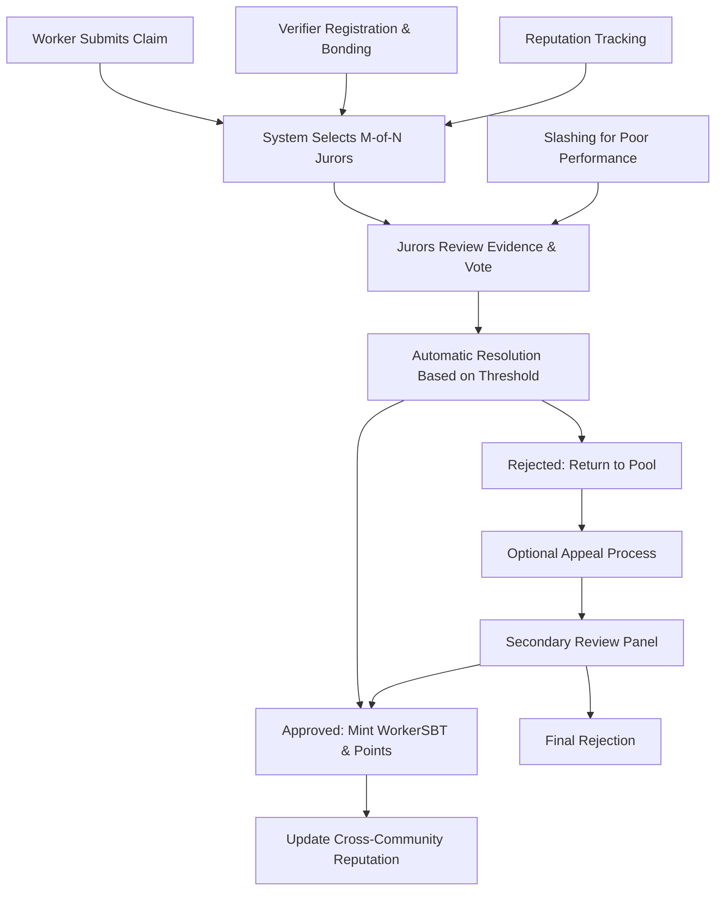

# Arquitectura del Sistema Shift DeSoc

Este documento proporciona una visión general de alto nivel de la arquitectura del sistema Shift DeSoc, interacciones de componentes y patrones de flujo de datos tanto para stakeholders técnicos como de negocio.

## 🏗️ Visión General del Sistema

Shift DeSoc implementa una **arquitectura modular, nativa de blockchain** diseñada para escalabilidad, seguridad y capacidad de actualización. La plataforma consiste en contratos inteligentes interconectados que gestionan gobernanza, verificación de trabajo e incentivos económicos.

### Principios de Diseño Central

1. **Modularidad**: Contratos independientes que pueden ser actualizados por separado
2. **Composabilidad**: Interfaces estándar permiten integración de ecosistema  
3. **Seguridad**: Seguridad multi-capa con incentivos económicos y protección timelock
4. **Escalabilidad**: Despliegue Layer 2 con patrones eficientes de uso de gas
5. **Transparencia**: Todas las operaciones verificables on-chain con logs de eventos ricos

## 🏛️ Arquitectura de 5 Capas

Shift DeSoc está construido como una pila tecnológica de 5 capas que proporciona funcionalidad completa de sociedad descentralizada:

### **Capa 1: Infraestructura de Coordinación Comunitaria**
La base para discusión democrática y desarrollo colaborativo de propuestas:

```
┌─────────────────────────────────────────────────────────────────────────────────────────┐
│                          INFRAESTRUCTURA DE COORDINACIÓN COMUNITARIA                    │
├─────────────────────────────────────────────────────────────────────────────────────────┤
│ ┌─────────────────┐  ┌────────────────┐  ┌────────────────┐  ┌─────────────────────┐ │
│ │CommunityRegistry│  │   RequestHub   │  │ DraftsManager  │  │  ParamController    │ │
│ │- Metadata       │  │- Discusión     │  │- Colaboración  │  │- Params Dinámicos   │ │
│ │- Parámetros     │  │- Moderación    │  │- Versionado    │  │- Timelock Config    │ │
│ │- Módulos        │  │- Etiquetas     │  │- Revisión      │  │- Elegibilidad      │ │
│ │- Roles          │  │- Flujo Eventos │  │- Escalación    │  │- División Ingresos  │ │
│ │- Cross-Community│  │- Stream Eventos│  │- Escalación    │  │- Soporte Migración │ │
│ └─────────────────┘  └────────────────┘  └────────────────┘  └─────────────────────┘ │
└─────────────────────────────────────────────────────────────────────────────────────────┘
```

### **Capa 2: Gobernanza Democrática**
Sistema de votación multi-opción con poder de voto mejorado por mérito:

```
┌─────────────────────────────────────────────────────────────────────────────────────────┐
│                                GOBERNANZA DEMOCRÁTICA                                   │
├─────────────────────────────────────────────────────────────────────────────────────────┤
│ ┌─────────────────┐  ┌────────────────┐  ┌────────────────┐  ┌─────────────────────┐ │
│ │  ShiftGovernor  │  │CountingMulti   │  │MembershipToken │  │  TimelockController │ │
│ │- Propuestas     │  │- Multi-Opción  │  │- Poder Voto    │  │- Retrasos Ejecución│ │
│ │- Multi-Choice   │  │- Pesos Voters  │  │- SBT Enhanced  │  │- Roles Admin       │ │
│ │- Timelock Integ │  │- Snapshots     │  │- Delegación    │  │- Queue Operations   │ │
│ │- Hooks & Events │  │- Conteo Votos  │  │- Concentración │  │- Gestión Roles     │ │
│ │- Hub Integración│  │- Eventos/Logs  │  │- Historial Voto│  │- Gestión Roles     │ │
│ └─────────────────┘  └────────────────┘  └────────────────┘  └─────────────────────┘ │
└─────────────────────────────────────────────────────────────────────────────────────────┘
```

### **Capa 3: Verificación de Trabajo & Mérito**
Sistema resistente a Sybil para validar contribuciones y construir reputación:

```
┌─────────────────────────────────────────────────────────────────────────────────────────┐
│                           VERIFICACIÓN DE TRABAJO & MÉRITO                              │
├─────────────────────────────────────────────────────────────────────────────────────────┤
│ ┌─────────────────┐  ┌────────────────┐  ┌────────────────┐  ┌─────────────────────┐ │
│ │ActionTypeRegistry│ │     Claims     │  │ VerifierPool   │  │     WorkerSBT       │ │
│ │- Tipos Trabajo  │  │- Envío Trabajo │  │- Registro M-de-N│  │- Tokens Soulbound  │ │
│ │- Params Verific │  │- Selec Jurados │  │- Bonding ETH   │  │- WorkerPoints EMA  │ │
│ │- Recompensas    │  │- Votac M-de-N  │  │- Reputa/Select │  │- Cross-Community   │ │
│ │- Cooldowns      │  │- Apelaciones   │  │- Slashing      │  │- Poder Gobernanza │ │
│ │- Spec Evidencia │  │- Estado Claims │  │- Pool Activo   │  │- Anti-Gaming      │ │
│ └─────────────────┘  └────────────────┘  └────────────────┘  └─────────────────────┘ │
└─────────────────────────────────────────────────────────────────────────────────────────┘
```

### **Capa 4: Motor Económico Avanzado**
Sistema de tokens triple con distribución dinámica de ingresos y economía sostenible:

```
┌─────────────────────────────────────────────────────────────────────────────────────────┐
│                            MOTOR ECONÓMICO AVANZADO                                     │
├─────────────────────────────────────────────────────────────────────────────────────────┤
│ ┌─────────────────┐  ┌────────────────┐  ┌────────────────┐  ┌─────────────────────┐ │
│ │ CommunityToken  │  │ RevenueRouter  │  │  InvestorSBT   │  │  TreasuryAdapter    │ │
│ │- Salario Merit  │  │- Distribución  │  │- Decay Tiempo  │  │- Gestión Tesorería │ │
│ │- Reclamos SBT   │  │- Performance   │  │- Contribuciones│  │- Runway Controller │ │
│ │- Sistema Salario│  │- Matemático    │  │- Network Multi │  │- Límites Gasto    │ │
│ │- Payments       │  │- Anti-Gaming   │  │- Voting Weight │  │- Governance Gates  │ │
│ │- Governance Ctrl│  │- Runway Aware  │  │- Capital Track │  │- Emergency Funds  │ │
│ └─────────────────┘  └────────────────┘  └────────────────┘  └─────────────────────┘ │
└─────────────────────────────────────────────────────────────────────────────────────────┘
```

### **Capa 5: Infraestructura de Utilidades & Proyectos**
Aplicaciones del mundo real que demuestran el valor de la coordinación descentralizada:

```
┌─────────────────────────────────────────────────────────────────────────────────────────┐
│                         INFRAESTRUCTURA UTILIDADES & PROYECTOS                          │
├─────────────────────────────────────────────────────────────────────────────────────────┤
│ ┌─────────────────┐  ┌────────────────┐  ┌────────────────┐  ┌─────────────────────┐ │
│ │ ProjectFactory  │  │  Marketplace   │  │ HousingManager │  │  Cross-Chain Bridge │ │
│ │- Crowdfunding   │  │- P2P Services  │  │- Co-housing    │  │- Multi-Network     │ │
│ │- Tokens ERC-1155│  │- Trade Servicios│  │- Co-housing    │  │- Interfaz Tesorería   │ │
│ │- Milestone Valid│  │- Quality Verif │  │- Investor Stake│  │- Sync Estado       │ │
│ │- Protec Investor│  │- Reputation    │  │- Worker Discounts│ │- Asset Movement   │ │
│ │- Community Funds│  │- Escrow System │  │- Booking System│  │- Unified Economy   │ │
│ └─────────────────┘  └────────────────┘  └────────────────┘  └─────────────────────┘ │
└─────────────────────────────────────────────────────────────────────────────────────────┘
```

## 🔗 Flujos de Datos del Sistema

### **Flujo de Coordinación Comunitaria**


### **Flujo de Verificación de Trabajo**


### **Flujo Económico Dinámico**
```mermaid
graph TD
    A[Revenue Generated] --> B[Mathematical Distribution Engine]
    B --> C[Time-Based Weight Calculation]
    B --> D[Performance Modulation]
    B --> E[Treasury Runway Analysis]
    
    C --> F[Worker Share: w_W(t) = α_W × (1 - e^(-λ_W × t)) + β_W]
    C --> G[Investor Share: w_I(t) = α_I × e^(-λ_I × t) + β_I]
    E --> H[Treasury Share: Dynamic based on runway urgency]
    
    F --> I[CommunityToken Distribution to Workers]
    G --> J[Returns to InvestorSBT Holders]
    H --> K[Treasury Fund Growth]
    
    I --> L[WorkerSBT Point Tracking]
    J --> M[InvestorSBT Decay Tracking]
    K --> N[Runway Extension & Sustainability]
```

## � Estado de Datos & Estructura de Contratos Inteligentes

### **Mapas de Estado del Sistema**

#### Estado de Gobernanza
```solidity
// Seguimiento de propuestas
mapping(uint256 => ProposalCore) proposals;
mapping(uint256 => uint8) numOptions;           // Configuración multi-opción
mapping(uint256 => ProposalVote) proposalVotes; // Conteo de votos

// Snapshots de poder de voto
mapping(address => Checkpoint[]) checkpoints;   // Poder de voto histórico
mapping(uint256 => uint256) totalSupplyHistory; // Snapshots de supply de tokens
```

#### Estado de Verificación
```solidity
// Ciclo de vida de claims
mapping(uint256 => Claim) claims;               // Todos los claims enviados
mapping(uint256 => Appeal) appeals;             // Seguimiento de apelaciones
mapping(address => mapping(uint256 => uint64)) workerCooldowns; // Rate limiting

// Gestión de verificadores
mapping(address => Verifier) verifiers;         // Perfiles de verificadores
address[] activeVerifiers;                      // Pool de selección
mapping(uint256 => JurorSelection) selections;  // Asignaciones de panel
```

#### Estado Económico
```solidity
// Estado de Arquitectura Triple-Token
mapping(address => uint256) membershipBalances;      // Elegibilidad de voto base
mapping(address => WorkerProfile) workerProfiles;    // Datos de mérito y contribución
mapping(address => InvestorProfile) investorProfiles; // Datos de capital y time-decay

// Estado de Distribución Dinámica de Ingresos  
struct DistributionSnapshot {
    uint256 timestamp;                          // Tiempo de cálculo
    uint256 rawWorkerWeight;                    // Peso base matemático
    uint256 rawInvestorWeight;                  // Peso base matemático
    uint256 treasuryWeight;                     // Peso basado en runway
    uint256 performanceModW;                    // Multiplicador performance worker
    uint256 performanceModI;                    // Multiplicador performance investor
    uint256 totalNormalization;                 // Suma para cálculo porcentaje
}
mapping(uint256 => DistributionSnapshot) distributionHistory; // Cálculos históricos

// Estado de Reputación Cross-Community
mapping(address => mapping(uint256 => uint256)) crossCommunityReputation; // [user][communityId] = reputation
mapping(uint256 => CommunityEconomicParams) communityParameters;          // Config económica por comunidad
mapping(address => uint256[]) userCommunities;                            // Comunidades donde participa el usuario
```

## 🏗️ Arquitectura Económica Avanzada

### **Motor de Distribución Matemática de Ingresos**

El RevenueRouter elimina divisiones arbitrarias a través de curvas matemáticas basadas en tiempo:

```solidity
contract RevenueRouterDynamic {
    struct EconomicParams {
        uint64 startTimestamp;           // T=0 para todos los cálculos
        uint64 lambdaInvestor;           // Tasa de decay investor (ej. 0.1/mes)
        uint64 lambdaWorker;             // Tasa de crecimiento worker (ej. 0.05/mes)
        uint256 alphaI;                  // Amplitud curva investor
        uint256 betaI;                   // Piso investor (share mínima)
        uint256 alphaW;                  // Amplitud curva worker  
        uint256 betaW;                   // Share inicial worker
        uint16 investorFloor;            // % mínimo investor (bps)
        uint16 workerCap;                // % máximo worker (bps)
        uint16 treasuryFloor;            // % base tesorería (bps)
    }
    
    function calculateTimeBasedWeights(uint64 elapsedTime) 
        external view returns (uint256 investorWeight, uint256 workerWeight) {
        
        // Peso investor: w_I(t) = α_I × e^(-λ_I × t) + β_I  
        uint256 investorDecay = Math.exp(-params.lambdaInvestor * elapsedTime / 1e9);
        investorWeight = (params.alphaI * investorDecay + params.betaI) / 1e18;
        investorWeight = Math.max(investorWeight, params.investorFloor);
        
        // Peso worker: w_W(t) = α_W × (1 - e^(-λ_W × t)) + β_W
        uint256 workerGrowth = 1e18 - Math.exp(-params.lambdaWorker * elapsedTime / 1e9);
        workerWeight = (params.alphaW * workerGrowth + params.betaW) / 1e18;
        workerWeight = Math.min(workerWeight, params.workerCap);
    }
    
    function calculatePerformanceMultipliers() 
        external view returns (uint256 workerMult, uint256 investorMult) {
        
        // Performance worker: calidad output × consistencia × colaboración
        uint256 qualityScore = getCollectiveOutputQuality();      // Tasa promedio aprobación claims
        uint256 consistencyScore = getContributionConsistency();  // Participación regular
        uint256 collaborationScore = getPeerReviewScores();      // Compatibilidad de equipo
        workerMult = Math.cbrt(qualityScore * consistencyScore * collaborationScore);
        
        // Performance investor: logro hitos × efectos red × eficiencia capital  
        uint256 milestonesHit = getCollectiveMilestoneScore();    // Logro objetivos comunitarios
        uint256 networkEffects = getEcosystemContributions();     // Valor cross-community
        uint256 capitalEfficiency = getRunwayExtensionRatio();    // $ por mes runway añadido
        investorMult = (milestonesHit + networkEffects + capitalEfficiency) / 3;
    }
}
```

### **Arquitectura de Controlador de Runway de Tesorería**

Gestión automatizada de sostenibilidad sin porcentajes fijos:

```solidity
contract TreasuryController {
    struct RunwayParams {
        uint64 targetRunwayMonths;       // Meta sostenibilidad fijada por gobernanza
        uint64 currentRunwayMonths;      // Calculado desde balance/burn
        uint256 monthlyBurnRate;         // EMA de gastos reales
        uint16 urgencyMultiplier;        // Qué tan agresivamente proteger (bps)
        uint16 maxTreasuryShare;         // Límite superior para prevenir hambruna
        uint16 baseTreasuryShare;        // Mínimo cuando runway es saludable
    }
    
    function calculateDynamicTreasuryShare() external view returns (uint256) {
        RunwayParams memory runway = getCurrentRunwayStatus();
        
        if (runway.currentRunwayMonths >= runway.targetRunwayMonths) {
            return runway.baseTreasuryShare; // Runway saludable = mínimo base
        }
        
        // Función de urgencia exponencial cuando el runway decrece
        uint256 runwayRatio = runway.currentRunwayMonths * 1e18 / runway.targetRunwayMonths;
        uint256 urgencyFactor = 1e18 - runwayRatio; // 0 cuando saludable, 1e18 cuando crítico
        
        // Share adicional de tesorería escala exponencialmente con urgencia
        uint256 additionalShare = urgencyFactor * runway.urgencyMultiplier / 1e4;
        uint256 totalShare = runway.baseTreasuryShare + additionalShare;
        
        return Math.min(totalShare, runway.maxTreasuryShare);
    }
    
    function updateBurnRate(uint256 newExpense) external {
        // Suavizado EMA: new_rate = α × new_expense + (1-α) × old_rate
        uint256 alpha = 200; // 20% ponderación para datos nuevos (de 1000)
        params.monthlyBurnRate = (alpha * newExpense + (1000 - alpha) * params.monthlyBurnRate) / 1000;
    }
}
```

### **Arquitectura de Token de Gobernanza Basado en Mérito**

Token de gobernanza puro que se acuña automáticamente basado en contribuciones verificadas:

```solidity
contract MembershipTokenERC20Votes {
    // Eliminado: funciones mint/redeem - los tokens solo se ganan a través de logros SBT
    // Eliminado: respaldo USDC - utilidad de gobernanza pura
    
    struct GovernanceWeighting {
        uint64 vestingPeriodMonths;     // Línea de tiempo de equilibrio establecida por la comunidad (ej. 36 meses)
        uint64 startTimestamp;          // T=0 para cálculos basados en tiempo
        uint256 workerBaseWeight;       // Peso inicial de gobernanza WorkerSBT
        uint256 investorBaseWeight;     // Peso inicial de gobernanza InvestorSBT
        uint256 maxConcentrationBps;    // Límite anti-plutocracia (ej. 15%)
    }
    
    function calculateTimeBasedWeight(address account) 
        external view returns (uint256 totalVotingPower) {
        
        uint256 workerTokens = getWorkerSBTTokens(account);
        uint256 investorTokens = getInvestorSBTTokens(account);
        
        // Cálculo de ponderación basado en tiempo
        uint256 elapsedMonths = (block.timestamp - weighting.startTimestamp) / 30 days;
        uint256 progressRatio = Math.min(elapsedMonths * 1e18 / weighting.vestingPeriodMonths, 1e18);
        
        // Progresión lineal: inversores empiezan alto, trabajadores crecen con el tiempo
        uint256 currentWorkerWeight = weighting.workerBaseWeight + 
            (progressRatio * (1e18 - weighting.workerBaseWeight) / 1e18);
        uint256 currentInvestorWeight = weighting.investorBaseWeight - 
            (progressRatio * (weighting.investorBaseWeight - 1e18) / 1e18);
        
        totalVotingPower = (workerTokens * currentWorkerWeight + investorTokens * currentInvestorWeight) / 1e18;
        
        // Límite anti-plutocracia de concentración
        uint256 totalSupply = totalSupply();
        uint256 maxConcentration = totalSupply * weighting.maxConcentrationBps / 10000;
        return Math.min(totalVotingPower, maxConcentration);
    }
    
    function mintFromSBT(address recipient, uint256 amount, bytes32 sbtType) external {
        require(msg.sender == actionTypeRegistry || msg.sender == workerSBT || msg.sender == investorSBT, "No autorizado");
        _mint(recipient, amount);
        emit MembershipMinted(recipient, amount, sbtType);
    }
}
```

### **Arquitectura de Reputación Cross-Community**

Credenciales portables que crean efectos de red:

```solidity
contract WorkerSBT {
    struct CrossCommunityProfile {
        uint256[] participatingCommunities;   // IDs de comunidades donde el usuario está activo
        mapping(uint256 => uint256) communityPoints; // Puntos por comunidad
        mapping(uint256 => uint256) communityReputation; // Reputación por comunidad
        uint256 networkReputation;            // Promedio cross-community
        uint64 lastCrossCommunityActivity;    // Timestamp anti-gaming
    }
    
    function getNetworkReputationScore(address user) external view returns (uint256) {
        CrossCommunityProfile storage profile = crossProfiles[user];
        uint256 totalReputation = 0;
        uint256 activeCommunities = 0;
        
        for (uint i = 0; i < profile.participatingCommunities.length; i++) {
            uint256 communityId = profile.participatingCommunities[i];
            uint256 reputation = profile.communityReputation[communityId];
            
            if (reputation > 0) {
                totalReputation += reputation;
                activeCommunities++;
            }
        }
        
        if (activeCommunities == 0) return 0;
        
        // Bonus de efecto de red: más comunidades = mayor confianza
        uint256 networkBonus = Math.sqrt(activeCommunities * 1e18);
        uint256 avgReputation = totalReputation / activeCommunities;
        
        return avgReputation * networkBonus / 1e9;
    }
    
    function portReputationToNewCommunity(address user, uint256 newCommunityId) 
        external returns (uint256 startingReputation) {
        
        uint256 networkScore = getNetworkReputationScore(user);
        
        // Reputación inicial = 50% del promedio de red (debe aún probar valor local)
        startingReputation = networkScore / 2;
        
        // Añadir a la lista de comunidades del usuario
        crossProfiles[user].participatingCommunities.push(newCommunityId);
        crossProfiles[user].communityReputation[newCommunityId] = startingReputation;
        
        emit ReputationPorted(user, newCommunityId, startingReputation);
    }
}
```

### Arquitectura Dirigida por Eventos

#### Eventos de Gobernanza
```solidity
event ProposalCreated(uint256 indexed proposalId, address proposer, string description);
event MultiChoiceProposalCreated(uint256 indexed proposalId, uint8 numOptions);
event VoteCast(address indexed voter, uint256 indexed proposalId, uint8 support, uint256 weight);
event VoteMultiCast(address indexed voter, uint256 indexed proposalId, uint256[] weights);
event ProposalExecuted(uint256 indexed proposalId);
```

#### Eventos de Verificación
```solidity
event ClaimSubmitted(uint256 indexed claimId, address indexed worker, uint256 typeId);
event JurorsAssigned(uint256 indexed claimId, address[] jurors);
event ClaimVerified(uint256 indexed claimId, address indexed verifier, bool approve);
event ClaimResolved(uint256 indexed claimId, uint8 status, uint32 approvals, uint32 rejections);
event ReputationUpdated(address indexed verifier, uint256 oldRep, uint256 newRep);
```

#### Eventos Económicos
```solidity
event VerifierRegistered(address indexed verifier, uint256 bondAmount);
event BondIncreased(address indexed verifier, uint256 oldAmount, uint256 newAmount);
event WorkerSBTMinted(address indexed worker, uint256 indexed tokenId, uint256 points);
event FeesDistributed(uint256 totalFees, uint256 treasuryShare, uint256 verifierShare);
```

## 🔐 Arquitectura de Seguridad

### Modelo de Seguridad Multi-Capa

#### Capa 1: Seguridad de Contratos Inteligentes
- **Control de Acceso**: Permisos basados en roles con supervisión de gobernanza
- **Validación de Input**: Verificación comprensiva de parámetros y validación de límites
- **Protección Reentrancy**: Uso consistente del patrón checks-effects-interactions
- **Seguridad de Integers**: Protección overflow Solidity 0.8+ y patrones SafeMath

#### Capa 2: Seguridad Económica
- **Requisitos de Bonding**: Stakes económicas para todos los actores críticos
- **Seguimiento de Reputación**: Alineación de incentivos a largo plazo a través de historial de performance
- **Mecanismos de Slashing**: Penalidades económicas por comportamiento malicioso o pobre
- **Períodos de Cooldown**: Rate limiting para prevenir spam y manipulación

#### Capa 3: Seguridad de Gobernanza
- **Protección Timelock**: Retrasos obligatorios para cambios críticos del sistema
- **Requisitos Multi-Signature**: Múltiples aprobaciones para operaciones sensibles
- **Pausa de Emergencia**: Circuit breakers controlados por gobernanza para respuesta a crisis
- **Controles de Upgrade**: Rutas de upgrade de contratos controladas a través de gobernanza

#### Capa 4: Seguridad Operacional
- **Monitoreo & Alertas**: Seguimiento en tiempo real de salud del sistema y anomalías
- **Audit Trail**: Historial completo on-chain de todas las operaciones y decisiones
- **Procedimientos de Recuperación**: Procesos definidos para manejar varios escenarios de fallo
- **Programas Bug Bounty**: Testing de seguridad dirigido por la comunidad y mejoras

### Análisis de Vectores de Ataque & Mitigación

#### Ataques de Gobernanza
- **Gobernanza Flash Loan**: Mitigado por snapshots de poder de voto y retrasos timelock
- **Spam de Propuestas**: Prevenido por umbrales de propuestas y costos económicos
- **Compra de Votos**: Reducido a través de mecanismos de delegación y seguimiento de reputación

#### Ataques de Verificación
- **Ataques Sybil**: Prevenidos por requisitos de bonding ETH y seguimiento de reputación
- **Colusión**: Detectada a través de análisis de patrones de votación y decay de reputación
- **Manipulación de Evidencia**: Mitigada por direccionamiento de contenido IPFS y pruebas criptográficas

#### Ataques Económicos
- **Ataques de Drenaje**: Prevenidos por flujos de fondos controlados y supervisión de gobernanza
- **Manipulación de Oracle**: Dependencia reducida en price feeds externos
- **Extracción MEV**: Minimizada a través de operaciones batch y ordenamiento justo

## 🚀 Escalabilidad & Performance

### Optimización Layer 2

#### Estrategias de Eficiencia de Gas
- **Operaciones Batch**: Agrupar transacciones relacionadas para reducir costos por operación
- **Optimización de Estado**: Patrones eficientes de storage y técnicas de empaquetado de datos
- **Updates Dirigidas por Eventos**: Usar eventos para indexado off-chain en lugar de lecturas caras de storage
- **Computación Lazy**: Diferir cálculos caros hasta que realmente se necesiten

#### Ventajas de Red Base
- **Costos Bajos de Transacción**: $0.01 vs $20-100 en Ethereum mainnet
- **Confirmaciones Rápidas**: Tiempos de bloque 2-segundo vs 15-segundo Ethereum
- **Compatibilidad EVM**: Herramientas completas de Ethereum y experiencia de desarrollador
- **Integración Coinbase**: On-ramps nativos fiat y partnerships empresariales

### Características de Performance

#### Métricas de Throughput
- **Gobernanza**: 1000+ votos por propuesta sin degradación de performance
- **Verificación**: 100+ claims concurrentes con selección automatizada de jurados
- **Operaciones de Token**: Características de performance ERC-20/ERC-721 estándar

#### Objetivos de Latencia
- **Casting de Votos**: <5 segundo tiempos de confirmación
- **Envío de Claims**: <10 segundo procesamiento incluyendo selección de jurados
- **Updates de Reputación**: Updates en tiempo real en resolución de claims

## 🔮 Evolución Futura de Arquitectura

### Mejoras Planificadas

#### Expansión Cross-Chain
- **Despliegue Multi-Red**: Soporte Ethereum, Polygon, Arbitrum
- **Sincronización de Estado**: Coordinación cross-chain de reputación y gobernanza
- **Integración de Bridge**: Movimiento seamless de assets entre redes

#### Características Avanzadas
- **Privacidad Zero-Knowledge**: Votación privada con verificabilidad pública
- **Verificación Asistida por IA**: Revisión de evidencia augmentada por machine learning
- **Parámetros Dinámicos**: Tuning automatizado del sistema basado en métricas de performance

#### Mejoras de Escalabilidad
- **State Channels**: Computación off-chain con settlement on-chain
- **Integración Rollup**: Despliegue Layer 3 nativo para casos de uso especializados
- **Soporte Sharding**: Escalado horizontal para despliegue masivo de comunidades

## 🔗 Patrones de Integración & Arquitectura de Ecosistema

### **Integración Community-to-Community**

#### **Modelo de Gobernanza Federada**
Las comunidades pueden establecer relaciones formales para compartir recursos y tomar decisiones colectivas:

```solidity
contract CommunityFederation {
    struct FederationParams {
        uint256[] memberCommunities;        // IDs de comunidades en federación
        uint16 consensusThreshold;          // % necesario para decisiones de federación
        address federationTreasury;         // Pool de recursos compartidos
        mapping(uint256 => uint16) votingWeights; // Poder de federación por comunidad
    }
    
    function proposeFederationAction(
        uint256 federationId,
        address[] calldata targets,
        uint256[] calldata values,
        bytes[] calldata calldatas,
        string calldata description
    ) external returns (uint256 proposalId) {
        // Propuesta de gobernanza cross-community
        // Requiere consenso de comunidades miembro
    }
    
    function executeCrossCommunitySplit(
        uint256 federationId,
        uint256 amount,
        uint256[] calldata communityShares
    ) external {
        // Distribución de recursos a través de comunidades federadas
        // Basado en métricas de contribución y acuerdos de federación
    }
}
```

#### **Redes de Intercambio de Recursos**
Las comunidades se especializan y comercian expertise, bienes y servicios:

```solidity
contract InterCommunityMarketplace {
    struct ResourceListing {
        uint256 sourceCommunityId;         // Comunidad ofreciendo recurso
        string resourceType;               // "expertise", "goods", "services"
        uint256 priceInCommunityToken;     // Costo en token de comunidad local
        bytes32 qualityHash;               // Hash IPFS de credenciales de calidad
        uint256 availableQuantity;         // Cantidad disponible para comercio
        uint64 expirationTime;             // Deadline del listado
    }
    
    function createResourceListing(ResourceListing calldata listing) external;
    function requestResource(uint256 listingId, uint256 quantity) external;
    function fulfillResourceRequest(uint256 requestId, bytes32 fulfillmentProof) external;
    
    // Reputación cross-community afecta elegibilidad de comercio y precios
    function getTradeMultiplier(address user, uint256 targetCommunityId) 
        external view returns (uint256 trustMultiplier);
}
```

### **Integración con Plataformas Externas**

#### **Bridges de Plataformas Tradicionales**
Integración con herramientas comunitarias existentes mientras mantienen soberanía:

```solidity
contract DiscordGovernanceBridge {
    mapping(uint256 => string) communityDiscordGuilds;     // Comunidad → servidor Discord
    mapping(bytes32 => uint256) discordProposalMapping;    // Hilo Discord → ID Propuesta
    
    function linkDiscordProposal(
        uint256 proposalId,
        string calldata discordThreadId,
        bytes calldata signature
    ) external {
        // Vincula gobernanza on-chain con discusión Discord
        // Permite notificación y broadcasting de resultados
    }
    
    function broadcastResults(uint256 proposalId) external {
        // Publica resultados de gobernanza de vuelta a Discord
        // Mantiene continuidad de discusión a través de plataformas
    }
}

contract GitHubIntegration {
    mapping(uint256 => string) communityRepositories;      // Comunidad → org/repo GitHub
    mapping(bytes32 => uint256) issueToActionType;         // Issue GitHub → ActionType
    
    function createActionTypeFromIssue(
        uint256 communityId,
        string calldata issueUrl,
        ActionTypeParams calldata params
    ) external returns (uint256 actionTypeId) {
        // Convierte issues GitHub en tipos de trabajo verificables
        // Permite onboarding seamless de desarrolladores
    }
    
    function submitClaimFromPR(
        uint256 actionTypeId,
        string calldata pullRequestUrl,
        bytes32 evidenceHash
    ) external returns (uint256 claimId) {
        // Envía claims de trabajo directamente desde GitHub PR
        // Vincula contribución de código con sistema de reputación
    }
}
```

#### **Integración con Protocolos DeFi**
Las tesorerías comunitarias pueden participar en el ecosistema DeFi más amplio:

```solidity
contract TreasuryDeFiAdapter {
    function investInYieldProtocol(
        address protocol,
        uint256 amount,
        uint256 minYield
    ) external onlyGovernance {
        // Gobernanza comunitaria puede desplegar fondos de tesorería
        // En protocolos verificados generadores de yield
    }
    
    function provideLiquidityToAMM(
        address pool,
        uint256 tokenAAmount,
        uint256 tokenBAmount
    ) external onlyGovernance returns (uint256 liquidityTokens) {
        // Permite a comunidades proveer liquidez
        // Generar ingresos de fees de trading
    }
    
    function borrowAgainstTreasury(
        address lendingProtocol,
        uint256 collateralAmount,
        uint256 borrowAmount
    ) external onlyGovernance {
        // Capacidad de préstamo de emergencia
        // Mantener operaciones durante gaps de cash flow
    }
}
```

#### **Integración con Infraestructura Descentralizada**
Partnerships esenciales para funcionalidad descentralizada de grado empresarial:

```solidity
contract DecentralizedInfrastructureAdapter {
    // Identidad & Resistencia Sybil
    IWorldID public worldID;                    // Verificación de humanos preservando privacidad
    IBrightID public brightID;                  // Verificación de identidad de grafo social
    IProofOfHumanity public proofOfHumanity;   // Registro humano descentralizado
    IEAS public attestationService;             // Sistema de credenciales portables
    
    // Resolución de Disputas & Apelaciones
    IKleros public klerosArbitrator;            // Arbitraje descentralizado
    IAragonCourt public aragonCourt;            // Resolución de disputas de gobernanza
    IChainlinkFunctions public chainlinkOracle; // Verificación de datos del mundo real
    
    // Tokenización de Propiedades & Assets
    IRealT public realTProtocol;                // Real estate fraccionado
    ILoftyAI public loftyPropertyManager;       // Gestión automatizada de propiedades
    IPropy public propyTitleService;            // Registros de propiedades blockchain
    IRedSwan public redSwanCommercial;          // Tokenización real estate comercial
    
    function verifyHumanIdentity(address user) external returns (bool isHuman) {
        // Verificación humana multi-protocolo para resistencia sybil
        bool worldIDVerified = worldID.verifyProof(user, /* parámetros proof */);
        bool brightIDVerified = brightID.isVerified(user);
        bool pohVerified = proofOfHumanity.isRegistered(user);
        
        return worldIDVerified || brightIDVerified || pohVerified;
    }
    
    function initiateDispute(
        uint256 claimId,
        bytes32 disputeType,
        uint256 disputeAmount
    ) external returns (uint256 disputeId) {
        if (disputeAmount < KLEROS_THRESHOLD) {
            return klerosArbitrator.createDispute(claimId, disputeType);
        } else {
            return aragonCourt.createDispute(claimId, disputeType, disputeAmount);
        }
    }
    
    function tokenizeProperty(
        string calldata propertyAddress,
        uint256 totalValue,
        uint256 tokenSupply
    ) external returns (address tokenContract) {
        // Tokenización de propiedades para adquisición de tierras comunitarias
        return realTProtocol.tokenizeProperty(
            propertyAddress, 
            totalValue, 
            tokenSupply,
            address(this) // Tesorería comunitaria como propietario inicial
        );
    }
    
    function generateYield(uint256 amount, address protocol) external onlyGovernance {
        // Gestión automatizada de tesorería a través de protocolos DeFi
        require(approvedProtocols[protocol], "Protocol not approved");
        IERC20(communityToken).transfer(protocol, amount);
    }
}
```

### **Evolución de Arquitectura Multi-Community**

#### **Fase 1: Comunidades Aisladas (Actual - Mes 6)**
```
Comunidad A: [Suite Completa Contratos A]
Comunidad B: [Suite Completa Contratos B]  
Comunidad C: [Suite Completa Contratos C]
```

**Beneficios:** Autonomía completa, no hay conflictos cross-community, perfecto para validación MVP
**Desafíos:** Altos costos de despliegue, no hay efectos de red, UX multi-community complejo

#### **Fase 2: Arquitectura Federada (Mes 6-18)**
```
Infraestructura Compartida: [CommunityRegistry + CrossReputationHub + FederationController]
                              ↓
Comunidad A: [Governor_A + Local_Contracts_A] ←→ Comunidad B: [Governor_B + Local_Contracts_B]
                              ↓                                           ↓
Comunidad C: [Governor_C + Local_Contracts_C] ←→ Comunidad D: [Governor_D + Local_Contracts_D]
```

**Beneficios:** Reputación compartida, comercio de recursos, costos de despliegue reducidos, efectos de red
**Implementación:** CommunityFactory para despliegue de nuevas comunidades, portabilidad de reputación compartida

#### **Fase 3: Red de Ecosistema (Mes 18+)**
```
Capa de Infraestructura Global:
├── CrossCommunityReputationHub (WorkerSBT Universal)
├── GlobalGovernanceCoordinator (Decisiones de federación)
├── InterCommunityMarketplace (Comercio de recursos & servicios)
└── EcosystemTreasury (Financiamiento infraestructura compartida)

Hubs Regionales:
├── Hub América del Norte [Comunidades 1-100]
├── Hub Europa [Comunidades 101-200]  
├── Hub Asia-Pacífico [Comunidades 201-300]
└── Hub Mercados Emergentes [Comunidades 301-400]

Capa de Comunidad Local:
└── Comunidades individuales con gobernanza especializada
```

**Beneficios:** Red de reputación global, ecosistemas comunitarios especializados, compartición de costos de infraestructura
**Implementación:** Despliegue Layer 2, especialización regional, portabilidad de reputación cross-chain

## 🔧 Detalles de Implementación Técnica

### Especificaciones de Contratos Inteligentes

#### **Contratos Core**

**CommunityRegistry**
```solidity
contract CommunityRegistry {
    struct Community {
        string name;
        string description;
        string metadataURI;
        
        // Parámetros de Gobernanza  
        uint256 debateWindow;
        uint256 voteWindow;
        uint256 executionDelay;
        
        // Reglas de Elegibilidad
        uint256 minSeniority;
        uint256 minSBTs;
        uint256 proposalThreshold;
        
        // Parámetros Económicos
        uint256[3] revenueSplit;     // [workers%, treasury%, investors%] - configurable gobernanza
        uint256 feeOnWithdraw;
        address[] backingAssets;     // Tokens colaterales aprobados
        
        // Direcciones de Módulos
        address governor;
        address timelock;
        address requestHub;
        address draftsManager;
        address claimsManager;
        address actionTypeRegistry;
        address verifierPool;
        address workerSBT;
        address treasuryAdapter;
        
        // Roles & Permisos
        mapping(address => bool) moderators;
        mapping(address => bool) curators;
        
        // Links Cross-Community
        uint256 parentCommunityId;   // Soporte federación/jerarquía
        uint256[] allyCommunityIds;  // Relaciones de partnership
    }
    
    function registerCommunity(CommunityParams params) returns (uint256 communityId);
    function updateParameters(uint256 communityId, ParameterUpdate[] updates); // Gateado por gobernanza
    function setModuleAddress(uint256 communityId, bytes32 moduleKey, address moduleAddress);
}
```

**Claims Contract**
```solidity
contract Claims {
    struct Claim {
        uint256 actionTypeId;
        address claimant;
        string evidenceCID;
        uint64 submittedAt;
        ClaimStatus status;
        uint256[] selectedJurors;
        mapping(address => Vote) votes;
        uint64 resolvedAt;
        bool appealed;
    }
    
    function submitClaim(uint256 actionTypeId, string calldata evidenceCID) external returns (uint256 claimId);
    function vote(uint256 claimId, bool approve, string calldata reason) external;
    function resolve(uint256 claimId) external;
    function appeal(uint256 claimId) external payable;
}
```

#### **Sistema de Bonding Económico**

**Implementación VerifierPool**
```solidity
contract VerifierPool {
    struct Verifier {
        uint256 bondAmount;         // ETH bondeado como depósito de seguridad
        uint256 reputation;         // Score de reputación basado en precisión
        uint64 joinedAt;           // Timestamp de membresía
        bool active;               // Estado actual
        uint256 totalVotes;       // Total de votos de verificación emitidos
        uint256 accurateVotes;    // Votos coincidiendo con consenso final
    }
    
    function registerVerifier() external payable;
    function deactivate() external; // Retirar bond y salir
    function updateReputations(uint256[] calldata claimIds, bool[] calldata outcomes) external;
    function selectJurors(uint256 claimId, uint256 count) external returns (address[] memory);
}
```

### Arquitectura de Despliegue Layer 2

**Optimización Base L2**
- Costos de transacción: <$0.01 por operación
- Confirmación de bloque: ~2 segundos
- Compatibilidad EVM: Soporte completo de herramientas Ethereum
- Confiabilidad sequencer: Infraestructura Coinbase

**Patrones de Optimización de Gas**
```solidity
// Operaciones batch para minimizar costos de transacción
function batchVote(uint256[] calldata claimIds, bool[] calldata votes) external;

// Patrones eficientes de storage
struct PackedVote {
    uint64 timestamp;
    uint32 weight;
    bool approved;
    // Total: 12 bytes vs 3 slots de storage
}

// Arquitectura dirigida por eventos para indexado off-chain
event ClaimSubmitted(uint256 indexed claimId, address indexed claimant, uint256 indexed actionTypeId);
event VoteCast(uint256 indexed claimId, address indexed voter, bool approved);
```

### Implementación de Seguridad

**Modelo de Seguridad Multi-Capa**

1. **Seguridad de Contratos Inteligentes**
   - Contratos base OpenZeppelin (Governor, Timelock, implementaciones ERC)
   - Cobertura comprensiva de tests (95%+ lograda)
   - Auditorías de seguridad profesionales (planeadas pre-mainnet)
   - Estrategia de despliegue gradual (testnet → limitado → completo)

2. **Seguridad Económica**
   ```solidity
   // Requisitos de bonding de verificadores
   uint256 public constant MIN_BOND = 0.1 ether;
   uint256 public constant SLASH_RATE = 1000; // 10%
   
   // Ponderación de selección basada en reputación
   function calculateJurorWeight(address verifier) public view returns (uint256) {
       Verifier memory v = verifiers[verifier];
       return v.reputation * v.bondAmount / 1 ether;
   }
   ```

3. **Seguridad de Gobernanza**
   ```solidity
   // Retrasos timelock para operaciones críticas
   uint256 public constant PROPOSAL_DELAY = 1 days;
   uint256 public constant EXECUTION_DELAY = 2 days;
   
   // Requisitos multi-signature para acciones de emergencia
   modifier onlyMultisig() {
       require(msg.sender == emergencyMultisig, "Unauthorized");
       _;
   }
   ```

## 🚀 Roadmap de Implementación & Evolución Técnica

### **Fase 1: Fundación MVP (Actual - Mes 3)**
**Objetivo:** Probar gobernanza core y verificación con 5-10 comunidades piloto

**Entregables Técnicos:**
- ✅ ShiftGovernor con votación multi-opción (completado)
- ✅ Claims + ActionTypeRegistry + VerifierPool (completado) 
- ✅ WorkerSBT acumulación básica de puntos (completado)
- ✅ CommunityToken sistema de salario basado en mérito (completado)
- 🔄 Scripts mejorados de despliegue y onboarding comunitario
- 🔄 RevenueRouter básico con divisiones fijas

**Foco de Arquitectura:**
- Despliegues de comunidades individuales
- Validación de workflow core: request → draft → proposal → execution → claims → verification
- Optimización de experiencia de usuario para gestores comunitarios no técnicos

### **Fase 2: Tokenomics Avanzadas (Mes 3-8)**  
**Objetivo:** Implementar modelo económico dinámico y gobernanza mejorada

**Entregables Técnicos:**
- 🆕 InvestorSBT con matemáticas de time-decay
- 🆕 RevenueRouter dinámico con modulación de performance  
- 🆕 TreasuryController con gestión de runway
- 🆕 MembershipToken mejorado con votación ponderada por SBT
- 🆕 ParamController para gestión de parámetros de gobernanza
- 🆕 RequestHub + DraftsManager capa de coordinación comunitaria

**Foco de Arquitectura:**
- Distribución económica matemática (eliminar divisiones arbitrarias)
- Infraestructura de coordinación comunitaria (discusión → drafts colaborativos → gobernanza)
- Gobernanza mejorada con poder de voto basado en mérito

### **Fase 3: Efectos de Red (Mes 8-15)**
**Objetivo:** Reputación cross-community y gobernanza federada

**Entregables Técnicos:**  
- 🆕 CommunityRegistry con soporte de federación
- 🆕 Portabilidad de reputación WorkerSBT cross-community
- 🆕 Marketplace inter-community para comercio de recursos
- 🆕 Gobernanza de federación para decisiones multi-community
- 🆕 Sistema de crowdfunding ProjectFactory ERC-1155
- 🆕 Seguridad avanzada: límites de concentración, resistencia sybil

**Foco de Arquitectura:**
- Despliegue de infraestructura compartida (reducir costos por comunidad)
- Efectos de reputación de red (contribuyentes de calidad atraen mejores comunidades)
- Soberanía económica (comunidades controlan sus propios parámetros)

### **Fase 4: Madurez de Ecosistema (Mes 15+)**
**Objetivo:** Red comunitaria global con hubs especializados

**Entregables Técnicos:**
- 🔧 Optimización Layer 2 y despliegue multi-chain
- 🔧 Mecanismos anti-gaming avanzados y verificación formal
- 🔧 APIs de integración empresarial y tooling de compliance
- 🔧 Experiencia de usuario mobile-first y progressive web app
- 🔧 Gestión comunitaria asistida por IA y soporte de decisiones

**Foco de Arquitectura:**
- Escalabilidad global (soporte 1000+ comunidades)
- Compliance regulatorio (cumplir varios requisitos jurisdiccionales)  
- Adopción mainstream (onboarding comunitario no-crypto)

## 📋 Resumen: Implementación de Visión Completa

**La Arquitectura Shift DeSoc** proporciona la infraestructura para **liberación humana a través de abundancia colaborativa**:

### **Democracia Económica**
- **Distribución dinámica de ingresos** elimina divisiones arbitrarias favoreciendo capital sobre contribución
- **Transición basada en tiempo** de prioridad capital a cooperativa worker durante 24-36 meses  
- **Modulación basada en performance** asegura que mérito impulse recompensas económicas
- **Soberanía comunitaria** a través de parámetros económicos controlados por gobernanza

### **Coordinación Basada en Mérito**  
- **Arquitectura triple-token** (Membership + WorkerSBT + InvestorSBT) balancea elegibilidad, mérito y capital
- **Reputación cross-community** crea efectos de red recompensando contribuyentes de calidad
- **Verificación resistente a Sybil** a través de bonding económico y consenso de pares
- **Mecanismos anti-plutocracia** previenen captura de gobernanza por concentración de riqueza

### **Redes Comunitarias Post-Escasez**
- **Economía basada en recursos** donde comunidades satisfacen necesidades de miembros a través de coordinación no competencia
- **Especialización y comercio** entre comunidades crea abundancia a través de cooperación  
- **Credenciales portables** permiten movimiento fluido entre comunidades basado en calidad de contribución
- **Infraestructura democrática** que escala desde cooperativas locales a redes de federación global

**El Resultado**: Comunidades que demuestran cómo **la tecnología permite abundancia a través de cooperación**, probando que un mundo mejor no sólo es posible sino inevitable una vez que tenemos las herramientas para construirlo.

*Esto no es sólo una plataforma de gobernanza - es infraestructura para la transición desde empleo basado en escasez hacia contribución basada en abundancia.*

### Estado de Desarrollo & Testing

#### **Componentes Completados (86%+ Cobertura de Tests)**
- ✅ **ShiftGovernor**: Votación multi-opción con integración OpenZeppelin
- ✅ **CountingMultiChoice**: Lógica de distribución de votación ponderada  
- ✅ **ActionTypeRegistry**: Parámetros configurables de verificación de trabajo
- ✅ **Claims**: Verificación M-de-N con proceso de apelaciones
- ✅ **VerifierPool**: Selección de jurados ponderada por reputación con bonding

#### **En Desarrollo**
- 🔄 **WorkerSBT**: Minting de tokens soulbound y seguimiento de reputación
- 🔄 **CommunityToken**: Sistema de salario periódico basado en mérito con reclamos SBT-ponderados
- 🔄 **RevenueRouter**: Sistema automatizado de distribución de ingresos

#### **Estrategia de Testing**
```javascript
// Ejemplo estructura de test
describe("Claims Verification Flow", () => {
  it("should complete M-of-N verification", async () => {
    // Enviar claim
    const claimId = await claims.submitClaim(actionTypeId, evidenceCID);
    
    // Seleccionar jurados
    const jurors = await verifierPool.selectJurors(claimId, PANEL_SIZE);
    
    // Emitir votos
    for (const juror of jurors.slice(0, MIN_APPROVALS)) {
      await claims.connect(juror).vote(claimId, true, "Good work");
    }
    
    // Verificar resolución
    await claims.resolve(claimId);
    expect(await claims.getStatus(claimId)).to.equal(ClaimStatus.Approved);
  });
});
```

Esta arquitectura proporciona una fundación robusta para gobernanza comunitaria democrática mientras mantiene flexibilidad para evolucionar con necesidades de usuarios y avances tecnológicos. El diseño modular asegura que componentes individuales puedan ser actualizados o reemplazados sin disrumpir el sistema más amplio, mientras el modelo comprensivo de seguridad protege contra ataques tanto técnicos como económicos.

La combinación de infraestructura blockchain probada, mecanismos innovadores de gobernanza y modelos económicos sostenibles crea una plataforma capaz de soportar comunidades que van desde DAOs pequeñas a organizaciones empresariales grandes, todo mientras mantiene transparencia, accountability y participación democrática.

## 🚀 Cronograma de Despliegue

### Fase 1: Testnet Deployment (Q4 2024)
- **Base Sepolia**: Despliegue completo para testing público
- **Community Beta**: 10-20 comunidades piloto
- **Features**: Gobernanza básica, verificación trabajo, SBTs
- **Testing**: Security audits, stress testing, UX feedback

### Fase 2: Mainnet Launch (Q1 2025)  
- **Base Mainnet**: Despliegue producción con auditorías completadas
- **Limited Release**: 50-100 comunidades early adopters
- **Features**: Sistema económico completo, marketplace básico
- **Monitoring**: Métricas de adopción, health del sistema, community feedback

### Fase 3: Scale & Expand (Q2-Q3 2025)
- **Open Access**: Plataforma disponible para todas las comunidades
- **Advanced Features**: Analytics avanzadas, mobile apps, integraciones
- **Multi-Chain**: Expandir a Ethereum mainnet y otras L2s
- **Enterprise**: Características y soporte para organizaciones grandes

### Fase 4: Ecosystem Growth (Q4 2025+)  
- **Developer Tools**: SDKs, APIs, herramientas de integración
- **Partnerships**: Integraciones con plataformas existentes
- **Global Expansion**: Localización e expansion internacional
- **Advanced DeSoc**: Características avanzadas de sociedad descentralizada

## 🔧 Comandos Rápidos de Desarrollo

```bash
# Setup y test
pnpm install
pnpm build                    # Compilar ambas toolchains
pnpm forge:test              # Ejecutar tests Foundry
pnpm cov:gate                # Verificar cobertura

# Deploy a testnet
pnpm -C packages/hardhat hardhat run scripts/deploy.ts --network base_sepolia

# Formatear código
pnpm fmt
```

```bash
# Comandos de testing automatizados
pnpm forge:test      # Ejecutar todas las pruebas unitarias
pnpm forge:cov       # Generar reporte de cobertura
pnpm cov:gate        # Enforcer umbral ≥86% cobertura
pnpm fmt             # Formatear código según estándares
```

---

*Esta arquitectura está diseñada para evolucionar con las necesidades de la comunidad mientras mantiene seguridad, escalabilidad y usabilidad como principios centrales.*
```

```
┌─────────────────────────────────────────────────────────────────────────────┐
│                            CAPA DE GOBERNANZA                               │
├─────────────────────────────────────────────────────────────────────────────┤
│  ┌─────────────────┐    ┌──────────────────┐    ┌─────────────────────────┐ │
│  │  ShiftGovernor  │◄───┤CountingMultiChoice├────┤  MembershipToken       │ │
│  │  - Propuestas   │    │ - Multi-opción   │    │  - Poder de Voto       │ │
│  │  - Ejecución    │    │ - Dist. Peso     │    │  - Delegación          │ │
│  │  - Timelock     │    │ - Resultados     │    │  - Snapshots           │ │
│  └─────────────────┘    └──────────────────┘    └─────────────────────────┘ │
└─────────────────────────────────────────────────────────────────────────────┘

┌─────────────────────────────────────────────────────────────────────────────┐
│                          CAPA DE VERIFICACIÓN                               │
├─────────────────────────────────────────────────────────────────────────────┤
│  ┌─────────────────┐    ┌──────────────────┐    ┌─────────────────────────┐ │
│  │ActionTypeRegistry│◄───┤     Claims       ├────┤    VerifierPool        │ │
│  │ - Tipos Trabajo │    │ - Envíos         │    │ - Registro             │ │
│  │ - Parámetros    │    │ - Votación M-de-N│    │ - Bonding              │ │
│  │ - Spec Evidencia│    │ - Apelaciones    │    │ - Reputación           │ │
│  └─────────────────┘    └──────────────────┘    └─────────────────────────┘ │
└─────────────────────────────────────────────────────────────────────────────┘

┌─────────────────────────────────────────────────────────────────────────────┐
│                             CAPA DE TOKENS                                  │
├─────────────────────────────────────────────────────────────────────────────┤
│  ┌─────────────────┐    ┌──────────────────┐    ┌─────────────────────────┐ │
│  │   WorkerSBT     │    │ CommunityToken   │    │   RevenueRouter         │ │
│  │ - Soulbound     │    │ - Salario Mérito │    │ - Distribución Tarifas  │ │
│  │ - WorkerPoints  │    │ - Pagos          │    │ - Gestión Tesorería     │ │
│  │ - Logros        │    │ - Recompensas    │    │ - División Ingresos     │ │
│  └─────────────────┘    └──────────────────┘    └─────────────────────────┘ │
└─────────────────────────────────────────────────────────────────────────────┘
```

### Arquitectura de Flujo de Datos

```
┌───────────┐     ┌─────────────┐     ┌──────────────┐     ┌─────────────┐
│Trabajador │────▶│ Enviar      │────▶│ Selección    │────▶│Actualización│
│           │     │ Reclamo     │     │ Jurado       │     │ Reputación  │
└───────────┘     └─────────────┘     └──────────────┘     └─────────────┘
                         │                     │                    │
                         ▼                     ▼                    ▼
                  ┌─────────────┐     ┌──────────────┐     ┌─────────────┐
                  │ActionType   │     │VerifierPool  │     │ Resolución  │
                  │Registry     │     │              │     │ Claims      │
                  └─────────────┘     └──────────────┘     └─────────────┘
                         │                     │                    │
                         ▼                     ▼                    ▼
                  ┌─────────────┐     ┌──────────────┐     ┌─────────────┐
                  │Parámetros   │     │Asignación    │     │Acuñación SBT│
                  │y Evidencia  │     │Panel M-de-N  │     │y Recompensas│
                  └─────────────┘     └──────────────┘     └─────────────┘
```

## 🔄 Flujos de Trabajo Centrales

### 1. Flujo de Propuesta de Gobernanza

**Proceso de Propuesta Multi-Opción:**
1. **Creación**: Miembro comunitario crea propuesta con múltiples opciones
2. **Período de Debate**: Discusión comunitaria sobre opciones
3. **Período de Votación**: Los miembros distribuyen peso de voto a través de opciones
4. **Conteo de Resultados**: CountingMultiChoice calcula opción ganadora
5. **Cola Timelock**: Propuesta aprobada entra en cola de timelock
6. **Ejecución**: Después del retraso, la propuesta se ejecuta automáticamente

### 2. Flujo de Verificación de Trabajo

**Proceso de Verificación M-de-N:**
1. **Envío**: Trabajador envía reclamo con evidencia IPFS
2. **Validación**: ActionTypeRegistry valida parámetros del reclamo
3. **Selección de Jurados**: VerifierPool selecciona panel M-de-N
4. **Período de Verificación**: Jurados revisan y votan sobre el reclamo
5. **Resolución**: Reclamo aprobado/rechazado basado en consenso mayoría
6. **Recompensas**: WorkerSBT acuñado, WorkerPoints actualizados
7. **Reputación**: Reputación del verificador actualizada basada en precisión

### 3. Flujo de Incentivos Económicos

**Distribución de Valor Comunitario:**
1. **Generación de Ingresos**: Actividad comunitaria genera tarifas/ingresos
2. **Router de Ingresos**: RevenueRouter distribuye fondos según configuración gobernanza
3. **Splits Configurables**: 
   - Contribuidores (típicamente 60-70%)
   - Tesorería Comunitaria (20-30%)
   - Inversores/Stakeholders (10-20%)
4. **Pagos**: CommunityToken facilita pagos periódicos basados en mérito SBT

## 🔧 Especificaciones Técnicas de Contratos

### ShiftGovernor
**Propósito**: Gobernanza avanzada con soporte multi-opción y integración timelock

**Características Clave**:
- Extensión de OpenZeppelin Governor con CountingMultiChoice personalizado
- Integración Timelock para ejecución segura de propuestas
- Soporte para propuestas tanto binarias como multi-opción
- Thresholds de quorum configurables por comunidad

**Funciones Principales**:
```solidity
function proposeMultiChoice(
    address[] targets,
    uint256[] values,
    bytes[] calldatas,
    string description,
    uint8 numOptions
) external returns (uint256 proposalId);

function castVoteMulti(
    uint256 proposalId,
    uint256[] weights,
    string reason
) external;
```

## **ActionType Registry: Sistema Central de Definición de Valor**

El ActionType Registry sirve como el mecanismo fundamental de gobernanza que define cómo el trabajo se traduce en mérito, valor económico y poder de gobernanza. A diferencia de los sistemas tradicionales de categorización de trabajos, los ActionTypes son **instrumentos económicos configurados dinámicamente** que las comunidades usan para alinear incentivos y medir el valor de las contribuciones.

### **Estructura Central de ActionType**

```solidity
contract ActionTypeRegistry {
    struct ActionType {
        // Parámetros Económicos
        uint32 governanceWeight;        // Cantidad de MembershipToken acuñada en aprobación
        uint32 salaryWeight;           // Tasa de ganancia CommunityToken (por período)  
        uint32 initialInvestorBonus;   // Acuñación InvestorSBT en acciones de fundador
        
        // Parámetros de Verificación
        uint32 jurorsMin;              // M (aprobaciones mínimas necesarias)
        uint32 panelSize;              // N (total de jurados seleccionados)
        uint32 verifyWindow;           // Límite de tiempo para decisión del jurado
        uint32 verifierRewardWeight;   // Puntos ganados por verificadores precisos
        uint32 slashVerifierBps;       // Penalización por verificación inexacta
        
        // Control de Calidad
        uint32 cooldownPeriod;         // Tiempo mínimo entre reclamos de este tipo
        uint32 maxConcurrent;          // Máximo de reclamos activos por persona
        bool revocable;                // La gobernanza comunitaria puede revocar este SBT
        uint32 evidenceTypes;          // Máscara de bits de formatos de evidencia requeridos
        
        // Barreras Económicas (Anti-Spam)
        uint256 creationStake;         // USDC requerido para crear este ActionType
        uint256 proposalThreshold;     // Tokens de gobernanza necesarios para proponer cambios
        address sponsor;               // Quien financió la creación de este ActionType
        
        // Metadatos y Automatización
        string evidenceSpecCID;        // IPFS: requisitos detallados de evidencia
        string titleTemplate;          // Plantilla para títulos de reclamos
        bytes32[] automationRules;     // Integración con sistemas externos (GitHub, etc)
        
        // Parámetros Basados en Tiempo
        uint64 activationDelay;        // Período de aprobación de gobernanza → activo
        uint64 deprecationWarning;     // Tiempo antes de auto-desactivación
        bool founderVerified;          // Estado especial para bootstrap de comunidad
    }
    
    // Sistema de Verificación de Fundadores (Seguridad Bootstrap)
    mapping(address => mapping(uint256 => bool)) public founderWhitelist;  // fundador → comunidad → verificado
    mapping(uint256 => address[]) public communityFounders;               // comunidad → lista de fundadores
    
    function proposeActionType(
        uint256 communityId,
        ActionTypeParams calldata params,
        uint256 governanceStake
    ) external payable returns (uint256 actionTypeId) {
        require(msg.value >= params.creationStake, "Stake de creación insuficiente");
        require(governanceToken.balanceOf(msg.sender) >= params.proposalThreshold, "Peso de gobernanza insuficiente");
        
        // Caso especial: Verificación de fundador para bootstrap de comunidad
        if (params.founderVerified) {
            require(founderWhitelist[msg.sender][communityId], "Fundador no está en whitelist");
            // Los fundadores pueden crear ActionTypes que evitan los delays normales de gobernanza
            _activateActionType(actionTypeId, params);
        } else {
            // Ruta normal: requiere aprobación de gobernanza comunitaria
            uint256 proposalId = _createGovernanceProposal(actionTypeId, params);
            pendingActionTypes[actionTypeId] = proposalId;
        }
        
        emit ActionTypeProposed(actionTypeId, communityId, msg.sender, params.founderVerified);
    }
    
    function activateFromGovernance(uint256 actionTypeId, uint256 approvedProposalId) external {
        require(msg.sender == governor, "Solo la gobernanza puede activar");
        require(pendingActionTypes[actionTypeId] == approvedProposalId, "Desajuste de propuesta");
        
        ActionType storage actionType = actionTypes[actionTypeId];
        actionType.active = true;
        actionType.activatedAt = uint64(block.timestamp);
        
        emit ActionTypeActivated(actionTypeId, approvedProposalId);
    }
}
```

### **Configuración de Peso Económico**

Los ActionTypes definen las **tasas de conversión** entre trabajo verificado y varias formas de valor:

```solidity
// Ejemplos de configuración ActionType para diferentes tipos de trabajo
struct ActionTypeExamples {
    // DESARROLLO DE ALTO IMPACTO (Trabajo Técnico Senior)
    ActionType seniorDevelopment = ActionType({
        governanceWeight: 100,          // 100 MembershipTokens por aprobación
        salaryWeight: 50,               // Alta tasa de ganancia en reclamos CommunityToken
        initialInvestorBonus: 20,       // InvestorSBT significativo si es trabajo de fundador
        jurorsMin: 3,                   // Requiere 3 aprobaciones (barra alta de calidad)
        panelSize: 5,                   // De panel de 5 verificadores expertos
        verifyWindow: 7 days,           // Trabajo complejo necesita revisión minuciosa
        verifierRewardWeight: 15,       // Altas recompensas por verificación experta
        cooldownPeriod: 14 days,        // Calidad sobre cantidad
        evidenceTypes: CODE_REVIEW | DEPLOYMENT_PROOF | IMPACT_METRICS,
        creationStake: 1000e6,          // $1000 USDC para crear (previene spam)
        proposalThreshold: 10000e18     // Requiere poder de gobernanza significativo
    });
    
    // MODERACIÓN COMUNITARIA (Contribución Regular)
    ActionType moderation = ActionType({
        governanceWeight: 10,           // 10 MembershipTokens por aprobación
        salaryWeight: 15,               // Tasa de ganancia moderada
        initialInvestorBonus: 5,        // Pequeño bono InvestorSBT
        jurorsMin: 2,                   // Requiere 2 aprobaciones
        panelSize: 3,                   // De panel de 3 verificadores
        verifyWindow: 3 days,           // Tiempo de respuesta más rápido para trabajo rutinario
        verifierRewardWeight: 5,        // Recompensas estándar de verificador
        cooldownPeriod: 1 days,         // Puede hacerse regularmente
        evidenceTypes: SCREENSHOT | ACTIVITY_LOG,
        creationStake: 100e6,           // $100 USDC para crear
        proposalThreshold: 1000e18      // Umbral de gobernanza más bajo
    });
    
    // BOOTSTRAP DE FUNDADOR (Estado de Verificación Especial)
    ActionType founderWork = ActionType({
        governanceWeight: 200,          // Poder de gobernanza extra durante bootstrap
        salaryWeight: 0,                // Los fundadores no ganan salario (enfocados en equity)
        initialInvestorBonus: 100,      // Acuñación significativa de InvestorSBT
        jurorsMin: 1,                   // Verificación más rápida durante bootstrap
        panelSize: 2,                   // Panel mínimo necesario
        verifyWindow: 1 days,           // Verificación rápida para agilidad
        founderVerified: true,          // Evita delays normales de gobernanza
        deprecationWarning: 180 days    // Auto-desactiva después de 6 meses
    });
}
```

### **Sistema de Verificación de Fundadores**

Mecanismo de seguridad crítico para la fase de bootstrap de la comunidad:

```solidity
contract FounderVerificationSystem {
    struct FounderApplication {
        address applicant;
        uint256 communityId;  
        string profileCID;          // IPFS: perfil detallado del fundador
        string businessPlanCID;     // IPFS: plan de negocios de la comunidad
        uint256 initialStake;       // USDC comprometido a la comunidad
        address[] endorsers;        // Endorsos de fundadores existentes
        uint64 applicationDate;
        bool approved;
    }
    
    function applyForFounderStatus(
        uint256 communityId,
        string calldata profileCID,
        string calldata businessPlanCID,
        address[] calldata endorsers
    ) external payable returns (uint256 applicationId) {
        require(msg.value >= minimumFounderStake, "Stake de fundador insuficiente");
        require(endorsers.length >= minimumEndorsements, "Endorsos insuficientes");
        
        // Crear aplicación para revisión comunitaria
        applications[applicationId] = FounderApplication({
            applicant: msg.sender,
            communityId: communityId,
            profileCID: profileCID,
            businessPlanCID: businessPlanCID,
            initialStake: msg.value,
            endorsers: endorsers,
            applicationDate: uint64(block.timestamp),
            approved: false
        });
        
        emit FounderApplicationSubmitted(applicationId, msg.sender, communityId);
    }
    
    function approveFounder(uint256 applicationId) external {
        require(msg.sender == communityGovernance, "Solo la gobernanza comunitaria");
        
        FounderApplication storage app = applications[applicationId];
        app.approved = true;
        
        // Otorgar privilegios especiales
        founderWhitelist[app.applicant][app.communityId] = true;
        communityFounders[app.communityId].push(app.applicant);
        
        // Privilegios limitados en tiempo (previene concentración permanente de poder)
        founderExpirationTime[app.applicant][app.communityId] = 
            block.timestamp + founderPrivilegeWindow;
            
        emit FounderApproved(applicationId, app.applicant, app.communityId);
    }
}
```

### VerifierPool
**Propósito**: Gestión de verificadores con bonding económico y seguimiento de reputación

**Características Clave**:
- Registro de verificadores con requisitos de bonding USDC
- Algoritmo de selección pseudo-aleatorio para paneles justos
- Sistema de reputación EMA que se degrada con el tiempo
- Mecanismos de slashing para verificadores inexactos

**Métricas de Reputación**:
- **Precisión**: Porcentaje de decisiones de verificación correctas
- **Actividad**: Frecuencia de participación en paneles
- **Decaimiento**: Degradación gradual de reputación sin actividad
- **Bonding**: Cantidad apostada como garantía de buen comportamiento

### Claims
**Propósito**: Sistema integral de envío y verificación de reclamos de trabajo

**Características Clave**:
- Estados de reclamo con flujo de trabajo definido (Pending → Verified/Rejected)
- Proceso de apelación para reclamos disputados
- Integración con VerifierPool para selección de jurados
- Prevención de spam a través de cooldowns y validación

**Flujo de Estados de Claims**:
```
PENDING → VERIFYING → VERIFIED/REJECTED
    ↓         ↓            ↓
COOLDOWN   APPEAL     SBT_MINTED
```

### WorkerSBT
**Propósito**: Tokens soulbound para reputación permanente de trabajadores

**Características Clave**:
- Tokens no transferibles vinculados a identidad individual
- Sistema WorkerPoints con seguimiento EMA
- Metadatos de logros almacenados on-chain e IPFS
- Revocación por gobernanza para comportamiento malicioso

**Seguimiento WorkerPoints**:
- **EMA Tracking**: Promedio móvil exponencial de contribuciones
- **Decay Function**: Decaimiento gradual sin actividad reciente
- **Achievement Milestones**: Hitos desbloqueados por WorkerPoints totales
- **Cross-Community**: Reputación portable a través de comunidades

## **CommunityToken: Sistema de Salario Basado en Mérito**

El CommunityToken implementa un sofisticado **sistema de salario periódico** donde los miembros de la comunidad ganan basado en su mérito acumulado (pesos SBT) en lugar de salarios por hora tradicionales. Esto crea un modelo económico sostenible que recompensa la contribución a largo plazo sobre la extracción a corto plazo.

### **Arquitectura Central de Salario**

```solidity
contract CommunityToken is ERC20 {
    struct SalaryPeriod {
        uint64 startTime;               // Marca de tiempo de inicio del período
        uint64 endTime;                 // Marca de tiempo de fin del período
        uint256 totalBudget;           // Total USDC asignado para este período
        uint256 totalSBTWeight;        // Suma de todos los pesos SBT al inicio del período
        uint256 claimedAmount;         // Total reclamado hasta ahora en este período
        bool finalized;                // Período cerrado para reclamos
        mapping(address => uint256) workerWeightSnapshot;  // Pesos SBT al inicio del período
        mapping(address => bool) hasClaimed;               // Seguimiento de reclamos
    }
    
    struct WorkerSalaryState {
        uint256 accumulatedWeight;      // Peso total SBT ganado a través de ActionTypes
        uint256 lastClaimPeriod;       // Último período que el trabajador reclamó salario
        uint256 unclaimedPeriods;      // Número de períodos no reclamados (rollover)
        bool fraudFlagged;             // Temporalmente suspendido de reclamos
        uint256 lifetimeEarnings;      // Total CommunityToken ganado históricamente
        uint64 joinDate;               // Marca de tiempo de primera contribución
    }
    
    mapping(uint256 => SalaryPeriod) public salaryPeriods;
    mapping(address => WorkerSalaryState) public workerStates;
    
    uint256 public currentPeriod;
    uint64 public periodDuration = 30 days;    // Períodos de salario mensuales
    uint256 public maxRolloverPeriods = 6;     // Máximo 6 meses sin reclamar
    uint256 public emergencyReserveRatio = 20; // 20% mantenido en reserva
    
    function initializePeriod(uint256 periodId, uint256 budgetUSDC) external onlyGovernance {
        require(!salaryPeriods[periodId].finalized, "Período ya finalizado");
        
        SalaryPeriod storage period = salaryPeriods[periodId];
        period.startTime = uint64(block.timestamp);
        period.endTime = uint64(block.timestamp + periodDuration);
        period.totalBudget = budgetUSDC;
        
        // Capturar todos los pesos SBT de trabajadores al inicio del período
        address[] memory workers = workerSBT.getAllWorkers();
        uint256 totalWeight = 0;
        
        for (uint i = 0; i < workers.length; i++) {
            uint256 weight = workerSBT.getTotalWeight(workers[i]);
            period.workerWeightSnapshot[workers[i]] = weight;
            totalWeight += weight;
        }
        
        period.totalSBTWeight = totalWeight;
        
        emit PeriodInitialized(periodId, budgetUSDC, totalWeight, workers.length);
    }
}
```

### **Mecanismo de Reclamación Sofisticado**

```solidity
contract CommunityTokenClaiming {
    function claimSalary(uint256[] calldata periodIds) external nonReentrant {
        require(!workerStates[msg.sender].fraudFlagged, "Trabajador marcado para revisión de fraude");
        
        uint256 totalClaimableUSDC = 0;
        
        for (uint i = 0; i < periodIds.length; i++) {
            uint256 periodId = periodIds[i];
            totalClaimableUSDC += _calculatePeriodClaim(msg.sender, periodId);
        }
        
        require(totalClaimableUSDC > 0, "No hay salario reclamable");
        
        // Actualizar estado del trabajador
        workerStates[msg.sender].lastClaimPeriod = _getLatestPeriod(periodIds);
        workerStates[msg.sender].lifetimeEarnings += totalClaimableUSDC;
        workerStates[msg.sender].unclaimedPeriods = _calculateUnclaimedPeriods(msg.sender);
        
        // Acuñar CommunityTokens respaldados 1:1 USDC
        _mintFromTreasury(msg.sender, totalClaimableUSDC);
        
        emit SalaryClaimed(msg.sender, periodIds, totalClaimableUSDC);
    }
    
    function _calculatePeriodClaim(address worker, uint256 periodId) 
        internal returns (uint256 claimableUSDC) {
        
        SalaryPeriod storage period = salaryPeriods[periodId];
        require(period.finalized, "Período aún no finalizado");
        require(!period.hasClaimed[worker], "Ya reclamado para este período");
        require(period.workerWeightSnapshot[worker] > 0, "Sin contribuciones en el período");
        
        // Calcular porción proporcional: (peso_trabajador / peso_total) * presupuesto
        uint256 baseShare = (period.workerWeightSnapshot[worker] * period.totalBudget) / 
                           period.totalSBTWeight;
        
        // Aplicar bonos y penalizaciones
        uint256 adjustedShare = _applyClaimAdjustments(worker, baseShare, periodId);
        
        // Marcar como reclamado
        period.hasClaimed[worker] = true;
        period.claimedAmount += adjustedShare;
        
        return adjustedShare;
    }
    
    function _applyClaimAdjustments(address worker, uint256 baseShare, uint256 periodId) 
        internal view returns (uint256 adjustedShare) {
        
        adjustedShare = baseShare;
        
        // Bono de rollover: Recompensa extra por reclamos retrasados (fomenta agrupación)
        uint256 unclaimed = workerStates[worker].unclaimedPeriods;
        if (unclaimed > 1) {
            uint256 rolloverBonus = Math.min(unclaimed * 5, 25); // Hasta 25% de bono
            adjustedShare = adjustedShare * (100 + rolloverBonus) / 100;
        }
        
        // Bono de consistencia: Recompensa por contribuciones regulares
        if (_hasConsistentContributions(worker, periodId)) {
            adjustedShare = adjustedShare * 110 / 100; // 10% bono de consistencia
        }
        
        // Reducción de penalización para nuevos trabajadores: Subida gradual para nuevos contribuidores
        uint256 tenureMonths = (block.timestamp - workerStates[worker].joinDate) / 30 days;
        if (tenureMonths < 6) {
            uint256 penaltyReduction = Math.min(tenureMonths * 10, 50); // Hasta 50% de reducción
            adjustedShare = adjustedShare * (50 + penaltyReduction) / 100;
        }
        
        return adjustedShare;
    }
}
```

### **Protección contra Fraude y Manejo de Casos Edge**

```solidity
contract CommunityTokenSecurity {
    struct FraudInvestigation {
        address reporter;
        address accused;
        string evidenceCID;
        uint256 reportedPeriod;
        uint64 reportedAt;
        bool resolved;
        bool fraudConfirmed;
        uint256 investigatorReward;
    }
    
    mapping(uint256 => FraudInvestigation) public fraudCases;
    mapping(address => uint256) public fraudScore; // Riesgo de fraude acumulativo
    
    function reportFraud(
        address accused, 
        uint256 suspiciousPeriod,
        string calldata evidenceCID
    ) external payable returns (uint256 caseId) {
        require(msg.value >= fraudReportStake, "Stake de reporte insuficiente");
        require(workerSBT.balanceOf(msg.sender) > 0, "Reportero debe tener SBT");
        
        fraudCases[caseId] = FraudInvestigation({
            reporter: msg.sender,
            accused: accused,
            evidenceCID: evidenceCID,
            reportedPeriod: suspiciousPeriod,
            reportedAt: uint64(block.timestamp),
            resolved: false,
            fraudConfirmed: false,
            investigatorReward: msg.value
        });
        
        // Marcar temporalmente al trabajador acusado
        workerStates[accused].fraudFlagged = true;
        
        emit FraudReported(caseId, msg.sender, accused, suspiciousPeriod);
    }
    
    function investigateFraud(uint256 caseId, bool fraudConfirmed, string calldata reasoning) 
        external onlyGovernance {
        
        FraudInvestigation storage case = fraudCases[caseId];
        require(!case.resolved, "Caso ya resuelto");
        
        case.resolved = true;
        case.fraudConfirmed = fraudConfirmed;
        
        if (fraudConfirmed) {
            // Penalización: Recortar salario por período fraudulento
            _slashSalary(case.accused, case.reportedPeriod);
            
            // Recompensar reportero
            payable(case.reporter).transfer(case.investigatorReward);
            
            // Incrementar puntuación de fraude
            fraudScore[case.accused] += 100;
            
            emit FraudConfirmed(caseId, case.accused, case.reportedPeriod);
        } else {
            // Reporte falso: Devolver stake al acusado, penalización al reportero
            payable(case.accused).transfer(case.investigatorReward / 2);
            fraudScore[case.reporter] += 25; // Penalización por reporte falso
            
            // Restaurar privilegios de reclamación
            workerStates[case.accused].fraudFlagged = false;
            
            emit FraudDismissed(caseId, case.accused);
        }
    }
    
    function _slashSalary(address worker, uint256 fraudulentPeriod) internal {
        // Recuperar ganancias fraudulentas
        SalaryPeriod storage period = salaryPeriods[fraudulentPeriod];
        if (period.hasClaimed[worker]) {
            uint256 fraudulentAmount = _calculatePeriodClaim(worker, fraudulentPeriod);
            
            // Quemar tokens fraudulentos (remueve de circulación)
            _burn(worker, fraudulentAmount);
            
            // Actualizar contabilidad del período
            period.claimedAmount -= fraudulentAmount;
            period.hasClaimed[worker] = false;
            
            emit SalarySlashed(worker, fraudulentPeriod, fraudulentAmount);
        }
    }
}
```

### **Integración con Tesorería y Respaldo USDC**

```solidity
contract CommunityTokenTreasury {
    IERC20 public immutable USDC;
    address public treasuryController;
    uint256 public totalReserves;      // USDC que respalda el suministro del token
    uint256 public emergencyReserve;   // Fondo de emergencia (controlado por gobernanza)
    
    function _mintFromTreasury(address recipient, uint256 usdcAmount) internal {
        require(totalReserves >= usdcAmount, "Reservas de tesorería insuficientes");
        
        // Acuñar tokens respaldados 1:1
        _mint(recipient, usdcAmount);
        totalReserves -= usdcAmount;
        
        emit TokensMinted(recipient, usdcAmount, totalReserves);
    }
    
    function redeem(uint256 tokenAmount) external {
        require(balanceOf(msg.sender) >= tokenAmount, "Saldo insuficiente");
        require(totalReserves >= tokenAmount, "Reservas de respaldo insuficientes");
        
        // Quemar tokens y devolver USDC
        _burn(msg.sender, tokenAmount);
        totalReserves += tokenAmount;
        USDC.transfer(msg.sender, tokenAmount);
        
        emit TokensRedeemed(msg.sender, tokenAmount, totalReserves);
    }
    
    function fundSalaryBudget(uint256 usdcAmount) external {
        require(msg.sender == treasuryController, "Solo controlador de tesorería");
        
        USDC.transferFrom(msg.sender, address(this), usdcAmount);
        totalReserves += usdcAmount;
        
        emit SalaryBudgetFunded(usdcAmount, totalReserves);
    }
    
    // Funciones de emergencia para casos extremos
    function emergencyFreeze() external onlyGovernance {
        // Detener temporalmente todos los reclamos de salario durante crisis
        emit EmergencyFreeze(block.timestamp);
    }
    
    function emergencyRecovery(address newTreasuryController) external onlyGovernance {
        treasuryController = newTreasuryController;
        emit EmergencyRecovery(newTreasuryController);
    }
}
```

## 🌐 Despliegue Layer 2 y Optimización

### Estrategia de Red Base
**Por qué Base Layer 2:**
- **Costo**: Transacciones <$0.01 vs >$10 en Ethereum mainnet
- **Velocidad**: Confirmaciones de 2 segundos vs 12+ segundos Ethereum
- **Ecosistema**: Creciente adopción DeFi y herramientas de desarrollo
- **Coinbase Integration**: Fácil onboarding para usuarios fiat-to-crypto

### Optimizaciones de Gas
**Patrones de Eficiencia Implementados**:
- **Packed Structs**: Optimización de storage para reducir costos SSTORE
- **Batch Operations**: Múltiples acciones en una sola transacción
- **Event-Driven Architecture**: Datos off-chain indexados via eventos
- **Lazy Evaluation**: Cálculos costosos diferidos hasta ser necesarios

### Métricas de Rendimiento
- **Costo Promedio Transacción**: <$0.01 en Base durante uso normal
- **Throughput**: 1000+ transacciones por segundo capacidad teórica
- **Storage Optimization**: 30-50% reducción costos storage vs patrones naive
- **Batch Efficiency**: 60-80% ahorro gas para operaciones multi-claim

## 🔐 Modelo de Seguridad

### Mecanismos de Seguridad Multi-Capa

**1. Seguridad de Contratos Inteligentes**
- **Timelock Protection**: Retraso 24-48 horas para cambios de gobernanza críticos
- **Access Control**: Roles granulares con permisos específicos
- **Input Validation**: Validación integral de parámetros y estados
- **Reentrancy Guards**: Protección contra ataques de reentrancia

**2. Seguridad Económica**  
- **Bonding Requirements**: Verificadores deben apostar USDC como garantía
- **Slashing Mechanisms**: Penalizaciones económicas por comportamiento malicioso
- **Reputation Decay**: Degradación automática de reputación sin actividad
- **Quorum Requirements**: Múltiples verificadores requeridos para decisiones

**3. Seguridad de Gobernanza**
- **Proposal Delays**: Período de debate antes de votación
- **Execution Delays**: Timelock previene ejecución inmediata
- **Emergency Pause**: Capacidad de pausar contratos en emergencias
- **Upgrade Paths**: Actualizaciones controladas por gobernanza con delays

### Vectores de Ataque y Mitigaciones

**Ataques de Gobernanza:**
- **Mitigación**: Timelock delays, quorum requirements, emergency pause
- **Monitoreo**: Event monitoring para propuestas sospechosas

**Ataques de Verificación:**
- **Mitigación**: Bonding económico, reputation tracking, slashing
- **Detección**: Análisis de patrones de votación para comportamiento coordinated

**Ataques de Spam:**
- **Mitigación**: Cooldowns, tarifas de envío, rate limiting
- **Prevención**: Requisitos mínimos de reputación para participation

## 📊 Estado de Desarrollo y Cobertura de Pruebas

### Cobertura de Pruebas por Contrato
| Contrato | Cobertura Líneas | Cobertura Funciones | Cobertura Ramas | Estado |
|----------|------------------|---------------------|-----------------|---------|
| ShiftGovernor | 86%+ | 95%+ | 80%+ | ✅ Completado |
| CountingMultiChoice | 100% | 100% | 100% | ✅ Completado |
| ActionTypeRegistry | 96%+ | 98%+ | 92%+ | ✅ Completado |
| Claims | 98%+ | 100% | 95%+ | ✅ Completado |
| VerifierPool | 95%+ | 97%+ | 88%+ | ✅ Completado |
| WorkerSBT | 85%+ | 90%+ | 80%+ | 🚧 En Desarrollo |

### Estrategias de Testing

**Pruebas Unitarias**:
- Cobertura de todas las funciones públicas y paths de ejecución
- Testing de edge cases y condiciones de error
- Validación de emisión de eventos y cambios de estado
- Pruebas de optimización de gas y límites

**Pruebas de Integración**:
- Flujos de trabajo end-to-end a través de múltiples contratos
- Interacciones entre sistemas de gobernanza y verificación
- Escenarios de distribución económica y tokenomics
- Testing de upgrade y migración de contratos

**Pruebas Fuzz**:
- Input aleatorio para descubrir edge cases no anticipados
- Fuzzing de parámetros de gobernanza y verificación
- Testing de resistencia bajo condiciones adversas
- Validación de invariantes del sistema bajo stress

### Pipeline de Integración Continua
```bash
# Comandos de testing automatizados
pnpm forge:test      # Ejecutar todas las pruebas unitarias
pnpm forge:cov       # Generar reporte de cobertura
pnpm cov:gate        # Enforcer umbral ≥86% cobertura
pnpm fmt             # Formatear código según estándares
```

## 🚀 Cronograma de Despliegue

### Fase 1: Testnet Deployment (Q4 2024)
- **Base Sepolia**: Despliegue completo para testing público
- **Community Beta**: 10-20 comunidades piloto
- **Features**: Gobernanza básica, verificación trabajo, SBTs
- **Testing**: Security audits, stress testing, UX feedback

### Fase 2: Mainnet Launch (Q1 2025)  
- **Base Mainnet**: Despliegue producción con auditorías completadas
- **Limited Release**: 50-100 comunidades early adopters
- **Features**: Sistema económico completo, marketplace básico
- **Monitoring**: Métricas de adopción, health del sistema, community feedback

### Fase 3: Scale & Expand (Q2-Q3 2025)
- **Open Access**: Plataforma disponible para todas las comunidades
- **Advanced Features**: Analytics avanzadas, mobile apps, integraciones
- **Multi-Chain**: Expandir a Ethereum mainnet y otras L2s
- **Enterprise**: Características y soporte para organizaciones grandes

### Fase 4: Ecosystem Growth (Q4 2025+)  
- **Developer Tools**: SDKs, APIs, herramientas de integración
- **Partnerships**: Integraciones con plataformas existentes
- **Global Expansion**: Localización e expansion internacional
- **Advanced DeSoc**: Características avanzadas de sociedad descentralizada

---

*Esta arquitectura está diseñada para evolucionar con las necesidades de la comunidad mientras mantiene seguridad, escalabilidad y usabilidad como principios centrales.*