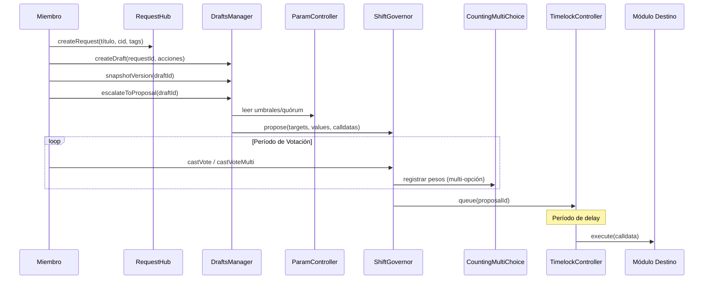
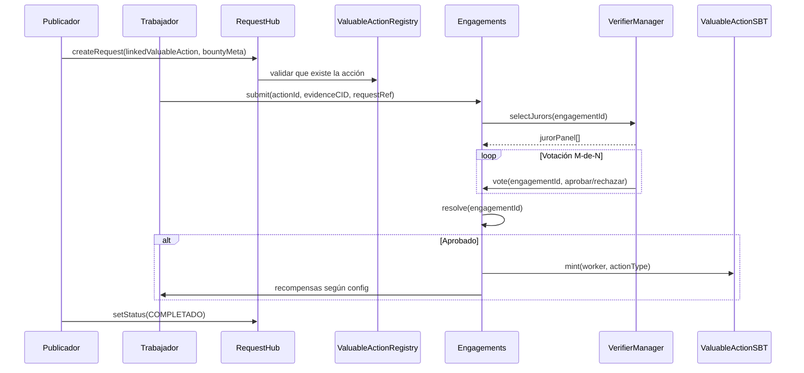
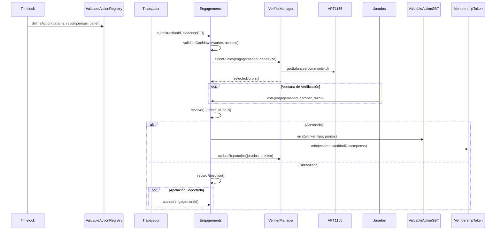
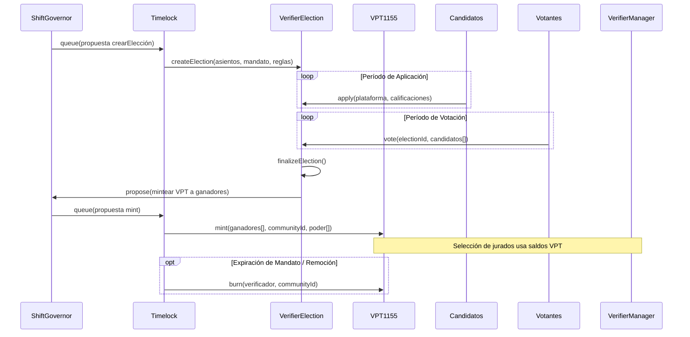
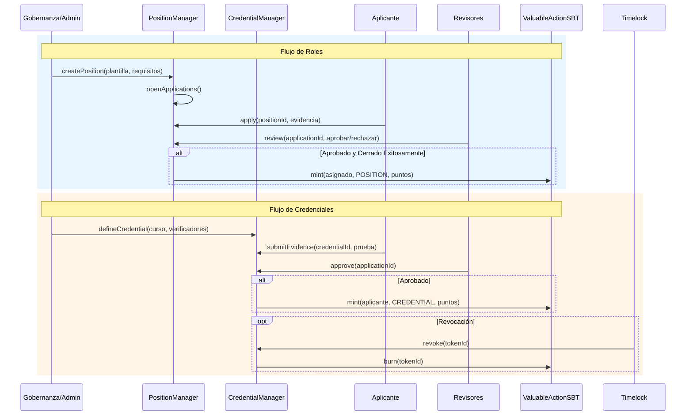
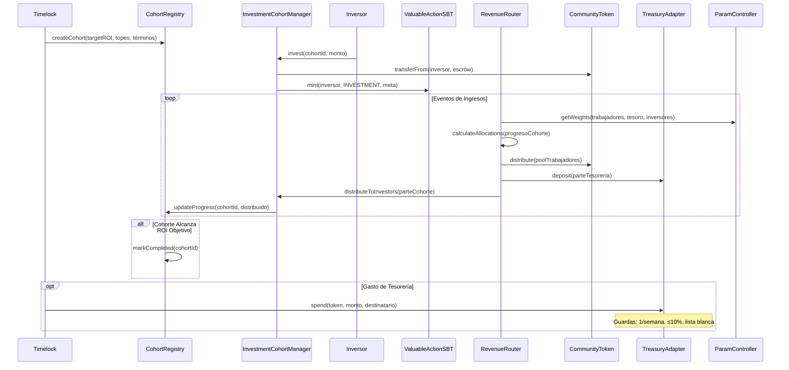
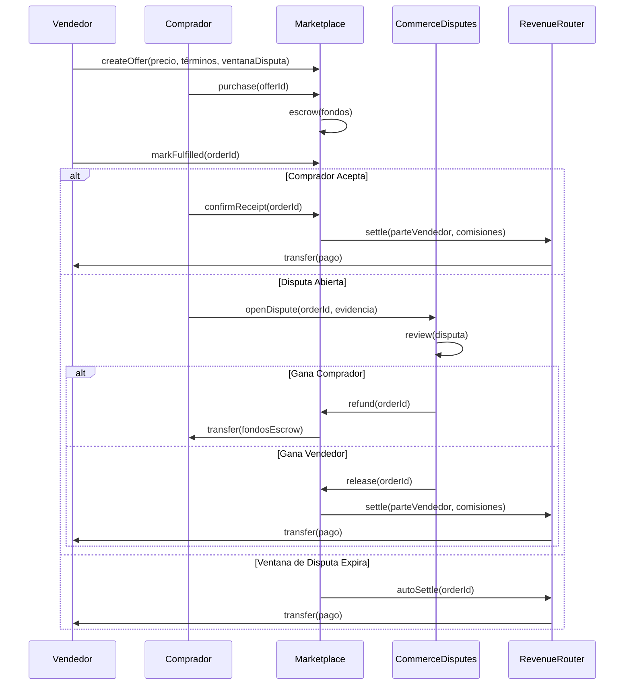
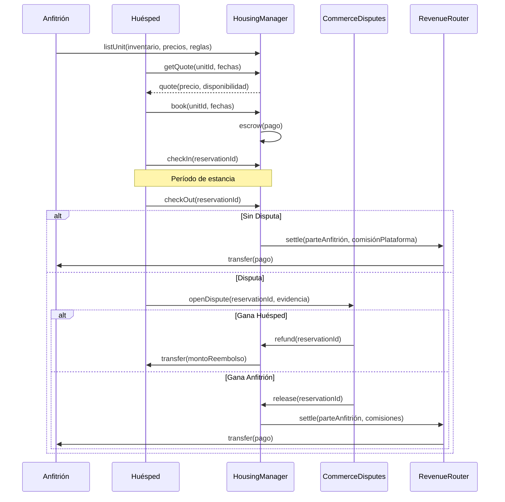
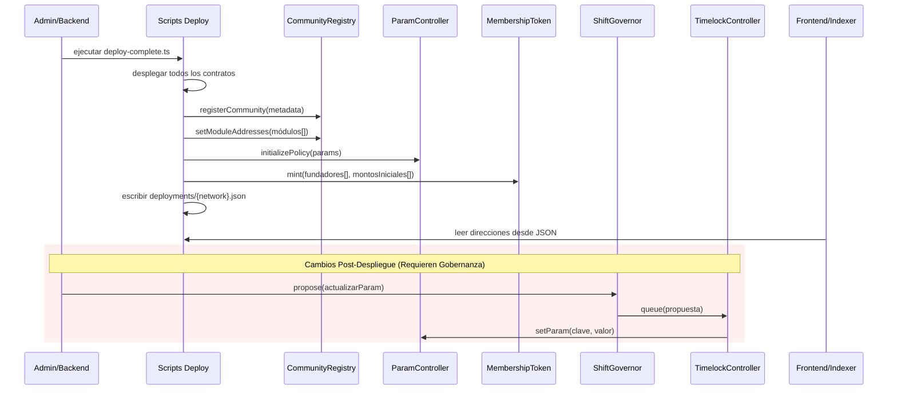

# Flujos Shift DeSoc

Esta guía recorre los procesos principales en Shift DeSoc, explicando cómo interactúan los miembros de la comunidad, trabajadores, inversores y administradores con el sistema. Ya seas un organizador comunitario buscando entender la gobernanza, un desarrollador planificando una integración, o un negocio evaluando Shift para tu organización, estos flujos describen lo que sucede en cada paso.

**Principios Clave**: Todas las acciones privilegiadas requieren aprobación comunitaria a través de la gobernanza. El contrato Timelock actúa como guardián final, asegurando que ninguna persona pueda hacer cambios críticos unilateralmente. Los parámetros económicos, reglas de tiempo y criterios de elegibilidad se gestionan centralmente a través de ParamController, haciendo el sistema predecible y auditable. Las disputas comerciales se manejan separadamente de la verificación de trabajo para mantener una responsabilidad clara.

---

## Gobernanza: De la Discusión Comunitaria a Decisiones Ejecutadas

La gobernanza en Shift sigue un camino deliberado desde la discusión abierta hasta la acción vinculante. Esto asegura que las decisiones reflejen un consenso comunitario genuino en lugar de reacciones apresuradas.

**Cómo funciona**: Cuando un miembro de la comunidad identifica una necesidad u oportunidad, comienza abriendo una discusión en el RequestHub. Esto puede ser cualquier cosa desde "Necesitamos mejor documentación" hasta "Cambiemos cómo se reparten los ingresos." Otros miembros pueden comentar, sugerir alternativas y refinar la idea colaborativamente.

Una vez que la discusión madura, los contribuidores pueden formalizarla en una propuesta borrador usando DraftsManager. Un borrador agrupa las acciones on-chain específicas necesarias para implementar la idea—qué contratos llamar, con qué parámetros. Los borradores pueden pasar por múltiples versiones mientras la comunidad refina el enfoque, con cada versión guardada para transparencia.

Cuando un borrador está listo para votación, escala a ShiftGovernor como propuesta formal. El sistema lee umbrales de votación y requisitos de quórum de ParamController, asegurando reglas consistentes en todas las propuestas. Los miembros votan usando su saldo de MembershipToken (ganado a través de contribuciones de trabajo verificadas). Para decisiones complejas con múltiples opciones, el módulo CountingMultiChoice permite votación ponderada entre alternativas.

Si la propuesta pasa, no se ejecuta inmediatamente. En su lugar, entra a una cola en TimelockController con un período de espera obligatorio. Esto da tiempo a la comunidad para prepararse para los cambios y proporciona una ventana de seguridad para detectar cualquier problema. Solo después del período de espera el Timelock ejecuta las acciones aprobadas, llamando a los contratos objetivo con los parámetros aprobados por la comunidad.

Todo este flujo asegura que ningún individuo—ni siquiera fundadores o administradores—pueda hacer cambios unilaterales a los sistemas críticos de la comunidad.

- Referencias: [Arquitectura](docs/ES/Architecture.md), [ShiftGovernor](docs/ES/contracts/ShiftGovernor.md), [CountingMultiChoice](docs/ES/contracts/CountingMultiChoice.md), [DraftsManager](docs/ES/contracts/DraftsManager.md), [ParamController](docs/ES/contracts/ParamController.md).

---

## Recompensas/Bounties: Conectando Necesidades Comunitarias con Contribuidores Capacitados

Los bounties conectan lo que las comunidades necesitan con quienes pueden entregarlo. En lugar de contratar por canales tradicionales, las comunidades pueden publicar tareas específicas vinculadas a sus estándares establecidos de verificación de trabajo.

**Cómo funciona**: Un miembro de la comunidad o administrador crea un bounty publicando una solicitud en RequestHub que enlaza a un tipo de ValuableAction predefinido. Por ejemplo, una comunidad podría tener un tipo de acción "Documentación Técnica" que especifica qué evidencia se requiere, cuántos verificadores revisan las entregas, y qué recompensas gana la completación exitosa.

Los trabajadores interesados en el bounty envían su trabajo a través del sistema Engagements, referenciando tanto la solicitud de bounty como el tipo de acción enlazado. Esta entrega incluye evidencia de completación—quizás enlaces a pull requests, borradores de documentación, o archivos entregables.

La entrega entonces sigue el proceso de verificación estándar (detallado en la sección de Verificación de Trabajo abajo). Un panel de verificadores electos por la comunidad revisa la evidencia y vota sobre si el trabajo cumple los estándares definidos. Si es aprobado, el trabajador recibe las recompensas configuradas: tokens de gobernanza que aumentan su poder de voto, credenciales de reputación, y potencialmente pago del fondo de bounty.

A lo largo de este proceso, los moderadores y la gobernanza pueden actualizar el estado de la solicitud—marcándola como en-progreso cuando el trabajo comienza, o completada cuando el bounty se cumple. Esto mantiene a la comunidad informada sobre qué necesidades han sido atendidas.

- Referencias: [RequestHub](docs/ES/contracts/RequestHub.md), [ValuableActionRegistry](docs/ES/contracts/ValuableActionRegistry.md), [Engagements](docs/ES/contracts/Engagements.md).

---

## Verificación de Trabajo: Cómo las Contribuciones se Convierten en Valor Reconocido

En el corazón de Shift está el principio de que el poder de gobernanza debe fluir de la contribución demostrada, no del capital. El Sistema de Poder de Verificador (VPS) hace esto real proporcionando un proceso transparente y controlado por la comunidad para validar el trabajo.

**Definiendo Qué Cuenta como Trabajo Valioso**: Antes de que alguien pueda enviar trabajo para verificación, la comunidad primero debe definir qué tipos de contribuciones valora. A través de la gobernanza, las comunidades crean definiciones de ValuableAction que especifican todo sobre una categoría de trabajo: qué evidencia se requiere, cuántos verificadores deben revisarla, cuál es el umbral de aprobación, cuánto dura la ventana de revisión, y qué recompensas gana la completación exitosa. Estas definiciones se almacenan en ValuableActionRegistry y solo pueden modificarse a través de la gobernanza.

**Enviando Trabajo para Revisión**: Cuando un trabajador completa una tarea, envía un engagement a través del contrato Engagements, adjuntando evidencia de su trabajo (típicamente como enlaces de contenido IPFS). El sistema primero valida que el trabajador sea elegible—verificando períodos de cooldown entre entregas y cualquier otra regla de elegibilidad definida para ese tipo de acción.

**El Panel de Verificación**: Una vez que una entrega es aceptada, el VerifierManager ensambla un panel de revisión. Los verificadores no son auto-designados—poseen VerifierPowerTokens (VPT) que fueron otorgados a través de la gobernanza comunitaria. El proceso de selección pondera a los verificadores por su saldo de VPT, lo que significa que los verificadores a quienes la comunidad ha otorgado más poder tienen más probabilidad de ser seleccionados para paneles.

**Revisión y Resolución**: Los verificadores seleccionados tienen una ventana de tiempo definida para revisar la evidencia y emitir sus votos. Cada verificador decide independientemente si el trabajo cumple los estándares de la comunidad. El sistema usa un umbral M-de-N—por ejemplo, 3 de 5 verificadores deben aprobar para que el trabajo pase.

**Resultados**: Si es aprobado, el trabajador recibe sus recompensas automáticamente: un ValuableActionSBT (token soulbound) documentando su contribución, MembershipTokens que aumentan su poder de voto en gobernanza, y potencialmente pagos en CommunityToken. Si es rechazado, el resultado se registra y pueden aplicar períodos de cooldown antes de que el trabajador pueda reenviar. Algunos tipos de acción soportan apelaciones para decisiones contestadas.

**Responsabilidad de Verificadores**: Los verificadores construyen reputación con el tiempo basada en si sus votos se alinean con los resultados del panel. Este sistema de responsabilidad—combinado con el hecho de que el poder de verificador viene de la gobernanza, no del staking—asegura que los verificadores estén incentivados a juzgar justamente en lugar de maximizar retornos personales.

- Referencias: [ValuableActionRegistry](docs/ES/contracts/ValuableActionRegistry.md), [Engagements](docs/ES/contracts/Engagements.md), [VerifierManager](docs/ES/contracts/VerifierManager.md), [VerifierPowerToken1155](docs/ES/contracts/VerifierPowerToken1155.md), [VerifierElection](docs/ES/contracts/VerifierElection.md), [ValuableActionSBT](docs/ES/contracts/ValuableActionSBT.md), [MembershipTokenERC20Votes](docs/ES/contracts/MembershipTokenERC20Votes.md).

---

## Elecciones de Verificadores: Construyendo un Panel de Revisión Confiable

Los verificadores son los guardianes de calidad de una comunidad. A diferencia de sistemas donde cualquiera puede hacer staking de tokens para convertirse en validador, Shift requiere que los verificadores sean electos por la comunidad. Esto asegura que el poder de verificación refleje la confianza comunitaria, no solo recursos financieros.

**Configurando una Elección**: El proceso comienza con una propuesta de gobernanza para crear o actualizar una elección. Esta propuesta especifica cuántos asientos de verificador están disponibles, la duración del mandato, requisitos de elegibilidad y reglas de votación. Una vez aprobada y ejecutada a través del Timelock, el contrato VerifierElection abre para aplicaciones.

**Aplicaciones de Candidatos**: Durante el período de aplicación, los miembros de la comunidad que quieren servir como verificadores envían su candidatura. Típicamente incluyen sus calificaciones, contribuciones pasadas y plataforma—explicando cómo abordarían el rol de verificación. Esta información ayuda a los votantes a tomar decisiones informadas.

**Votación Comunitaria**: Una vez que las aplicaciones cierran, el período de votación comienza. Los miembros de la comunidad usan sus tokens de gobernanza para votar por los candidatos en quienes confían para evaluar justamente las entregas de trabajo. La elección puede soportar varios mecanismos de votación dependiendo de cómo fue configurada.

**Finalizando Resultados y Otorgando Poder**: Cuando la votación concluye, la elección se finaliza y los candidatos ganadores son identificados. Una nueva propuesta de gobernanza entonces mintea VerifierPowerTokens (VPT) a los ganadores. Estos tokens son intransferibles—representan un otorgamiento de confianza comunitaria, no un activo comercializable.

**Responsabilidad Continua**: Los verificadores sirven por su mandato electo, durante el cual son llamados a servir en paneles de verificación basado en su saldo de VPT. Si un verificador consistentemente hace juicios pobres o viola estándares comunitarios, la gobernanza puede proponer removerlo y quemar su VPT. Cuando los mandatos expiran, nuevas elecciones pueden refrescar el roster de verificadores.

- Referencias: [VerifierElection](docs/ES/contracts/VerifierElection.md), [VerifierPowerToken1155](docs/ES/contracts/VerifierPowerToken1155.md), [VerifierManager](docs/ES/contracts/VerifierManager.md).

---

## Roles y Credenciales: Reconociendo Habilidades y Responsabilidades

Más allá de verificar trabajo individual, las comunidades necesitan formas de reconocer formalmente roles y credenciales. Shift proporciona dos sistemas complementarios: PositionManager para roles organizacionales y CredentialManager para habilidades y logros verificados.

**Roles Organizacionales con PositionManager**: Las comunidades a menudo tienen posiciones formales—líderes de proyecto, representantes, moderadores, embajadores—que vienen con responsabilidades y autoridades específicas. Cuando la comunidad necesita llenar un rol, la gobernanza o un administrador autorizado crea una posición definiendo sus requisitos, responsabilidades y proceso de aplicación.

**Aplicaciones y Selección**: Las personas interesadas envían aplicaciones durante la ventana abierta, proporcionando sus calificaciones y declaraciones de intención. Los revisores designados evalúan las aplicaciones y hacen selecciones basadas en los criterios de la comunidad. Esta revisión estructurada asegura que las posiciones se llenen basándose en mérito y ajuste en lugar de popularidad sola.

**Reconocimiento Soulbound**: Cuando alguien es seleccionado para una posición, recibe un SBT de tipo Posición. Este token intransferible sirve como verificación on-chain de su rol. Otros contratos y sistemas pueden verificar estos SBTs para habilitar acceso, permisos u otros beneficios asociados con la posición. Cuando una posición termina, el SBT puede ser quemado o marcado como expirado.

**Credenciales de Habilidad con CredentialManager**: Para habilidades y logros, las comunidades pueden definir programas de credenciales con requisitos de verificación. Piénsalo como certificaciones profesionales pero gestionadas de forma transparente on-chain. Un programa de credencial especifica qué evidencia se necesita, quién puede verificarla, y si las credenciales expiran.

**Obtención y Verificación de Credenciales**: Los aplicantes envían evidencia de sus calificaciones—esto podría ser trabajo completado, cursos tomados, evaluaciones pasadas, u otra documentación. Los verificadores designados (que pueden ser instructores, evaluadores certificados, o paneles de la comunidad) revisan las entregas y aprueban las que cumplen los estándares. Las credenciales aprobadas son minteadas como SBTs de tipo Credencial.

**Gobernanza y Responsabilidad**: Ambos sistemas operan bajo supervisión de gobernanza. La gobernanza puede revocar credenciales si evidencia posterior muestra que fueron otorgadas inapropiadamente. Los parámetros como períodos de cooldown y requisitos de elegibilidad pueden gestionarse a través de ParamController, manteniendo estas configuraciones consistentes con otras políticas comunitarias.

- Referencias: [PositionManager](docs/ES/contracts/PositionManager.md), [CredentialManager](docs/ES/contracts/CredentialManager.md), [ValuableActionSBT](docs/ES/contracts/ValuableActionSBT.md).

---

## Inversión e Ingresos: Financiamiento Sostenible con Retornos Justos

Shift proporciona un modelo de inversión estructurado que equilibra atraer capital con proteger los intereses de la comunidad. En lugar de propiedad indefinida de inversores, el sistema usa cohortes con retornos objetivo, asegurando que los inversores estén incentivados a apoyar el crecimiento de la comunidad mientras eventualmente reducen su parte a medida que logran sus retornos.

**Entendiendo las Cohortes de Inversión**: Las comunidades organizan inversiones en cohortes—grupos de inversores que ingresaron bajo los mismos términos. Cada cohorte tiene un ROI (retorno sobre inversión) objetivo, topes de inversión, y otros términos definidos a través de gobernanza. Esto crea expectativas claras para todas las partes: los inversores saben qué retornos pueden esperar, y la comunidad sabe cuántos ingresos fluirán a los inversores antes de que completamente transicionen al tesoro comunitario.

**Proceso de Inversión**: Cuando un inversor quiere apoyar a la comunidad, se une a una cohorte abierta a través del InvestmentCohortManager. Su inversión es registrada, y pueden recibir un Investment SBT documentando su participación. Los fondos se mantienen en CommunityToken, que mantiene un respaldo 1:1 con USDC para estabilidad.

**Distribución de Ingresos**: Cuando la comunidad genera ingresos (de servicios de marketplace, cuotas de vivienda, u otras fuentes), el RevenueRouter distribuye estos fondos según pesos definidos por gobernanza. Típicamente, los ingresos fluyen a tres piscinas: compensación de trabajadores, el tesoro comunitario, e inversores. La parte de inversores se subdivide entre cohortes activas basándose en su saldo restante hasta el ROI objetivo.

**ROI Progresivo**: A medida que los inversores reciben distribuciones, su progreso hacia el ROI objetivo se rastrea. Una vez que una cohorte alcanza su retorno objetivo, se marca como completa y ya no recibe distribuciones. Esto significa que los intereses de inversores están alineados con el éxito de la comunidad—quieren que los ingresos crezcan para que puedan alcanzar su objetivo más rápido, pero no tienen incentivo para extraer valor indefinidamente.

**Gestión del Tesoro con Salvaguardas**: Los fondos que fluyen al tesoro comunitario son gestionados a través del TreasuryAdapter, que impone reglas estrictas configuradas vía gobernanza: no más de un gasto por semana, no más del 10% del saldo de cualquier token por gasto, solo stablecoins aprobadas, y caminos de retiro de emergencia. Estas salvaguardas protegen contra tanto actores maliciosos como decisiones apresuradas.

- Referencias: [CohortRegistry](docs/ES/contracts/CohortRegistry.md), [InvestmentCohortManager](docs/ES/contracts/InvestmentCohortManager.md), [RevenueRouter](docs/ES/contracts/RevenueRouter.md), [CommunityToken](docs/ES/contracts/CommunityToken.md), [TreasuryAdapter-Spec-v1](docs/ES/TreasuryAdapter-Spec-v1.md), [ParamController](docs/ES/contracts/ParamController.md), [Tokenomics](docs/ES/Tokenomics.md).

---

## Órdenes de Marketplace y Disputas: Comercio Seguro dentro de la Comunidad

El Marketplace permite a los miembros de la comunidad comprar y vender servicios o productos con protecciones incorporadas. Crucialmente, las transacciones comerciales se mantienen separadas del sistema de verificación de trabajo—el marketplace es para comercio, mientras que ValuableActions y Claims manejan reconocimiento de contribuciones.

**Creando Ofertas**: Los vendedores listan sus ofertas especificando precios, términos de entrega, y la duración de la ventana de disputas. Esta información se almacena on-chain, creando términos claros y verificables que ambas partes pueden referenciar si surgen desacuerdos.

**El Rol del Escrow**: Cuando un comprador compra una oferta, el pago va a escrow—retenido por el contrato Marketplace en lugar de ser transferido directamente al vendedor. Esto protege a los compradores asegurando que pueden obtener un reembolso si el vendedor no entrega, mientras también asegura a los vendedores que el pago existe y será liberado tras cumplimiento exitoso.

**Cumplimiento y Aceptación**: Después de que el vendedor entrega el producto o servicio, marca la orden como cumplida. El comprador entonces revisa lo que recibió. Si está satisfecho, confirma recepción, lo cual dispara la liquidación—los fondos fluyen al vendedor a través del RevenueRouter, con cualquier comisión de plataforma deducida según la configuración de la comunidad.

**Ventana de Disputas**: Si el comprador no está satisfecho, puede abrir una disputa durante la ventana designada. Esto congela los fondos en escrow mientras el proceso de disputa se desarrolla. Después de que la ventana de disputas expira sin disputa, los fondos se auto-liquidan al vendedor.

**Resolución de Disputas**: Las disputas son manejadas por el contrato CommerceDisputes, que opera separadamente del sistema de Claims. Los resultados de disputas son binarios: o el comprador es reembolsado, o el vendedor recibe el pago. No hay resultados parciales en v1, aunque comunidades futuras podrían implementar mecanismos de mediación más matizados.

**Por Qué Comercio ≠ Verificación de Trabajo**: El sistema deliberadamente mantiene el comercio separado de la verificación de contribuciones. Comprar un servicio es una transacción de mercado donde el comprador evalúa el valor subjetivamente. La verificación de trabajo es un proceso de evaluación estructurado donde los verificadores miden las contribuciones contra estándares comunitarios. Mantenerlos separados preserva la integridad de ambos sistemas.

- Referencias: [Marketplace](docs/ES/contracts/Marketplace.md), [Marketplace-Spec-v1](docs/ES/Marketplace-Spec-v1.md), [CommerceDisputes](docs/ES/contracts/CommerceDisputes.md), [RevenueRouter](docs/ES/contracts/RevenueRouter.md).

---

## Reservas de Vivienda: Gestión de Espacios Compartidos de la Comunidad

Muchas comunidades gestionan recursos de vivienda compartidos—ya sea espacio para invitados, instalaciones de co-living, o propiedades de vacaciones. HousingManager proporciona un sistema de reservas completo con precios, disponibilidad, escrow y resolución de disputas.

**Listado de Propiedades**: Los anfitriones (ya sean propietarios individuales o la comunidad misma) listan sus unidades con inventario, información de precios, y reglas de reserva. El sistema puede manejar precios dinámicos basados en temporadas, demanda u otros factores configurados por la comunidad.

**Cotización y Reserva**: Los huéspedes pueden consultar cotizaciones para fechas específicas, recibiendo precios claros y confirmación de disponibilidad antes de comprometerse. Cuando reservan, el pago se escrow—protegiendo tanto a huéspedes como a anfitriones asegurando que los fondos están disponibles pero no liberados prematuramente.

**Gestión de Estancias**: El ciclo de reserva incluye puntos de check-in y check-out. Estos momentos disparan lógica importante: el check-in confirma que la estancia comenzó, y el check-out inicia la liquidación. Este flujo estructurado crea puntos claros donde cualquiera de las partes puede señalar problemas.

**Manejo de Disputas**: Si un huésped encuentra problemas—la unidad no coincidía con la descripción, los servicios no funcionaban, u otros asuntos—pueden abrir una disputa a través de CommerceDisputes. El proceso de resolución sigue el mismo patrón binario que las disputas de marketplace: o el huésped recibe un reembolso, o el anfitrión recibe el pago completo.

**Distribución de Ingresos**: Las estancias exitosas fluyen a través del RevenueRouter, que aplica cualquier comisión de plataforma y distribuye los ingresos según la configuración de la comunidad. Para propiedades de propiedad comunitaria, los ingresos podrían fluir al tesoro; para propiedades de propiedad individual, los anfitriones reciben su parte directamente.

**Descuentos para Trabajadores**: Las comunidades pueden configurar descuentos para miembros que han contribuido trabajo—reconocido a través de sus ValuableActionSBTs. Esto crea beneficios tangibles por participación comunitaria más allá de tokens de gobernanza.

- Referencias: [HousingManager](docs/ES/contracts/HousingManager.md), [HousingManager-Spec-v1](docs/ES/HousingManager-Spec-v1.md), [CommerceDisputes](docs/ES/contracts/CommerceDisputes.md).

---

## Creación y Configuración de Comunidad: Lanzando Tu Organización

Crear una nueva comunidad Shift despliega una suite completa de contratos inteligentes preconfigurados para trabajar juntos. El proceso está optimizado para costo y confiabilidad, con gestión automatizada de direcciones que simplifica la integración.

**El Proceso de Despliegue**: La creación de comunidad típicamente ocurre a través de una API backend en lugar de transacciones directas en blockchain. Este enfoque permite desplegar la suite completa de más de 20 contratos de manera confiable mientras mantiene los costos bajos—aproximadamente $0.19 en la testnet de Base Sepolia, proyectando alrededor de $10 para despliegue en Base mainnet.

**Registro de Comunidad**: Una vez que los contratos se despliegan, el CommunityRegistry registra la metadata de la comunidad y las direcciones de los módulos. Esto crea un directorio central donde cualquier sistema puede buscar qué contratos pertenecen a qué comunidad. El ParamController se inicializa con la política de gobernanza de la comunidad—duraciones de votación, reglas de elegibilidad, divisiones económicas, y otros parámetros que dan forma a cómo opera la comunidad.

**Bootstrap de Gobernanza**: Cada nueva comunidad necesita distribución inicial de tokens de gobernanza para habilitar la toma de decisiones. Típicamente, los fundadores reciben MembershipTokens iniciales, dándoles poder de voto para las primeras propuestas. Esto resuelve el problema de bootstrap: ¿cómo puede una comunidad tomar decisiones gobernadas antes de que nadie haya ganado tokens a través del trabajo?

**Gestión de Direcciones**: Los scripts de despliegue escriben automáticamente todas las direcciones de contratos a archivos JSON (`deployments/{network}.json` y `deployments/latest.json`). Los frontends e indexers leen de estos archivos, lo que significa que no hay direcciones hardcodeadas en el código de la aplicación. Cuando los contratos se actualizan o redeployan, actualizar los archivos JSON propaga los cambios a todas las aplicaciones consumidoras.

**Evolución Controlada por Gobernanza**: Después del despliegue, todos los cambios significativos deben fluir a través de la gobernanza. ¿Quieres ajustar la duración de votación? Propón un cambio a través del ShiftGovernor. ¿Necesitas actualizar el poder de verificador? La propuesta debe ser aprobada y ejecutada a través del Timelock. Esta consistencia asegura que las comunidades siempre puedan rastrear quién decidió qué y cuándo.

**Integrando con Tu Organización**: Las organizaciones que adoptan Shift pueden mapear su estructura existente al sistema. Los comités se convierten en paneles de verificación. Los ciclos presupuestarios se convierten en períodos de distribución del tesoro. Las revisiones de desempeño se convierten en entregas de ValuableAction. La flexibilidad viene de configurar parámetros—los flujos centrales permanecen consistentes mientras los detalles se adaptan a las necesidades de cada comunidad.

- Referencias: [Architecture](docs/ES/Architecture.md), [CommunityRegistry](docs/ES/contracts/CommunityRegistry.md), [ParamController](docs/ES/contracts/ParamController.md), [deployments/README](deployments/README.md), [deploy-complete.ts](scripts/deploy-complete.ts).
