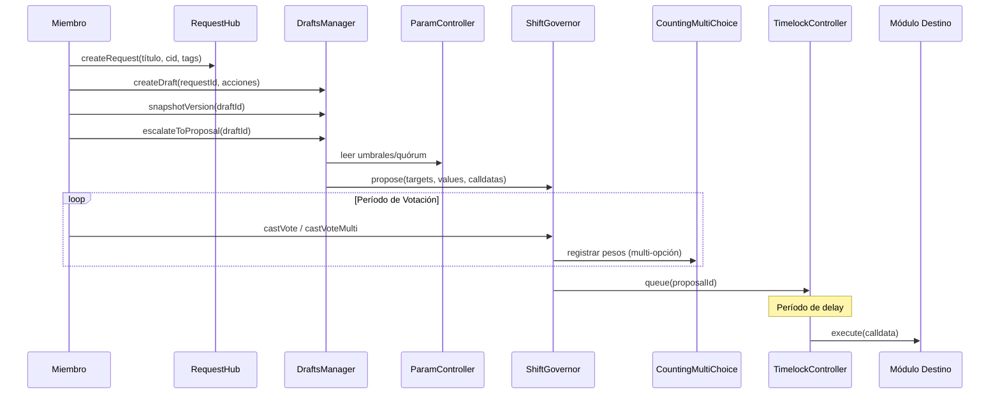
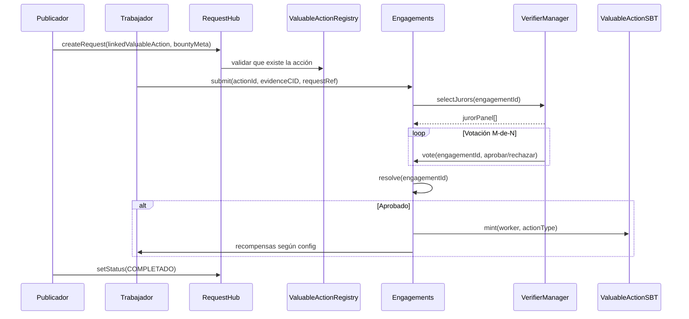
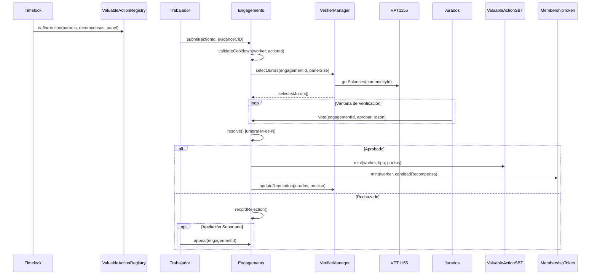
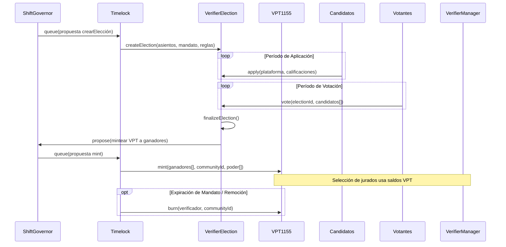
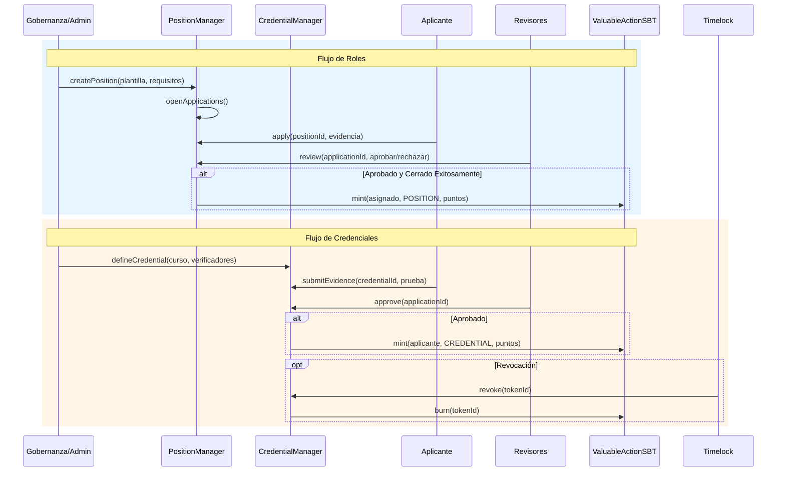
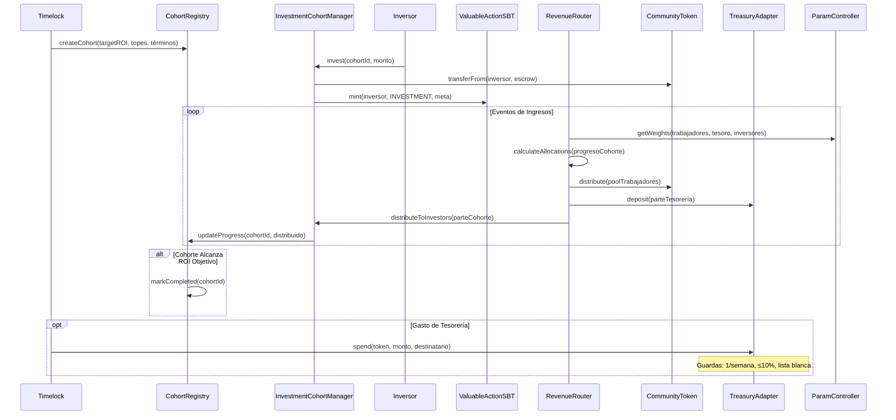
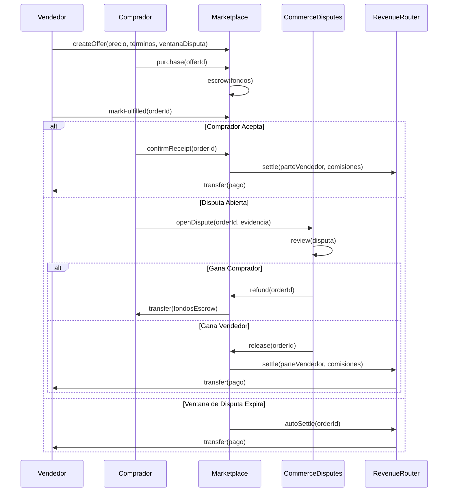
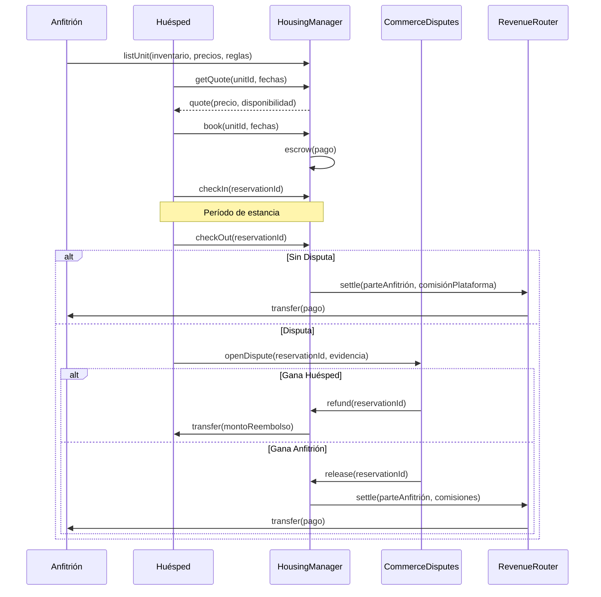
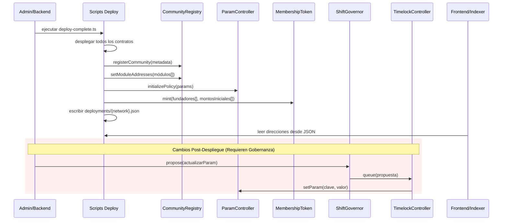

# Flujos Shift DeSoc

Propósito: guía rápida y orientada a implementación de los ciclos principales. Guardas: Timelock es la única autoridad privilegiada; ParamController es la única fuente de política; el poder de verificador se otorga por gobernanza (sin staking); las salvaguardas de TreasuryAdapter se mantienen (≤1 gasto/semana, ≤10% por token, lista blanca de stablecoins, pausa/ruta de emergencia); las disputas de comercio son separadas de la verificación de trabajo.

## Gobernanza: Request → Draft → Propuesta → Voto → Timelock → Ejecución
- Alcance: Coordinación comunitaria y ejecución de decisiones. Módulos: CommunityRegistry, RequestHub, DraftsManager, ShiftGovernor, CountingMultiChoice, TimelockController, ParamController.
- Flujo: (1) Miembro abre discusión en RequestHub (etiquetas, estado). (2) DraftsManager agrupa acciones (targets/values/calldatas) y genera snapshots de versión. (3) El draft escala a propuesta (binaria o multi-opción) en ShiftGovernor; umbral/quórum se leen de ParamController. (4) La votación usa snapshots de MembershipToken; multi-opción via CountingMultiChoice. (5) Propuesta aprobada entra a TimelockController y ejecuta tras el delay. (6) Los módulos solo mutan cuando los llama TimelockController.

- Referencias: [docs/ES/Architecture.md](docs/ES/Architecture.md), [docs/ES/contracts/ShiftGovernor.md](docs/ES/contracts/ShiftGovernor.md), [docs/ES/contracts/CountingMultiChoice.md](docs/ES/contracts/CountingMultiChoice.md), [docs/ES/contracts/DraftsManager.md](docs/ES/contracts/DraftsManager.md), [docs/ES/contracts/ParamController.md](docs/ES/contracts/ParamController.md).

## Recompensas/Bounties (RequestHub + Acciones Valiosas)
- Alcance: Bounties ligeros vinculados a definiciones de ValuableAction. Módulos: RequestHub, ValuableActionRegistry, Engagements.
- Flujo: (1) Publicador crea entrada en RequestHub con `linkedValuableAction` y metadatos opcionales de bounty. (2) Trabajadores envían engagements referenciando request/acción. (3) La verificación usa el flujo VPS estándar abajo; pagos/recompensas siguen la configuración de la acción. (4) Los estados del Request se actualizan vía moderadores/gobernanza.

- Referencias: [docs/ES/contracts/RequestHub.md](docs/ES/contracts/RequestHub.md), [docs/ES/contracts/ValuableActionRegistry.md](docs/ES/contracts/ValuableActionRegistry.md), [docs/ES/contracts/Engagements.md](docs/ES/contracts/Engagements.md).

## Verificación de Trabajo (VPS: Engagements)
- Alcance: Envío de trabajo y verificación M-de-N. Módulos: ValuableActionRegistry, Engagements, VerifierManager, VerifierPowerToken1155, VerifierElection, ValuableActionSBT, MembershipTokenERC20Votes.
- Flujo: (1) La gobernanza define ValuableAction y parámetros de verificación (tamaño de panel, aprobaciones requeridas, cooldowns, recompensas) en ValuableActionRegistry vía Timelock. (2) El trabajador envía engagement con evidencia; Engagements valida cooldown/elegibilidad. (3) VerifierManager selecciona jurados usando pesos VPT; solo saldos VPT1155 minteados por gobernanza califican. (4) Jurados votan dentro de la ventana; el umbral M-de-N resuelve. (5) Aprobado: se mintea ValuableActionSBT (tipo específico), MembershipToken y opcionalmente CommunityToken según config. (6) Rechazado: se registra resultado; aplican cooldowns; apelación opcional si el módulo la permite. (7) La reputación de verificadores se actualiza; slashing solo vía rutas de gobernanza.

- Referencias: [docs/ES/contracts/ValuableActionRegistry.md](docs/ES/contracts/ValuableActionRegistry.md), [docs/ES/contracts/Engagements.md](docs/ES/contracts/Engagements.md), [docs/ES/contracts/VerifierManager.md](docs/ES/contracts/VerifierManager.md), [docs/ES/contracts/VerifierPowerToken1155.md](docs/ES/contracts/VerifierPowerToken1155.md), [docs/ES/contracts/VerifierElection.md](docs/ES/contracts/VerifierElection.md), [docs/ES/contracts/ValuableActionSBT.md](docs/ES/contracts/ValuableActionSBT.md), [docs/ES/contracts/MembershipTokenERC20Votes.md](docs/ES/contracts/MembershipTokenERC20Votes.md).

## Elecciones de Verificadores (VPT)
- Alcance: Roster de verificadores y otorgamiento de poder controlados por gobernanza. Módulos: VerifierElection, VerifierPowerToken1155, ShiftGovernor/Timelock.
- Flujo: (1) Propuesta crea/actualiza parámetros de elección (asientos, mandato) vía Timelock. (2) Candidatos aplican según reglas de la elección. (3) La comunidad vota; se finalizan ganadores mediante acción aprobada por Timelock. (4) Timelock mintea/quema poder VPT1155 a ganadores/remociones. (5) VerifierManager usa saldos VPT activos para selección de jurados; el poder expira por remoción de gobernanza o lógica de mandato.

- Referencias: [docs/ES/contracts/VerifierElection.md](docs/ES/contracts/VerifierElection.md), [docs/ES/contracts/VerifierPowerToken1155.md](docs/ES/contracts/VerifierPowerToken1155.md), [docs/ES/contracts/VerifierManager.md](docs/ES/contracts/VerifierManager.md).

## Roles y Credenciales
- Alcance: Asignación de roles y emisión de credenciales/cursos. Módulos: PositionManager, CredentialManager, ValuableActionSBT.
- Flujo (Roles): (1) Gobernanza o rol autorizado crea plantilla de posición y abre aplicaciones. (2) Aplicantes envían; revisores aprueban/rechazan. (3) En asignación/cierre exitoso se mintea SBT de tipo POSITION; cierres fallidos no mintean. (4) Parámetros (cooldowns, límites) se leen de ParamController donde aplique.
- Flujo (Credenciales): (1) Se define curso/credencial con requisitos de verificador. (2) Aplicante envía evidencia; verificadores designados aprueban. (3) Aprobado mintea SBT de tipo CREDENTIAL; la gobernanza puede revocar si está permitido. (4) Apelaciones/revocaciones siguen reglas del módulo y Timelock cuando son privilegiadas.

- Referencias: [docs/ES/contracts/PositionManager.md](docs/ES/contracts/PositionManager.md), [docs/ES/contracts/CredentialManager.md](docs/ES/contracts/CredentialManager.md), [docs/ES/contracts/ValuableActionSBT.md](docs/ES/contracts/ValuableActionSBT.md).

## Inversión e Ingresos (Cohortes + Router)
- Alcance: Alta de inversores, seguimiento de ROI objetivo, distribuciones en cascada. Módulos: CohortRegistry, InvestmentCohortManager, RevenueRouter, CommunityToken, TreasuryAdapter, ParamController.
- Flujo: (1) La gobernanza define términos de cohorte (ROI objetivo, topes) vía Timelock en CohortRegistry. (2) Inversores se unen a cohortes mediante InvestmentCohortManager; el metadato de Investment SBT se registra en ValuableActionSBT cuando aplique. (3) Los ingresos entran a RevenueRouter; las asignaciones siguen pesos gobernados (trabajadores/tesoro/inversores) y progreso de cohortes. (4) CommunityToken maneja mint/redención respaldada por USDC; salarios/reclamos referencian puntos SBT. (5) TreasuryAdapter aplica salvaguardas en gastos del tesoro (1/semana, ≤10% por token, lista blanca de stablecoins, pausa/retiro de emergencia). (6) ParamController permanece como única fuente para parámetros económicos.

- Referencias: [docs/ES/contracts/CohortRegistry.md](docs/ES/contracts/CohortRegistry.md), [docs/ES/contracts/InvestmentCohortManager.md](docs/ES/contracts/InvestmentCohortManager.md), [docs/ES/contracts/RevenueRouter.md](docs/ES/contracts/RevenueRouter.md), [docs/ES/contracts/CommunityToken.md](docs/ES/contracts/CommunityToken.md), [docs/ES/TreasuryAdapter-Spec-v1.md](docs/ES/TreasuryAdapter-Spec-v1.md), [docs/ES/contracts/ParamController.md](docs/ES/contracts/ParamController.md), [docs/ES/Tokenomics.md](docs/ES/Tokenomics.md).

## Órdenes de Marketplace y Disputas
- Alcance: Ofertas comerciales, escrow y disputas (separado de verificación de trabajo). Módulos: Marketplace, CommerceDisputes, RevenueRouter, TreasuryAdapter (ruta de pagos).
- Flujo: (1) Vendedor crea oferta (precio, términos, ventana de disputa). (2) Comprador compra; fondos quedan en escrow. (3) Vendedor marca cumplimiento; comprador acepta o abre disputa dentro de la ventana. (4) CommerceDisputes resuelve: reembolso al comprador o pago al vendedor (resultados binarios). (5) Liquidaciones usan RevenueRouter/ruta de tesoro según configuración; las salvaguardas de TreasuryAdapter aplican cuando se mueven fondos del tesoro. (6) Este flujo no usa Engagements/ValuableAction.

- Referencias: [docs/ES/contracts/Marketplace.md](docs/ES/contracts/Marketplace.md), [docs/ES/Marketplace-Spec-v1.md](docs/ES/Marketplace-Spec-v1.md), [docs/ES/contracts/CommerceDisputes.md](docs/ES/contracts/CommerceDisputes.md), [docs/ES/contracts/RevenueRouter.md](docs/ES/contracts/RevenueRouter.md).

## Reservas de Vivienda
- Alcance: Ciclo de reservas para productos de vivienda. Módulos: HousingManager, CommerceDisputes (para disputas), RevenueRouter.
- Flujo: (1) Anfitrión lista inventario; HousingManager calcula precio y disponibilidad. (2) Huésped reserva; fondos se manejan según reglas del módulo. (3) Check-in/out dispara liquidaciones; disputas van a CommerceDisputes (resultados binarios). (4) Compartición de ingresos vía RevenueRouter; salvaguardas de tesoro aplican cuando se mueven fondos del tesoro.

- Referencias: [docs/ES/contracts/HousingManager.md](docs/ES/contracts/HousingManager.md), [docs/ES/HousingManager-Spec-v1.md](docs/ES/HousingManager-Spec-v1.md), [docs/ES/contracts/CommerceDisputes.md](docs/ES/contracts/CommerceDisputes.md).

## Creación y Configuración de Comunidad
- Alcance: Despliegue y cableado de una instancia comunitaria. Módulos: scripts de despliegue, CommunityRegistry, ParamController, ShiftGovernor, TimelockController, JSON de direcciones de módulos.
- Flujo: (1) Backend despliega la suite completa (scripts/API) y escribe deployments/{network}.json + deployments/latest.json. (2) CommunityRegistry registra direcciones de módulos y metadata; ParamController se inicializa con política. (3) La distribución inicial de governance tokens se configura (p. ej., fundadores) según el script. (4) Cambios posteriores (parámetros, poder de verificador, módulos) deben pasar por ShiftGovernor → TimelockController. (5) Frontend/indexer leen direcciones desde los JSON; no hay direcciones hardcodeadas en contratos.

- Referencias: [docs/ES/Architecture.md](docs/ES/Architecture.md), [docs/ES/contracts/CommunityRegistry.md](docs/ES/contracts/CommunityRegistry.md), [docs/ES/contracts/ParamController.md](docs/ES/contracts/ParamController.md), [deployments/README.md](deployments/README.md), [scripts/deploy-complete.ts](scripts/deploy-complete.ts).
