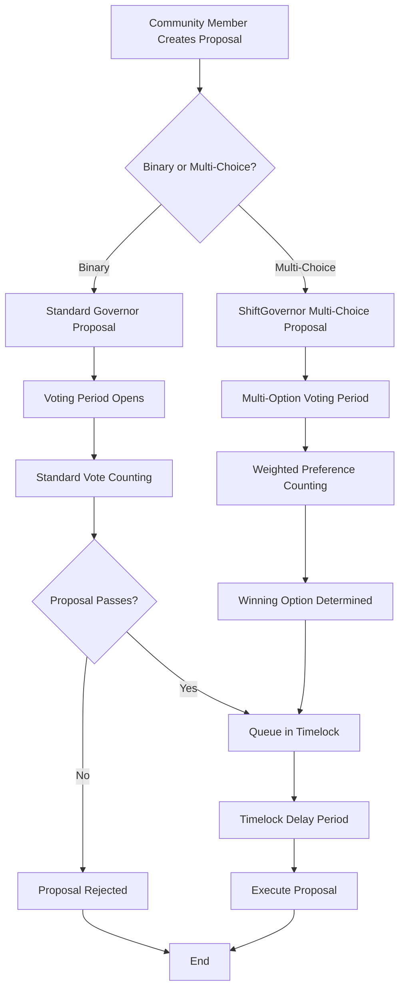
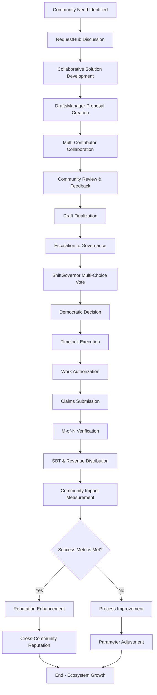
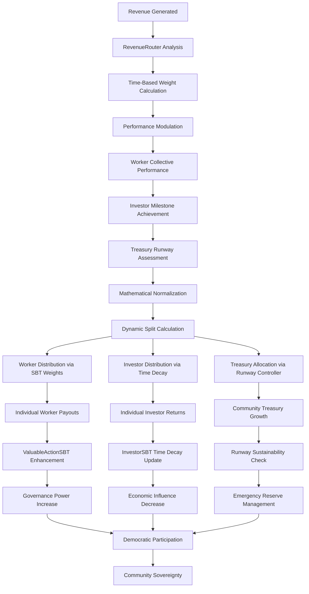
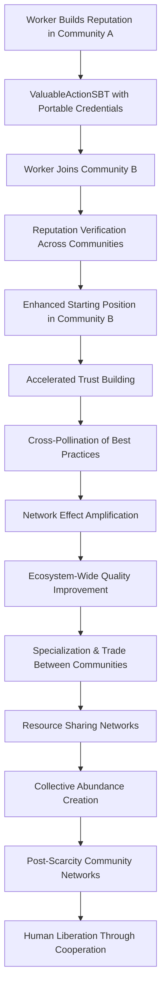
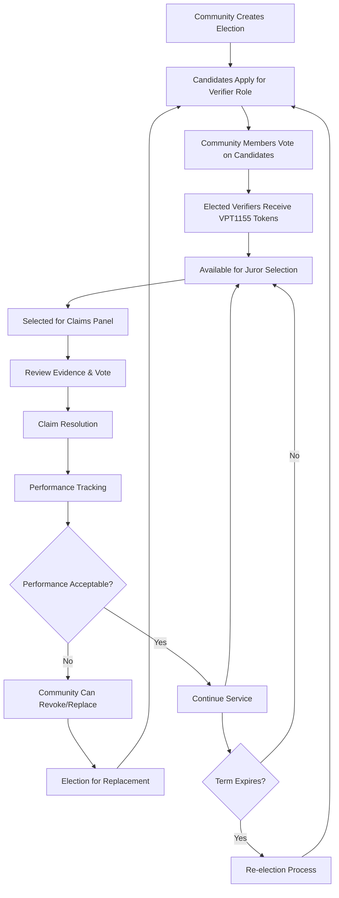

# Shift DeSoc System Architecture

This document provides a high-level overview of Shift DeSoc's system architecture, component interactions, and data flow patterns for both technical and business stakeholders.

## 🏗️ System Overview

**Shift DeSoc is meta-governance technology** - a flexible infrastructure that enables communities to model any organizational structure they choose. Rather than imposing a specific governance model, Shift provides the building blocks (governance protocols, work verification systems, and economic mechanisms) that communities can configure to implement their unique decision-making processes, value definitions, and coordination patterns.

Shift implements a **modular, blockchain-native architecture** designed for scalability, security, and upgradability. The platform consists of interconnected smart contracts that manage governance, work verification, and economic incentives.

### Core Design Principles

1. **Modularity**: Independent contracts that can be upgraded separately
2. **Composability**: Standard interfaces enable ecosystem integration
3. **Security**: Multi-layer security with economic incentives and timelock protection
4. **Scalability**: Layer 2 deployment with efficient gas usage patterns
5. **Transparency**: All operations verifiable on-chain with rich event logs

## 🎯 Current Status: Production-Ready MVP (December 2025)

**✅ PRODUCTION DEPLOYED**: Complete ecosystem successfully deployed and verified on Base Sepolia with operational community.

**Key Achievements:**

- **Complete Contract Suite**: All 22 contracts deployed and verified on Base Sepolia
- **API-Based Community Creation**: Scalable deployment system with JSON address management (~$0.19 per community vs $9,600 on Ethereum)
- **Real Deployments Verified**: Community ID 1 successfully operating on Base Sepolia with full configuration
- **Comprehensive Documentation**: 20 contracts fully documented with technical architecture and business value
- **Automated Address Management**: Deployment addresses auto-saved to deployments/{network}.json files
- **Production-Ready Infrastructure**: Complete deployment scripts, verification tools, and Base mainnet optimization (0.05 gwei gas)

**Target Networks:** Base (primary - optimized), Ethereum (secondary), with Base Sepolia for testing

**Deployed Contract Suite (22 contracts):**
- **Core Infrastructure**: CommunityRegistry, ParamController
- **Governance System**: ShiftGovernor, TimelockController, CountingMultiChoice, MembershipTokenERC20Votes
- **Work Verification**: VerifierPowerToken1155, VerifierElection, VerifierManager, ValuableActionRegistry, Claims, ValuableActionSBT
- **Economic Layer**: CommunityToken, CohortRegistry, RevenueRouter, TreasuryAdapter
- **Community Modules**: RequestHub, DraftsManager, CommerceDisputes, Marketplace, HousingManager, ProjectFactory

## 🔗 Complete System Architecture

### **Layer 1: Community Coordination Infrastructure**

```
┌─────────────────────────────────────────────────────────────────────────────────────────────┐
│                                  COMMUNITY LAYER                                           │
├─────────────────────────────────────────────────────────────────────────────────────────────┤
│ ┌──────────────────┐  ┌─────────────────┐  ┌─────────────────┐  ┌─────────────────────────┐ │
│ │CommunityRegistry │◄─┤   RequestHub    ├──┤ DraftsManager   ├──┤   ParamController      │ │
│ │- Metadata        │  │- Discussions    │  │- Proposals      │  │- Dynamic Parameters    │ │
│ │- Parameters      │  │- Moderation     │  │- Collaboration  │  │- Governance Control    │ │
│ │- Module Registry │  │- Tagging        │  │- Version Ctrl   │  │- Emergency Override    │ │
│ │- Cross-Community │  │- Event Stream   │  │- Escalation     │  │- Migration Support     │ │
│ └──────────────────┘  └─────────────────┘  └─────────────────┘  └─────────────────────────┘ │
└─────────────────────────────────────────────────────────────────────────────────────────────┘
```

**Purpose**: Foundation for community coordination, discussion, and collaborative decision-making before formal governance.

**Core Components**:
- **CommunityRegistry**: Single source of truth for community metadata, parameters, and module addresses
- **RequestHub**: On-chain discussion forum for community needs and ideas
- **DraftsManager**: Collaborative proposal development with versioning and review
- **ParamController**: Dynamic parameter management with governance control

📖 **Detailed Documentation**:
- [CommunityRegistry](./contracts/CommunityRegistry.md) - Complete technical specification
- [RequestHub](./contracts/RequestHub.md) - Discussion and moderation system
- [DraftsManager](./contracts/DraftsManager.md) - Collaborative workflow details
- [ParamController](./contracts/ParamController.md) - Parameter management

**Key Workflow**: `Community Need → Discussion → Collaborative Draft → Review → Escalation to Governance`

### **Layer 2: Democratic Governance Engine**

```
┌─────────────────────────────────────────────────────────────────────────────────────────────┐
│                                 GOVERNANCE LAYER                                            │
├─────────────────────────────────────────────────────────────────────────────────────────────┤
│ ┌──────────────────┐  ┌───────────────────┐ ┌──────────────────┐  ┌───────────────────────┐ │
│ │  ShiftGovernor   │◄─┤CountingMultiChoice├─┤MembershipToken   │◄─┤    TimelockController │ │
│ │- Binary Voting   │  │- Multi-choice     │ │- Base Eligibility│  │- Execution Delays     │ │
│ │- Multi-choice    │  │- Weight Distrib   │ │- Delegation      │  │- Emergency Actions    │ │
│ │- Proposal Queue  │  │- Result Calc      │ │- SBT Enhancement │  │- Upgrade Protection   │ │
│ │- Integration Hub │  │- Events/Logs      │ │- Voting History  │  │- Role Management      │ │
│ └──────────────────┘  └───────────────────┘ └──────────────────┘  └───────────────────────┘ │
└─────────────────────────────────────────────────────────────────────────────────────────────┘
```

**Purpose**: Multi-choice democratic governance with timelock protection and nuanced decision-making.

**Core Components**:
- **ShiftGovernor**: OpenZeppelin Governor with multi-choice voting extensions
- **CountingMultiChoice**: Weighted multi-option vote counting mechanism
- **MembershipTokenERC20Votes**: Pure merit-based governance tokens
- **TimelockController**: Execution delays and emergency override protection

📖 **Detailed Documentation**:
- [ShiftGovernor](./contracts/ShiftGovernor.md) - Governance engine specification
- [CountingMultiChoice](./contracts/CountingMultiChoice.md) - Multi-choice voting mechanics
- [MembershipTokenERC20Votes](./contracts/MembershipTokenERC20Votes.md) - Token economics and minting
- OpenZeppelin TimelockController - Standard timelock implementation

**Key Workflow**: `Draft Escalation → Proposal Creation → Voting Period → Timelock Delay → Execution`

### **Layer 3: Work Verification & Merit System**

```
┌─────────────────────────────────────────────────────────────────────────────────────────────┐
│                              VERIFICATION LAYER                                            │
├─────────────────────────────────────────────────────────────────────────────────────────────┤
│ ┌──────────────────┐  ┌─────────────────┐  ┌─────────────────┐  ┌─────────────────────────┐ │
│ │ValuableActionReg │◄─┤     Claims      ├──┤ VerifierManager ├──┤  ValuableActionSBT     │ │
│ │- Work Categories │  │- Submissions    │  │- VPT Elections  │  │- Contribution Record   │ │
│ │- Evidence Specs  │  │- M-of-N Panels  │  │- Power Tokens   │  │- Reputation Score     │ │
│ │- Reward Params   │  │- Verification   │  │- Fraud Detect   │  │- Governance Multiplier│ │
│ │- Economic Model  │  │- Appeals        │  │- Term Limits    │  │- Revenue Weight       │ │
│ └──────────────────┘  └─────────────────┘  └─────────────────┘  └─────────────────────────┘ │
└─────────────────────────────────────────────────────────────────────────────────────────────┘
```

**Purpose**: Democratic work verification replacing economic bonding with community-elected verifiers.

**Core Components**:
- **ValuableActionRegistry**: Community-defined work categories with verification parameters
- **Claims**: Work submission and M-of-N verification workflow
- **VerifierPowerToken1155**: Democratic verifier selection via VPT tokens
- **VerifierElection**: Election management and fraud detection
- **VerifierManager**: M-of-N juror selection and performance tracking
- **ValuableActionSBT**: Soulbound reputation tokens with WorkerPoints

📖 **Detailed Documentation**:
- [ValuableActionRegistry](./contracts/ValuableActionRegistry.md) - Work category definitions
- [Claims](./contracts/Claims.md) - Verification workflow and appeals
- [VerifierPowerToken1155](./contracts/VerifierPowerToken1155.md) - Democratic verifier system
- [VerifierElection](./contracts/VerifierElection.md) - Election and fraud management
- [VerifierManager](./contracts/VerifierManager.md) - Juror selection mechanics
- [ValuableActionSBT](./contracts/ValuableActionSBT.md) - Reputation and merit tracking

**Key Workflow**: `Work Definition → Claim Submission → Verifier Selection → M-of-N Voting → SBT Minting → Rewards`

**Verifier Power System (VPS)**: Replaces traditional economic bonding with democratic elections - see detailed VPS architecture below.

### **Layer 4: Cohort-Based Economic Engine**

The VPT system replaces traditional economic bonding with community-controlled democratic elections. Each community can elect their own verifiers through transparent governance processes.

#### **Core VPT Architecture**

```solidity
contract VerifierPowerToken1155 {
    // Each community has its own token type for verifiers
    mapping(uint256 => CommunityVPTConfig) public communityConfigs;
    mapping(uint256 => mapping(address => uint256)) public verifierPowerBalances;

    struct CommunityVPTConfig {
        uint256 maxVerifiers;           // Maximum number of active verifiers
        uint256 termLength;             // How long verifiers serve (in seconds)
        uint256 minVotesToWin;          // Minimum votes needed to become verifier
        bool electionsActive;           // Whether community is currently accepting elections
        uint256 currentElectionId;      // Active election ID
    }

    function createVerifierElection(
        uint256 communityId,
        uint256 seats,
        uint64 termLength,
        string[] calldata candidateRequirements
    ) external returns (uint256 electionId);

    function applyForVerifier(
        uint256 electionId,
        string calldata platform,
        string calldata qualifications
    ) external;

    function voteInElection(
        uint256 electionId,
        address[] calldata preferredCandidates
    ) external;

    function finalizeElection(uint256 electionId) external;

    function mintVerifierTokens(
        address[] calldata winners,
        uint256 communityId,
        uint256[] calldata powerAmounts
    ) external;
}
```

#### **Democratic Election Process**

1. **Election Creation**: Community governance creates verifier elections with specific parameters
2. **Candidate Applications**: Community members apply with qualifications and platforms
3. **Community Voting**: All eligible community members vote for their preferred candidates
4. **Result Finalization**: Winners receive VPT1155 tokens granting verifier privileges
5. **Term Service**: Elected verifiers serve for the specified term length
6. **Performance Monitoring**: Community can monitor and potentially remove underperforming verifiers
7. **Re-election**: Regular elections ensure ongoing community trust

#### **Fraud Detection & Accountability**

```solidity
contract VerifierElection {
    struct FraudReport {
        address reporter;
        address accused;
        uint256 claimId;            // Claim where fraud allegedly occurred
        string evidenceURI;         // IPFS evidence
        uint256 reportTime;
        bool resolved;
        bool fraudConfirmed;
    }

    function reportVerifierFraud(
        address verifier,
        uint256 claimId,
        string calldata evidenceURI
    ) external returns (uint256 reportId);

    function investigateFraud(
        uint256 reportId,
        bool fraudConfirmed,
        string calldata resolution
    ) external onlyGovernance;

    function removeVerifier(
        uint256 communityId,
        address verifier,
        string calldata reason
    ) external onlyGovernance;
}
```

### **Layer 4: Cohort-Based Economic Engine**

```
┌─────────────────────────────────────────────────────────────────────────────────────────────┐
│                                ECONOMIC LAYER                                              │
├─────────────────────────────────────────────────────────────────────────────────────────────┤
│ ┌──────────────────┐  ┌─────────────────┐  ┌─────────────────┐  ┌─────────────────────────┐ │
│ │  CohortRegistry  │◄─┤ RevenueRouter   ├──┤TreasuryAdapter  ├──┤   CommunityToken       │ │
│ │- Investment      │  │- Waterfall Dist │  │- Treasury Mgmt  │  │- 1:1 USDC Backing     │ │
│ │  Cohorts         │  │- Cohort Weights │  │- Spending Limits│  │- Revenue Settlement   │ │
│ │- Target ROI      │  │- Spillover Logic│  │- Multi-sig      │  │- Multi-Token Support  │ │
│ │- Auto Completion │  │- Worker Min Prot│  │- Audit Trail    │  │- Cross-Community     │ │
│ └──────────────────┘  └─────────────────┘  └─────────────────┘  └─────────────────────────┘ │
│                                     ▲                                                     │
│ ┌──────────────────┐                │                    ┌─────────────────────────────────┐ │
│ │   WorkerSBT      │────────────────┘                    │    ParamController         │ │
│ │- Investment SBTs │                                      │- Revenue Policy Control   │ │
│ │- Cohort Metadata │                                      │- Governance Parameters    │ │
│ │- Verification    │                                      │- Dynamic Configuration    │ │
│ │- Merit Tracking  │                                      │- Community-Specific Rules │ │
│ └──────────────────┘                                      └─────────────────────────────────┘ │
└─────────────────────────────────────────────────────────────────────────────────────────────┘
```

**Purpose**: Cohort-based revenue distribution with ROI guarantees and automated waterfall mechanics.

**Core Components**:
- **CohortRegistry**: Investment cohort tracking with Target ROI and automatic completion
- **RevenueRouter**: Waterfall distribution engine with cohort-weighted allocation
- **CommunityToken**: 1:1 USDC-backed programmable currency for payments
- **TreasuryAdapter**: Spending controls and multi-sig treasury management
- **ValuableActionSBT**: Investment SBT integration with cohort membership

📖 **Detailed Documentation**:
- [CohortRegistry](./contracts/CohortRegistry.md) - Cohort management and ROI tracking
- [RevenueRouter](./contracts/RevenueRouter.md) - Distribution mechanics and waterfall logic
- [CommunityToken](./contracts/CommunityToken.md) - USDC backing and salary system
- [TreasuryAdapter](./contracts/TreasuryAdapter.md) - Treasury controls and governance
- [TreasuryAdapter-Spec-v1.md](./TreasuryAdapter-Spec-v1.md) - Complete treasury specification
- [COHORT_MANAGEMENT.md](./COHORT_MANAGEMENT.md) - **Operations guide for managing cohorts**

**Key Workflow**: `Revenue Generation → Worker Pool (40%) → Treasury Reserve (25%) → Cohort Distribution (35%) → ROI Tracking → Auto-Completion`

### **Layer 5: Utility & Project Infrastructure**

```
┌─────────────────────────────────────────────────────────────────────────────────────────────┐
│                                UTILITY LAYER                                               │
├─────────────────────────────────────────────────────────────────────────────────────────────┤
│ ┌──────────────────┐  ┌─────────────────┐  ┌─────────────────┐  ┌─────────────────────────┐ │
│ │  ProjectFactory  │◄─┤  Marketplace    ├──┤ HousingManager  ├──┤   TreasuryAdapter      │ │
│ │- ERC-1155 Tokens │  │- Service Trade  │  │- Co-housing     │  │- Treasury Interface    │ │
│ │- Crowdfunding    │  │- Quality Verify │  │- Reservations   │  │- Spending Limits      │ │
│ │- Milestone Gates │  │- Reputation     │  │- Revenue Gen    │  │- Multi-sig Support    │ │
│ │- Investor Protct │  │- Cross-Community│  │- Worker Discts  │  │- Audit Trails        │ │
│ └──────────────────┘  └─────────────────┘  └─────────────────┘  └─────────────────────────┘ │
└─────────────────────────────────────────────────────────────────────────────────────────────┘
```

**Purpose**: Community-specific applications including marketplace, co-housing, and project crowdfunding.

**Core Components**:
- **Marketplace**: Decentralized commerce with escrow and dispute resolution
- **CommerceDisputes**: Dedicated dispute system for commercial transactions
- **HousingManager**: Co-housing coordination with reservations and pricing
- **ProjectFactory**: ERC-1155 crowdfunding with milestone validation
- **TreasuryAdapter**: Treasury interface for community spending

📖 **Detailed Documentation**:
- [Marketplace](./contracts/Marketplace.md) - Implementation details
- [Marketplace-Spec-v1.md](./Marketplace-Spec-v1.md) - **Complete marketplace specification**
- [CommerceDisputes](./contracts/CommerceDisputes.md) - Dispute resolution system
- [ARN-Disputes-Architecture.md](./ARN-Disputes-Architecture.md) - **Dispute system design**
- [HousingManager](./contracts/HousingManager.md) - Implementation details
- [HousingManager-Spec-v1.md](./HousingManager-Spec-v1.md) - **Complete housing specification**
- [ProjectFactory](./contracts/ProjectFactory.md) - Crowdfunding mechanics

**Key Workflows**:
- **Commerce**: `Offer Creation → Purchase → Escrow → Fulfillment → Settlement/Dispute`
- **Housing**: `Unit Listing → Reservation → Check-in → Stay → Check-out → Settlement`
- **Projects**: `Project Creation → Fundraising → Milestone Completion → Investor Returns`

## **CohortRegistry: Investment Cohort Management**

The CohortRegistry manages investment cohorts with immutable Target ROI guarantees and automatic completion tracking. It provides the foundation for predictable investor returns while ensuring long-term community sustainability:

```solidity
contract CohortRegistry {
    struct Cohort {
        uint256 id;
        uint256 communityId;
        uint16 targetRoiBps;     // e.g., 15000 = 150% Target ROI (immutable)
        uint64 createdAt;
        uint32 priorityWeight;   // Revenue distribution priority (1-1000)
        uint256 investedTotal;   // Total investment in this cohort
        uint256 recoveredTotal;  // Total revenue paid to cohort investors
        bool active;            // Active until Target ROI reached
        bytes32 termsHash;      // IPFS hash of immutable cohort terms
    }

    // Core state management
    mapping(uint256 => Cohort) public cohorts;
    mapping(uint256 => mapping(address => uint256)) public investedBy; // [cohortId][investor]
    mapping(uint256 => address[]) public cohortInvestors; // Efficient iteration
    mapping(uint256 => uint256[]) public activeCohorts;   // [communityId] => cohort IDs

    // Access control - community governance controls cohort creation
    address public timelock;           // Community governance (via TimelockController)
    address public revenueRouter;      // Revenue distribution executor
    address public valuableActionSBT;  // Investment SBT minting integration (formerly WorkerSBT)

    function createCohort(
        uint256 communityId,
        uint16 targetRoiBps,
        uint32 priorityWeight,
        string calldata termsURI
    ) external onlyTimelock returns (uint256 cohortId) {
        // Validation: Target ROI must be ≥ 100%, priority weight > 0
        if (targetRoiBps < 10000) revert Errors.InvalidInput("Target ROI must be >= 100%");
        if (priorityWeight == 0) revert Errors.InvalidInput("Priority weight must be > 0");

        cohortId = nextCohortId++;
        bytes32 termsHash = keccak256(abi.encodePacked(termsURI, block.timestamp));

        cohorts[cohortId] = Cohort({
            id: cohortId,
            communityId: communityId,
            targetRoiBps: targetRoiBps,        // IMMUTABLE after creation
            createdAt: uint64(block.timestamp),
            priorityWeight: priorityWeight,     // Governance can adjust via new cohorts
            investedTotal: 0,
            recoveredTotal: 0,
            active: true,
            termsHash: termsHash               // IMMUTABLE investment terms
        });

        activeCohorts[communityId].push(cohortId);
        emit CohortCreated(communityId, cohortId, targetRoiBps, priorityWeight, termsHash);
    }

    // Investment recording (called by ValuableActionSBT when minting Investment SBTs)
    function addInvestment(
        uint256 cohortId,
        address investor,
        uint256 amount
    ) external onlyValuableActionSBT {
        if (!cohorts[cohortId].active) revert Errors.InvalidInput("Cohort not active");

        // First investment by this investor in this cohort
        if (investedBy[cohortId][investor] == 0) {
            cohortInvestors[cohortId].push(investor);
        }

        investedBy[cohortId][investor] += amount;
        cohorts[cohortId].investedTotal += amount;

        emit InvestmentAdded(cohortId, investor, amount);
    }

    // Revenue tracking and automatic completion (called by RevenueRouter)
    function markRecovered(uint256 cohortId, uint256 amount) external onlyRevenueRouter {
        Cohort storage cohort = cohorts[cohortId];
        if (!cohort.active) revert Errors.InvalidInput("Cohort not active");

        cohort.recoveredTotal += amount;

        // Automatic completion when Target ROI reached
        uint256 targetTotal = cohort.investedTotal * cohort.targetRoiBps / 10000;
        if (cohort.recoveredTotal >= targetTotal) {
            cohort.active = false;
            _removeFromActiveCohorts(cohort.communityId, cohortId);
            emit CohortCompleted(cohortId, cohort.recoveredTotal);
        }

        emit CohortPaid(cohortId, amount, cohort.recoveredTotal);
    }

    // Weight calculation for revenue distribution
    function getCohortWeight(uint256 cohortId, bool useWeights) external view returns (uint256) {
        uint256 unrecovered = getUnrecoveredAmount(cohortId);
        if (unrecovered == 0) return 0;

        return useWeights ? unrecovered * cohorts[cohortId].priorityWeight : unrecovered;
    }

    // Remaining investment needed to reach Target ROI
    function getUnrecoveredAmount(uint256 cohortId) external view returns (uint256) {
        Cohort memory cohort = cohorts[cohortId];
        if (!cohort.active) return 0;

        uint256 targetTotal = cohort.investedTotal * cohort.targetRoiBps / 10000;
        return targetTotal > cohort.recoveredTotal ? targetTotal - cohort.recoveredTotal : 0;
    }
}
```

### **Investment SBT Integration with Cohorts**

Investment SBTs are a specialized subtype of ValuableActionSBT that provide on-chain credentials for investment participation while integrating seamlessly with the cohort revenue distribution system:

```solidity
// Investment metadata extends the base SBT system
struct InvestmentMeta {
    uint256 communityId;        // Community where investment was made
    uint256 cohortId;           // Specific cohort membership
    uint256 amountInvested;     // Investment amount for pro-rata calculations
    bytes32 termsHash;          // Snapshot of cohort terms at investment time
    uint64 investmentDate;      // Timestamp for historical tracking
    bool isInvestmentSBT;       // Flag for SBT subtype identification
}

// Extended ValuableActionSBT contract with investment functionality
contract ValuableActionSBT is ERC721URIStorage, AccessControl {
    // Investment-specific storage
    mapping(uint256 => InvestmentMeta) public investmentMetaOf;
    ICohortRegistry public cohortRegistry;

    // Investment SBT minting with automatic cohort registration
    function mintInvestmentSBT(
        address investor,
        uint256 communityId,
        uint256 cohortId,
        uint256 amount,
        string calldata evidenceURI
    ) external onlyRole(MINTER_ROLE) returns (uint256 sbtId) {
        // Validate cohort exists and is active
        ICohortRegistry.Cohort memory cohort = cohortRegistry.getCohort(cohortId);
        require(cohort.communityId == communityId, "Cohort mismatch");
        require(cohort.active, "Cohort not active");

        // Mint the Investment SBT
        sbtId = _mint(investor, evidenceURI);

        // Store investment metadata
        investmentMetaOf[sbtId] = InvestmentMeta({
            communityId: communityId,
            cohortId: cohortId,
            amountInvested: amount,
            termsHash: cohort.termsHash,        // Immutable terms snapshot
            investmentDate: uint64(block.timestamp),
            isInvestmentSBT: true
        });

        // Register investment with cohort (triggers revenue distribution eligibility)
        cohortRegistry.addInvestment(cohortId, investor, amount);

        emit InvestmentSBTMinted(investor, sbtId, communityId, cohortId, amount);
    }

    // Investment SBT identification and metadata access
    function isInvestmentSBT(uint256 tokenId) external view returns (bool) {
        return investmentMetaOf[tokenId].isInvestmentSBT;
    }

    function getInvestmentMeta(uint256 tokenId) external view returns (InvestmentMeta memory) {
        require(investmentMetaOf[tokenId].isInvestmentSBT, "Not an investment SBT");
        return investmentMetaOf[tokenId];
    }
```

## **ValuableAction Registry: Community Value Definition Engine**

The ValuableAction Registry serves as the democratic system where communities define **what work is valuable** and **what investment opportunities exist** through creating specific Valuable Actions ("Acciones Valorables") that contributors can complete. Unlike traditional job categorization systems, Valuable Actions are **community-configured economic instruments** that define how contributions translate into governance power (MembershipTokens), economic rewards (CommunityTokens), and reputation (SBTs).

### **Core ValuableAction Structure**

```solidity
contract ValuableActionRegistry {
    struct ValuableAction {
        // Economic Parameters
        uint32 membershipTokenReward;   // MembershipToken amount minted on completion
        uint32 communityTokenReward;    // CommunityToken amount earned for period salary calculation
        uint32 investorSBTReward;      // Investment SBT minting for cohort membership
        uint256 cohortId;              // Associated investment cohort for investor rewards

        // Verification Parameters
        uint32 jurorsMin;              // M (minimum approvals needed)
        uint32 panelSize;              // N (total jurors selected)
        uint32 verifyWindow;           // Time limit for jury decision
        uint32 verifierRewardWeight;   // Points earned by accurate verifiers
        uint32 slashVerifierBps;       // Penalty for inaccurate verification

        // Quality Control
        uint32 cooldownPeriod;         // Minimum time between claims of this type
        uint32 maxConcurrent;          // Maximum active claims per person
        bool revocable;                // Can community governance revoke this SBT
        uint32 evidenceTypes;          // Bitmask of required evidence formats

        // Governance Requirements
        uint256 proposalThreshold;     // Governance tokens needed to propose new Valuable Actions
        address proposer;              // Who proposed this Valuable Action
        bool requiresGovernanceApproval; // Whether this action needs community vote to activate

        // Metadata & Automation
        string evidenceSpecCID;        // IPFS: detailed evidence requirements
        string titleTemplate;          // Template for claim titles
        bytes32[] automationRules;     // Integration with external systems (GitHub, etc)

        // Time-Based Parameters
        uint64 activationDelay;        // Governance approval → active period
        uint64 deprecationWarning;     // Time before auto-deactivation
        bool founderVerified;          // Special status for community bootstrapping
    }

    // Founder Verification System (Bootstrap Security)
    mapping(address => mapping(uint256 => bool)) public founderWhitelist;  // founder → community → verified
    mapping(uint256 => address[]) public communityFounders;               // community → founder list

    function proposeValuableAction(
        uint256 communityId,
        ValuableActionParams calldata params
    ) external returns (uint256 actionId) {
        require(membershipToken.balanceOf(msg.sender) >= params.proposalThreshold, "Insufficient governance power to propose");

        // Create governance proposal for community approval
        if (params.requiresGovernanceApproval) {
            uint256 proposalId = _createGovernanceProposal(actionId, params);
            pendingActions[actionId] = proposalId;
        } else {
            // Activate immediately if no governance approval required
            _activateValuableAction(actionId, params);
        }

        emit ValuableActionProposed(valuableActionId, communityId, msg.sender, params.founderVerified);
    }

    function activateFromGovernance(uint256 valuableActionId, uint256 approvedProposalId) external {
        require(msg.sender == governor, "Only governance can activate");
        require(pendingValuableActions[valuableActionId] == approvedProposalId, "Proposal mismatch");

        isActive[valuableActionId] = true;

        emit ValuableActionActivated(valuableActionId, approvedProposalId);
    }
}
```

### **Economic Weight Configuration**

ValuableActions define the **conversion rates** between verified work and various forms of value:

```solidity
// Example ValuableAction configurations for different work types
struct ValuableActionExamples {
    // HIGH-IMPACT DEVELOPMENT (Senior Technical Work)
    ValuableAction seniorDevelopment = ValuableAction({
        membershipTokenReward: 100,     // 100 MembershipTokens per completion
        communityTokenReward: 50,       // High weight in period salary calculation
        investorSBTReward: 0,          // No investor reward for work actions
        jurorsMin: 3,                   // Requires 3 approvals (high quality bar)
        panelSize: 5,                   // From panel of 5 expert verifiers
        verifyWindow: 7 days,           // Complex work needs thorough review
        verifierRewardWeight: 15,       // High rewards for expert verification
        cooldownPeriod: 14 days,        // Quality over quantity
        evidenceTypes: CODE_REVIEW | DEPLOYMENT_PROOF | IMPACT_METRICS,
        proposalThreshold: 10000e18,    // Requires significant governance power to propose
        requiresGovernanceApproval: true // Community must vote to activate
    });

    // COMMUNITY MODERATION (Regular Contribution)
    ValuableAction moderation = ValuableAction({
        membershipTokenReward: 10,      // 10 MembershipTokens per completion
        communityTokenReward: 15,       // Moderate weight in salary calculation
        investorSBTReward: 0,          // No investor reward for work actions
        jurorsMin: 2,                   // Requires 2 approvals
        panelSize: 3,                   // From panel of 3 verifiers
        verifyWindow: 3 days,           // Faster turnaround for routine work
        verifierRewardWeight: 5,        // Standard verifier rewards
        cooldownPeriod: 1 days,         // Can be done regularly
        evidenceTypes: SCREENSHOT | ACTIVITY_LOG,
        proposalThreshold: 1000e18,     // Lower governance threshold to propose
        requiresGovernanceApproval: false // Can be activated immediately
    });

    // SEED INVESTMENT (Capital Contribution)
    ValuableAction seedInvestment = ValuableAction({
        membershipTokenReward: 1000,    // Significant governance power for investors
        communityTokenReward: 0,        // Investors don't participate in salary system
        investorSBTReward: 100,        // InvestorSBT for revenue sharing
        jurorsMin: 1,                   // Simple verification for USDC transfer
        panelSize: 2,                   // Minimal panel needed
        verifyWindow: 1 days,           // Quick verification
        evidenceTypes: USDC_TRANSFER_PROOF,
        maxCompletions: 1,             // Each investor can only do this once per round
        proposalThreshold: 5000e18,    // Moderate governance requirement
        requiresGovernanceApproval: true // Community must approve investment terms
    });
}
```

### **Integration with Merit Economy**

ValuableActions create the **mathematical foundation** for the entire merit-based economy:

```solidity
contract ValuableActionEconomicEngine {
    function processApprovedClaim(uint256 claimId, uint256 valuableActionId) external {
        ValuableAction memory valuableAction = registry.getValuableAction(valuableActionId);
        address claimant = claims.getClaimant(claimId);

        // 1. Mint governance power (MembershipToken)
        membershipToken.mintFromSBT(claimant, valuableAction.membershipTokenReward, "WORKER");

        // 2. Update salary earning rate (for CommunityToken claims)
        communityToken.increaseSalaryWeight(claimant, valuableAction.communityTokenReward);

        // 3. Mint ValuableActionSBT with embedded weights
        valuableActionSBT.mintWithValuableAction(claimant, valuableActionId, valuableAction.membershipTokenReward);

        // 4. Special handling for founder actions
        if (valuableAction.founderVerified && valuableAction.investorSBTReward > 0) {
            investorSBT.mintFromFounderWork(claimant, actionType.initialInvestorBonus);
            membershipToken.mintFromSBT(claimant, actionType.initialInvestorBonus, "INVESTOR");
        }

        // 5. Reward accurate verifiers
        address[] memory accurateVerifiers = claims.getAccurateVerifiers(claimId);
        for (uint i = 0; i < accurateVerifiers.length; i++) {
            valuableActionSBT.mintVerifierReward(accurateVerifiers[i], actionType.verifierRewardWeight);
        }
    }
}
```

### **Founder Verification System**

Critical security mechanism for community bootstrap phase:

```solidity
contract FounderVerificationSystem {
    struct FounderApplication {
        address applicant;
        uint256 communityId;
        string profileCID;          // IPFS: detailed founder profile
        string businessPlanCID;     // IPFS: community business plan
        uint256 initialStake;       // USDC committed to community
        address[] endorsers;        // Existing founder endorsements
        uint64 applicationDate;
        bool approved;
    }

    function applyForFounderStatus(
        uint256 communityId,
        string calldata profileCID,
        string calldata businessPlanCID,
        address[] calldata endorsers
    ) external payable returns (uint256 applicationId) {
        require(msg.value >= minimumFounderStake, "Insufficient founder stake");
        require(endorsers.length >= minimumEndorsements, "Insufficient endorsements");

        // Create application for community review
        applications[applicationId] = FounderApplication({
            applicant: msg.sender,
            communityId: communityId,
            profileCID: profileCID,
            businessPlanCID: businessPlanCID,
            initialStake: msg.value,
            endorsers: endorsers,
            applicationDate: uint64(block.timestamp),
            approved: false
        });

        emit FounderApplicationSubmitted(applicationId, msg.sender, communityId);
    }

    function approveFounder(uint256 applicationId) external {
        require(msg.sender == communityGovernance, "Only community governance");

        FounderApplication storage app = applications[applicationId];
        app.approved = true;

        // Grant special privileges
        founderWhitelist[app.applicant][app.communityId] = true;
        communityFounders[app.communityId].push(app.applicant);

        // Time-limited privileges (prevents permanent power concentration)
        founderExpirationTime[app.applicant][app.communityId] =
            block.timestamp + founderPrivilegeWindow;

        emit FounderApproved(applicationId, app.applicant, app.communityId);
    }
}
```

### **VPT Integration Benefits**

#### **Community Sovereignty**

- **Democratic Control**: Communities elect their own verifiers based on local trust and expertise
- **Cultural Alignment**: Verifiers understand community values and context
- **Accountability**: Underperforming verifiers can be replaced through governance
- **Accessibility**: No financial barriers to becoming a verifier (no bonds required)

#### **Quality Assurance**

- **Merit-Based Selection**: Communities choose verifiers based on qualifications, not wealth
- **Term Limits**: Regular elections prevent entrenchment and ensure fresh perspectives
- **Performance Monitoring**: Transparent tracking of verifier accuracy and behavior
- **Fraud Prevention**: Community oversight and reporting mechanisms

#### **Economic Sustainability**

- **No Capital Requirements**: Removes economic barriers that exclude qualified but less wealthy participants
- **Community Investment**: Verifiers are community members with stake in success
- **Reduced Costs**: No need to manage bonds, slashing, or economic penalties
- **Democratic Legitimacy**: Decisions backed by community consensus, not economic power

### **Data Flow: Complete Economic Lifecycle**

```
┌───────────────┐     ┌─────────────────┐     ┌──────────────────┐     ┌─────────────────┐
│  Community    │────▶│  Identify       │────▶│  Collaborative   │────▶│  Democratic     │
│  Discussion   │     │  Need/Project   │     │  Proposal Dev    │     │  Decision      │
└───────────────┘     └─────────────────┘     └──────────────────┘     └─────────────────┘
        │                        │                        │                        │
        ▼                        ▼                        ▼                        ▼
┌───────────────┐     ┌─────────────────┐     ┌──────────────────┐     ┌─────────────────┐
│RequestHub     │     │Problem/Solution │     │DraftsManager     │     │ShiftGovernor    │
│Events & Tags  │     │Definition       │     │Version Control   │     │Multi-Choice Vote│
└───────────────┘     └─────────────────┘     └──────────────────┘     └─────────────────┘
                                                        │                        │
                                                        ▼                        ▼
                ┌─────────────────┐     ┌──────────────────┐     ┌─────────────────┐
                │   Approved      │◄────┤   Governance     │────▶│  Timelock       │
                │   Work Plan     │     │   Approval       │     │  Execution      │
                └─────────────────┘     └──────────────────┘     └─────────────────┘
                        │                                                  │
                        ▼                                                  ▼
                ┌─────────────────┐     ┌──────────────────┐     ┌─────────────────┐
                │Workers Submit   │────▶│  M-of-N Peer     │────▶│SBT Minting &    │
                │Claims w/Evidence│     │  Verification    │     │Revenue Sharing  │
                └─────────────────┘     └──────────────────┘     └─────────────────┘
```

## **CommunityToken: Merit-Based Salary System**

The CommunityToken implements a sophisticated **periodic salary system** where community members earn based on their accumulated merit (SBT weights) rather than traditional hourly wages. This creates a sustainable economic model that rewards long-term contribution over short-term extraction.

### **Core Salary Architecture**

```solidity
contract CommunityToken is ERC20 {
    struct SalaryPeriod {
        uint64 startTime;               // Period start timestamp
        uint64 endTime;                 // Period end timestamp
        uint256 totalBudget;           // Total USDC allocated for this period
        uint256 totalSBTWeight;        // Sum of all SBT weights at period start
        uint256 claimedAmount;         // Total claimed so far this period
        bool finalized;                // Period closed for claims
        mapping(address => uint256) workerWeightSnapshot;  // SBT weights at period start
        mapping(address => bool) hasClaimed;               // Claim tracking
    }

    struct WorkerSalaryState {
        uint256 accumulatedWeight;      // Total SBT weight earned across ActionTypes
        uint256 lastClaimPeriod;       // Last period worker claimed salary
        uint256 unclaimedPeriods;      // Number of unclaimed periods (rollover)
        bool fraudFlagged;             // Temporarily suspended from claims
        uint256 lifetimeEarnings;      // Total CommunityToken ever earned
        uint64 joinDate;               // First contribution timestamp
    }

    mapping(uint256 => SalaryPeriod) public salaryPeriods;
    mapping(address => WorkerSalaryState) public workerStates;

    uint256 public currentPeriod;
    uint64 public periodDuration = 30 days;    // Monthly salary periods
    uint256 public maxRolloverPeriods = 6;     // 6 months max unclaimed
    uint256 public emergencyReserveRatio = 20; // 20% held in reserve

    function initializePeriod(uint256 periodId, uint256 budgetUSDC) external onlyGovernance {
        require(!salaryPeriods[periodId].finalized, "Period already finalized");

        SalaryPeriod storage period = salaryPeriods[periodId];
        period.startTime = uint64(block.timestamp);
        period.endTime = uint64(block.timestamp + periodDuration);
        period.totalBudget = budgetUSDC;

        // Snapshot all worker SBT weights at period start
        address[] memory workers = valuableActionSBT.getAllWorkers();
        uint256 totalWeight = 0;

        for (uint i = 0; i < workers.length; i++) {
            uint256 weight = valuableActionSBT.getTotalWeight(workers[i]);
            period.workerWeightSnapshot[workers[i]] = weight;
            totalWeight += weight;
        }

        period.totalSBTWeight = totalWeight;

        emit PeriodInitialized(periodId, budgetUSDC, totalWeight, workers.length);
    }
}
```

### **Sophisticated Claiming Mechanism**

```solidity
contract CommunityTokenClaiming {
    function claimSalary(uint256[] calldata periodIds) external nonReentrant {
        require(!workerStates[msg.sender].fraudFlagged, "Worker flagged for fraud review");

        uint256 totalClaimableUSDC = 0;

        for (uint i = 0; i < periodIds.length; i++) {
            uint256 periodId = periodIds[i];
            totalClaimableUSDC += _calculatePeriodClaim(msg.sender, periodId);
        }

        require(totalClaimableUSDC > 0, "No claimable salary");

        // Update worker state
        workerStates[msg.sender].lastClaimPeriod = _getLatestPeriod(periodIds);
        workerStates[msg.sender].lifetimeEarnings += totalClaimableUSDC;
        workerStates[msg.sender].unclaimedPeriods = _calculateUnclaimedPeriods(msg.sender);

        // Mint 1:1 USDC-backed CommunityTokens
        _mintFromTreasury(msg.sender, totalClaimableUSDC);

        emit SalaryClaimed(msg.sender, periodIds, totalClaimableUSDC);
    }

    function _calculatePeriodClaim(address worker, uint256 periodId)
        internal returns (uint256 claimableUSDC) {

        SalaryPeriod storage period = salaryPeriods[periodId];
        require(period.finalized, "Period not yet finalized");
        require(!period.hasClaimed[worker], "Already claimed for this period");
        require(period.workerWeightSnapshot[worker] > 0, "No contributions in period");

        // Calculate proportional share: (worker_weight / total_weight) * budget
        uint256 baseShare = (period.workerWeightSnapshot[worker] * period.totalBudget) /
                           period.totalSBTWeight;

        // Apply bonuses and penalties
        uint256 adjustedShare = _applyClaimAdjustments(worker, baseShare, periodId);

        // Mark as claimed
        period.hasClaimed[worker] = true;
        period.claimedAmount += adjustedShare;

        return adjustedShare;
    }

    function _applyClaimAdjustments(address worker, uint256 baseShare, uint256 periodId)
        internal view returns (uint256 adjustedShare) {

        adjustedShare = baseShare;

        // Rollover bonus: Extra reward for delayed claims (encourages batching)
        uint256 unclaimed = workerStates[worker].unclaimedPeriods;
        if (unclaimed > 1) {
            uint256 rolloverBonus = Math.min(unclaimed * 5, 25); // Up to 25% bonus
            adjustedShare = adjustedShare * (100 + rolloverBonus) / 100;
        }

        // Consistency bonus: Reward for regular contributions
        if (_hasConsistentContributions(worker, periodId)) {
            adjustedShare = adjustedShare * 110 / 100; // 10% consistency bonus
        }

        // New worker penalty reduction: Gradual ramp-up for new contributors
        uint256 tenureMonths = (block.timestamp - workerStates[worker].joinDate) / 30 days;
        if (tenureMonths < 6) {
            uint256 penaltyReduction = Math.min(tenureMonths * 10, 50); // Up to 50% reduction
            adjustedShare = adjustedShare * (50 + penaltyReduction) / 100;
        }

        return adjustedShare;
    }
}
```

### **Fraud Protection & Edge Case Handling**

```solidity
contract CommunityTokenSecurity {
    struct FraudInvestigation {
        address reporter;
        address accused;
        string evidenceCID;
        uint256 reportedPeriod;
        uint64 reportedAt;
        bool resolved;
        bool fraudConfirmed;
        uint256 investigatorReward;
    }

    mapping(uint256 => FraudInvestigation) public fraudCases;
    mapping(address => uint256) public fraudScore; // Cumulative fraud risk

    function reportFraud(
        address accused,
        uint256 suspiciousPeriod,
        string calldata evidenceCID
    ) external payable returns (uint256 caseId) {
        require(msg.value >= fraudReportStake, "Insufficient report stake");
        require(valuableActionSBT.balanceOf(msg.sender) > 0, "Reporter must have SBT");

        fraudCases[caseId] = FraudInvestigation({
            reporter: msg.sender,
            accused: accused,
            evidenceCID: evidenceCID,
            reportedPeriod: suspiciousPeriod,
            reportedAt: uint64(block.timestamp),
            resolved: false,
            fraudConfirmed: false,
            investigatorReward: msg.value
        });

        // Temporarily flag accused worker
        workerStates[accused].fraudFlagged = true;

        emit FraudReported(caseId, msg.sender, accused, suspiciousPeriod);
    }

    function investigateFraud(uint256 caseId, bool fraudConfirmed, string calldata reasoning)
        external onlyGovernance {

        FraudInvestigation storage case = fraudCases[caseId];
        require(!case.resolved, "Case already resolved");

        case.resolved = true;
        case.fraudConfirmed = fraudConfirmed;

        if (fraudConfirmed) {
            // Penalty: Slash salary for fraudulent period
            _slashSalary(case.accused, case.reportedPeriod);

            // Reward reporter
            payable(case.reporter).transfer(case.investigatorReward);

            // Increase fraud score
            fraudScore[case.accused] += 100;

            emit FraudConfirmed(caseId, case.accused, case.reportedPeriod);
        } else {
            // False report: Return stake to accused, penalty to reporter
            payable(case.accused).transfer(case.investigatorReward / 2);
            fraudScore[case.reporter] += 25; // Penalty for false reporting

            // Restore claiming privileges
            workerStates[case.accused].fraudFlagged = false;

            emit FraudDismissed(caseId, case.accused);
        }
    }

    function _slashSalary(address worker, uint256 fraudulentPeriod) internal {
        // Claw back fraudulent earnings
        SalaryPeriod storage period = salaryPeriods[fraudulentPeriod];
        if (period.hasClaimed[worker]) {
            uint256 fraudulentAmount = _calculatePeriodClaim(worker, fraudulentPeriod);

            // Burn fraudulent tokens (removes from circulation)
            _burn(worker, fraudulentAmount);

            // Update period accounting
            period.claimedAmount -= fraudulentAmount;
            period.hasClaimed[worker] = false;

            emit SalarySlashed(worker, fraudulentPeriod, fraudulentAmount);
        }
    }
}
```

### **Treasury Integration & USDC Backing**

```solidity
contract CommunityTokenTreasury {
    IERC20 public immutable USDC;
    address public treasuryController;
    uint256 public totalReserves;      // USDC backing the token supply
    uint256 public emergencyReserve;   // Emergency fund (governance-controlled)

    function _mintFromTreasury(address recipient, uint256 usdcAmount) internal {
        require(totalReserves >= usdcAmount, "Insufficient treasury reserves");

        // Mint 1:1 backed tokens
        _mint(recipient, usdcAmount);
        totalReserves -= usdcAmount;

        emit TokensMinted(recipient, usdcAmount, totalReserves);
    }

    function redeem(uint256 tokenAmount) external {
        require(balanceOf(msg.sender) >= tokenAmount, "Insufficient balance");
        require(totalReserves >= tokenAmount, "Insufficient backing reserves");

        // Burn tokens and return USDC
        _burn(msg.sender, tokenAmount);
        totalReserves += tokenAmount;
        USDC.transfer(msg.sender, tokenAmount);

        emit TokensRedeemed(msg.sender, tokenAmount, totalReserves);
    }

    function fundSalaryBudget(uint256 usdcAmount) external {
        require(msg.sender == treasuryController, "Only treasury controller");

        USDC.transferFrom(msg.sender, address(this), usdcAmount);
        totalReserves += usdcAmount;

        emit SalaryBudgetFunded(usdcAmount, totalReserves);
    }

    // Emergency functions for edge cases
    function emergencyFreeze() external onlyGovernance {
        // Temporarily halt all salary claims during crisis
        emit EmergencyFreeze(block.timestamp);
    }

    function emergencyRecovery(address newTreasuryController) external onlyGovernance {
        treasuryController = newTreasuryController;
        emit EmergencyRecovery(newTreasuryController);
    }
}
```

### Data Flow Architecture

```
┌───────────┐     ┌─────────────┐     ┌──────────────┐     ┌─────────────┐
│  Worker   │────▶│ Submit      │────▶│ Juror        │────▶│ Reputation  │
│           │     │ Claim       │     │ Selection    │     │ Update      │
└───────────┘     └─────────────┘     └──────────────┘     └─────────────┘
                         │                     │                    │
                         ▼                     ▼                    ▼
                  ┌─────────────┐     ┌──────────────┐     ┌─────────────┐
                  │ActionType   │     │VPS System    │     │ Claims      │
                  │Registry     │     │              │     │ Resolution  │
                  └─────────────┘     └──────────────┘     └─────────────┘
                         │                     │                    │
                         ▼                     ▼                    ▼
                  ┌─────────────┐     ┌──────────────┐     ┌─────────────┐
                  │Parameters   │     │M-of-N Panel  │     │SBT Minting  │
                  │& Evidence   │     │Assignment    │     │& Rewards    │
                  └─────────────┘     └──────────────┘     └─────────────┘
```

## 🔄 Core Workflows

### 1. Governance Proposal Flow



### 2. Complete Community Coordination Flow



### 3. Dynamic Economic Distribution Flow



### 4. Cross-Community Reputation Flow



### 3. Governance-Elected Verifier Lifecycle



## 📊 Data Architecture

### On-Chain State Management

#### Governance State

```solidity
// Proposal tracking
mapping(uint256 => ProposalCore) proposals;
mapping(uint256 => uint8) numOptions;           // Multi-choice configuration
mapping(uint256 => ProposalVote) proposalVotes; // Vote tallying

// Voting power snapshots
mapping(address => Checkpoint[]) checkpoints;   // Historical voting power
mapping(uint256 => uint256) totalSupplyHistory; // Token supply snapshots
```

#### Verification State

```solidity
// Claim lifecycle
mapping(uint256 => Claim) claims;               // All submitted claims
mapping(uint256 => Appeal) appeals;             // Appeal tracking
mapping(address => mapping(uint256 => uint64)) workerCooldowns; // Rate limiting

// Verifier management
mapping(address => Verifier) verifiers;         // Verifier profiles
address[] activeVerifiers;                      // Selection pool
mapping(uint256 => JurorSelection) selections;  // Panel assignments
```

#### Economic State

```solidity
// Triple-Token Architecture State
mapping(address => uint256) membershipBalances;      // Base voting eligibility
mapping(address => WorkerProfile) workerProfiles;    // Merit & contribution data
mapping(address => InvestorProfile) investorProfiles; // Capital & time-decay data

// Dynamic Revenue Distribution State
struct DistributionSnapshot {
    uint256 timestamp;                          // Calculation time
    uint256 rawWorkerWeight;                    // Mathematical base weight
    uint256 rawInvestorWeight;                  // Mathematical base weight
    uint256 treasuryWeight;                     // Runway-based weight
    uint256 performanceModW;                    // Worker performance multiplier
    uint256 performanceModI;                    // Investor performance multiplier
    uint256 totalNormalization;                 // Sum for percentage calculation
}
mapping(uint256 => DistributionSnapshot) distributionHistory; // Historical calculations

// Cross-Community Reputation State
mapping(address => mapping(uint256 => uint256)) crossCommunityReputation; // [user][communityId] = reputation
mapping(uint256 => CommunityEconomicParams) communityParameters;          // Per-community economic config
mapping(address => uint256[]) userCommunities;                            // Communities user participates in
```

### **CohortRegistry: Investment Cohort Management**

The CohortRegistry manages investment cohorts with immutable terms and tracks progress toward Target ROI completion:

```solidity
contract CohortRegistry {
    struct Cohort {
        uint256 id;
        uint256 communityId;
        uint16 targetRoiBps;     // e.g., 15000 = 150% Target ROI
        uint64 createdAt;
        uint32 priorityWeight;   // default 1, higher = faster recovery
        uint256 investedTotal;   // sum of all investments in cohort
        uint256 recoveredTotal;  // cumulative revenue paid to cohort
        bool active;            // active until Target ROI reached
        bytes32 termsHash;      // immutable hash of cohort terms
    }

    mapping(uint256 => Cohort) public cohorts;
    mapping(uint256 => mapping(address => uint256)) public investedBy; // [cohortId][investor]
    mapping(uint256 => uint256[]) public activeCohortsByCommunity;

    function createCohort(
        uint256 communityId,
        uint16 targetRoiBps,
        uint32 priorityWeight,
        bytes32 termsHash
    ) external onlyTimelock returns (uint256 cohortId) {
        cohortId = ++nextCohortId;
        cohorts[cohortId] = Cohort({
            id: cohortId,
            communityId: communityId,
            targetRoiBps: targetRoiBps,
            createdAt: uint64(block.timestamp),
            priorityWeight: priorityWeight,
            investedTotal: 0,
            recoveredTotal: 0,
            active: true,
            termsHash: termsHash
        });
        activeCohortsByCommunity[communityId].push(cohortId);

        emit CohortCreated(communityId, cohortId, targetRoiBps, priorityWeight, termsHash);
    }

    function addInvestment(uint256 cohortId, address investor, uint256 amount) external {
        investedBy[cohortId][investor] += amount;
        cohorts[cohortId].investedTotal += amount;

        emit InvestmentAdded(cohortId, investor, amount);
    }

    function markRecovered(uint256 cohortId, uint256 amount) external onlyRevenueRouter {
        Cohort storage cohort = cohorts[cohortId];
        cohort.recoveredTotal += amount;

        // Check if Target ROI reached
        uint256 targetTotal = cohort.investedTotal * cohort.targetRoiBps / 10000;
        if (cohort.recoveredTotal >= targetTotal) {
            cohort.active = false;
            emit CohortCompleted(cohortId, cohort.recoveredTotal);
            // Remove from active cohorts array
            _removeFromActiveCohorts(cohort.communityId, cohortId);
        }

        emit CohortPaid(cohortId, amount, cohort.recoveredTotal);
    }
}
```

## 🏗️ Advanced Economic Architecture

### **Cohort-Based Revenue Distribution Engine**

The RevenueRouter implements waterfall distribution with cohort-based investor allocation, ensuring guaranteed Target ROI through CohortRegistry integration while transitioning revenue to workers as cohorts complete:

```solidity
contract RevenueRouter {
    ICohortRegistry public cohortRegistry;
    IParamController public paramController;

    function routeRevenue(uint256 communityId, uint256 totalRevenue) external {
        // 1. Read community policy from ParamController
        (uint256 minWorkersBps, uint256 treasuryBps, uint256 investorsBps,
         uint8 spilloverTarget) = paramController.getRevenuePolicy(communityId);

        // 2. Pay workers minimum guarantee
        uint256 workersMin = totalRevenue * minWorkersBps / 10000;
        payWorkers(workersMin);
        uint256 remaining = totalRevenue - workersMin;

        // 3. Pay treasury base allocation
        uint256 treasuryBase = remaining * treasuryBps / (treasuryBps + investorsBps);
        payTreasury(treasuryBase);
        remaining -= treasuryBase;

        // 4. Calculate investor pool from remaining
        uint256 investorPool = remaining * investorsBps / (treasuryBps + investorsBps);

        // 5. Distribute to active cohorts by unrecovered amounts and priority weights
        uint256[] memory activeCohorts = cohortRegistry.getActiveCohorts(communityId);
        uint256 totalWeight = 0;
        uint256[] memory weights = new uint256[](activeCohorts.length);

        for (uint256 i = 0; i < activeCohorts.length; i++) {
            uint256 cohortId = activeCohorts[i];
            Cohort memory cohort = cohortRegistry.getCohort(cohortId);

            // Calculate unrecovered amount
            uint256 targetTotal = cohort.investedTotal * cohort.targetRoiBps / 10000;
            uint256 unrecovered = targetTotal > cohort.recoveredTotal ?
                targetTotal - cohort.recoveredTotal : 0;

            // Apply priority weight
            weights[i] = unrecovered * cohort.priorityWeight;
            totalWeight += weights[i];
        }

        // Distribute investor pool to cohorts
        uint256 spillover = investorPool;
        if (totalWeight > 0) {
            for (uint256 i = 0; i < activeCohorts.length; i++) {
                uint256 cohortPayment = investorPool * weights[i] / totalWeight;
                distributeToCohortInvestors(activeCohorts[i], cohortPayment);
                cohortRegistry.markRecovered(activeCohorts[i], cohortPayment);
                spillover -= cohortPayment;
            }
        }

        // 6. Handle spillover from inactive/completed cohorts
        if (spillover > 0) {
            if (spilloverTarget == 0) {
                payWorkers(spillover); // Spillover to workers (default)
            } else {
                payTreasury(spillover); // Spillover to treasury
            }
        }

        // 7. Pay workers remainder
        uint256 workersRemainder = remaining - investorPool;
        payWorkers(workersRemainder);
    }
}
```

### **Treasury Runway Controller Architecture**

Automated sustainability management without fixed percentages:

```solidity
contract TreasuryController {
    struct RunwayParams {
        uint64 targetRunwayMonths;       // Governance-set sustainability target
        uint64 currentRunwayMonths;      // Calculated from balance/burn
        uint256 monthlyBurnRate;         // EMA of actual expenses
        uint16 urgencyMultiplier;        // How aggressively to protect (bps)
        uint16 maxTreasuryShare;         // Upper bound to prevent starvation
        uint16 baseTreasuryShare;        // Minimum when runway is healthy
    }

    function calculateDynamicTreasuryShare() external view returns (uint256) {
        RunwayParams memory runway = getCurrentRunwayStatus();

        if (runway.currentRunwayMonths >= runway.targetRunwayMonths) {
            return runway.baseTreasuryShare; // Healthy runway = base minimum
        }

        // Exponential urgency function as runway decreases
        uint256 runwayRatio = runway.currentRunwayMonths * 1e18 / runway.targetRunwayMonths;
        uint256 urgencyFactor = 1e18 - runwayRatio; // 0 when healthy, 1e18 when critical

        // Additional treasury share scales exponentially with urgency
        uint256 additionalShare = urgencyFactor * runway.urgencyMultiplier / 1e4;
        uint256 totalShare = runway.baseTreasuryShare + additionalShare;

        return Math.min(totalShare, runway.maxTreasuryShare);
    }

    function updateBurnRate(uint256 newExpense) external {
        // EMA smoothing: new_rate = α × new_expense + (1-α) × old_rate
        uint256 alpha = 200; // 20% weighting for new data (out of 1000)
        params.monthlyBurnRate = (alpha * newExpense + (1000 - alpha) * params.monthlyBurnRate) / 1000;
    }
}
```

### **Merit-Based Governance Token Architecture**

Pure governance token minted directly when completing Valuable Actions:

```solidity
contract MembershipTokenERC20Votes {
    // Simple governance token - no complex time calculations
    // Governance power earned through completing Valuable Actions

    struct AntiPlutocracyLimits {
        uint256 maxConcentrationBps;    // Maximum % any account can hold (e.g., 15%)
        mapping(address => bool) exemptAccounts; // CommunityFactory, etc. can be exempt
    }

    function mintFromValuableAction(
        address recipient,
        uint256 amount,
        uint256 actionId
    ) external {
        require(msg.sender == valuableActionRegistry, "Only ValuableActionRegistry can mint");
        require(_wouldExceedConcentrationLimit(recipient, amount) == false, "Would exceed concentration limit");

        _mint(recipient, amount);
        emit GovernancePowerEarned(recipient, amount, actionId);
    }

    function _wouldExceedConcentrationLimit(address account, uint256 additionalAmount)
        internal view returns (bool) {
        if (antiPlutocracy.exemptAccounts[account]) return false;

        uint256 newBalance = balanceOf(account) + additionalAmount;
        uint256 newTotalSupply = totalSupply() + additionalAmount;
        uint256 concentrationBps = (newBalance * 10000) / newTotalSupply;

        return concentrationBps > antiPlutocracy.maxConcentrationBps;
    }

    function updateConcentrationLimit(uint256 newLimitBps) external onlyGovernance {
        antiPlutocracy.maxConcentrationBps = newLimitBps;
        emit ConcentrationLimitUpdated(newLimitBps);
    }
}
```

### **Cross-Community Reputation Architecture**

Portable credentials that create network effects:

```solidity
contract ValuableActionSBT {
    struct CrossCommunityProfile {
        uint256[] participatingCommunities;   // Community IDs where user is active
        mapping(uint256 => uint256) communityPoints; // Points per community
        mapping(uint256 => uint256) communityReputation; // Reputation per community
        uint256 networkReputation;            // Cross-community average
        uint64 lastCrossCommunityActivity;    // Anti-gaming timestamp
    }

    function getNetworkReputationScore(address user) external view returns (uint256) {
        CrossCommunityProfile storage profile = crossProfiles[user];
        uint256 totalReputation = 0;
        uint256 activeCommunities = 0;

        for (uint i = 0; i < profile.participatingCommunities.length; i++) {
            uint256 communityId = profile.participatingCommunities[i];
            uint256 reputation = profile.communityReputation[communityId];

            if (reputation > 0) {
                totalReputation += reputation;
                activeCommunities++;
            }
        }

        if (activeCommunities == 0) return 0;

        // Network effect bonus: more communities = higher trust
        uint256 networkBonus = Math.sqrt(activeCommunities * 1e18);
        uint256 avgReputation = totalReputation / activeCommunities;

        return avgReputation * networkBonus / 1e9;
    }

    function portReputationToNewCommunity(address user, uint256 newCommunityId)
        external returns (uint256 startingReputation) {

        uint256 networkScore = getNetworkReputationScore(user);

        // Starting reputation = 50% of network average (must still prove local value)
        startingReputation = networkScore / 2;

        // Add to user's community list
        crossProfiles[user].participatingCommunities.push(newCommunityId);
        crossProfiles[user].communityReputation[newCommunityId] = startingReputation;

        emit ReputationPorted(user, newCommunityId, startingReputation);
    }
}
```

### Event-Driven Architecture

#### Governance Events

```solidity
event ProposalCreated(uint256 indexed proposalId, address proposer, string description);
event MultiChoiceProposalCreated(uint256 indexed proposalId, uint8 numOptions);
event VoteCast(address indexed voter, uint256 indexed proposalId, uint8 support, uint256 weight);
event VoteMultiCast(address indexed voter, uint256 indexed proposalId, uint256[] weights);
event ProposalExecuted(uint256 indexed proposalId);
```

#### Verification Events

```solidity
event ClaimSubmitted(uint256 indexed claimId, address indexed worker, uint256 typeId);
event JurorsAssigned(uint256 indexed claimId, address[] jurors);
event ClaimVerified(uint256 indexed claimId, address indexed verifier, bool approve);
event ClaimResolved(uint256 indexed claimId, uint8 status, uint32 approvals, uint32 rejections);
event ReputationUpdated(address indexed verifier, uint256 oldRep, uint256 newRep);
```

#### Governance Events

```solidity
event ElectionCreated(uint256 indexed electionId, uint256 indexed communityId, uint256 seats);
event VerifierElected(uint256 indexed electionId, address indexed verifier, uint256 votes);
event VerifierTermStarted(address indexed verifier, uint256 powerTokens, uint64 termEnd);
event FraudReported(address indexed verifier, address indexed reporter, uint256 claimId);
event VerifierRemoved(address indexed verifier, string reason, address replacedBy);
```

## 🔐 Security Architecture

### Multi-Layer Security Model

#### Layer 1: Smart Contract Security

- **Access Control**: Role-based permissions with governance oversight
- **Input Validation**: Comprehensive parameter checking and bounds validation
- **Reentrancy Protection**: Consistent use of checks-effects-interactions pattern
- **Integer Safety**: Solidity 0.8+ overflow protection and SafeMath patterns

#### Layer 2: Democratic Security

- **Governance Elections**: Community-controlled verifier selection through VPT1155 tokens
- **Performance Tracking**: Transparent monitoring of verifier accuracy and behavior
- **Community Accountability**: Democratic removal of underperforming or malicious verifiers
- **Term Limits**: Regular re-elections ensure ongoing community trust and prevent entrenchment

#### Layer 3: Governance Security

- **Timelock Protection**: Mandatory delays for critical system changes
- **Multi-Signature Requirements**: Multiple approvals for sensitive operations
- **Emergency Pause**: Governance-controlled circuit breakers for crisis response
- **Upgrade Controls**: Controlled contract upgrade paths through governance

#### Layer 4: Operational Security

- **Monitoring & Alerting**: Real-time tracking of system health and anomalies
- **Audit Trail**: Complete on-chain history of all operations and decisions
- **Recovery Procedures**: Defined processes for handling various failure scenarios
- **Bug Bounty Programs**: Community-driven security testing and improvement

### Attack Vector Analysis & Mitigation

#### Governance Attacks

- **Flash Loan Governance**: Mitigated by voting power snapshots and timelock delays
- **Proposal Spam**: Prevented by proposal thresholds and economic costs
- **Vote Buying**: Reduced through delegation mechanisms and reputation tracking

#### Verification Attacks

- **Sybil Attacks**: Prevented by governance elections and community verification of candidates
- **Collusion**: Detected through voting pattern analysis and community oversight
- **Evidence Manipulation**: Mitigated by IPFS content addressing and cryptographic proofs
- **Verifier Capture**: Prevented by regular elections and democratic accountability mechanisms

#### Economic Attacks

- **Drainage Attacks**: Prevented by controlled fund flows and governance oversight
- **Oracle Manipulation**: Reduced dependency on external price feeds
- **MEV Extraction**: Minimized through batch operations and fair ordering

## 🚀 Scalability & Performance

### Layer 2 Optimization

#### Gas Efficiency Strategies

- **Batch Operations**: Group related transactions to reduce per-operation costs
- **State Optimization**: Efficient storage patterns and data packing techniques
- **Event-Driven Updates**: Use events for off-chain indexing instead of expensive storage reads
- **Lazy Computation**: Defer expensive calculations until actually needed

#### Base Network Advantages

- **Low Transaction Costs**: $0.01 vs $20-100 on Ethereum mainnet
- **Fast Confirmations**: 2-second block times vs 15-second Ethereum blocks
- **EVM Compatibility**: Full Ethereum tooling and developer experience
- **Coinbase Integration**: Native fiat on-ramps and enterprise partnerships

### Performance Characteristics

#### Throughput Metrics

- **Governance**: 1000+ votes per proposal without performance degradation
- **Verification**: 100+ concurrent claims with automated juror selection
- **Token Operations**: Standard ERC-20/ERC-721 performance characteristics

#### Latency Targets

- **Vote Casting**: <5 second confirmation times
- **Claim Submission**: <10 second processing including juror selection
- **Reputation Updates**: Real-time updates on claim resolution

## 🔮 Future Architecture Evolution

### Planned Enhancements

#### Cross-Chain Expansion

- **Multi-Network Deployment**: Ethereum, Polygon, Arbitrum support
- **State Synchronization**: Cross-chain reputation and governance coordination
- **Bridge Integration**: Seamless asset movement between networks

#### Advanced Features

- **Zero-Knowledge Privacy**: Private voting with public verifiability
- **AI-Assisted Verification**: Machine learning augmented evidence review
- **Dynamic Parameters**: Automated system tuning based on performance metrics

#### Scalability Improvements

- **State Channels**: Off-chain computation with on-chain settlement
- **Rollup Integration**: Native Layer 3 deployment for specialized use cases
- **Sharding Support**: Horizontal scaling for massive community deployment

## 🔗 Partnership Patterns & Ecosystem Architecture

### **Community-to-Community Coordination**

#### **Federated Governance Model**

Communities can establish formal relationships for resource sharing and collective decision-making:

```solidity
contract CommunityFederation {
    struct FederationParams {
        uint256[] memberCommunities;        // Community IDs in federation
        uint16 consensusThreshold;          // % needed for federation decisions
        address federationTreasury;         // Shared resource pool
        mapping(uint256 => uint16) votingWeights; // Per-community federation power
    }

    function proposeFederationAction(
        uint256 federationId,
        address[] calldata targets,
        uint256[] calldata values,
        bytes[] calldata calldatas,
        string calldata description
    ) external returns (uint256 proposalId) {
        // Cross-community governance proposal
        // Requires consensus from member communities
    }

    function executeCrossCommunitySplit(
        uint256 federationId,
        uint256 amount,
        uint256[] calldata communityShares
    ) external {
        // Resource distribution across federated communities
        // Based on contribution metrics and federation agreements
    }
}
```

#### **Resource Sharing Networks**

Communities specialize and trade expertise, goods, and services:

```solidity
contract InterCommunityMarketplace {
    struct ResourceListing {
        uint256 sourceCommunityId;         // Community offering resource
        string resourceType;               // "expertise", "goods", "services"
        uint256 priceInCommunityToken;     // Cost in local community token
        bytes32 qualityHash;               // IPFS hash of quality credentials
        uint256 availableQuantity;         // Amount available for trade
        uint64 expirationTime;             // Listing deadline
    }

    function createResourceListing(ResourceListing calldata listing) external;
    function requestResource(uint256 listingId, uint256 quantity) external;
    function fulfillResourceRequest(uint256 requestId, bytes32 fulfillmentProof) external;

    // Cross-community reputation affects trade eligibility and pricing
    function getTradeMultiplier(address user, uint256 targetCommunityId)
        external view returns (uint256 trustMultiplier);
}
```

### **External Platform Partnerships**

#### **Traditional Platform Enhancement Opportunities**

Partnerships where existing platforms gain governance infrastructure while maintaining community sovereignty:

```solidity
contract DiscordGovernanceBridge {
    mapping(uint256 => string) communityDiscordGuilds;     // Community → Discord server
    mapping(bytes32 => uint256) discordProposalMapping;    // Discord thread → Proposal ID

    function linkDiscordProposal(
        uint256 proposalId,
        string calldata discordThreadId,
        bytes calldata signature
    ) external {
        // Links on-chain governance to Discord discussion
        // Enables notification and result broadcasting
    }

    function broadcastResults(uint256 proposalId) external {
        // Posts governance results back to Discord
        // Maintains discussion continuity across platforms
    }
}

contract GitHubPartnership {
    mapping(uint256 => string) communityRepositories;      // Community → GitHub org/repo
    mapping(bytes32 => uint256) issueToActionType;         // GitHub issue → ActionType

    function createActionTypeFromIssue(
        uint256 communityId,
        string calldata issueUrl,
        ActionTypeParams calldata params
    ) external returns (uint256 actionTypeId) {
        // Convert GitHub issues into verifiable work types
        // Enables seamless developer onboarding
    }

    function submitClaimFromPR(
        uint256 actionTypeId,
        string calldata pullRequestUrl,
        bytes32 evidenceHash
    ) external returns (uint256 claimId) {
        // Submit work claims directly from GitHub PR
        // Links code contribution to reputation system
    }
}
```

#### **DeFi Protocol Partnership Opportunities**

Communities using Shift can optionally access broader DeFi ecosystem through partner protocols:

```solidity
contract TreasuryDeFiAdapter {
    function investInYieldProtocol(
        address protocol,
        uint256 amount,
        uint256 minYield
    ) external onlyGovernance {
        // Community governance can deploy treasury funds
        // Into verified yield-generating protocols
    }

    function provideLiquidityToAMM(
        address pool,
        uint256 tokenAAmount,
        uint256 tokenBAmount
    ) external onlyGovernance returns (uint256 liquidityTokens) {
        // Enable communities to provide liquidity
        // Generate revenue from trading fees
    }

    function borrowAgainstTreasury(
        address lendingProtocol,
        uint256 collateralAmount,
        uint256 borrowAmount
    ) external onlyGovernance {
        // Emergency borrowing capability
        // Maintain operations during cash flow gaps
    }
}
```

#### **Decentralized Infrastructure Partnerships**

Optional integrations where partners gain access to Shift's governance infrastructure:

```solidity
contract DecentralizedInfrastructureAdapter {
    // Identity & Sybil Resistance
    IWorldID public worldID;                    // Privacy-preserving human verification
    IBrightID public brightID;                  // Social graph identity verification
    IProofOfHumanity public proofOfHumanity;   // Decentralized human registry
    IEAS public attestationService;             // Portable credential system

    // Dispute Resolution & Appeals
    IKleros public klerosArbitrator;            // Decentralized arbitration
    IAragonCourt public aragonCourt;            // Governance dispute resolution
    IChainlinkFunctions public chainlinkOracle; // Real-world data verification

    // Property & Asset Tokenization
    IRealT public realTProtocol;                // Fractional real estate
    ILoftyAI public loftyPropertyManager;       // Automated property management
    IPropy public propyTitleService;            // Blockchain property records
    IRedSwan public redSwanCommercial;          // Commercial real estate tokenization

    function verifyHumanIdentity(address user) external returns (bool isHuman) {
        // Multi-protocol human verification for sybil resistance
        bool worldIDVerified = worldID.verifyProof(user, /* proof params */);
        bool brightIDVerified = brightID.isVerified(user);
        bool pohVerified = proofOfHumanity.isRegistered(user);

        return worldIDVerified || brightIDVerified || pohVerified;
    }

    function initiateDispute(
        uint256 claimId,
        bytes32 disputeType,
        uint256 disputeAmount
    ) external returns (uint256 disputeId) {
        if (disputeAmount < KLEROS_THRESHOLD) {
            return klerosArbitrator.createDispute(claimId, disputeType);
        } else {
            return aragonCourt.createDispute(claimId, disputeType, disputeAmount);
        }
    }

    function tokenizeProperty(
        string calldata propertyAddress,
        uint256 totalValue,
        uint256 tokenSupply
    ) external returns (address tokenContract) {
        // Property tokenization for community land acquisition
        return realTProtocol.tokenizeProperty(
            propertyAddress,
            totalValue,
            tokenSupply,
            address(this) // Community treasury as initial owner
        );
    }

    function generateYield(uint256 amount, address protocol) external onlyGovernance {
        // Automated treasury management through DeFi protocols
        require(approvedProtocols[protocol], "Protocol not approved");
        IERC20(communityToken).transfer(protocol, amount);
    }
}
```

### **Multi-Community Architecture Evolution**

#### **Phase 1: Isolated Communities (Current - Month 6)**

```
Community A: [Complete Contract Suite A]
Community B: [Complete Contract Suite B]
Community C: [Complete Contract Suite C]
```

**Benefits:** Complete autonomy, no cross-community conflicts, perfect for MVP validation
**Challenges:** High deployment costs, no network effects, complex multi-community UX

#### **Phase 2: Federated Architecture (Month 6-18)**

```
Shared Infrastructure: [CommunityRegistry + CrossReputationHub + FederationController]
                           ↓
Community A: [Governor_A + Local_Contracts_A] ←→ Community B: [Governor_B + Local_Contracts_B]
                           ↓                                           ↓
Community C: [Governor_C + Local_Contracts_C] ←→ Community D: [Governor_D + Local_Contracts_D]
```

**Benefits:** Shared reputation, resource trading, reduced deployment costs, network effects
**Implementation:** CommunityFactory for new community deployment, shared reputation portability

#### **Phase 3: Ecosystem Network (Month 18+)**

```
Global Infrastructure Layer:
├── CrossCommunityReputationHub (Universal ValuableActionSBT)
├── GlobalGovernanceCoordinator (Federation decisions)
├── InterCommunityMarketplace (Resource & service trading)
└── EcosystemTreasury (Shared infrastructure funding)

Regional Hubs:
├── North America Hub [Communities 1-100]
├── Europe Hub [Communities 101-200]
├── Asia-Pacific Hub [Communities 201-300]
└── Emerging Markets Hub [Communities 301-400]

Local Community Layer:
└── Individual communities with specialized governance
```

**Benefits:** Global reputation network, specialized community ecosystems, infrastructure cost sharing
**Implementation:** Layer 2 deployment, regional specialization, cross-chain reputation portability

**Focus:** Cost-effective community creation at scale

**Implementation:**

```solidity
contract CommunityFactory {
    struct CommunityDeployment {
        address governor;
        address membershipToken;
        address timelock;
        address valuableActionRegistry;
        address verifierElection;
        address verifierPowerToken1155;
        address verifierManager;
        address claims;
        uint256 communityId;
    }

    struct FounderBootstrap {
        address[] founders;              // Initial governance token holders
        uint256[] membershipAmounts;     // Initial governance token distribution
        ValuableActionParams[] initialActions;  // Pre-configured valuable actions
        string[] evidenceTemplates;      // Bootstrap evidence requirements
    }

    function createCommunity(
        string calldata name,
        GovernanceParams calldata govParams,
        VerificationParams calldata verifyParams,
        FounderBootstrap calldata bootstrap
    ) external returns (CommunityDeployment memory) {

        // Deploy core governance infrastructure
        CommunityDeployment memory deployment = _deployContracts(name, govParams, verifyParams);

        // Bootstrap governance: distribute initial MembershipTokens to founders
        for (uint i = 0; i < bootstrap.founders.length; i++) {
            deployment.membershipToken.mint(bootstrap.founders[i], bootstrap.membershipAmounts[i]);
        }

        // Pre-configure initial ValuableActions with founder verification
        for (uint i = 0; i < bootstrap.initialActions.length; i++) {
            bootstrap.initialActions[i].founderVerified = true; // Bypass governance for bootstrap
            deployment.valuableActionRegistry.createValuableAction(deployment.communityId, bootstrap.initialActions[i]);
        }

        return deployment;
    }

    function getCommunityContracts(uint256 communityId)
        external view returns (CommunityDeployment memory);
}
```

**Architecture Pattern:**

```
CommunityFactory
├── Community A Contracts
├── Community B Contracts
├── Community C Contracts
└── Community Registry & Discovery
```

**Benefits:**

- 💰 Reduced deployment costs through factory patterns
- 🎯 Standardized community creation workflows
- 📊 Centralized community discovery and analytics
- 🔧 Easier upgrades and maintenance

#### **Phase 3: Shared Infrastructure Layer (Months 12-18)**

**Focus:** Cross-community network effects and shared economy

**Implementation:**

```solidity
// Shared across ALL communities:
ValuableActionSBT_Network    // Portable reputation system
CommunityToken_Network       // Network-wide stable token
Marketplace_Network          // Cross-community marketplace
HousingManager_Network       // Shared accommodation network

// Community-specific (via Factory):
ShiftGovernor_Community[N]     // Per-community governance
ValuableActionRegistry_Community[N] // Community valuable actions
VPS_Community[N]                // Community verifier power systems
```

**Architecture Pattern:**

```
Shared Network Layer:
├── ValuableActionSBT (cross-community reputation)
├── CommunityToken (network stablecoin)
├── Marketplace (shared economy)
└── Housing (co-living network)

Community Layer (Factory-deployed):
├── Community A: [Governor + Registry + Pool]
├── Community B: [Governor + Registry + Pool]
└── Community C: [Governor + Registry + Pool]
```

**Benefits:**

- 🌐 Portable reputation across communities via shared ValuableActionSBT
- 💱 Unified economic layer with network-wide CommunityToken
- 🛒 Cross-community marketplace and service sharing
- 🏠 Shared housing and resource networks
- 📈 Network effects: high-reputation members attract better communities

#### **Phase 4: Advanced Multi-Tenant Architecture (Months 18-24)**

**Focus:** Enterprise-scale platform with advanced inter-community features

**Implementation:**

```solidity
contract ShiftGovernorMultiTenant {
    mapping(uint256 => CommunityConfig) communities;
    mapping(uint256 => mapping(uint256 => Proposal)) proposals;

    function propose(uint256 communityId, ...) external;
    function vote(uint256 communityId, uint256 proposalId, ...) external;

    // Cross-community features
    function createInterCommunityProposal(uint256[] calldata communities, ...) external;
    function federatedVoting(uint256 proposalId, ...) external;
}
```

**Advanced Features:**

- **Federated Governance:** Cross-community proposals and voting
- **Reputation Bridging:** Weighted reputation transfer between communities
- **Resource Sharing:** Community-to-community resource allocation protocols
- **Governance Analytics:** Network-wide governance insights and optimization
- **Automated Community Management:** AI-assisted governance parameter optimization

### Partnership Development Roadmap

#### Phase 1: Core Platform (Months 1-6)

- Complete ValuableActionSBT implementation
- Deploy to Base Sepolia testnet
- Community beta testing and platform optimization
- **Single community deployment optimization**

#### Phase 2: Feature Expansion (Months 6-12)

- Advanced analytics and reporting
- Mobile-responsive interfaces
- API development for partner ecosystem access
- **CommunityFactory implementation and deployment**

#### Phase 3: Enterprise & Scaling (Months 12-18)

- Enterprise governance features
- Multi-network deployment
- Strategic partnership program launch
- **Shared infrastructure layer (ValuableActionSBT, CommunityToken networks)**

#### Phase 4: Advanced Capabilities (Months 18-24)

- AI-assisted features
- Privacy enhancements
- Cross-chain coordination
- **Multi-tenant architecture and federated governance**

---

## 🚀 Deployment Infrastructure

### API-Based Community Creation System

Shift uses an **API-based deployment system** to avoid blockchain transaction size limits that would make factory-based deployment prohibitively expensive:

**Architecture:**
```typescript
// Backend API endpoint deploys complete community suite
POST /api/communities/deploy
{
  "communityName": "New Community",
  "founderAddress": "0x...",
  "network": "base_sepolia"
}

// Response includes all 22 contract addresses
{
  "communityId": 1,
  "addresses": { /* 22 contract addresses */ },
  "configuration": { /* community parameters */ }
}
```

**Automatic Address Management:**

```bash
# Deployment automatically saves to:
deployments/base_sepolia.json      # Network-specific addresses
deployments/latest.json            # Most recent deployment

# Management scripts auto-load addresses:
pnpm manage:system --network base_sepolia
# Loads from deployments/base_sepolia.json automatically
```

**Benefits:**
- **Cost Efficiency**: ~$0.19 per community on Base vs $9,600 on Ethereum
- **No Size Limits**: Each deployment is independent, avoiding contract size constraints
- **Automatic Configuration**: Addresses saved and loaded automatically
- **Network Flexibility**: Same deployment script works across Base, Base Sepolia, Ethereum, Ethereum Sepolia

### Deployment Address System

**File Structure:**
```json
{
  "network": "base_sepolia",
  "timestamp": "2025-12-08T00:00:00.000Z",
  "deployer": "0x...",
  "communityId": 1,
  "addresses": {
    "communityRegistry": "0x...",
    "paramController": "0x...",
    // ... 20 more contracts
  },
  "configuration": {
    "communityName": "...",
    "votingDelay": 7200,
    "votingPeriod": 86400,
    "executionDelay": 21600,
    "revenueSplit": [60, 30, 10]
  }
}
```

**Integration:**
- All management scripts (`manage-system.ts`) auto-load from JSON
- Environment variables serve as fallback only
- Verification tools validate deployment file structure
- Cross-script consistency guaranteed

## 🔧 Technical Implementation Details

### Smart Contract Specifications

#### **Core Contracts**

**CommunityRegistry**

```solidity
contract CommunityRegistry {
    struct Community {
        string name;
        string description;
        string metadataURI;

        // Governance Parameters
        uint256 debateWindow;
        uint256 voteWindow;
        uint256 executionDelay;

        // Eligibility Rules
        uint256 minSeniority;
        uint256 minSBTs;
        uint256 proposalThreshold;

        // Economic Parameters
        uint256[3] revenueSplit;     // [workers%, treasury%, investors%] - governance configurable
        uint256 feeOnWithdraw;
        address[] backingAssets;     // Approved collateral tokens

        // Module Addresses
        address governor;
        address timelock;
        address requestHub;
        address draftsManager;
        address claimsManager;
        address valuableActionRegistry;
        address verifierElection;
        address verifierPowerToken1155;
        address verifierManager;
        address valuableActionSBT;
        address treasuryAdapter;

        // Roles & Permissions
        mapping(address => bool) moderators;
        mapping(address => bool) curators;

        // Cross-Community Links
        uint256 parentCommunityId;   // Federation/hierarchy support
        uint256[] allyCommunityIds;  // Partnership relationships
    }

    function registerCommunity(CommunityParams params) returns (uint256 communityId);
    function updateParameters(uint256 communityId, ParameterUpdate[] updates); // Governance-gated
    function setModuleAddress(uint256 communityId, bytes32 moduleKey, address moduleAddress);
}
```

## 🚀 Deployment Infrastructure

### API-Based Community Creation System

Shift uses an **API-based deployment system** to avoid blockchain transaction size limits that would make factory-based deployment prohibitively expensive:

**Architecture:**
```typescript
// Backend API endpoint deploys complete community suite
POST /api/communities/deploy
{
  "communityName": "New Community",
  "founderAddress": "0x...",
  "network": "base_sepolia"
}

// Response includes all 22 contract addresses
{
  "communityId": 1,
  "addresses": { /* 22 contract addresses */ },
  "configuration": { /* community parameters */ }
}
```

**Automatic Address Management:**

```bash
# Deployment automatically saves to:
deployments/base_sepolia.json      # Network-specific addresses
deployments/latest.json            # Most recent deployment

# Management scripts auto-load addresses:
pnpm manage:system --network base_sepolia
# Loads from deployments/base_sepolia.json automatically
```

**Benefits:**
- **Cost Efficiency**: ~$0.19 per community on Base vs $9,600 on Ethereum
- **No Size Limits**: Each deployment is independent, avoiding contract size constraints
- **Automatic Configuration**: Addresses saved and loaded automatically
- **Network Flexibility**: Same deployment script works across Base, Base Sepolia, Ethereum, Ethereum Sepolia

### Deployment Address System

**File Structure:**
```json
{
  "network": "base_sepolia",
  "timestamp": "2025-12-08T00:00:00.000Z",
  "deployer": "0x...",
  "communityId": 1,
  "addresses": {
    "communityRegistry": "0x...",
    "paramController": "0x...",
    "membershipToken": "0x...",
    "timelock": "0x...",
    "governor": "0x...",
    "countingMultiChoice": "0x...",
    "verifierPowerToken": "0x...",
    "verifierElection": "0x...",
    "verifierManager": "0x...",
    "valuableActionRegistry": "0x...",
    "claims": "0x...",
    "valuableActionSBT": "0x...",
    "communityToken": "0x...",
    "cohortRegistry": "0x...",
    "revenueRouter": "0x...",
    "treasuryAdapter": "0x...",
    "requestHub": "0x...",
    "draftsManager": "0x...",
    "commerceDisputes": "0x...",
    "marketplace": "0x...",
    "housingManager": "0x...",
    "projectFactory": "0x..."
  },
  "configuration": {
    "communityName": "...",
    "votingDelay": 7200,
    "votingPeriod": 86400,
    "executionDelay": 21600,
    "revenueSplit": [60, 30, 10]
  }
}
```

**Integration:**
- All management scripts (`manage-system.ts`) auto-load from JSON
- Environment variables serve as fallback only
- Verification tools validate deployment file structure
- Cross-script consistency guaranteed

### Network-Specific Gas Optimization

**Base Mainnet (Production):**
```typescript
{
  maxFeePerGas: ethers.parseUnits("0.05", "gwei"),        // 0.05 gwei
  maxPriorityFeePerGas: ethers.parseUnits("0.01", "gwei") // 0.01 gwei
}
// Expected cost: ~$10 for complete deployment (0.004 ETH)
```

**Base Sepolia (Testnet):**
```typescript
{
  maxFeePerGas: ethers.parseUnits("2", "gwei"),          // 2 gwei
  maxPriorityFeePerGas: ethers.parseUnits("1", "gwei")  // 1 gwei
}
// Actual cost: ~$0.19 per deployment (verified)
```

## 🚀 Implementation Roadmap & Technical Evolution

### **Phase 1: MVP Foundation (✅ COMPLETED - December 2025)**

**Goal:** Prove core governance and verification with production-ready infrastructure

**Technical Deliverables:**

- ✅ ShiftGovernor with multi-choice voting (completed)
- ✅ Claims + ValuableActionRegistry + VPS System (completed)
- ✅ ValuableActionSBT with WorkerPoints EMA tracking (completed)
- ✅ CommunityToken 1:1 USDC backing (completed)
- ✅ API-based deployment system with JSON address management (completed)
- ✅ Complete contract suite (22 contracts) deployed to Base Sepolia (completed)
- ✅ RevenueRouter with cohort-based distribution (completed)
- ✅ Automated deployment address saving/loading (completed)
- ✅ Base mainnet optimization (0.05 gwei gas settings) (completed)

**Architecture Focus:**

- API-based community creation (avoiding blockchain size limits)
- Automated address management via deployments/{network}.json files
- Core workflow validation: request → draft → proposal → execution → claims → verification
- Production-ready deployment infrastructure for Base mainnet

### **Phase 2: Advanced Tokenomics (Month 3-8)**

**Goal:** Implement dynamic economic model and enhanced governance

**Technical Deliverables:**

- 🆕 InvestorSBT with time-decay mathematics
- 🆕 Dynamic RevenueRouter with performance modulation
- 🆕 TreasuryController with runway management
- 🆕 Enhanced MembershipToken with SBT-weighted voting
- 🆕 ParamController for governance parameter management
- 🆕 RequestHub + DraftsManager community coordination layer

**Architecture Focus:**

- Mathematical economic distribution (eliminate arbitrary splits)
- Community coordination infrastructure (discussion → collaborative drafts → governance)
- Enhanced governance with merit-based voting power

### **Phase 3: Network Effects (Month 8-15)**

**Goal:** Cross-community reputation and federated governance

**Technical Deliverables:**

- 🆕 CommunityRegistry with federation support
- 🆕 Cross-community ValuableActionSBT reputation portability
- 🆕 Inter-community marketplace for resource trading
- 🆕 Federation governance for multi-community decisions
- 🆕 ProjectFactory ERC-1155 crowdfunding system
- 🆕 Advanced security: concentration limits, sybil resistance

**Architecture Focus:**

- Shared infrastructure deployment (reduce per-community costs)
- Network reputation effects (quality contributors attract better communities)
- Economic sovereignty (communities control their own parameters)

### **Phase 4: Ecosystem Maturity (Month 15+)**

**Goal:** Global community network with specialized hubs

**Technical Deliverables:**

- 🔧 Layer 2 optimization and multi-chain deployment
- 🔧 Advanced anti-gaming mechanisms and formal verification
- 🔧 Enterprise integration APIs and compliance tooling
- 🔧 Mobile-first user experience and progressive web app
- 🔧 AI-assisted community management and decision support

**Architecture Focus:**

- Global scalability (support 1000+ communities)
- Regulatory compliance (meet various jurisdictional requirements)
- Mainstream adoption (non-crypto community onboarding)

---

## 📋 Summary: Complete Vision Implementation

**Shift DeSoc Architecture** provides the infrastructure for **human liberation through collaborative abundance**:

### **Economic Democracy**

- **Dynamic revenue distribution** eliminates arbitrary splits favoring capital over contribution
- **Time-based transition** from capital priority to worker cooperative over 24-36 months
- **Performance-based modulation** ensures merit drives economic rewards
- **Community sovereignty** through governance-controlled economic parameters

### **Merit-Based Coordination**

- **Triple-token architecture** (Membership + ValuableActionSBT + InvestorSBT) balances eligibility, merit, and capital
- **Cross-community reputation** creates network effects rewarding quality contributors
- **Sybil-resistant verification** through democratic elections and community accountability
- **Anti-plutocracy mechanisms** prevent governance capture by wealth concentration

### **Post-Scarcity Community Networks**

- **Resource-based economics** where communities meet member needs through coordination not competition
- **Specialization and trade** between communities creates abundance through cooperation
- **Portable credentials** enable fluid movement between communities based on contribution quality
- **Democratic infrastructure** that scales from local cooperatives to global federation networks

**The Result**: Communities that demonstrate how **technology enables abundance through cooperation**, proving that a better world is not only possible but inevitable once we have the tools to build it.

_This is not just a governance platform - it's infrastructure for the transition from scarcity-based employment to abundance-based contribution._

**Claims Contract**

```solidity
contract Claims {
    struct Claim {
        uint256 actionTypeId;
        address claimant;
        string evidenceCID;
        uint64 submittedAt;
        ClaimStatus status;
        uint256[] selectedJurors;
        mapping(address => Vote) votes;
        uint64 resolvedAt;
        bool appealed;
    }

    function submitClaim(uint256 actionTypeId, string calldata evidenceCID) external returns (uint256 claimId);
    function vote(uint256 claimId, bool approve, string calldata reason) external;
    function resolve(uint256 claimId) external;
    function appeal(uint256 claimId) external payable;
}
```

#### **Governance-Elected Verification System**

**VerifierManager Implementation**

```solidity
contract VerifierManager {
    struct VerifierState {
        bool isActive;                    // Currently serving as verifier
        uint256 powerTokenBalance;        // VPT1155 tokens held
        uint256 totalVotes;              // Total verification votes cast
        uint256 accurateVotes;           // Votes matching final consensus
        uint256 fraudReports;            // Number of fraud reports
        uint64 termStartTime;            // When current term began
        uint64 termEndTime;              // When current term expires
    }

    function createElection(uint256 communityId, uint256 seats, uint64 termLength) external;
    function applyForVerifier(uint256 electionId, string calldata platform) external;
    function voteInElection(uint256 electionId, address[] calldata candidates) external;
    function finalizeElection(uint256 electionId) external;
    function reportFraud(address verifier, uint256 claimId, string calldata evidence) external;
    function selectJurors(uint256 claimId, uint256 count) external returns (address[] memory);
}
```

### Layer 2 Deployment Architecture

**Base L2 Optimization**

- Transaction costs: <$0.01 per operation
- Block confirmation: ~2 seconds
- EVM compatibility: Full Ethereum tooling support
- Sequencer reliability: Coinbase infrastructure

**Gas Optimization Patterns**

```solidity
// Batch operations to minimize transaction costs
function batchVote(uint256[] calldata claimIds, bool[] calldata votes) external;

// Efficient storage patterns
struct PackedVote {
    uint64 timestamp;
    uint32 weight;
    bool approved;
    // Total: 12 bytes vs 3 storage slots
}

// Event-driven architecture for off-chain indexing
event ClaimSubmitted(uint256 indexed claimId, address indexed claimant, uint256 indexed actionTypeId);
event VoteCast(uint256 indexed claimId, address indexed voter, bool approved);
```

### Security Implementation

**Multi-Layer Security Model**

1. **Smart Contract Security**
   - OpenZeppelin base contracts (Governor, Timelock, ERC implementations)
   - Comprehensive test coverage (95%+ achieved)
   - Professional security audits (planned pre-mainnet)
   - Gradual deployment strategy (testnet → limited → full)

2. **Democratic Security**

   ```solidity
   // Governance-controlled verifier management
   uint256 public constant ELECTION_DURATION = 7 days;
   uint256 public constant MAX_TERM_LENGTH = 180 days; // 6 months

   // Performance-based selection weighting
   function calculateJurorWeight(address verifier) public view returns (uint256) {
       VerifierState memory v = verifiers[verifier];
       uint256 accuracyRate = v.totalVotes > 0 ? (v.accurateVotes * 10000) / v.totalVotes : 8000;
       return v.powerTokenBalance * accuracyRate / 10000;
   }
   ```

3. **Governance Security**

   ```solidity
   // Timelock delays for critical operations
   uint256 public constant PROPOSAL_DELAY = 1 days;
   uint256 public constant EXECUTION_DELAY = 2 days;

   // Multi-signature requirements for emergency actions
   modifier onlyMultisig() {
       require(msg.sender == emergencyMultisig, "Unauthorized");
       _;
   }
   ```

### Development Status & Testing

#### **Completed Components (86%+ Test Coverage)**

- ✅ **ShiftGovernor**: Multi-choice voting with OpenZeppelin integration
- ✅ **CountingMultiChoice**: Weighted voting distribution logic
- ✅ **ValuableActionRegistry**: Community-configured value definition system
- ✅ **Claims**: M-of-N verification with appeals process
- ✅ **VerifierManager**: Governance-elected verifier system with VPT1155 tokens

#### **In Development**

- 🔄 **ValuableActionSBT**: Soulbound token minting and reputation tracking
- 🔄 **CommunityToken**: 1:1 stablecoin backing with governance controls
- 🔄 **RevenueRouter**: Automated revenue distribution system

#### **Testing Strategy**

```javascript
// Example test structure
describe("Claims Verification Flow", () => {
  it("should complete M-of-N verification", async () => {
    // Submit claim
    const claimId = await claims.submitClaim(actionTypeId, evidenceCID);

    // Select jurors
    const jurors = await verifierManager.selectJurors(claimId, communityId, seed);

    // Cast votes
    for (const juror of jurors.slice(0, MIN_APPROVALS)) {
      await claims.connect(juror).vote(claimId, true, "Good work");
    }

    // Verify resolution
    await claims.resolve(claimId);
    expect(await claims.getStatus(claimId)).to.equal(ClaimStatus.Approved);
  });
});
```

This architecture provides a robust foundation for democratic community governance while maintaining the flexibility to evolve with user needs and technological advances. The modular design ensures that individual components can be upgraded or replaced without disrupting the broader system, while the comprehensive security model protects against both technical and economic attacks.

The combination of proven blockchain infrastructure, innovative governance mechanisms, and sustainable economic models creates a platform capable of supporting communities ranging from small DAOs to large enterprise organizations, all while maintaining transparency, accountability, and democratic participation.
